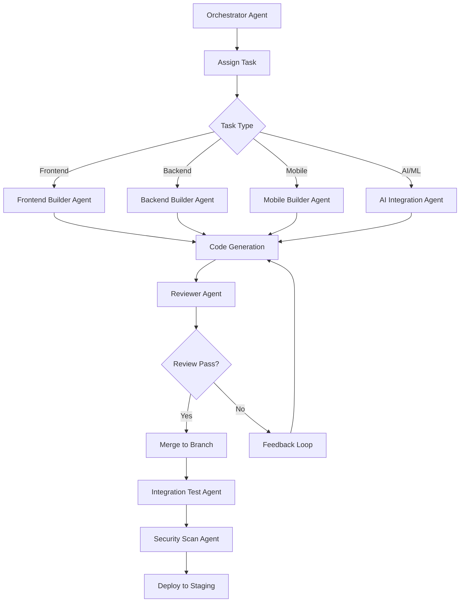

# DeepRef AI Orchestrator Guide
**Version:** 2.0
**Date:** 2025-01-18
**Purpose:** Comprehensive guide for AI orchestrators to build and manage the DeepRef platform

---

## 1. Project Overview & Intention

### 1.1 Core Mission
Build an AI-powered professional reference verification platform that establishes trust between job seekers, reference providers, and employers through advanced biometric verification, AI analysis, and comprehensive metadata collection.

### 1.2 Primary Objectives
1. **Trust Creation**: Establish industry-leading verification standards
2. **Simplicity**: One-tap experience for reference providers
3. **AI-Centric**: Leverage Anthropic Claude for all intelligence tasks
4. **Security First**: Full compliance with global standards
5. **Mobile First**: Native experience on iOS/Android
6. **Revenue Positive**: Achieve $1M ARR within 18 months

### 1.3 Target Users
- **Seekers**: Job applicants needing verified references
- **Referrers**: Professionals providing references
- **Employers**: Companies verifying candidate backgrounds
- **Enterprise**: HR departments needing API integration

### 1.4 Unique Value Propositions
1. AI-powered authenticity verification using Claude
2. Real-time deepfake detection
3. Biometric identity verification
4. Predictive reference quality scoring
5. One-click reference submission
6. Blockchain-optional immutability

---

## 2. Success Criteria

### 2.1 Technical Success Metrics
```yaml
Performance:
  api_response_time: < 200ms (p95)
  mobile_app_startup: < 2 seconds
  video_upload_speed: > 5 Mbps
  ai_processing_time: < 5 seconds

Reliability:
  uptime: 99.9%
  error_rate: < 0.1%
  crash_free_rate: > 99%
  data_integrity: 100%

Scale:
  concurrent_users: 10,000+
  daily_verifications: 50,000+
  storage_capacity: 100TB+
  api_requests_per_second: 1,000+
```

### 2.2 Business Success Metrics
```yaml
Growth:
  month_over_month: 20%
  user_acquisition_cost: < $50
  lifetime_value: > $500
  viral_coefficient: > 1.2

Revenue:
  arr_year_1: $500K
  arr_year_2: $2M
  gross_margin: > 75%
  churn_rate: < 5% monthly

Engagement:
  reference_completion_rate: > 80%
  seeker_verification_rate: > 90%
  employer_adoption: > 60%
  nps_score: > 50
```

### 2.3 Security Success Metrics
```yaml
Compliance:
  gdpr_compliant: true
  soc2_type2: achieved
  iso_27001: certified
  pci_dss: level_1

Security:
  vulnerability_score: < 3.0 CVSS
  pen_test_findings: zero_critical
  incident_response_time: < 1 hour
  data_breach_count: 0
```

---

## 3. Ideal Software Stack

### 3.1 Backend Stack
```yaml
Runtime:
  node_version: "22.x LTS"
  typescript: "5.8+"

Framework:
  nestjs: "10.x"
  express: "4.21+"

Database:
  postgresql: "17"
  redis: "7.4"
  elasticsearch: "8.x"

Message_Queue:
  rabbitmq: "3.13"
  bull: "4.x"

AI_Integration:
  anthropic_sdk: "latest"
  langchain: "0.3.x"

Media_Processing:
  ffmpeg: "6.x"
  sharp: "0.33.x"

Authentication:
  passport: "0.7.x"
  jsonwebtoken: "9.x"
  speakeasy: "2.x" # for 2FA

Monitoring:
  winston: "3.x"
  prometheus: "15.x"
  opentelemetry: "1.x"
```

### 3.2 Frontend Stack
```yaml
Framework:
  angular: "19.x"
  typescript: "5.8+"

State_Management:
  ngrx: "19.x"
  angular_signals: "native"

UI_Components:
  tailwindcss: "4.x"
  angular_material: "19.x"
  primeng: "19.x"

Build_Tools:
  nx: "20.x"
  webpack: "5.x"
  esbuild: "0.24.x"

Testing:
  karma: "6.x"
  jasmine: "5.x"
  cypress: "13.x"
  playwright: "1.49.x"
```

### 3.3 Mobile Stack
```yaml
Framework:
  react_native: "0.76.x"
  expo: "52.x"

Navigation:
  react_navigation: "7.x"

State:
  redux_toolkit: "2.x"
  rtk_query: "2.x"

Native_Modules:
  react_native_camera: "5.x"
  react_native_biometrics: "3.x"
  react_native_webrtc: "124.x"

Testing:
  detox: "20.x"
  jest: "29.x"
```

### 3.4 Infrastructure Stack
```yaml
Containerization:
  docker: "27.x"
  docker_compose: "2.29"

Orchestration:
  kubernetes: "1.31"
  helm: "3.16"

CI_CD:
  github_actions: "latest"
  argocd: "2.13"

Cloud_Platform:
  aws_eks: "latest"
  aws_s3: "for media storage"
  aws_cloudfront: "CDN"
  aws_rds: "PostgreSQL"

Monitoring:
  grafana: "11.x"
  prometheus: "2.55"
  elasticsearch: "8.x"
  kibana: "8.x"
```

---

## 4. Development Workflows

### 4.1 AI Agent Development Workflow



### 4.2 Playwright & WebSee Review Workflow

```yaml
Review_Process:
  trigger: "On PR creation or update"

  steps:
    - name: "Visual Regression Test"
      agent: "Playwright Agent"
      actions:
        - Navigate to staging URL
        - Capture screenshots of all views
        - Compare with baseline images
        - Generate diff report

    - name: "WebSee Analysis"
      agent: "WebSee Agent"
      repository: "git@github.com:1AQuantum/websee-mcp-server.git"
      actions:
        - Analyze UI components
        - Check accessibility compliance
        - Verify responsive design
        - Test interactive elements
        - Generate performance metrics

    - name: "AI Review"
      agent: "Claude Reviewer"
      actions:
        - Analyze code quality
        - Check design patterns
        - Verify security best practices
        - Suggest optimizations

    - name: "Approval Gate"
      conditions:
        - Visual regression < 5% difference
        - Accessibility score > 90
        - Performance score > 85
        - Security scan: no critical issues
```

### 4.3 Git Worktree Agent Workflow

```bash
# Orchestrator manages parallel development
worktrees/
├── main/                    # Production branch
├── develop/                 # Integration branch
├── feature-auth/           # Auth Agent workspace
├── feature-seeker/         # Seeker Agent workspace
├── feature-referrer/       # Referrer Agent workspace
├── feature-ai/            # AI Agent workspace
└── feature-mobile/        # Mobile Agent workspace

# Each agent workflow
Agent_Workflow:
  1. checkout: "git worktree add ../worktrees/feature-{name}"
  2. develop: "Implement assigned features"
  3. test: "Run unit and integration tests"
  4. review: "Playwright + WebSee validation"
  5. merge: "PR to develop branch"
  6. cleanup: "git worktree remove feature-{name}"
```

### 4.4 Code Generation Workflow

```yaml
Code_Generation_Pipeline:
  input:
    - design_mockups: "frames_sep29/*.png"
    - specifications: "DEVROOM/*.md"
    - data_models: "schemas/*.prisma"

  agents:
    component_generator:
      prompt: "Generate Angular component from mockup"
      model: "claude-3-5-sonnet"
      validation: "Playwright screenshot comparison"

    api_generator:
      prompt: "Generate NestJS service from specification"
      model: "claude-3-5-sonnet"
      validation: "API contract testing"

    test_generator:
      prompt: "Generate test cases from requirements"
      model: "claude-3-haiku"
      validation: "Coverage > 80%"

  output:
    - components: "src/app/components/"
    - services: "src/app/services/"
    - tests: "src/app/**/*.spec.ts"
```

---

## 5. Agent Workflows in the App

### 5.1 Reference Coach Agent

```yaml
Name: "Reference Coach Agent"
Model: "claude-3-5-sonnet"
Purpose: "Guide seekers through optimal reference selection"

Workflow:
  1. analyze_profile:
      - Parse resume/CV
      - Extract work history
      - Identify key relationships

  2. suggest_referrers:
      - Rank by relevance
      - Check availability
      - Predict response rate

  3. generate_questions:
      - Parse job description
      - Create contextual questions
      - Optimize for role fit

  4. coach_interaction:
      - Provide tips for request
      - Suggest optimal timing
      - Draft personalized messages

Prompts:
  profile_analysis: |
    Analyze this resume and identify the 5 most valuable
    potential references based on role relevance, seniority,
    and relationship duration.

  question_generation: |
    Based on this job description for {role} at {company},
    generate 5 behavioral questions that would best demonstrate
    the candidate's fit for this position.
```

### 5.2 Verification Orchestrator Agent

```yaml
Name: "Verification Orchestrator"
Model: "claude-3-5-sonnet"
Purpose: "Manage multi-factor identity verification pipeline"

Workflow:
  1. document_verification:
      - OCR extraction
      - Template matching
      - Fraud detection
      - MRZ validation

  2. biometric_verification:
      - Face detection
      - Liveness check
      - Face matching
      - Voice print analysis

  3. consistency_check:
      - Cross-reference data
      - OSINT validation
      - Timeline verification
      - Network analysis

  4. risk_scoring:
      - Calculate confidence
      - Flag anomalies
      - Generate report
      - Recommend actions

Integration:
  - Uses Claude Vision API for document analysis
  - Implements challenge-response for liveness
  - Maintains audit trail of all checks
```

### 5.3 Authenticity Analyzer Agent

```yaml
Name: "Authenticity Analyzer"
Model: "claude-3-5-sonnet"
Purpose: "Detect deepfakes and verify content authenticity"

Workflow:
  1. media_analysis:
      technical:
        - Compression artifacts
        - Temporal consistency
        - Audio-visual sync
        - Metadata validation

      behavioral:
        - Micro-expressions
        - Eye movement patterns
        - Speech patterns
        - Body language

  2. content_analysis:
      - Sentiment consistency
      - Language patterns
      - Factual accuracy
      - Temporal alignment

  3. cross_reference:
      - Compare multiple references
      - Check against profile
      - Validate claims
      - Identify contradictions

  4. authenticity_score:
      - Technical integrity (30%)
      - Content validity (40%)
      - Behavioral indicators (30%)

Alerts:
  - Deepfake probability > 20%
  - Inconsistency detected
  - Suspicious patterns
  - Manual review required
```

### 5.4 Reference Intelligence Agent

```yaml
Name: "Reference Intelligence Engine"
Model: "claude-3-5-sonnet"
Purpose: "Extract insights and assess reference quality"

Workflow:
  1. transcription:
      - Speech-to-text conversion
      - Speaker diarization
      - Timestamp alignment
      - Error correction

  2. nlp_analysis:
      - Entity extraction
      - Sentiment analysis
      - Key phrase identification
      - Skill mapping

  3. quality_assessment:
      - Specificity score
      - Example richness
      - Enthusiasm level
      - Recommendation strength

  4. insight_generation:
      - Strengths summary
      - Growth areas
      - Cultural fit indicators
      - Red flags (if any)

Output:
  reference_summary:
    quality_score: 0-100
    key_strengths: []
    verified_skills: []
    recommendation_level: "strong|moderate|weak"
    insights: []
```

---

## 6. Security Workflows

### 6.1 Security Development Lifecycle (SDL)

```yaml
Security_Gates:
  design_phase:
    - Threat modeling (STRIDE)
    - Security requirements gathering
    - Privacy impact assessment
    - Architecture security review

  development_phase:
    - Secure coding standards
    - Code security scanning (SAST)
    - Dependency scanning (SCA)
    - Secret scanning

  testing_phase:
    - Dynamic security testing (DAST)
    - Penetration testing
    - Security regression testing
    - Compliance validation

  deployment_phase:
    - Security configuration review
    - Infrastructure scanning
    - Certificate validation
    - Access control audit

  monitoring_phase:
    - Runtime protection (RASP)
    - Intrusion detection
    - Log monitoring
    - Incident response
```

### 6.2 Automated Security Scanning

```yaml
SAST_Tools:
  - tool: "Semgrep"
    rules: "OWASP Top 10"
    threshold: "No high/critical"

  - tool: "SonarQube"
    quality_gate: "Security hotspots = 0"
    coverage: "> 80%"

  - tool: "ESLint Security Plugin"
    config: "plugin:security/recommended"

DAST_Tools:
  - tool: "OWASP ZAP"
    scan_type: "Full scan"
    frequency: "Nightly"

  - tool: "Burp Suite"
    scan_type: "API security"
    frequency: "Weekly"

Dependency_Scanning:
  - tool: "Snyk"
    severity_threshold: "High"
    auto_fix: true

  - tool: "npm audit"
    level: "Critical"
    auto_fix: false

  - tool: "OWASP Dependency Check"
    cvss_threshold: 7.0

Container_Scanning:
  - tool: "Trivy"
    scan_targets: ["image", "filesystem", "config"]
    severity: ["CRITICAL", "HIGH"]

  - tool: "Clair"
    scan_frequency: "On build"
```

### 6.3 Compliance Validation Workflow

```yaml
GDPR_Checks:
  automated:
    - Privacy policy presence
    - Cookie consent implementation
    - Data retention policies
    - Encryption verification
    - Right to erasure API

  manual:
    - DPIA review
    - Consent flow testing
    - Cross-border transfer validation

SOC2_Checks:
  automated:
    - Access control testing
    - Encryption validation
    - Backup verification
    - Monitoring alerts

  manual:
    - Security training records
    - Incident response drill
    - Vendor assessment review

PCI_DSS_Checks:
  automated:
    - Cardholder data scanning
    - Network segmentation test
    - Vulnerability scanning
    - Log monitoring

  manual:
    - Physical security review
    - Policy documentation
    - Personnel screening
```

### 6.4 Incident Response Workflow

```yaml
Incident_Response:
  detection:
    sources:
      - SIEM alerts
      - User reports
      - Monitoring systems
      - Third-party notification

  triage:
    severity_levels:
      critical: "Data breach, system compromise"
      high: "Authentication bypass, XSS in production"
      medium: "Non-critical vulnerability"
      low: "Best practice violation"

  response:
    critical:
      - Immediate escalation
      - Isolate affected systems
      - Preserve evidence
      - Notify legal/compliance
      - Begin forensics

    high:
      - Escalate to security team
      - Patch within 24 hours
      - Document impact

  recovery:
    - Implement fixes
    - Verify remediation
    - Update documentation
    - Lessons learned session
    - Update runbooks
```

---

## 7. Testing Workflows

### 7.1 Unit Testing Workflow

```yaml
Unit_Test_Requirements:
  coverage:
    minimum: 80%
    target: 90%
    critical_paths: 100%

  frameworks:
    backend: "Jest"
    frontend: "Jasmine/Karma"
    mobile: "Jest/React Native Testing Library"

  conventions:
    naming: "*.spec.ts"
    structure: "Arrange-Act-Assert"
    mocking: "Dependency injection"

  automation:
    pre_commit: "Run affected tests"
    ci_pipeline: "Run all tests"
    reporting: "Coverage reports to SonarQube"
```

### 7.2 Integration Testing Workflow

```yaml
Integration_Tests:
  api_testing:
    tool: "Supertest"
    coverage: "All endpoints"
    scenarios:
      - Happy path
      - Error handling
      - Authentication
      - Rate limiting
      - Input validation

  database_testing:
    tool: "TypeORM test utilities"
    approach: "Transaction rollback"
    coverage:
      - CRUD operations
      - Complex queries
      - Migrations
      - Constraints

  service_integration:
    tool: "Docker Compose"
    services:
      - PostgreSQL
      - Redis
      - RabbitMQ
      - ElasticSearch
    validation:
      - Service communication
      - Message queue processing
      - Cache invalidation
```

### 7.3 E2E Testing Workflow

```yaml
E2E_Testing:
  frameworks:
    web: "Playwright"
    mobile: "Detox"

  scenarios:
    critical_paths:
      - User registration
      - Identity verification
      - Reference request creation
      - Reference submission
      - Bundle creation
      - Payment processing

  playwright_config:
    browsers: ["chromium", "firefox", "webkit"]
    devices: ["iPhone 14", "Pixel 7", "iPad Pro"]
    screenshots: "on-failure"
    video: "retain-on-failure"
    trace: "on-first-retry"

  visual_regression:
    tool: "Playwright + WebSee"
    threshold: 5%
    baseline_update: "Manual approval"

  performance_testing:
    metrics:
      - First Contentful Paint < 1.5s
      - Time to Interactive < 3.5s
      - Cumulative Layout Shift < 0.1
      - API response time < 200ms
```

### 7.4 AI Model Testing Workflow

```yaml
AI_Model_Testing:
  accuracy_testing:
    test_dataset: "1000 verified references"
    metrics:
      - Precision > 0.95
      - Recall > 0.90
      - F1 Score > 0.92

  bias_testing:
    categories:
      - Gender bias
      - Ethnic bias
      - Age bias
      - Language bias
    threshold: "< 5% variance"

  adversarial_testing:
    attacks:
      - Prompt injection
      - Jailbreak attempts
      - Data poisoning
      - Model extraction
    validation: "No successful attacks"

  performance_testing:
    latency:
      - p50: < 2s
      - p95: < 5s
      - p99: < 10s
    throughput: "> 100 requests/minute"

  edge_case_testing:
    scenarios:
      - Multilingual content
      - Poor quality video/audio
      - Incomplete data
      - Contradictory information
```

### 7.5 Load Testing Workflow

```yaml
Load_Testing:
  tool: "k6"

  scenarios:
    baseline:
      vus: 100
      duration: "30m"
      target: "No errors"

    stress:
      stages:
        - duration: "5m", target: 100
        - duration: "5m", target: 500
        - duration: "5m", target: 1000
        - duration: "5m", target: 0
      success_criteria:
        - Error rate < 1%
        - p95 latency < 500ms

    spike:
      vus: 2000
      duration: "2m"
      target: "Graceful degradation"

    soak:
      vus: 400
      duration: "2h"
      target: "No memory leaks"

  metrics:
    - Response time
    - Error rate
    - Throughput
    - CPU usage
    - Memory usage
    - Database connections
```

---

## 8. Monitoring & Observability Workflows

### 8.1 Application Monitoring

```yaml
Metrics_Collection:
  application:
    - Request rate
    - Error rate
    - Response time
    - Throughput

  business:
    - Verification completions
    - Reference submissions
    - User registrations
    - Revenue metrics

  infrastructure:
    - CPU utilization
    - Memory usage
    - Disk I/O
    - Network traffic

  ai_specific:
    - Model inference time
    - Token usage
    - API costs
    - Accuracy metrics

Alerting_Rules:
  critical:
    - Error rate > 5%
    - Response time > 1s (p95)
    - Disk usage > 90%
    - Security incident detected

  warning:
    - Error rate > 1%
    - Response time > 500ms (p95)
    - Disk usage > 80%
    - High API costs
```

### 8.2 Log Aggregation

```yaml
Logging_Strategy:
  levels:
    error: "Exceptions, failures"
    warn: "Deprecations, retries"
    info: "Business events"
    debug: "Detailed execution"

  structured_logging:
    format: "JSON"
    fields:
      - timestamp
      - level
      - message
      - service
      - trace_id
      - user_id
      - session_id

  retention:
    hot: "7 days in ElasticSearch"
    warm: "30 days in S3"
    cold: "1 year in Glacier"

  compliance:
    pii_masking: true
    audit_logs: "Immutable, 7 years"
```

---

## 9. Deployment Workflows

### 9.1 CI/CD Pipeline

```yaml
GitHub_Actions_Workflow:
  on:
    push:
      branches: [develop, main]
    pull_request:
      branches: [develop]

  jobs:
    lint_and_format:
      - ESLint
      - Prettier
      - TypeScript compilation

    test:
      - Unit tests
      - Integration tests
      - Coverage report

    security:
      - SAST scan
      - Dependency check
      - Secret scanning

    build:
      - Docker build
      - Tag with SHA
      - Push to registry

    deploy_staging:
      if: "branch == develop"
      - Deploy to staging
      - Run E2E tests
      - Performance tests

    deploy_production:
      if: "branch == main"
      requires:
        - Manual approval
        - All tests passing
        - Security scan clean
      steps:
        - Blue-green deployment
        - Health checks
        - Smoke tests
        - Rollback on failure
```

### 9.2 Release Management

```yaml
Release_Strategy:
  versioning: "Semantic (MAJOR.MINOR.PATCH)"

  release_types:
    hotfix:
      branches: "hotfix/* -> main"
      testing: "Minimal regression"
      deployment: "Immediate"

    feature:
      branches: "feature/* -> develop"
      testing: "Full test suite"
      deployment: "Next sprint"

    major:
      branches: "release/* -> main"
      testing: "Full regression + performance"
      deployment: "Scheduled maintenance"

  rollback_strategy:
    automatic:
      - Error rate > 10%
      - Health check failures
      - Critical alerts

    manual:
      - Customer complaints
      - Performance degradation
      - Security concerns
```

---

## 10. Orchestrator Commands

### 10.1 Task Assignment

```yaml
Orchestrator_Commands:
  create_task:
    command: "CREATE_TASK"
    parameters:
      type: "feature|bug|security|performance"
      priority: "critical|high|medium|low"
      assignee: "agent_name"
      deadline: "ISO date"
      dependencies: ["task_ids"]

  assign_agent:
    command: "ASSIGN_AGENT"
    parameters:
      agent_type: "builder|reviewer|tester|security"
      task_id: "string"
      resources: "CPU/memory allocation"

  review_progress:
    command: "REVIEW_PROGRESS"
    parameters:
      task_id: "string"
      metrics: ["completion", "quality", "performance"]

  approve_merge:
    command: "APPROVE_MERGE"
    parameters:
      pr_number: "integer"
      target_branch: "string"
      conditions: ["tests_pass", "review_approved", "security_clean"]
```

### 10.2 Quality Gates

```yaml
Quality_Gates:
  code_quality:
    - Test coverage > 80%
    - No critical SonarQube issues
    - Cyclomatic complexity < 10
    - Documentation complete

  security:
    - No high/critical vulnerabilities
    - OWASP compliance
    - Secrets scanning clean
    - Dependencies up-to-date

  performance:
    - Load test passing
    - Response time < 200ms
    - Memory usage stable
    - No memory leaks

  user_experience:
    - Lighthouse score > 90
    - Accessibility score > 95
    - Visual regression < 5%
    - Mobile responsive
```

---

## 11. Success Validation

### 11.1 MVP Success Criteria

```yaml
Week_4_Checkpoint:
  completed:
    - Authentication system working
    - Basic UI responsive
    - Database connected
    - CI/CD pipeline active
  metrics:
    - 0 critical bugs
    - 80% test coverage
    - All security scans passing

Week_8_Checkpoint:
  completed:
    - Identity verification functional
    - Reference flow complete
    - AI integration working
    - Mobile app alpha
  metrics:
    - < 200ms API response
    - 90% test coverage
    - First 10 beta users

Week_12_Checkpoint:
  completed:
    - All core features
    - Payment processing
    - Admin dashboard
    - Mobile app beta
  metrics:
    - 100 beta users
    - NPS > 40
    - 95% uptime

Week_16_Checkpoint:
  completed:
    - SOC 2 compliance ready
    - Performance optimized
    - Documentation complete
    - Marketing site live
  metrics:
    - 500 users
    - $10K MRR
    - 99% uptime
```

### 11.2 Production Success Metrics

```yaml
Month_1:
  users: 1000
  verifications: 5000
  mrr: $20K
  uptime: 99.5%

Month_3:
  users: 5000
  verifications: 25000
  mrr: $50K
  uptime: 99.9%

Month_6:
  users: 10000
  verifications: 100000
  mrr: $100K
  uptime: 99.95%
  nps: 50+

Year_1:
  users: 25000
  verifications: 500000
  arr: $500K
  uptime: 99.99%
  certifications: ["SOC2", "ISO27001"]
```

---

## 12. Orchestrator Decision Trees

### 12.1 Development Priority Matrix

```yaml
Priority_Matrix:
  critical_path:
    1: "Authentication system"
    2: "Identity verification"
    3: "Reference request flow"
    4: "Reference submission"
    5: "AI integration"
    6: "Payment processing"

  parallel_development:
    track_1: ["Frontend components", "UI/UX"]
    track_2: ["Backend APIs", "Database"]
    track_3: ["AI services", "ML models"]
    track_4: ["Mobile app", "Native features"]
    track_5: ["Security", "Compliance"]

  dependencies:
    ai_integration:
      requires: ["Authentication", "Database"]
    payment:
      requires: ["User management", "Security"]
    mobile:
      requires: ["API complete", "Auth working"]
```

### 12.2 Agent Coordination

```yaml
Agent_Coordination:
  daily_sync:
    time: "09:00 UTC"
    participants: "All active agents"
    agenda:
      - Progress updates
      - Blocker discussion
      - Task reassignment
      - Priority changes

  code_review:
    trigger: "PR created"
    reviewers:
      - Primary: "Specialized agent"
      - Secondary: "Security agent"
      - Final: "Orchestrator"

  conflict_resolution:
    merge_conflicts:
      - Auto-resolve: "Non-functional changes"
      - Agent-resolve: "Same module changes"
      - Orchestrator-resolve: "Cross-module changes"

  resource_allocation:
    high_priority:
      cpu: "4 cores"
      memory: "16GB"
      gpu: "If AI tasks"
    normal_priority:
      cpu: "2 cores"
      memory: "8GB"
```

---

## 13. Emergency Procedures

### 13.1 Incident Response

```yaml
Severity_Levels:
  P0_Critical:
    definition: "Complete outage or data breach"
    response_time: "< 5 minutes"
    escalation: "Immediate to CTO"

  P1_High:
    definition: "Major feature broken"
    response_time: "< 30 minutes"
    escalation: "Within 1 hour"

  P2_Medium:
    definition: "Minor feature issue"
    response_time: "< 2 hours"
    escalation: "Within 4 hours"

  P3_Low:
    definition: "Cosmetic or edge case"
    response_time: "< 24 hours"
    escalation: "Next business day"

Response_Playbooks:
  security_breach:
    1: "Isolate affected systems"
    2: "Preserve evidence"
    3: "Notify security team"
    4: "Begin forensics"
    5: "Customer communication"

  data_loss:
    1: "Stop writes to database"
    2: "Identify scope"
    3: "Restore from backup"
    4: "Verify integrity"
    5: "Root cause analysis"
```

### 13.2 Rollback Procedures

```yaml
Rollback_Triggers:
  automatic:
    - Error rate > 10%
    - Response time > 1s for 5 minutes
    - Memory usage > 95%
    - Security alert critical

  manual:
    - Customer complaints > 5
    - Revenue impact detected
    - Data corruption suspected

Rollback_Process:
  1: "Trigger health check failure"
  2: "Route traffic to previous version"
  3: "Verify system stability"
  4: "Notify stakeholders"
  5: "Begin root cause analysis"
  6: "Create hotfix plan"
```

---

## Appendix A: Prompt Templates

### A.1 Code Generation Prompts

```yaml
Component_Generation:
  prompt: |
    Generate an Angular 19 component for {component_name} that:
    - Follows the design in {mockup_path}
    - Uses Tailwind CSS classes
    - Implements proper TypeScript typing
    - Includes error handling
    - Is fully accessible (WCAG 2.1 AA)
    - Has comprehensive JSDoc comments

API_Generation:
  prompt: |
    Create a NestJS service for {service_name} that:
    - Implements the OpenAPI spec: {spec_path}
    - Uses TypeORM for database operations
    - Includes proper validation decorators
    - Has comprehensive error handling
    - Implements rate limiting
    - Includes unit tests with > 90% coverage
```

### A.2 Review Prompts

```yaml
Security_Review:
  prompt: |
    Review this code for security vulnerabilities:
    - Check for OWASP Top 10 issues
    - Identify potential injection points
    - Verify authentication/authorization
    - Check for sensitive data exposure
    - Validate input sanitization
    - Assess cryptographic implementation

Performance_Review:
  prompt: |
    Analyze this code for performance issues:
    - Identify O(n²) or worse algorithms
    - Check for memory leaks
    - Find unnecessary database queries
    - Identify missing indexes
    - Check for proper caching
    - Assess async/await usage
```

---

## Appendix B: Resource Links

### B.1 Documentation

- Anthropic Claude API: https://docs.anthropic.com
- Angular Documentation: https://angular.dev
- NestJS Documentation: https://docs.nestjs.com
- React Native Documentation: https://reactnative.dev
- Playwright Documentation: https://playwright.dev
- WebSee MCP Server: git@github.com:1AQuantum/websee-mcp-server.git

### B.2 Compliance Resources

- OWASP Top 10: https://owasp.org/Top10
- NIST Cybersecurity Framework: https://www.nist.gov/cyberframework
- GDPR Compliance: https://gdpr.eu
- SOC 2: https://www.aicpa.org/soc2
- PCI DSS: https://www.pcisecuritystandards.org

### B.3 Tools & Services

- GitHub Actions: https://docs.github.com/actions
- Docker Hub: https://hub.docker.com
- AWS Documentation: https://docs.aws.amazon.com
- Snyk Security: https://snyk.io
- SonarQube: https://www.sonarqube.org

---

## Document Control

- **Version**: 2.0
- **Last Updated**: 2025-01-18
- **Next Review**: 2025-02-01
- **Owner**: AI Orchestrator Team
- **Classification**: Internal Use Only

---

**End of Document**