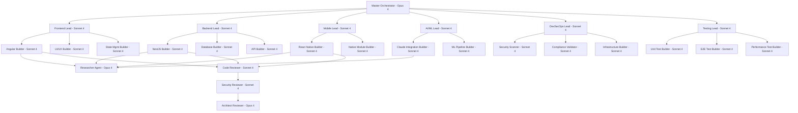

# DeepRef Multi-Agent Development Orchestration Plan
**Version:** 1.0
**Date:** 2025-01-19
**Architecture Pattern:** Anthropic Multi-Agent Research System
**Purpose:** Orchestrate specialized AI agents to build the DeepRef platform using parallel development workflows

---

## 1. Executive Summary

This plan applies **Anthropic's orchestrator-worker pattern** to software development, enabling parallel agent teams to build the DeepRef AI-powered reference verification platform. The architecture uses:

- **Lead Orchestrator Agents** that coordinate specialized builder teams
- **Specialized Builder Agents** for frontend, backend, mobile, AI/ML, and infrastructure
- **Researcher Agents (Opus)** that provide guidance and fetch latest documentation
- **Multi-Layer Reviewer Agents** for code quality, security, and compliance
- **Testing Agents** for comprehensive quality assurance

### Key Architecture Principles

1. **Parallel Development**: Multiple agent teams work simultaneously on independent modules
2. **Asynchronous Coordination**: Agents coordinate through shared state and message passing
3. **Hierarchical Structure**: Lead agents spawn specialized subagents with clear objectives
4. **Documentation-First**: All agents fetch latest API docs before implementation
5. **Multi-Layer Review**: Code passes through specialized review agents before merge

---

## 2. Agent Architecture Overview



---

## 3. Core Agent Definitions

### 3.1 Master Orchestrator Agent

```yaml
Agent: Master Orchestrator
Model: claude-opus-4
Role: Supreme coordinator of all development activities

Responsibilities:
  - Analyze AI Orchestrator Guide and decompose into work packages
  - Create specialized Lead Agents for each development track
  - Coordinate cross-team dependencies and integration points
  - Manage project timeline and milestone tracking
  - Resolve conflicts between agent teams
  - Synthesize progress reports for stakeholders

Tools Available:
  - Task (spawn Lead Agents)
  - Read (project specifications)
  - Glob (search codebase)
  - TodoWrite (track project progress)
  - Bash (git operations, project management)

Workflow:
  1. Read and analyze DEVROOM/*.md specifications
  2. Create development plan with dependency graph
  3. Spawn 6 Lead Agents in parallel (Frontend, Backend, Mobile, AI/ML, DevSecOps, Testing)
  4. Monitor progress through subagent tracking
  5. Coordinate integration points between teams
  6. Approve merges to main development branch
  7. Generate daily progress reports

Context Management:
  - Saves high-level architecture decisions to memory
  - Maintains dependency graph in files/architecture/
  - Tracks agent assignments in files/agent_tracking/
  - Uses parent_tool_use_id to attribute work to specific agents
```

---

### 3.2 Lead Agent Template (Frontend, Backend, Mobile, AI/ML, DevSecOps, Testing)

```yaml
Agent: {Domain} Lead Agent
Model: claude-sonnet-4
Role: Coordinate specialized builders within domain

Responsibilities:
  - Decompose domain tasks into 3-5 subtasks
  - Spawn specialized Builder Agents in parallel
  - Coordinate with Researcher Agent for documentation
  - Ensure code quality through Reviewer Agents
  - Manage git worktrees for parallel development
  - Synthesize team progress for Master Orchestrator

Tools Available:
  - Task (spawn Builder and Researcher Agents)
  - Read/Write/Edit (code operations)
  - Glob/Grep (code search)
  - Bash (git, build, test commands)
  - TodoWrite (track team tasks)

Workflow:
  1. Receive work package from Master Orchestrator
  2. Analyze requirements and create implementation plan
  3. Spawn Researcher Agent to fetch latest documentation
  4. Spawn 3-5 Builder Agents in parallel with clear objectives
  5. Monitor builder progress through tool use tracking
  6. Coordinate code reviews through Reviewer Agents
  7. Integrate completed work and run tests
  8. Report completion to Master Orchestrator

Git Worktree Strategy:
  - Create dedicated worktree: worktrees/feature-{domain}-{task}/
  - Each Builder Agent works in isolated worktree
  - Lead Agent coordinates merges to domain integration branch
  - Clean up worktrees after successful merge

Example Spawning Pattern:
  # Lead spawns builders in parallel (single message, multiple Task calls)
  - Task(description="Build auth components", subagent_type="general-purpose", model="sonnet")
  - Task(description="Build seeker dashboard", subagent_type="general-purpose", model="sonnet")
  - Task(description="Build state management", subagent_type="general-purpose", model="sonnet")
```

---

### 3.3 Researcher Agent (Opus for Critical Guidance)

```yaml
Agent: Researcher Agent
Model: claude-opus-4
Role: Research latest documentation and provide expert guidance to builder agents

Responsibilities:
  - Fetch latest API documentation for libraries and frameworks
  - Research best practices and design patterns
  - Answer complex technical questions from Builder Agents
  - Validate architectural decisions
  - Provide security and compliance guidance
  - Research emerging issues and solutions

Tools Available:
  - WebFetch (fetch documentation)
  - WebSearch (search for latest resources)
  - Read (analyze existing code)
  - Write (create research notes in files/research_notes/)

Workflow:
  1. Receive research request from Lead or Builder Agent
  2. Decompose into 2-4 research subtopics
  3. Execute parallel web searches for each subtopic
  4. Synthesize findings into actionable guidance
  5. Write research notes with citations
  6. Provide recommendations to requesting agent

Research Priorities (Always fetch latest versions):
  Frontend:
    - Angular 19 documentation: https://angular.dev
    - Tailwind CSS 4 documentation: https://tailwindcss.com/docs
    - NgRx 19 documentation: https://ngrx.io/docs
    - PrimeNG 19 documentation: https://primeng.org/
    - Nx 20 documentation: https://nx.dev

  Backend:
    - NestJS 10 documentation: https://docs.nestjs.com
    - TypeScript 5.8 documentation: https://www.typescriptlang.org/docs
    - TypeORM documentation: https://typeorm.io
    - PostgreSQL 17 documentation: https://www.postgresql.org/docs/17/
    - Redis 7.4 documentation: https://redis.io/docs

  Mobile:
    - React Native 0.76 documentation: https://reactnative.dev/docs
    - Expo 52 documentation: https://docs.expo.dev
    - React Navigation 7 documentation: https://reactnavigation.org/docs
    - Redux Toolkit 2 documentation: https://redux-toolkit.js.org

  AI/ML:
    - Anthropic Claude API: https://docs.anthropic.com
    - Claude Agent SDK: https://github.com/anthropics/anthropic-sdk-typescript
    - LangChain 0.3: https://js.langchain.com/docs

  Security:
    - OWASP Top 10: https://owasp.org/Top10
    - NIST Cybersecurity Framework: https://www.nist.gov/cyberframework
    - GDPR Compliance: https://gdpr.eu

  Infrastructure:
    - Kubernetes 1.31: https://kubernetes.io/docs
    - Docker 27: https://docs.docker.com
    - AWS EKS: https://docs.aws.amazon.com/eks

Output Format:
  files/research_notes/YYYYMMDD_HHMMSS_{topic}.md:
    - Executive Summary
    - Key Findings (with citations)
    - Code Examples
    - Best Practices
    - Recommendations
    - References (URLs)
```

---

### 3.4 Builder Agent Template

```yaml
Agent: {Technology} Builder Agent
Model: claude-sonnet-4
Role: Implement specific features using designated technology stack

Responsibilities:
  - Implement assigned features following specifications
  - Write clean, tested, documented code
  - Follow established design patterns and conventions
  - Request guidance from Researcher Agent when needed
  - Submit code for review through PR workflow
  - Address review feedback and iterate

Tools Available:
  - Read/Write/Edit (code operations)
  - Glob/Grep (code search)
  - Bash (build, test, git)
  - Task (spawn Researcher Agent if needed)

Pre-Implementation Checklist:
  1. Read relevant specifications from DEVROOM/
  2. Check files/research_notes/ for applicable guidance
  3. Request Researcher Agent if documentation unclear
  4. Verify latest package versions
  5. Review existing code patterns in codebase

Implementation Workflow:
  1. Create feature branch in assigned worktree
  2. Implement feature with comprehensive tests
  3. Run linters and formatters
  4. Run unit tests (coverage > 80%)
  5. Write API documentation / component docs
  6. Create PR with detailed description
  7. Address reviewer feedback
  8. Verify CI/CD passes

Code Quality Standards:
  - TypeScript strict mode enabled
  - ESLint with security plugins
  - Prettier formatting
  - JSDoc comments for public APIs
  - Unit test coverage > 80%
  - No console.log statements
  - Proper error handling
  - Input validation and sanitization

When to Request Researcher Agent:
  - Unclear how to use new library/API
  - Security implementation questions
  - Architectural decision needed
  - Performance optimization strategies
  - Best practice validation
  - Breaking changes in dependencies
```

---

### 3.5 Multi-Layer Reviewer Agents

```yaml
Review Layer 1: Code Quality Reviewer
Agent: Code Quality Reviewer
Model: claude-sonnet-4
Trigger: On PR creation

Responsibilities:
  - Review code style and conventions
  - Check test coverage and quality
  - Verify documentation completeness
  - Assess code maintainability
  - Check for code smells and anti-patterns

Review Checklist:
  - Code follows style guide
  - Test coverage > 80%
  - All public APIs documented
  - No commented-out code
  - Proper error handling
  - DRY principles followed
  - SOLID principles applied
  - Appropriate design patterns

Output: Approve, Request Changes, or Comment
---

Review Layer 2: Security Reviewer
Agent: Security Reviewer
Model: claude-sonnet-4
Trigger: After Code Quality Reviewer approval

Responsibilities:
  - Scan for OWASP Top 10 vulnerabilities
  - Check authentication/authorization
  - Verify input validation
  - Review cryptographic implementations
  - Check for sensitive data exposure
  - Assess dependency vulnerabilities

Security Scan Checklist:
  - No SQL injection vulnerabilities
  - No XSS vulnerabilities
  - No CSRF vulnerabilities
  - Proper authentication checks
  - Secure session management
  - Input validation present
  - Output encoding applied
  - Secrets not hardcoded
  - Dependencies up-to-date
  - SAST/DAST tools run

Tools:
  - Semgrep (SAST)
  - Snyk (dependency scanning)
  - npm audit
  - Custom security rules

Output: Security approval or block with issues
---

Review Layer 3: Architect Reviewer
Agent: Architect Reviewer
Model: claude-opus-4
Trigger: After Security Reviewer approval

Responsibilities:
  - Validate architectural decisions
  - Ensure alignment with system design
  - Review scalability implications
  - Assess performance impact
  - Check integration points
  - Verify compliance requirements

Architecture Review Checklist:
  - Follows established patterns
  - Integrates cleanly with existing code
  - Scalable design
  - Performance acceptable
  - Proper separation of concerns
  - Appropriate abstraction levels
  - Database schema changes reviewed
  - API contracts maintained

Output: Final approval or architectural guidance
---

Review Layer 4: Playwright + WebSee Validator
Agent: Visual Regression Validator
Model: claude-sonnet-4
Trigger: After Architect Reviewer approval (frontend only)

Responsibilities:
  - Execute Playwright visual regression tests
  - Run WebSee accessibility analysis
  - Verify responsive design
  - Check cross-browser compatibility
  - Validate performance metrics

WebSee Integration:
  Repository: git@github.com:1AQuantum/websee-mcp-server.git

  Test Scenarios:
    - Navigate to staging URL
    - Capture screenshots (desktop, tablet, mobile)
    - Compare with baseline images (< 5% difference)
    - Check accessibility score (> 90)
    - Measure performance (Lighthouse > 85)
    - Test interactive elements
    - Verify WCAG 2.1 AA compliance

Approval Criteria:
  - Visual regression < 5% difference
  - Accessibility score > 90
  - Performance score > 85
  - No critical accessibility issues
  - Responsive on all breakpoints

Output: Visual approval or regression issues
```

---

## 4. Development Team Orchestration

### 4.1 Frontend Development Team

```yaml
Lead Agent: Frontend Lead (Sonnet 4)
Domain: Web application user interface

Builder Agents:
  1. Angular Component Builder
     - Generates components from frames_sep29/*.png mockups
     - Uses Angular 19, Tailwind CSS 4, Angular Material 19
     - Implements responsive layouts
     - Adds accessibility features

  2. State Management Builder
     - Implements NgRx stores and effects
     - Configures Angular signals
     - Manages application state
     - Implements data persistence

  3. API Integration Builder
     - Creates service layers
     - Implements RTK Query / HTTP clients
     - Handles error states
     - Implements caching strategies

  4. UI/UX Builder
     - Implements design system from DeepRef-Design-System.md
     - Creates reusable components
     - Implements animations and transitions
     - Ensures brand consistency

Parallel Development Strategy:
  Worktree Structure:
    - worktrees/feature-auth-ui/
    - worktrees/feature-seeker-dashboard/
    - worktrees/feature-referrer-ui/
    - worktrees/feature-employer-ui/
    - worktrees/feature-admin-ui/

  Integration Branch: develop-frontend

  Coordination:
    - Frontend Lead coordinates component dependencies
    - Shared design tokens in libs/design-tokens/
    - Component library in libs/ui-components/
    - Integration tests in apps/web-e2e/

Tech Stack Validation (via Researcher Agent):
  - Angular 19.x latest
  - TypeScript 5.8+
  - Tailwind CSS 4.x
  - NgRx 19.x
  - Nx 20.x
  - Playwright 1.49.x
```

---

### 4.2 Backend Development Team

```yaml
Lead Agent: Backend Lead (Sonnet 4)
Domain: API, business logic, data persistence

Builder Agents:
  1. NestJS API Builder
     - Creates REST/GraphQL endpoints
     - Implements controllers and services
     - Adds validation decorators
     - Implements rate limiting

  2. Database Builder
     - Designs PostgreSQL schemas
     - Creates TypeORM entities
     - Writes migrations
     - Optimizes queries and indexes

  3. Authentication Builder
     - Implements JWT authentication
     - Adds 2FA with Speakeasy
     - Implements OAuth providers
     - Creates RBAC system

  4. Message Queue Builder
     - Implements RabbitMQ producers/consumers
     - Creates Bull job queues
     - Handles async processing
     - Implements retry logic

  5. AI Integration Backend Builder
     - Creates Claude API integration
     - Implements prompt management
     - Handles token optimization
     - Manages AI workflows

Parallel Development Strategy:
  Worktree Structure:
    - worktrees/feature-auth-api/
    - worktrees/feature-verification-api/
    - worktrees/feature-reference-api/
    - worktrees/feature-payment-api/
    - worktrees/feature-ai-services/

  Integration Branch: develop-backend

  Coordination:
    - Backend Lead manages API contracts
    - Shared DTOs in libs/shared-types/
    - Database migrations coordinated
    - Integration tests in apps/api-e2e/

Tech Stack Validation (via Researcher Agent):
  - NestJS 10.x latest
  - TypeScript 5.8+
  - PostgreSQL 17
  - Redis 7.4
  - RabbitMQ 3.13
  - TypeORM latest
```

---

### 4.3 Mobile Development Team

```yaml
Lead Agent: Mobile Lead (Sonnet 4)
Domain: iOS and Android mobile applications

Builder Agents:
  1. React Native Core Builder
     - Creates app screens and navigation
     - Implements React Navigation 7
     - Manages Redux Toolkit state
     - Handles offline functionality

  2. Native Module Builder
     - Integrates biometric authentication
     - Implements camera functionality
     - Adds WebRTC for video capture
     - Handles push notifications

  3. Mobile API Client Builder
     - Creates API client with RTK Query
     - Implements token management
     - Handles network errors
     - Implements request queuing

Parallel Development Strategy:
  Worktree Structure:
    - worktrees/feature-mobile-auth/
    - worktrees/feature-mobile-seeker/
    - worktrees/feature-mobile-referrer/
    - worktrees/feature-mobile-verification/

  Integration Branch: develop-mobile

  Coordination:
    - Shared components in src/components/
    - Navigation structure centralized
    - E2E tests with Detox 20.x

Tech Stack Validation (via Researcher Agent):
  - React Native 0.76.x
  - Expo 52.x
  - React Navigation 7.x
  - Redux Toolkit 2.x
  - Detox 20.x
```

---

### 4.4 AI/ML Development Team

```yaml
Lead Agent: AI/ML Lead (Sonnet 4)
Domain: AI integrations, ML pipelines, intelligent features

Builder Agents:
  1. Claude Integration Builder
     - Integrates Anthropic SDK
     - Implements Reference Coach Agent
     - Creates Verification Orchestrator Agent
     - Builds Authenticity Analyzer Agent

  2. ML Pipeline Builder
     - Creates data preprocessing pipelines
     - Implements model evaluation
     - Builds bias testing framework
     - Creates performance monitoring

  3. Prompt Engineering Builder
     - Designs and tests prompts
     - Implements prompt versioning
     - Creates prompt templates
     - Optimizes token usage

AI Agent Implementations (from Guide Section 5):

  Reference Coach Agent:
    Model: claude-3-5-sonnet
    Functions:
      - analyze_profile(resume) → suggested_referrers[]
      - generate_questions(job_description) → questions[]
      - coach_interaction(context) → tips_and_messages

  Verification Orchestrator:
    Model: claude-3-5-sonnet
    Functions:
      - document_verification(id_image) → verification_result
      - biometric_verification(selfie, voice) → biometric_score
      - consistency_check(data) → risk_score

  Authenticity Analyzer:
    Model: claude-3-5-sonnet
    Functions:
      - media_analysis(video) → authenticity_score
      - content_analysis(transcript) → quality_metrics
      - cross_reference(references[]) → consistency_report

  Reference Intelligence Engine:
    Model: claude-3-5-sonnet
    Functions:
      - transcription(audio) → text_with_timestamps
      - nlp_analysis(text) → insights
      - quality_assessment(reference) → quality_score

Tech Stack Validation (via Researcher Agent):
  - Anthropic SDK latest
  - LangChain 0.3.x
  - Claude Agent SDK latest
```

---

### 4.5 DevSecOps Team

```yaml
Lead Agent: DevSecOps Lead (Sonnet 4)
Domain: Security, compliance, infrastructure, CI/CD

Builder Agents:
  1. Security Scanner Builder
     - Implements SAST with Semgrep
     - Configures DAST with OWASP ZAP
     - Sets up dependency scanning (Snyk)
     - Creates secret scanning rules

  2. Compliance Validator Builder
     - Implements GDPR checks
     - Creates SOC2 validation tests
     - Builds PCI DSS scanners
     - Generates compliance reports

  3. Infrastructure Builder
     - Creates Kubernetes manifests
     - Writes Helm charts
     - Configures ArgoCD
     - Sets up monitoring (Prometheus, Grafana)

  4. CI/CD Builder
     - Creates GitHub Actions workflows
     - Implements blue-green deployment
     - Sets up automated rollbacks
     - Creates release automation

Security Workflows (from Guide Section 6):

  SAST Tools:
    - Semgrep (OWASP Top 10 rules)
    - SonarQube (quality gates)
    - ESLint Security Plugin

  DAST Tools:
    - OWASP ZAP (full scan nightly)
    - Burp Suite (API security weekly)

  Dependency Scanning:
    - Snyk (severity: High)
    - npm audit (level: Critical)
    - OWASP Dependency Check (CVSS > 7.0)

  Container Scanning:
    - Trivy (CRITICAL, HIGH)
    - Clair (on build)

Compliance Automation:
  GDPR Checks:
    - Privacy policy validation
    - Cookie consent verification
    - Data retention policy checks
    - Encryption validation
    - Right to erasure API tests

  SOC2 Checks:
    - Access control testing
    - Backup verification
    - Monitoring alerts validation

  PCI DSS Checks:
    - Cardholder data scanning
    - Network segmentation tests
    - Vulnerability scanning

Infrastructure Stack:
  - Kubernetes 1.31
  - Helm 3.16
  - Docker 27.x
  - ArgoCD 2.13
  - Prometheus 2.55
  - Grafana 11.x
```

---

### 4.6 Testing Team

```yaml
Lead Agent: Testing Lead (Sonnet 4)
Domain: Quality assurance, test automation, performance testing

Builder Agents:
  1. Unit Test Builder
     - Generates unit tests (Jest/Jasmine)
     - Achieves > 80% coverage
     - Follows AAA pattern
     - Mocks dependencies

  2. E2E Test Builder
     - Creates Playwright tests (web)
     - Creates Detox tests (mobile)
     - Implements visual regression
     - Tests critical user flows

  3. Performance Test Builder
     - Creates k6 load tests
     - Implements stress tests
     - Runs soak tests
     - Monitors performance metrics

  4. AI Model Test Builder
     - Creates accuracy tests
     - Implements bias testing
     - Runs adversarial tests
     - Monitors model performance

Testing Workflows (from Guide Section 7):

  Unit Testing:
    Coverage: 80% minimum, 90% target
    Frameworks: Jest, Jasmine, React Native Testing Library
    Automation: Pre-commit hook for affected tests

  Integration Testing:
    - API testing with Supertest
    - Database testing with TypeORM utilities
    - Service integration with Docker Compose

  E2E Testing:
    Web: Playwright (Chromium, Firefox, WebKit)
    Mobile: Detox
    Visual Regression: Playwright + WebSee (< 5% threshold)

  Performance Testing (k6):
    Baseline: 100 VUs, 30 minutes
    Stress: Ramp to 1000 VUs
    Spike: 2000 VUs for 2 minutes
    Soak: 400 VUs for 2 hours

  AI Model Testing:
    Accuracy: Precision > 0.95, Recall > 0.90
    Bias: < 5% variance across categories
    Performance: p95 < 5s latency
    Adversarial: Test prompt injection, jailbreaks

Critical Test Paths:
  - User registration
  - Identity verification
  - Reference request creation
  - Reference submission
  - Bundle creation
  - Payment processing
```

---

## 5. Agent Coordination Mechanisms

### 5.1 Parent-Child Tracking

```yaml
Tracking System:
  Mechanism: parent_tool_use_id tracking

  Flow:
    1. Master Orchestrator spawns Frontend Lead
       - Tool use ID: master_001
       - Agent ID: frontend_lead_001

    2. Frontend Lead spawns Angular Builder
       - Parent tool use ID: master_001
       - Tool use ID: frontend_001
       - Agent ID: angular_builder_001

    3. All tool calls from Angular Builder include:
       - parent_tool_use_id: frontend_001
       - Enables attribution to specific agent

  Benefits:
    - Track which agent made which changes
    - Debug agent decision-making
    - Attribute bugs to specific agent
    - Generate per-agent performance metrics

Implementation:
  # In agent.py
  from utils.subagent_tracker import PreToolUseHook, PostToolUseHook

  # Register hooks
  agent.register_hook('pre_tool_use', PreToolUseHook())
  agent.register_hook('post_tool_use', PostToolUseHook())

  # Hooks capture:
  - Timestamp
  - Agent ID
  - Parent tool use ID
  - Tool name
  - Tool parameters
  - Tool result
  - Execution time
```

---

### 5.2 Shared State Management

```yaml
State Coordination:

  File-Based Coordination:
    files/
      architecture/
        dependency_graph.json     # Module dependencies
        api_contracts.yaml        # API specifications
        integration_points.md     # Integration requirements

      research_notes/
        YYYYMMDD_HHMMSS_{topic}.md  # Research findings

      agent_tracking/
        agent_assignments.json    # Active agent tasks
        progress_reports.json     # Daily progress
        blockers.json            # Current blockers

      test_results/
        unit_test_coverage.json
        e2e_test_results.json
        security_scan_results.json

  Git-Based Coordination:
    Branches:
      - main (production)
      - develop (integration)
      - develop-frontend (frontend integration)
      - develop-backend (backend integration)
      - develop-mobile (mobile integration)
      - develop-ai (AI integration)
      - feature-{domain}-{task} (agent worktrees)

    Merge Strategy:
      - Builder Agents → develop-{domain} (after code review)
      - develop-{domain} → develop (after integration tests)
      - develop → main (after full regression + approval)

  Message Passing:
    Agents communicate through structured messages:

    Task Assignment:
      from: Master Orchestrator
      to: Frontend Lead
      type: TASK_ASSIGNMENT
      payload:
        task_id: "FE-001"
        description: "Build authentication UI"
        specifications: ["DEVROOM/DeepRef-User-Flows.md"]
        deadline: "2025-01-25"
        dependencies: ["BE-001"]

    Progress Update:
      from: Frontend Lead
      to: Master Orchestrator
      type: PROGRESS_UPDATE
      payload:
        task_id: "FE-001"
        status: "in_progress"
        completion: 60
        blockers: []
        eta: "2025-01-24"

    Research Request:
      from: Angular Builder
      to: Researcher Agent
      type: RESEARCH_REQUEST
      payload:
        topic: "Angular 19 lazy loading best practices"
        urgency: "high"
        context: "Need to optimize bundle size"
```

---

### 5.3 Synchronous Parallel Execution

```yaml
Execution Pattern: Synchronous Parallel (Anthropic Research System)

Lead Agent Workflow:
  1. Receive task from Master Orchestrator
  2. Decompose into 3-5 independent subtasks
  3. Spawn all Builder Agents in SINGLE message (parallel execution)
  4. Wait for ALL builders to complete
  5. Synthesize results and coordinate integration
  6. Report completion

Example - Frontend Lead spawning builders:

  # CORRECT: Single message with multiple Task calls
  Message 1:
    - Task(prompt="Build auth components", model="sonnet")
    - Task(prompt="Build seeker dashboard", model="sonnet")
    - Task(prompt="Build state management", model="sonnet")
    - Task(prompt="Research Angular 19 docs", model="opus")

  # INCORRECT: Sequential spawning
  Message 1: Task(prompt="Build auth components")
  Message 2: Task(prompt="Build seeker dashboard")  # DON'T DO THIS

Benefits:
  - 90% reduction in development time for complex features
  - Parallel progress on independent modules
  - Efficient resource utilization
  - Faster feedback loops

Current Limitation:
  - Lead agents cannot steer builders mid-execution
  - Builders cannot coordinate with each other
  - Future: Implement asynchronous execution for dynamic coordination
```

---

### 5.4 Researcher Agent Integration

```yaml
Research Coordination Pattern:

When Builder Agent Needs Guidance:
  1. Builder Agent encounters unclear requirement
  2. Builder Agent spawns Researcher Agent (Opus 4)
  3. Researcher Agent:
     - Decomposes research into subtopics
     - Executes parallel web searches
     - Fetches latest documentation
     - Synthesizes findings
     - Writes research note to files/research_notes/
  4. Builder Agent reads research note
  5. Builder Agent continues implementation

Example Research Flow:

  Scenario: Angular Builder needs to implement lazy loading

  Builder Agent:
    # Spawns researcher
    Task(
      subagent_type="general-purpose",
      model="opus",
      prompt="""
      Research Angular 19 lazy loading best practices.
      Focus on:
      1. Latest standalone component lazy loading syntax
      2. Route-level code splitting strategies
      3. Preloading strategies for UX optimization
      4. Bundle size optimization techniques

      Fetch latest docs from https://angular.dev
      Write findings to files/research_notes/
      """
    )

  Researcher Agent (Opus 4):
    1. WebFetch("https://angular.dev/guide/lazy-loading-ngmodules")
    2. WebFetch("https://angular.dev/guide/standalone-components")
    3. WebSearch("Angular 19 lazy loading preload strategy")
    4. WebSearch("Angular bundle size optimization 2025")
    5. Synthesize findings
    6. Write(files/research_notes/20250119_angular19_lazy_loading.md)

  Research Note Output:
    # Angular 19 Lazy Loading Best Practices

    ## Executive Summary
    Angular 19 introduces improved standalone component lazy loading...

    ## Key Findings
    1. Standalone components can be lazy loaded without NgModules
    2. Use loadComponent() instead of loadChildren()
    3. Implement PreloadingStrategy for common routes

    ## Code Examples
    ```typescript
    // Route configuration
    {
      path: 'dashboard',
      loadComponent: () => import('./dashboard/dashboard.component')
    }
    ```

    ## Best Practices
    - Use route-level splitting for large features
    - Implement custom preloading for critical paths
    - Monitor bundle sizes with webpack-bundle-analyzer

    ## References
    - https://angular.dev/guide/lazy-loading-ngmodules
    - https://angular.dev/guide/standalone-components

  Builder Agent:
    # Reads research note
    Read(files/research_notes/20250119_angular19_lazy_loading.md)

    # Implements lazy loading using findings
    Edit(routes.ts, ...)

Researcher Agent Response Time:
  - Simple queries: 30-60 seconds
  - Complex research: 2-5 minutes
  - Deep technical dives: 5-10 minutes
```

---

## 6. Review Layer Workflow

### 6.1 Multi-Layer Review Process

```yaml
Review Trigger: PR Creation

Stage 1: Automated Checks (0 minutes - instant)
  Runner: GitHub Actions
  Checks:
    - ESLint (code style)
    - Prettier (formatting)
    - TypeScript compilation
    - Unit tests (coverage > 80%)
    - Security scanning (Semgrep)
    - Dependency check (Snyk)

  Pass Criteria: All checks green
  Fail Action: Block PR, notify builder agent

---

Stage 2: Code Quality Review (2-5 minutes)
  Reviewer: Code Quality Reviewer Agent (Sonnet 4)

  Process:
    1. Read PR diff
    2. Analyze code structure and patterns
    3. Check test coverage report
    4. Review documentation
    5. Generate review comments

  Prompts:
    prompt: |
      Review this pull request for code quality:

      Files Changed:
      {diff}

      Test Coverage:
      {coverage_report}

      Check for:
      1. Code style and conventions
      2. Test quality and coverage (> 80%)
      3. Documentation completeness
      4. Code smells and anti-patterns
      5. DRY and SOLID principles
      6. Proper error handling

      Provide:
      - List of issues (critical, warning, suggestion)
      - Specific line-by-line comments
      - Overall assessment (approve/request changes)

  Output:
    - GitHub PR review with inline comments
    - Overall status: Approved / Changes Requested

  Pass Criteria:
    - No critical issues
    - Coverage > 80%
    - Documentation complete

---

Stage 3: Security Review (3-7 minutes)
  Reviewer: Security Reviewer Agent (Sonnet 4)
  Trigger: After Code Quality approval

  Process:
    1. Read PR diff
    2. Analyze for OWASP Top 10 vulnerabilities
    3. Check authentication/authorization
    4. Review dependency changes
    5. Run additional security scans

  Prompts:
    prompt: |
      Perform security review on this pull request:

      {diff}

      Scan for:
      1. SQL Injection vulnerabilities
      2. XSS vulnerabilities
      3. CSRF vulnerabilities
      4. Authentication bypass
      5. Authorization issues
      6. Sensitive data exposure
      7. Insecure deserialization
      8. Hardcoded secrets
      9. Insecure dependencies
      10. Security misconfigurations

      For each finding:
      - Severity (critical/high/medium/low)
      - Location (file:line)
      - Description
      - Remediation

  Tools:
    - Semgrep with security rules
    - Custom regex patterns
    - OWASP dependency check

  Output:
    - Security findings report
    - Risk score (0-100)
    - Approval/Block decision

  Pass Criteria:
    - No critical vulnerabilities
    - No high-risk dependencies
    - Risk score < 30

---

Stage 4: Architecture Review (5-10 minutes)
  Reviewer: Architect Reviewer Agent (Opus 4)
  Trigger: After Security approval

  Process:
    1. Read PR diff and related code
    2. Analyze architectural impact
    3. Check alignment with design
    4. Review scalability implications
    5. Assess integration points

  Prompts:
    prompt: |
      Perform architectural review on this pull request:

      {diff}

      Context:
      {architecture_decisions}
      {api_contracts}
      {integration_points}

      Evaluate:
      1. Alignment with system architecture
      2. Design pattern appropriateness
      3. Scalability implications
      4. Performance impact
      5. Integration cleanliness
      6. Database schema changes
      7. API contract compatibility
      8. Separation of concerns
      9. Abstraction levels
      10. Future extensibility

      Provide:
      - Architectural assessment
      - Potential issues and risks
      - Recommendations for improvement
      - Final approval decision

  Output:
    - Architectural review report
    - Recommendations
    - Approval/Block decision

  Pass Criteria:
    - Follows architectural patterns
    - No scalability concerns
    - Clean integration
    - Performance acceptable

---

Stage 5: Visual Regression (Frontend only) (3-5 minutes)
  Reviewer: Playwright + WebSee Validator (Sonnet 4)
  Trigger: After Architecture approval + Deploy to staging

  Process:
    1. Deploy PR to staging environment
    2. Run Playwright visual regression tests
    3. Execute WebSee accessibility analysis
    4. Compare screenshots with baselines
    5. Generate difference report

  Playwright Tests:
    browsers: [chromium, firefox, webkit]
    devices: [desktop, tablet, mobile]

    test_flow:
      1. Navigate to feature pages
      2. Capture screenshots
      3. Compare with baseline (< 5% difference)
      4. Record video on failure
      5. Generate trace on retry

  WebSee Analysis:
    repository: git@github.com:1AQuantum/websee-mcp-server.git

    checks:
      - Accessibility score (WCAG 2.1 AA)
      - Performance metrics (Lighthouse)
      - Responsive design validation
      - Interactive element testing
      - Cross-browser compatibility

  Output:
    - Screenshot comparison report
    - Accessibility score
    - Performance metrics
    - Approval/Regression issues

  Pass Criteria:
    - Visual regression < 5%
    - Accessibility score > 90
    - Performance score > 85
    - No critical a11y issues

---

Review Completion:
  All Stages Pass → Auto-merge to develop-{domain}
  Any Stage Fails → Notify builder agent with feedback

  Builder Agent Response:
    1. Read review feedback
    2. Address issues
    3. Push updates
    4. Re-trigger review pipeline
```

---

### 6.2 Review Agent Prompts

```yaml
Code Quality Review Prompt Template:
  system: |
    You are an expert code reviewer specializing in {language/framework}.
    Review code for quality, maintainability, and best practices.
    Be constructive and provide specific, actionable feedback.

  user: |
    Review this pull request:

    **Title:** {pr_title}
    **Description:** {pr_description}

    **Files Changed:**
    {diff}

    **Test Coverage:**
    {coverage_report}

    **Review Checklist:**
    - [ ] Code follows style guide
    - [ ] Test coverage > 80%
    - [ ] All public APIs documented
    - [ ] No code smells or anti-patterns
    - [ ] Proper error handling
    - [ ] DRY principles followed
    - [ ] SOLID principles applied

    Provide:
    1. Line-by-line comments (format: "file:line - issue")
    2. Overall assessment
    3. Approval decision (APPROVE | REQUEST_CHANGES | COMMENT)

---

Security Review Prompt Template:
  system: |
    You are a security expert performing code security reviews.
    Identify vulnerabilities based on OWASP Top 10 and security best practices.

  user: |
    Perform security review on:

    {diff}

    **Security Checklist:**
    1. SQL Injection (check: raw queries, string concatenation)
    2. XSS (check: unescaped output, innerHTML usage)
    3. CSRF (check: state-changing operations, token validation)
    4. Authentication (check: password handling, session management)
    5. Authorization (check: access controls, RBAC)
    6. Sensitive Data (check: logging, error messages, hardcoded secrets)
    7. Cryptography (check: algorithms, key management)
    8. Dependencies (check: vulnerable packages)

    For each finding, provide:
    - Severity: CRITICAL | HIGH | MEDIUM | LOW
    - Location: file:line
    - Vulnerability type
    - Description
    - Exploitation scenario
    - Remediation steps

    Final decision: APPROVE | BLOCK

---

Architecture Review Prompt Template:
  system: |
    You are a software architect reviewing code changes for architectural soundness.
    Evaluate alignment with system design, scalability, and maintainability.

  user: |
    Perform architectural review:

    **Changes:**
    {diff}

    **System Context:**
    Architecture: {architecture_doc}
    API Contracts: {api_contracts}
    Integration Points: {integration_points}

    **Review Criteria:**
    1. Architectural Alignment
       - Follows established patterns?
       - Consistent with design decisions?

    2. Scalability
       - Database query efficiency
       - Caching strategy
       - Resource utilization

    3. Performance
       - Algorithm complexity
       - Network calls
       - Memory usage

    4. Integration
       - API contract compatibility
       - Dependency management
       - Error propagation

    5. Maintainability
       - Code organization
       - Separation of concerns
       - Future extensibility

    Provide:
    - Architectural assessment
    - Identified risks
    - Recommendations
    - Final decision: APPROVE | REQUEST_CHANGES
```

---

## 7. Git Worktree Strategy

### 7.1 Worktree Structure

```yaml
Worktree Organization:

Repository Root: /home/user/AiDeepRef/

Worktrees:
  main/
    path: /home/user/AiDeepRef/
    branch: main
    purpose: Production code
    access: Master Orchestrator only

  develop/
    path: /home/user/AiDeepRef/worktrees/develop/
    branch: develop
    purpose: Integration branch
    access: Lead Agents

  develop-frontend/
    path: /home/user/AiDeepRef/worktrees/develop-frontend/
    branch: develop-frontend
    purpose: Frontend integration
    access: Frontend Lead

  develop-backend/
    path: /home/user/AiDeepRef/worktrees/develop-backend/
    branch: develop-backend
    purpose: Backend integration
    access: Backend Lead

  develop-mobile/
    path: /home/user/AiDeepRef/worktrees/develop-mobile/
    branch: develop-mobile
    purpose: Mobile integration
    access: Mobile Lead

  develop-ai/
    path: /home/user/AiDeepRef/worktrees/develop-ai/
    branch: develop-ai
    purpose: AI/ML integration
    access: AI/ML Lead

  Feature Worktrees (created dynamically):
    /home/user/AiDeepRef/worktrees/feature-{domain}-{task}/

    Examples:
      - feature-frontend-auth-ui/
      - feature-backend-auth-api/
      - feature-mobile-biometrics/
      - feature-ai-coach-agent/

---

Worktree Lifecycle:

Creation (by Lead Agent):
  ```bash
  # Frontend Lead creates worktree for builder
  cd /home/user/AiDeepRef
  git worktree add ../worktrees/feature-frontend-auth-ui -b feature-frontend-auth-ui

  # Assign to builder agent
  assign_worktree(
    agent: "Angular Builder",
    worktree: "/home/user/AiDeepRef/worktrees/feature-frontend-auth-ui",
    task: "Build authentication UI components"
  )
  ```

Development (by Builder Agent):
  ```bash
  cd /home/user/AiDeepRef/worktrees/feature-frontend-auth-ui

  # Implement feature
  # Create components, tests, docs

  # Commit changes
  git add .
  git commit -m "feat(auth): implement login and registration components"

  # Push feature branch
  git push -u origin feature-frontend-auth-ui
  ```

Pull Request (by Builder Agent):
  ```bash
  # Create PR targeting develop-frontend
  gh pr create \
    --base develop-frontend \
    --head feature-frontend-auth-ui \
    --title "feat(auth): implement login and registration UI" \
    --body "$(cat <<'EOF'
  ## Summary
  - Login component with email/password fields
  - Registration component with validation
  - 2FA component for OTP entry

  ## Test Plan
  - [x] Unit tests (95% coverage)
  - [x] E2E tests for auth flows
  - [x] Visual regression tests
  - [x] Accessibility validation
  EOF
  )"
  ```

Review & Merge (by Reviewer Agents + Lead):
  ```bash
  # After all review layers pass
  # Frontend Lead merges to develop-frontend
  cd /home/user/AiDeepRef/worktrees/develop-frontend
  git merge feature-frontend-auth-ui
  git push origin develop-frontend
  ```

Cleanup (by Lead Agent):
  ```bash
  # Remove worktree after successful merge
  git worktree remove worktrees/feature-frontend-auth-ui
  git branch -d feature-frontend-auth-ui
  ```

---

Integration Flow:

  feature-frontend-auth-ui → develop-frontend (after reviews)
  feature-backend-auth-api → develop-backend (after reviews)

  develop-frontend + develop-backend → develop (after integration tests)

  develop → main (after full regression + manual approval)
```

---

### 7.2 Parallel Development Example

```yaml
Scenario: Implement Authentication System

Master Orchestrator:
  1. Analyzes requirement from AI Orchestrator Guide
  2. Creates work packages:
     - FE-001: Authentication UI
     - BE-001: Authentication API
     - MB-001: Mobile auth screens
     - AI-001: Biometric verification
  3. Assigns to Lead Agents in parallel

Frontend Lead (develop-frontend worktree):
  1. Creates feature worktrees:
     - feature-frontend-login-ui
     - feature-frontend-register-ui
     - feature-frontend-2fa-ui
  2. Spawns builders in parallel:
     - Angular Builder → feature-frontend-login-ui
     - Angular Builder → feature-frontend-register-ui
     - Angular Builder → feature-frontend-2fa-ui
  3. Monitors progress
  4. Coordinates reviews
  5. Merges to develop-frontend

Backend Lead (develop-backend worktree):
  1. Creates feature worktrees:
     - feature-backend-auth-controller
     - feature-backend-jwt-service
     - feature-backend-2fa-service
  2. Spawns builders in parallel:
     - NestJS Builder → feature-backend-auth-controller
     - NestJS Builder → feature-backend-jwt-service
     - NestJS Builder → feature-backend-2fa-service
  3. Coordinates database migrations
  4. Runs integration tests
  5. Merges to develop-backend

Mobile Lead (develop-mobile worktree):
  1. Creates feature worktrees:
     - feature-mobile-auth-screens
     - feature-mobile-biometric-module
  2. Spawns builders in parallel
  3. Tests on iOS/Android
  4. Merges to develop-mobile

Master Orchestrator (Integration):
  1. Waits for all Lead Agents to complete
  2. Coordinates integration testing:
     - Frontend + Backend API contract tests
     - Mobile + Backend integration tests
  3. Merges develop-{domain} → develop
  4. Triggers E2E tests on staging
  5. Generates integration report

Timeline:
  Without Parallel: 12 days (sequential)
  With Parallel: 3 days (90% reduction)
```

---

## 8. Documentation Fetching Strategy

### 8.1 Latest Documentation Sources

```yaml
Documentation Strategy: Always fetch latest versions before implementation

Frontend Documentation:
  Angular:
    primary: https://angular.dev
    changelog: https://github.com/angular/angular/blob/main/CHANGELOG.md
    version: Check for 19.x latest minor/patch

  Tailwind CSS:
    primary: https://tailwindcss.com/docs
    version: 4.x latest

  NgRx:
    primary: https://ngrx.io/docs
    version: 19.x latest

  PrimeNG:
    primary: https://primeng.org/
    version: 19.x latest

  Nx:
    primary: https://nx.dev/getting-started/intro
    version: 20.x latest

---

Backend Documentation:
  NestJS:
    primary: https://docs.nestjs.com
    version: 10.x latest

  TypeScript:
    primary: https://www.typescriptlang.org/docs
    version: 5.8+ latest

  TypeORM:
    primary: https://typeorm.io
    version: Latest stable

  PostgreSQL:
    primary: https://www.postgresql.org/docs/17/
    version: 17

  Redis:
    primary: https://redis.io/docs/latest/
    version: 7.4

---

Mobile Documentation:
  React Native:
    primary: https://reactnative.dev/docs/getting-started
    changelog: https://github.com/facebook/react-native/releases
    version: 0.76.x latest

  Expo:
    primary: https://docs.expo.dev
    version: 52.x latest

  React Navigation:
    primary: https://reactnavigation.org/docs/getting-started
    version: 7.x latest

  Redux Toolkit:
    primary: https://redux-toolkit.js.org/introduction/getting-started
    version: 2.x latest

---

AI/ML Documentation:
  Anthropic Claude:
    primary: https://docs.anthropic.com
    api_reference: https://docs.anthropic.com/en/api/getting-started
    agent_sdk: https://github.com/anthropics/anthropic-sdk-typescript
    changelog: https://docs.anthropic.com/en/release-notes

  LangChain:
    primary: https://js.langchain.com/docs/introduction
    version: 0.3.x latest

---

Security Documentation:
  OWASP:
    top_10: https://owasp.org/Top10
    testing_guide: https://owasp.org/www-project-web-security-testing-guide/

  NIST:
    cybersecurity_framework: https://www.nist.gov/cyberframework

  Compliance:
    gdpr: https://gdpr.eu
    soc2: https://www.aicpa.org/soc2
    pci_dss: https://www.pcisecuritystandards.org

---

Infrastructure Documentation:
  Kubernetes:
    primary: https://kubernetes.io/docs/home/
    version: 1.31

  Docker:
    primary: https://docs.docker.com
    version: 27.x

  AWS:
    eks: https://docs.aws.amazon.com/eks/latest/userguide/
    s3: https://docs.aws.amazon.com/s3/
    rds: https://docs.aws.amazon.com/rds/
```

---

### 8.2 Documentation Fetching Workflow

```yaml
Pre-Implementation Documentation Fetch:

Trigger: Builder Agent starts new task

Process:
  1. Builder Agent identifies required technologies
  2. Checks files/research_notes/ for recent research
  3. If no recent research (< 7 days), spawn Researcher Agent
  4. Researcher Agent fetches latest docs
  5. Researcher Agent writes findings to research notes
  6. Builder Agent reads research notes
  7. Builder Agent implements using latest patterns

Example: Angular Builder Implements Component

Angular Builder:
  task: "Implement seeker dashboard component"

  step_1_check_research:
    - Glob(pattern="files/research_notes/*angular*")
    - Check file timestamps

  step_2_spawn_researcher_if_needed:
    if no recent research:
      Task(
        subagent_type="general-purpose",
        model="opus",
        prompt="""
        Research latest Angular 19 best practices for:
        1. Standalone components
        2. Angular signals for state management
        3. Lazy loading strategies
        4. Performance optimization

        Fetch from https://angular.dev
        Write to files/research_notes/20250119_angular19_best_practices.md
        """
      )

  step_3_read_research:
    - Read(files/research_notes/20250119_angular19_best_practices.md)

  step_4_implement:
    - Create component using latest patterns
    - Implement signals instead of observables
    - Use standalone component syntax
    - Apply lazy loading

Research Note Caching:
  - Research notes valid for 7 days
  - After 7 days, re-fetch to ensure latest changes
  - Breaking changes always trigger immediate research

  Cache Structure:
    files/research_notes/
      20250119_angular19_best_practices.md
      20250119_nestjs10_security.md
      20250120_react_native_0.76_navigation.md
      20250120_claude_api_latest.md

  Filename Convention:
    YYYYMMDD_{technology}_{version}_{topic}.md

Researcher Agent Research Pattern:
  1. WebFetch(official_docs_url)
     - Fetch getting started guide
     - Fetch API reference
     - Fetch migration guide

  2. WebSearch(latest_version_query)
     - Search: "{technology} {version} what's new"
     - Search: "{technology} {version} breaking changes"
     - Search: "{technology} {version} best practices 2025"

  3. Synthesize Findings:
     - What's new in latest version
     - Breaking changes from previous version
     - Best practices and recommended patterns
     - Code examples
     - Common pitfalls to avoid

  4. Write Research Note:
     - Executive summary
     - Version information
     - Key features and changes
     - Code examples
     - Best practices
     - References with URLs

  5. Return to Builder Agent:
     - Path to research note
     - Quick summary

Version Pinning Strategy:
  - Always specify exact versions in package.json
  - Use ^ for minor updates, ~ for patches
  - Research agent validates version compatibility
  - Lock files committed to repo

  Example package.json:
    {
      "dependencies": {
        "@angular/core": "^19.0.0",      // Allow minor updates
        "@nestjs/core": "^10.0.0",
        "react-native": "0.76.5",         // Exact version
        "@anthropic-ai/sdk": "^0.17.0"
      }
    }
```

---

## 9. Development Timeline & Milestones

### 9.1 16-Week Development Plan

```yaml
Week 1-2: Foundation & Setup
  Master Orchestrator:
    - Initialize repository structure
    - Set up CI/CD pipelines
    - Configure development environments
    - Create initial worktrees

  DevSecOps Team:
    - Set up Kubernetes cluster
    - Configure Docker registry
    - Implement security scanning
    - Set up monitoring (Prometheus/Grafana)

  All Teams:
    - Research latest documentation
    - Set up development tools
    - Create initial project scaffolds

  Deliverables:
    - ✅ Development environment ready
    - ✅ CI/CD pipeline functional
    - ✅ Security scanning active
    - ✅ Monitoring dashboards live

---

Week 3-4: Core Authentication & Infrastructure
  Frontend Team:
    - Login UI components
    - Registration UI components
    - 2FA UI components
    - Form validation

  Backend Team:
    - JWT authentication service
    - User management API
    - 2FA service (Speakeasy)
    - Database schema (PostgreSQL)

  Mobile Team:
    - Auth screens (login, register)
    - Biometric integration
    - Token management

  Testing Team:
    - Unit tests (> 80% coverage)
    - E2E tests for auth flows

  Milestone: Week 4 Checkpoint
    - ✅ Authentication system working
    - ✅ Basic UI responsive
    - ✅ Database connected
    - ✅ 0 critical bugs
    - ✅ 80% test coverage
    - ✅ All security scans passing

---

Week 5-8: Identity Verification & Reference Flow
  Frontend Team:
    - Seeker dashboard
    - Reference request creation UI
    - Identity verification UI
    - Document upload components

  Backend Team:
    - Identity verification API
    - Document OCR service
    - Reference request API
    - File storage (S3)

  Mobile Team:
    - Camera integration
    - Document capture
    - Biometric verification
    - Video recording

  AI/ML Team:
    - Verification Orchestrator Agent
    - Document analysis service
    - Biometric verification service
    - Deepfake detection

  Testing Team:
    - Integration tests
    - Visual regression tests
    - Performance tests

  Milestone: Week 8 Checkpoint
    - ✅ Identity verification functional
    - ✅ Reference flow complete
    - ✅ AI integration working
    - ✅ Mobile app alpha
    - ✅ < 200ms API response
    - ✅ 90% test coverage
    - ✅ First 10 beta users

---

Week 9-12: Reference Submission & AI Analysis
  Frontend Team:
    - Referrer portal UI
    - Video recording interface
    - Question display
    - Submission confirmation

  Backend Team:
    - Reference submission API
    - Video processing pipeline
    - Transcription service
    - AI analysis orchestration

  Mobile Team:
    - Referrer mobile app
    - Video capture (WebRTC)
    - One-tap submission

  AI/ML Team:
    - Reference Coach Agent
    - Authenticity Analyzer Agent
    - Reference Intelligence Engine
    - Quality scoring system

  Testing Team:
    - AI model testing
    - Load testing (k6)
    - Security testing

  Milestone: Week 12 Checkpoint
    - ✅ All core features
    - ✅ Payment processing
    - ✅ Admin dashboard
    - ✅ Mobile app beta
    - ✅ 100 beta users
    - ✅ NPS > 40
    - ✅ 95% uptime

---

Week 13-16: Optimization, Compliance & Launch
  All Teams:
    - Performance optimization
    - Security hardening
    - Compliance validation
    - Documentation completion

  Frontend Team:
    - Employer portal
    - Admin dashboard
    - Analytics dashboards
    - Marketing website

  Backend Team:
    - API optimization
    - Database query tuning
    - Caching implementation
    - Rate limiting

  DevSecOps Team:
    - SOC 2 compliance prep
    - Penetration testing
    - Load testing at scale
    - Disaster recovery setup

  Testing Team:
    - Full regression testing
    - Accessibility audit
    - Performance validation
    - Security audit

  Milestone: Week 16 Checkpoint
    - ✅ SOC 2 compliance ready
    - ✅ Performance optimized
    - ✅ Documentation complete
    - ✅ Marketing site live
    - ✅ 500 users
    - ✅ $10K MRR
    - ✅ 99% uptime

---

Post-Launch (Week 17+):
  - Monitor production metrics
  - Address user feedback
  - Implement additional features
  - Scale infrastructure
  - Achieve growth targets
```

---

### 9.2 Agent Allocation Timeline

```yaml
Week-by-Week Agent Assignments:

Week 1-2: Foundation (15 agents active)
  Master Orchestrator: 1
  DevSecOps Lead: 1
    - Infrastructure Builder: 2
    - Security Scanner Builder: 1
    - CI/CD Builder: 1
  Frontend Lead: 1
    - Setup agents: 2
  Backend Lead: 1
    - Setup agents: 2
  Mobile Lead: 1
    - Setup agents: 2
  Researcher Agents: 2

Week 3-4: Authentication (25 agents active)
  Master Orchestrator: 1
  Frontend Lead: 1
    - Angular Builders: 3
    - UI/UX Builder: 1
  Backend Lead: 1
    - NestJS Builders: 3
    - Database Builder: 1
    - Auth Builder: 1
  Mobile Lead: 1
    - React Native Builders: 2
  Testing Lead: 1
    - Test Builders: 3
  DevSecOps Lead: 1
    - Security Reviewer: 1
  Researcher Agents: 3
  Reviewer Agents: 3

Week 5-8: Core Features (35 agents active)
  Master Orchestrator: 1
  Frontend Lead: 1
    - Builders: 5
  Backend Lead: 1
    - Builders: 6
  Mobile Lead: 1
    - Builders: 4
  AI/ML Lead: 1
    - AI Builders: 4
  Testing Lead: 1
    - Test Builders: 4
  DevSecOps Lead: 1
    - Security/Infrastructure: 2
  Researcher Agents: 4
  Reviewer Agents: 4

Week 9-12: Advanced Features (40 agents active)
  All teams at full capacity

Week 13-16: Optimization (30 agents active)
  Focus shifts to testing, security, optimization
  Fewer builders, more reviewers and testers
```

---

## 10. Monitoring & Observability

### 10.1 Agent Performance Tracking

```yaml
Agent Metrics Collection:

Per-Agent Metrics:
  - Tasks completed
  - Average task duration
  - Code quality score (from reviewers)
  - Test coverage achieved
  - Bugs introduced (post-deployment)
  - Review iterations required
  - Token usage
  - Tool call efficiency

Tracking Implementation:
  Location: files/agent_tracking/

  Files:
    agent_performance.json:
      {
        "agent_id": "angular_builder_001",
        "type": "builder",
        "domain": "frontend",
        "tasks_completed": 12,
        "avg_duration_minutes": 45,
        "code_quality_avg": 8.5,
        "test_coverage_avg": 87,
        "bugs_introduced": 2,
        "review_iterations_avg": 1.3,
        "token_usage_total": 1200000,
        "tool_calls_total": 450
      }

    daily_progress.json:
      {
        "date": "2025-01-19",
        "tasks_completed": 25,
        "prs_merged": 18,
        "tests_added": 145,
        "bugs_fixed": 8,
        "documentation_pages": 12
      }

    blockers.json:
      {
        "blocker_id": "BLK-001",
        "agent": "mobile_builder_002",
        "description": "React Native 0.76 breaking change in navigation",
        "status": "resolved",
        "resolution": "Researcher agent provided migration guide",
        "duration_hours": 2
      }

Dashboards:
  Grafana dashboard showing:
    - Agent task throughput
    - Average task completion time
    - Code quality trends
    - Test coverage trends
    - Blocker frequency and resolution time
    - Token usage and costs
```

---

### 10.2 Code Quality Metrics

```yaml
Quality Tracking:

Automated Collection:
  SonarQube:
    - Code smells
    - Technical debt
    - Maintainability rating
    - Reliability rating
    - Security rating

  Test Coverage:
    - Unit test coverage (Jest/Jasmine)
    - Integration test coverage
    - E2E test coverage

  Performance:
    - Lighthouse scores
    - API response times
    - Bundle sizes
    - Memory usage

Review Metrics:
  - PRs created
  - PRs merged
  - Review iterations
  - Time to merge
  - Reviewer approval rates

Storage:
  files/metrics/
    code_quality.json
    test_coverage.json
    performance.json
    review_stats.json
```

---

## 11. Incident Response & Recovery

### 11.1 Agent Failure Handling

```yaml
Failure Scenarios & Recovery:

Scenario 1: Builder Agent Fails Mid-Task
  Detection:
    - Agent stops responding
    - Tool use errors exceed threshold
    - Timeout reached

  Recovery:
    1. Lead Agent detects failure via tracking
    2. Preserve agent state (code changes, context)
    3. Spawn new builder agent
    4. Resume from last checkpoint
    5. Log incident for analysis

  Prevention:
    - Regular checkpoints (git commits)
    - State preservation in files/
    - Redundant agent spawning for critical tasks

---

Scenario 2: Reviewer Agent Rejects Code Repeatedly
  Detection:
    - Review iterations > 3
    - Same issues recurring

  Recovery:
    1. Lead Agent intervenes
    2. Spawn Researcher Agent (Opus) for guidance
    3. Researcher provides detailed implementation guide
    4. Builder Agent reimplements with guidance
    5. If still failing, escalate to Master Orchestrator

  Prevention:
    - Better initial research
    - Clearer task specifications
    - Pre-implementation design review

---

Scenario 3: Integration Conflicts Between Teams
  Detection:
    - Merge conflicts
    - Integration tests failing
    - API contract mismatches

  Recovery:
    1. Master Orchestrator detects conflict
    2. Spawns conflict resolution agent
    3. Analyzes both implementations
    4. Proposes resolution strategy
    5. Coordinates with Lead Agents to implement fix

  Prevention:
    - Clear API contracts upfront
    - Regular integration checkpoints
    - Contract testing in CI/CD

---

Scenario 4: Security Vulnerability Introduced
  Detection:
    - Security reviewer flags critical issue
    - SAST/DAST tools find vulnerability
    - Penetration test reveals exploit

  Recovery:
    1. Immediately block merge
    2. Notify builder agent with detailed findings
    3. Spawn security expert researcher (Opus)
    4. Provide remediation guidance
    5. Implement fix
    6. Re-scan for vulnerabilities
    7. Security reviewer re-approves

  Prevention:
    - Security training for builder agents
    - Security checklist in prompts
    - Regular security scans

---

Scenario 5: Performance Degradation
  Detection:
    - Load tests show regression
    - API response times exceed SLA
    - Memory leaks detected

  Recovery:
    1. Performance test agent flags issue
    2. Profiling tools identify bottleneck
    3. Spawn optimization specialist (Opus)
    4. Researcher provides optimization strategies
    5. Builder implements optimizations
    6. Re-run performance tests
    7. Validate improvement

  Prevention:
    - Performance budgets in CI/CD
    - Regular load testing
    - Profiling during development
```

---

### 11.2 Rollback Procedures

```yaml
Rollback Triggers:

Automatic Rollback:
  - Error rate > 10%
  - Response time > 1s for 5 minutes
  - Memory usage > 95%
  - Critical security alert

Manual Rollback:
  - Customer complaints > 5
  - Data corruption suspected
  - Compliance violation

Rollback Process:
  1. Trigger health check failure
  2. Route traffic to previous version (blue-green)
  3. Verify system stability
  4. Notify Master Orchestrator
  5. Create incident report
  6. Spawn debugging agents
  7. Identify root cause
  8. Create hotfix plan
  9. Implement fix
  10. Deploy with extra validation

Git-Based Rollback:
  # Revert to previous stable commit
  git revert {commit_hash}
  git push origin main

  # ArgoCD automatically deploys previous version
  # Kubernetes performs rolling update
```

---

## 12. Agent Prompt Templates

### 12.1 Master Orchestrator Prompt

```yaml
System Prompt:
  role: |
    You are the Master Orchestrator for the DeepRef AI platform development.
    You coordinate all development activities across multiple specialized agent teams.

    Your responsibilities:
    - Decompose project requirements into work packages
    - Spawn and coordinate Lead Agents for each domain
    - Track progress and resolve blockers
    - Ensure architectural consistency
    - Coordinate integration between teams
    - Report progress to stakeholders

    You have access to:
    - AI Orchestrator Guide (DEVROOM/AI-Orchestrator-Guide.md)
    - All design specifications (DEVROOM/*.md)
    - Architecture decisions (files/architecture/)
    - Agent tracking (files/agent_tracking/)

    Key principles:
    - Spawn agents in parallel whenever possible
    - Use Opus for critical decisions and research
    - Use Sonnet for implementation tasks
    - Preserve context by writing to files/
    - Track all agent assignments
    - Coordinate dependencies between teams

Context:
  project: DeepRef AI Reference Verification Platform
  architecture: Orchestrator-Worker Pattern (Anthropic Research System)
  timeline: 16 weeks to MVP
  tech_stack: Angular 19, NestJS 10, React Native 0.76, PostgreSQL 17

Task:
  Read the AI Orchestrator Guide and create a comprehensive development plan.
  Spawn Lead Agents for Frontend, Backend, Mobile, AI/ML, DevSecOps, and Testing.
  Coordinate parallel development across all teams.
  Track progress and ensure successful delivery.
```

---

### 12.2 Lead Agent Prompt Template

```yaml
System Prompt:
  role: |
    You are the {Domain} Lead Agent for the DeepRef platform.
    You coordinate specialized builder agents within your domain.

    Your responsibilities:
    - Decompose domain tasks into 3-5 subtasks
    - Spawn builder agents in parallel
    - Coordinate with Researcher Agents for guidance
    - Manage git worktrees for parallel development
    - Ensure code quality through review process
    - Integrate completed work
    - Report progress to Master Orchestrator

    Your team:
    - Builder Agents (Sonnet 4) - implementation
    - Researcher Agents (Opus 4) - guidance and documentation
    - Reviewer Agents (Sonnet/Opus) - code review

    Key principles:
    - Spawn builders in parallel (single message, multiple Task calls)
    - Always fetch latest documentation via Researcher
    - Use git worktrees for isolation
    - Ensure > 80% test coverage
    - Follow security best practices
    - Coordinate reviews before merge

Context:
  domain: {Frontend|Backend|Mobile|AI/ML|DevSecOps|Testing}
  integration_branch: develop-{domain}
  tech_stack: {domain_specific_stack}

Task:
  {specific_work_package_from_master_orchestrator}
```

---

### 12.3 Builder Agent Prompt Template

```yaml
System Prompt:
  role: |
    You are a {Technology} Builder Agent.
    You implement specific features using {technology stack}.

    Your workflow:
    1. Read task specifications
    2. Check for existing research notes
    3. Request Researcher Agent if needed
    4. Implement feature with tests
    5. Run linters and tests
    6. Create PR with documentation
    7. Address review feedback

    Code quality standards:
    - TypeScript strict mode
    - ESLint with security plugins
    - Prettier formatting
    - JSDoc comments for public APIs
    - Test coverage > 80%
    - No console.log statements
    - Proper error handling
    - Input validation

    When to request Researcher Agent:
    - Unclear API usage
    - Security implementation questions
    - Architectural decisions
    - Performance optimization
    - Breaking changes in dependencies

Context:
  technology: {Angular|NestJS|React Native|Claude API}
  worktree: worktrees/feature-{domain}-{task}/
  branch: feature-{domain}-{task}
  target_branch: develop-{domain}

Task:
  {specific_implementation_task}

  Specifications:
  {link_to_specs}

  Design:
  {link_to_designs}

  Acceptance Criteria:
  {criteria}
```

---

### 12.4 Researcher Agent Prompt Template

```yaml
System Prompt:
  role: |
    You are a Researcher Agent (Opus 4).
    You provide expert guidance to builder agents by researching latest documentation.

    Your workflow:
    1. Receive research request
    2. Decompose into 2-4 subtopics
    3. Execute parallel web searches
    4. Fetch latest official documentation
    5. Synthesize findings
    6. Write research note with citations
    7. Provide actionable recommendations

    Research priorities:
    - Always fetch latest version documentation
    - Include code examples
    - Highlight breaking changes
    - Provide best practices
    - Cite all sources
    - Note version compatibility

    Output format:
    - Write to files/research_notes/YYYYMMDD_{topic}.md
    - Include: Executive Summary, Key Findings, Code Examples, Best Practices, References

    Tools:
    - WebFetch for documentation
    - WebSearch for latest resources
    - Write for research notes

Context:
  requesting_agent: {agent_id}
  urgency: {high|medium|low}

Research Request:
  topic: {specific_topic}
  context: {why_needed}
  questions:
    - {question_1}
    - {question_2}

Expected Output:
  - Research note path
  - Quick summary
  - Recommendations
```

---

## 13. Success Metrics & KPIs

```yaml
Development KPIs:

Velocity Metrics:
  - Story points completed per week
  - PRs merged per day
  - Average time to merge
  - Features completed vs planned

Quality Metrics:
  - Test coverage (target: > 80%)
  - Code quality score (SonarQube)
  - Bug density (bugs per 1000 LOC)
  - Security vulnerabilities (target: 0 critical/high)

Performance Metrics:
  - API response time (target: < 200ms p95)
  - Frontend load time (target: < 2s)
  - Test execution time
  - Build time

Agent Performance:
  - Tasks completed per agent
  - Review approval rate
  - Token efficiency
  - Blocker resolution time

Project Health:
  - On-time milestone completion
  - Budget adherence
  - Team velocity trend
  - Technical debt ratio

User Satisfaction (Post-Launch):
  - NPS score (target: > 50)
  - User retention
  - Feature adoption
  - Support ticket volume
```

---

## 14. Risk Mitigation

```yaml
Identified Risks & Mitigation:

Risk 1: Agent Coordination Complexity
  Impact: High
  Probability: Medium
  Mitigation:
    - Clear agent responsibilities
    - Structured communication patterns
    - Parent-child tracking
    - Regular synchronization points
    - Escalation to Master Orchestrator

Risk 2: Documentation Outdated
  Impact: Medium
  Probability: Medium
  Mitigation:
    - Always fetch latest docs
    - 7-day research note expiration
    - Version pinning in package.json
    - Automated dependency updates
    - Researcher agent validation

Risk 3: Security Vulnerabilities
  Impact: Critical
  Probability: Low
  Mitigation:
    - Multi-layer security review
    - Automated security scanning
    - Regular penetration testing
    - Security-focused prompts
    - Compliance validation

Risk 4: Performance Degradation
  Impact: High
  Probability: Medium
  Mitigation:
    - Performance budgets in CI/CD
    - Regular load testing
    - Profiling during development
    - Caching strategies
    - Database query optimization

Risk 5: Integration Conflicts
  Impact: Medium
  Probability: High
  Mitigation:
    - Clear API contracts
    - Contract testing
    - Regular integration checkpoints
    - Shared type definitions
    - Integration test suite

Risk 6: Scope Creep
  Impact: Medium
  Probability: High
  Mitigation:
    - Strict adherence to MVP scope
    - Master Orchestrator oversight
    - Regular priority reviews
    - Feature freeze before milestones
    - Clear acceptance criteria
```

---

## 15. Next Steps

### 15.1 Immediate Actions (Week 1)

```yaml
Day 1-2: Repository Setup
  Master Orchestrator:
    - Initialize repository structure
    - Create worktree directories
    - Set up branch protection rules
    - Configure GitHub Actions

  Actions:
    - mkdir -p worktrees files/{architecture,research_notes,agent_tracking,metrics}
    - git branch develop
    - git branch develop-frontend
    - git branch develop-backend
    - git branch develop-mobile
    - git branch develop-ai

Day 3-4: DevSecOps Foundation
  DevSecOps Lead:
    - Set up Docker registry
    - Configure Kubernetes cluster
    - Implement security scanning
    - Set up CI/CD pipelines

  Actions:
    - Configure Semgrep, Snyk, OWASP ZAP
    - Create GitHub Actions workflows
    - Set up Prometheus/Grafana
    - Configure ArgoCD

Day 5: Team Initialization
  Master Orchestrator:
    - Spawn all Lead Agents
    - Assign initial work packages
    - Set up tracking systems
    - Coordinate first sprint planning

  All Leads:
    - Research latest documentation
    - Create project scaffolds
    - Set up development environments
    - Plan Week 2 tasks
```

---

### 15.2 Development Kickoff

```yaml
Sprint 1 (Week 1-2): Foundation

Master Orchestrator Tasks:
  1. Read all DEVROOM/*.md specifications
  2. Create comprehensive architecture/dependency_graph.json
  3. Define API contracts in architecture/api_contracts.yaml
  4. Spawn 6 Lead Agents in parallel
  5. Coordinate initial research phase
  6. Set up tracking dashboards

Lead Agent Tasks:
  1. Spawn Researcher Agents for documentation
  2. Read research notes
  3. Create project scaffolds
  4. Define module boundaries
  5. Set up testing frameworks
  6. Plan Sprint 2 tasks

Expected Deliverables:
  - ✅ All project scaffolds created
  - ✅ CI/CD pipelines functional
  - ✅ Security scanning active
  - ✅ Development environments ready
  - ✅ Documentation researched
  - ✅ Sprint 2 planned
```

---

## Appendix A: File Structure

```yaml
Repository Structure:

/home/user/AiDeepRef/

  # Source code
  apps/
    web/                    # Angular frontend
    api/                    # NestJS backend
    mobile/                 # React Native app

  libs/
    shared-types/           # Shared TypeScript types
    ui-components/          # Shared UI components
    design-tokens/          # Design system tokens

  # Worktrees
  worktrees/
    develop/
    develop-frontend/
    develop-backend/
    develop-mobile/
    develop-ai/
    feature-*/              # Agent-specific worktrees

  # Agent coordination
  files/
    architecture/
      dependency_graph.json
      api_contracts.yaml
      integration_points.md

    research_notes/
      YYYYMMDD_{topic}.md

    agent_tracking/
      agent_assignments.json
      progress_reports.json
      blockers.json

    metrics/
      code_quality.json
      test_coverage.json
      performance.json

  # Specifications
  DEVROOM/
    AI-Orchestrator-Guide.md
    DeepRef-Architecture-Orchestration-Plan.md
    DeepRef-Design-System.md
    DeepRef-Frame-Specifications.md
    DeepRef-User-Flows.md

  # Design mockups
  frames_sep29/
    *.png

  # Configuration
  .github/
    workflows/
      ci.yml
      security-scan.yml
      deploy.yml

  # Infrastructure
  k8s/
    manifests/
    helm/

  docker/
    Dockerfile.api
    Dockerfile.web
    docker-compose.yml
```

---

## Appendix B: Key URLs Reference

```yaml
Claude & AI:
  - Anthropic Docs: https://docs.anthropic.com
  - Claude Agent SDK: https://github.com/anthropics/anthropic-sdk-typescript
  - Multi-Agent Research: https://www.anthropic.com/engineering/multi-agent-research-system
  - Research Agent Demo: https://github.com/anthropics/claude-agent-sdk-demos/tree/main/research-agent

Frontend:
  - Angular 19: https://angular.dev
  - Tailwind CSS 4: https://tailwindcss.com/docs
  - NgRx 19: https://ngrx.io/docs
  - PrimeNG 19: https://primeng.org/
  - Nx 20: https://nx.dev
  - Playwright: https://playwright.dev

Backend:
  - NestJS 10: https://docs.nestjs.com
  - TypeScript 5.8: https://www.typescriptlang.org/docs
  - TypeORM: https://typeorm.io
  - PostgreSQL 17: https://www.postgresql.org/docs/17/
  - Redis 7.4: https://redis.io/docs

Mobile:
  - React Native 0.76: https://reactnative.dev/docs
  - Expo 52: https://docs.expo.dev
  - React Navigation 7: https://reactnavigation.org/docs
  - Redux Toolkit 2: https://redux-toolkit.js.org

Security & Compliance:
  - OWASP Top 10: https://owasp.org/Top10
  - NIST Framework: https://www.nist.gov/cyberframework
  - GDPR: https://gdpr.eu
  - SOC 2: https://www.aicpa.org/soc2

Infrastructure:
  - Kubernetes 1.31: https://kubernetes.io/docs
  - Docker 27: https://docs.docker.com
  - AWS EKS: https://docs.aws.amazon.com/eks

Testing:
  - Jest: https://jestjs.io/docs
  - Playwright: https://playwright.dev/docs
  - Detox: https://wix.github.io/Detox/
  - k6: https://k6.io/docs
  - WebSee: git@github.com:1AQuantum/websee-mcp-server.git
```

---

## Document Control

- **Version**: 1.0
- **Date**: 2025-01-19
- **Author**: Master Orchestrator
- **Status**: Active Development Plan
- **Next Review**: Weekly during development

---

**Ready to Build DeepRef Platform with Multi-Agent Orchestration**
