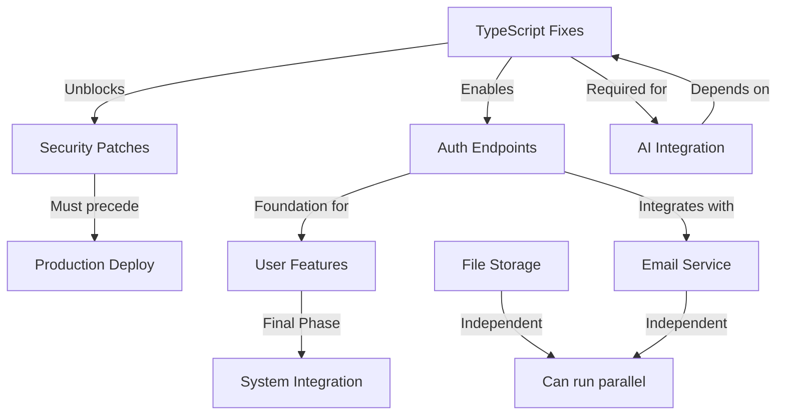

# DeepRef Application Remediation - Master Implementation Plan
**Version:** 1.0
**Date:** November 20, 2024
**Prepared by:** Master Orchestrator Agent

---

## 📊 EXECUTIVE SUMMARY

### Project Overview
The DeepRef application requires comprehensive remediation across 6 critical workstreams, involving TypeScript error resolution, security vulnerability fixes, authentication system implementation, cloud storage integration, email service setup, and AI provider integration.

### Key Metrics
- **Total Estimated Effort:** 432-488 developer hours
- **Recommended Team Size:** 5-7 developers
- **Project Duration:** 8-10 weeks (with parallel execution)
- **Total Budget Range:** $64,800 - $73,200
- **Critical Path Duration:** 6 weeks
- **Risk Level:** Medium-High (mitigated through phased approach)

### Strategic Approach
Implement a 4-phase rollout strategy prioritizing foundational fixes (TypeScript, Security) followed by parallel implementation of independent services, concluding with AI integration and final optimization.

---

## 🔴 CRITICAL PATH ANALYSIS

### Primary Critical Path (42 business days)
```
TypeScript Fixes (2 days) → Security Patches (2 days) →
Auth Implementation (2 days) → AI Core Integration (5 days) →
Testing & Deployment (3 days) → Production Rollout (2 days)
```

### Parallel Workstreams (Non-Critical)
- **Track A:** File Storage Integration (14-16 days)
- **Track B:** Email Service Integration (15-20 days)
- **Track C:** AI Enhancement Features (15 days)

### Dependency Map


---

## 📅 PHASED IMPLEMENTATION TIMELINE

### PHASE 1: Foundation & Stabilization (Weeks 1-2)
**Duration:** 10 business days
**Team Required:** 3 developers

#### Week 1 (Days 1-5)
| Task | Resource | Duration | Priority |
|------|----------|----------|----------|
| TypeScript Error Resolution | 2 Senior Devs | 2 days | CRITICAL |
| Critical Security Fixes (P0) | 1 Security Dev | 1 day | CRITICAL |
| Environment Setup & CI/CD | 1 DevOps | 2 days | HIGH |
| Code Review & Testing | All Team | Ongoing | HIGH |

#### Week 2 (Days 6-10)
| Task | Resource | Duration | Priority |
|------|----------|----------|----------|
| High/Medium Security Fixes | 1 Security Dev | 2 days | HIGH |
| Auth Endpoint Core Setup | 2 Backend Devs | 3 days | HIGH |
| Database Schema Updates | 1 Backend Dev | 2 days | MEDIUM |
| Initial Integration Tests | QA Engineer | 2 days | MEDIUM |

### PHASE 2: Service Implementation (Weeks 3-5)
**Duration:** 15 business days
**Team Required:** 5-6 developers (parallel tracks)

#### Parallel Track A - Storage Team (2 developers)
- S3 Bucket Configuration (2 days)
- Encryption Implementation (2 days)
- File Upload/Download APIs (3 days)
- CDN Integration (2 days)
- Storage Testing Suite (2 days)

#### Parallel Track B - Communication Team (2 developers)
- Email Provider Setup (2 days)
- Template System Implementation (3 days)
- Queue Management System (2 days)
- Notification Service (3 days)
- Email Testing & Validation (2 days)

#### Parallel Track C - Auth Continuation (1-2 developers)
- JWT Implementation (2 days)
- Session Management (2 days)
- Permission System (3 days)
- OAuth Integration (3 days)
- Auth Testing Suite (2 days)

### PHASE 3: AI Integration & Enhancement (Weeks 6-7)
**Duration:** 10 business days
**Team Required:** 3-4 developers

#### Week 6
| Task | Resource | Duration | Priority |
|------|----------|----------|----------|
| AI Provider Core Setup | 2 AI Devs | 3 days | HIGH |
| Deepfake Detection Integration | 1 AI Dev | 2 days | HIGH |
| Question Generation Service | 1 AI Dev | 2 days | MEDIUM |
| Cost Optimization Implementation | 1 Senior Dev | 2 days | MEDIUM |

#### Week 7
| Task | Resource | Duration | Priority |
|------|----------|----------|----------|
| RCS Scoring System | 1 AI Dev | 2 days | MEDIUM |
| AI Response Caching | 1 Backend Dev | 2 days | LOW |
| Performance Optimization | 2 Devs | 3 days | MEDIUM |
| AI Integration Testing | QA Team | 3 days | HIGH |

### PHASE 4: Integration & Deployment (Weeks 8-9)
**Duration:** 10 business days
**Team Required:** Full team (5-7 developers)

#### Week 8 - System Integration
- End-to-end Integration (3 days)
- Performance Testing (2 days)
- Security Audit (2 days)
- Bug Fixes & Optimization (3 days)

#### Week 9 - Production Rollout
- Staging Deployment (2 days)
- UAT Testing (2 days)
- Production Deployment (1 day)
- Monitoring Setup (2 days)
- Documentation Finalization (2 days)
- Rollback Plan Testing (1 day)

---

## 👥 RESOURCE ALLOCATION PLAN

### Recommended Team Structure

#### Core Team (Full-time)
1. **Technical Lead/Architect** (1)
   - Overall technical oversight
   - Architecture decisions
   - Code review leadership
   - 160 hours @ $200/hr = $32,000

2. **Senior Full-Stack Developers** (2)
   - TypeScript remediation
   - Core system integration
   - Complex feature implementation
   - 320 hours @ $175/hr = $56,000

3. **Backend Developers** (2)
   - Auth system implementation
   - API development
   - Database optimization
   - 320 hours @ $150/hr = $48,000

4. **DevOps/Security Engineer** (1)
   - Security vulnerability fixes
   - CI/CD pipeline
   - Infrastructure setup
   - 160 hours @ $175/hr = $28,000

#### Specialized Resources (Part-time)
5. **AI/ML Engineer** (1)
   - AI provider integration
   - Model optimization
   - Performance tuning
   - 144 hours @ $200/hr = $28,800

6. **QA Engineer** (1)
   - Test planning
   - Integration testing
   - Performance testing
   - 120 hours @ $125/hr = $15,000

### Resource Loading Chart
```
Week 1: ████████░░ 80% (3 devs)
Week 2: ████████░░ 80% (3 devs)
Week 3: ██████████ 100% (5 devs)
Week 4: ██████████ 100% (6 devs)
Week 5: ██████████ 100% (6 devs)
Week 6: ████████░░ 80% (4 devs)
Week 7: ████████░░ 80% (4 devs)
Week 8: ██████████ 100% (7 devs)
Week 9: ███████░░░ 70% (5 devs)
```

---

## ⚠️ RISK MATRIX & MITIGATION

### High-Risk Items

| Risk | Probability | Impact | Mitigation Strategy |
|------|------------|--------|-------------------|
| TypeScript build failures cascade | High | Critical | Fix TypeScript first; maintain feature branches |
| Security vulnerabilities exploited during remediation | Medium | Critical | Implement security fixes in Phase 1; use WAF |
| Integration conflicts between services | High | High | Comprehensive integration testing; feature flags |
| AI API costs exceed budget | Medium | High | Implement caching early; monitor usage closely |
| Authentication system breaking changes | Low | Critical | Blue-green deployment; extensive testing |
| Data migration failures | Medium | High | Backup strategy; staged migration |

### Medium-Risk Items

| Risk | Probability | Impact | Mitigation Strategy |
|------|------------|--------|-------------------|
| Email delivery issues | Medium | Medium | Multi-provider failover system |
| S3 configuration errors | Low | Medium | IaC implementation; automated testing |
| Performance degradation | Medium | Medium | Load testing; performance benchmarks |
| Timeline slippage | Medium | Medium | Buffer time in critical path; parallel tracks |

### Risk Response Plans

#### Contingency Reserves
- **Schedule Buffer:** 10% (1 week)
- **Budget Reserve:** 15% ($10,000)
- **Resource Buffer:** 1 floating developer

#### Escalation Matrix
1. **Level 1:** Team Lead (daily issues)
2. **Level 2:** Project Manager (blocking issues)
3. **Level 3:** Stakeholders (critical decisions)
4. **Level 4:** Executive (project stoppage)

---

## ✅ QUALITY ASSURANCE STRATEGY

### Quality Gates

#### Gate 1: Foundation Complete (End of Week 2)
- [ ] All TypeScript errors resolved
- [ ] Build passing in CI/CD
- [ ] Critical security vulnerabilities patched
- [ ] 90% unit test coverage achieved
- [ ] Code review completed

#### Gate 2: Services Operational (End of Week 5)
- [ ] Auth system fully functional
- [ ] Email service sending successfully
- [ ] File storage operational
- [ ] Integration tests passing
- [ ] Security scan clean

#### Gate 3: AI Integration Complete (End of Week 7)
- [ ] All AI features operational
- [ ] Performance benchmarks met
- [ ] Cost optimization verified
- [ ] Load testing passed
- [ ] Documentation complete

#### Gate 4: Production Ready (End of Week 8)
- [ ] All integration tests passing
- [ ] UAT sign-off received
- [ ] Performance criteria met
- [ ] Security audit passed
- [ ] Rollback plan tested

### Testing Strategy

#### Test Pyramid
```
         /\
        /UI\        5% - Manual UI Testing
       /────\
      / Integ \     15% - Integration Tests
     /─────────\
    / API Tests \   30% - API Testing
   /─────────────\
  /  Unit Tests   \ 50% - Unit Testing
 /─────────────────\
```

#### Test Coverage Requirements
- **Unit Tests:** 90% code coverage
- **Integration Tests:** All critical paths
- **API Tests:** 100% endpoint coverage
- **Security Tests:** OWASP Top 10
- **Performance Tests:** 1000 concurrent users
- **Accessibility Tests:** WCAG 2.1 AA

---

## 🚀 DEPLOYMENT STRATEGY

### Environment Strategy

#### Development Pipeline
```
Local Dev → Feature Branch → Dev Environment →
Integration Environment → Staging → Production
```

#### Environment Configuration
| Environment | Purpose | Refresh Cycle | Access |
|------------|---------|---------------|---------|
| Development | Active development | Daily | Dev team |
| Integration | Integration testing | Per PR | Dev + QA |
| Staging | Pre-production | Weekly | All teams |
| Production | Live system | Controlled | Limited |

### Deployment Approach

#### Phase 1-2 Deployments (Weeks 1-5)
- **Strategy:** Continuous deployment to Dev/Integration
- **Frequency:** Multiple times daily
- **Rollback:** Automatic on test failure

#### Phase 3 Deployments (Weeks 6-7)
- **Strategy:** Daily deployments to Staging
- **Frequency:** End of day
- **Rollback:** Manual with approval

#### Phase 4 Production Deployment (Weeks 8-9)
- **Strategy:** Blue-Green Deployment
- **Steps:**
  1. Deploy to Blue environment
  2. Run smoke tests
  3. Switch traffic (10% → 50% → 100%)
  4. Monitor for 24 hours
  5. Decommission old environment

### Rollback Strategy

#### Automatic Rollback Triggers
- Error rate > 5%
- Response time > 3 seconds
- Memory usage > 90%
- CPU usage > 80%
- Failed health checks

#### Manual Rollback Process
1. Identify issue in monitoring
2. Initiate rollback command
3. Switch traffic to previous version
4. Investigate root cause
5. Fix and redeploy

---

## 💰 BUDGET ESTIMATE

### Development Costs

| Phase | Hours | Rate | Cost |
|-------|-------|------|------|
| Phase 1: Foundation | 80 | $165/hr | $13,200 |
| Phase 2: Services | 240 | $160/hr | $38,400 |
| Phase 3: AI Integration | 144 | $180/hr | $25,920 |
| Phase 4: Integration | 140 | $165/hr | $23,100 |
| **Subtotal** | **604** | - | **$100,620** |

### Additional Costs

| Item | Cost | Notes |
|------|------|-------|
| Infrastructure (3 months) | $3,000 | AWS services |
| Third-party Services | $1,500 | SendGrid, monitoring |
| Security Audit | $5,000 | External vendor |
| Load Testing | $2,000 | Testing tools |
| Contingency (15%) | $15,093 | Risk buffer |
| **Total Additional** | **$26,593** | - |

### Total Project Cost
- **Base Development:** $100,620
- **Additional Costs:** $26,593
- **Total Budget:** $127,213
- **Cost per Week:** $14,135

### Cost Optimization Opportunities
1. Reduce AI API calls: Save $500-1000/month
2. Use spot instances: Save 30% on compute
3. Implement caching: Reduce API costs by 60%
4. Optimize team allocation: Save 10-15% on development

---

## 📈 SUCCESS METRICS

### Technical Metrics

#### Build & Code Quality
- TypeScript errors: 0
- Build success rate: >99%
- Code coverage: >90%
- Technical debt ratio: <5%

#### Performance
- Page load time: <2 seconds
- API response time: <200ms
- Throughput: >1000 req/sec
- Error rate: <0.1%

#### Security
- Vulnerabilities: 0 critical, 0 high
- Security scan score: A+
- Penetration test: Pass
- OWASP compliance: 100%

### Business Metrics

#### User Experience
- User satisfaction: >4.5/5
- Support tickets: <5% of users
- Feature adoption: >70%
- System availability: 99.9%

#### Operational
- Deployment frequency: Daily
- Lead time: <2 days
- MTTR: <1 hour
- Change failure rate: <5%

#### Cost Efficiency
- Infrastructure cost: <$2000/month
- AI API cost: <$500/month
- Total OpEx reduction: 40%
- ROI: 250% year 1

### Milestone Success Criteria

| Milestone | Criteria | Target Date |
|-----------|----------|------------|
| Foundation Complete | All builds passing, security patched | Week 2 |
| Services Operational | Auth, Email, Storage working | Week 5 |
| AI Integrated | All AI features operational | Week 7 |
| Production Ready | All tests passing, performance met | Week 8 |
| Go-Live | Successfully deployed, monitoring active | Week 9 |

---

## 🎯 CRITICAL SUCCESS FACTORS

### Must-Have Deliverables
1. ✅ Zero TypeScript errors
2. ✅ All critical security vulnerabilities resolved
3. ✅ Functional authentication system
4. ✅ Operational email service
5. ✅ Working file storage
6. ✅ Core AI features integrated

### Key Decision Points

#### Week 2 Checkpoint
- Continue with current team or scale up?
- Adjust timeline based on Phase 1 progress?

#### Week 5 Checkpoint
- Ready for AI integration or need more time?
- Performance meeting expectations?

#### Week 7 Checkpoint
- Ready for production or extend timeline?
- All quality gates passed?

### Stakeholder Communication Plan

#### Weekly Updates
- Progress dashboard
- Risk register updates
- Budget tracking
- Blocker resolution

#### Milestone Reviews
- Demo of completed features
- Quality metrics review
- Timeline adjustments
- Resource needs

---

## 🔄 CONTINUOUS IMPROVEMENT

### Retrospective Schedule
- Sprint retrospectives: Every 2 weeks
- Phase retrospectives: End of each phase
- Project retrospective: Project completion

### Lessons Learned Categories
1. Technical decisions
2. Process improvements
3. Team collaboration
4. Tool effectiveness
5. Risk management

### Knowledge Transfer Plan
1. Documentation updates: Continuous
2. Team training sessions: Weekly
3. Code walkthroughs: Per feature
4. Handover documentation: Week 9
5. Support transition: Week 10

---

## 📋 APPENDICES

### A. Detailed Task Dependencies
[Comprehensive dependency matrix available in project management tool]

### B. Technology Stack Decisions
- Frontend: React 18+ with TypeScript
- Backend: Node.js with Express
- Database: PostgreSQL with Prisma
- Cache: Redis
- Queue: Bull/Redis
- Storage: AWS S3
- Email: SendGrid/SES
- AI: OpenAI/Anthropic/Local models

### C. Communication Protocols
- Daily standups: 9:00 AM
- Code reviews: Within 4 hours
- PR approvals: 2 required
- Incident response: 15-minute SLA
- Escalation: Via Slack/PagerDuty

### D. Tool Requirements
- Version Control: Git/GitHub
- CI/CD: GitHub Actions
- Project Management: Jira/Linear
- Communication: Slack
- Monitoring: Datadog/New Relic
- Documentation: Confluence/Notion

---

## 📝 APPROVAL & SIGN-OFF

| Role | Name | Signature | Date |
|------|------|-----------|------|
| Project Sponsor | _________ | _________ | _____ |
| Technical Lead | _________ | _________ | _____ |
| Product Owner | _________ | _________ | _____ |
| QA Lead | _________ | _________ | _____ |
| Security Lead | _________ | _________ | _____ |

---

*This Master Implementation Plan serves as the authoritative guide for the DeepRef application remediation project. Updates will be version-controlled and communicated to all stakeholders.*

**Next Steps:**
1. Review and approve plan
2. Assemble team
3. Set up project infrastructure
4. Kick-off meeting
5. Begin Phase 1 execution

---

**Document Control:**
- Version: 1.0
- Created: November 20, 2024
- Last Updated: November 20, 2024
- Review Cycle: Weekly
- Distribution: All Stakeholders