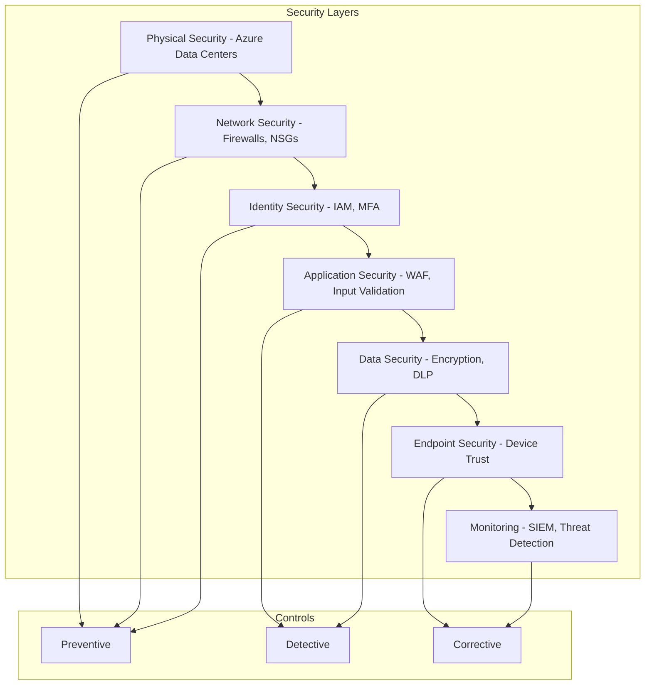
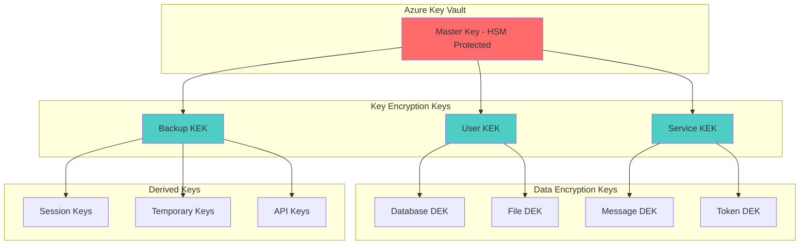
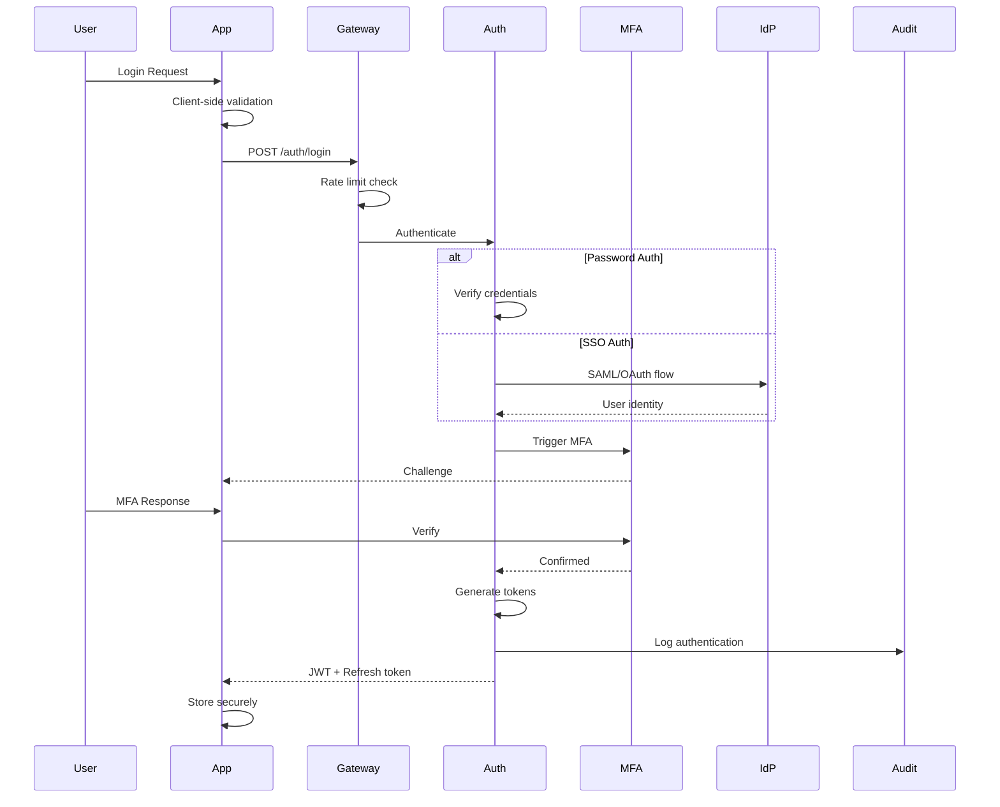
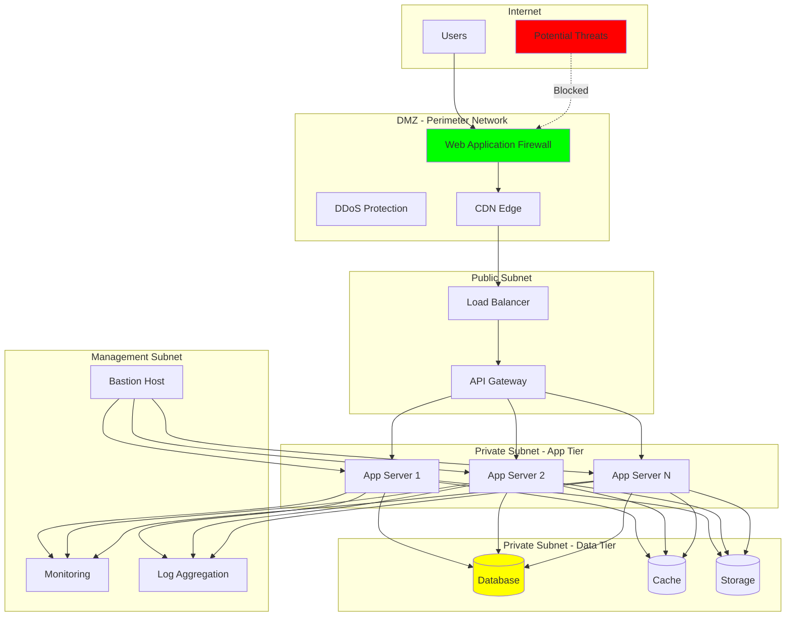
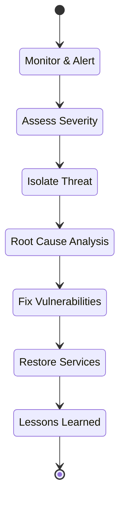

# Security Architecture - Deep Dive

**Version**: 1.0.0
**Date**: November 23, 2024
**Classification**: Security Sensitive

---

## Table of Contents
1. [Security Framework](#security-framework)
2. [Zero-Knowledge Implementation](#zero-knowledge-implementation)
3. [Encryption Architecture](#encryption-architecture)
4. [Identity & Access Management](#identity--access-management)
5. [Network Security](#network-security)
6. [Application Security](#application-security)
7. [Data Security](#data-security)
8. [Compliance & Audit](#compliance--audit)
9. [Incident Response](#incident-response)
10. [Security Operations](#security-operations)

---

## Security Framework

### Defense in Depth Model



### Security Principles

1. **Least Privilege**: Minimal permissions by default
2. **Zero Trust**: Never trust, always verify
3. **Defense in Depth**: Multiple security layers
4. **Fail Secure**: Default to secure state on failure
5. **Security by Design**: Built-in, not bolted-on
6. **Continuous Validation**: Regular security assessments

---

## Zero-Knowledge Implementation

### Client-Side Encryption Flow

```typescript
// Client-Side Encryption Implementation
class ZeroKnowledgeEncryption {
  private masterKey: CryptoKey;
  private dataKeys: Map<string, CryptoKey> = new Map();

  async initialize(password: string, salt: Uint8Array) {
    // Derive master key from password
    const keyMaterial = await this.getKeyMaterial(password);
    this.masterKey = await this.deriveKey(keyMaterial, salt);
  }

  private async getKeyMaterial(password: string): Promise<CryptoKey> {
    const enc = new TextEncoder();
    return window.crypto.subtle.importKey(
      'raw',
      enc.encode(password),
      'PBKDF2',
      false,
      ['deriveBits', 'deriveKey']
    );
  }

  private async deriveKey(
    keyMaterial: CryptoKey,
    salt: Uint8Array
  ): Promise<CryptoKey> {
    return window.crypto.subtle.deriveKey(
      {
        name: 'PBKDF2',
        salt: salt,
        iterations: 600000,  // OWASP 2023 recommendation
        hash: 'SHA-256'
      },
      keyMaterial,
      { name: 'AES-GCM', length: 256 },
      true,
      ['encrypt', 'decrypt']
    );
  }

  async encryptData(
    plaintext: string,
    associatedData?: string
  ): Promise<EncryptedData> {
    const iv = window.crypto.getRandomValues(new Uint8Array(12));
    const enc = new TextEncoder();
    const data = enc.encode(plaintext);

    const encrypted = await window.crypto.subtle.encrypt(
      {
        name: 'AES-GCM',
        iv: iv,
        additionalData: associatedData
          ? enc.encode(associatedData)
          : undefined,
        tagLength: 128
      },
      this.masterKey,
      data
    );

    return {
      ciphertext: btoa(String.fromCharCode(...new Uint8Array(encrypted))),
      iv: btoa(String.fromCharCode(...iv)),
      algorithm: 'AES-256-GCM',
      keyId: await this.getKeyId()
    };
  }

  async decryptData(
    encryptedData: EncryptedData,
    associatedData?: string
  ): Promise<string> {
    const ciphertext = Uint8Array.from(
      atob(encryptedData.ciphertext),
      c => c.charCodeAt(0)
    );
    const iv = Uint8Array.from(
      atob(encryptedData.iv),
      c => c.charCodeAt(0)
    );

    const decrypted = await window.crypto.subtle.decrypt(
      {
        name: 'AES-GCM',
        iv: iv,
        additionalData: associatedData
          ? new TextEncoder().encode(associatedData)
          : undefined,
        tagLength: 128
      },
      this.masterKey,
      ciphertext
    );

    return new TextDecoder().decode(decrypted);
  }

  // Searchable encryption for queries
  async createSearchToken(keyword: string): Promise<string> {
    const hmac = await window.crypto.subtle.sign(
      'HMAC',
      this.masterKey,
      new TextEncoder().encode(keyword.toLowerCase())
    );
    return btoa(String.fromCharCode(...new Uint8Array(hmac)));
  }
}

interface EncryptedData {
  ciphertext: string;
  iv: string;
  algorithm: string;
  keyId: string;
}
```

### Homomorphic Operations

```python
# Server-Side Homomorphic Operations
from typing import List, Tuple
import numpy as np
from phe import paillier

class HomomorphicProcessor:
    """
    Partial homomorphic encryption for specific operations
    without decrypting data
    """

    def __init__(self):
        self.public_key, self.private_key = paillier.generate_paillier_keypair()

    def encrypt_number(self, value: float) -> paillier.EncryptedNumber:
        """Encrypt a number for homomorphic operations"""
        return self.public_key.encrypt(value)

    def add_encrypted(
        self,
        enc1: paillier.EncryptedNumber,
        enc2: paillier.EncryptedNumber
    ) -> paillier.EncryptedNumber:
        """Add two encrypted numbers without decryption"""
        return enc1 + enc2

    def multiply_encrypted_by_constant(
        self,
        encrypted: paillier.EncryptedNumber,
        constant: float
    ) -> paillier.EncryptedNumber:
        """Multiply encrypted number by constant"""
        return encrypted * constant

    def compute_encrypted_average(
        self,
        encrypted_values: List[paillier.EncryptedNumber]
    ) -> paillier.EncryptedNumber:
        """Compute average of encrypted values"""
        total = encrypted_values[0]
        for value in encrypted_values[1:]:
            total = total + value
        return total * (1.0 / len(encrypted_values))

    def compare_encrypted_threshold(
        self,
        encrypted_value: paillier.EncryptedNumber,
        threshold: float
    ) -> bool:
        """
        Compare encrypted value with threshold using secure multiparty computation
        Note: This requires special protocols and is simplified here
        """
        # In practice, use secure comparison protocols
        # This is a placeholder for demonstration
        raise NotImplementedError("Requires secure comparison protocol")
```

---

## Encryption Architecture

### Key Management Hierarchy



### Encryption Standards

| Data Type | Algorithm | Key Size | Mode | Implementation |
|-----------|-----------|----------|------|----------------|
| **Data at Rest** | AES | 256-bit | GCM | Azure TDE |
| **Data in Transit** | TLS 1.3 | 256-bit | - | HTTPS/WSS |
| **Application Data** | AES | 256-bit | GCM | Web Crypto API |
| **Passwords** | Argon2id | - | - | 600K iterations |
| **API Tokens** | HMAC | 256-bit | SHA-256 | JWT HS256 |
| **File Encryption** | AES | 256-bit | CTR | Streaming |
| **Key Derivation** | PBKDF2 | 256-bit | SHA-256 | 600K iterations |

### Key Rotation Strategy

```yaml
key_rotation:
  master_key:
    frequency: annual
    method: hsm_rekey
    backup: 3_generations

  kek:
    frequency: quarterly
    method: automated
    notification: 30_days_advance

  dek:
    frequency: monthly
    method: automated
    zero_downtime: true

  api_keys:
    frequency: on_demand
    max_age: 90_days
    auto_expire: true

  certificates:
    frequency: annual
    renewal: 30_days_before_expiry
    provider: lets_encrypt
```

---

## Identity & Access Management

### Authentication Architecture



### JWT Token Structure

```json
{
  "header": {
    "alg": "RS256",
    "typ": "JWT",
    "kid": "key-id-2024-01"
  },
  "payload": {
    "sub": "user-uuid",
    "iat": 1700000000,
    "exp": 1700003600,
    "iss": "https://api.aideepref.com",
    "aud": ["api.aideepref.com"],
    "scope": ["read:profile", "write:jobs"],
    "role": "employer",
    "tenant": "tenant-uuid",
    "device_id": "device-fingerprint",
    "session_id": "session-uuid",
    "mfa_verified": true
  },
  "signature": "..."
}
```

### RBAC + ABAC Matrix

```yaml
# Role-Based Access Control
roles:
  super_admin:
    inherits: []
    permissions:
      - "*"

  admin:
    inherits: []
    permissions:
      - users:*
      - jobs:*
      - references:*
      - analytics:read
      - audit:read

  employer:
    inherits: [user]
    permissions:
      - jobs:create
      - jobs:update:own
      - jobs:delete:own
      - candidates:view:applied
      - references:request
      - analytics:read:own

  job_seeker:
    inherits: [user]
    permissions:
      - profile:manage:own
      - jobs:search
      - jobs:view
      - jobs:apply
      - references:manage:own

  referrer:
    inherits: [user]
    permissions:
      - references:provide
      - references:view:own
      - profile:view:limited

  user:
    inherits: []
    permissions:
      - profile:read:own
      - notifications:manage:own
      - settings:manage:own

# Attribute-Based Access Control
policies:
  - id: data-residency
    description: Enforce data residency requirements
    effect: deny
    condition: |
      resource.region != user.allowed_regions

  - id: time-based-access
    description: Restrict access to business hours
    effect: allow
    condition: |
      current_time.hour >= 8 AND current_time.hour <= 18
      OR user.role in ['admin', 'super_admin']

  - id: ip-restriction
    description: Restrict admin access to known IPs
    effect: deny
    condition: |
      user.role in ['admin', 'super_admin']
      AND request.ip NOT IN allowed_admin_ips

  - id: mfa-required
    description: Require MFA for sensitive operations
    effect: deny
    condition: |
      resource.sensitivity == 'high'
      AND NOT user.mfa_verified

  - id: rate-limit-ai
    description: Rate limit AI operations
    effect: deny
    condition: |
      operation.type == 'ai_processing'
      AND user.ai_requests_today > user.ai_quota
```

---

## Network Security

### Network Segmentation



### Network Security Groups (NSG) Rules

```yaml
# Network Security Configuration
nsgs:
  dmz:
    inbound:
      - priority: 100
        name: Allow_HTTPS
        source: Internet
        destination: DMZ
        port: 443
        protocol: TCP
        action: Allow

      - priority: 200
        name: Allow_HTTP_Redirect
        source: Internet
        destination: DMZ
        port: 80
        protocol: TCP
        action: Allow

    outbound:
      - priority: 100
        name: Allow_to_AppTier
        source: DMZ
        destination: AppTier
        port: 8080
        protocol: TCP
        action: Allow

  app_tier:
    inbound:
      - priority: 100
        name: Allow_from_DMZ
        source: DMZ
        destination: AppTier
        port: 8080
        protocol: TCP
        action: Allow

      - priority: 200
        name: Allow_from_Management
        source: ManagementSubnet
        destination: AppTier
        port: 22
        protocol: TCP
        action: Allow

    outbound:
      - priority: 100
        name: Allow_to_DataTier
        source: AppTier
        destination: DataTier
        port: 5432,6379
        protocol: TCP
        action: Allow

  data_tier:
    inbound:
      - priority: 100
        name: Allow_from_AppTier
        source: AppTier
        destination: DataTier
        port: 5432,6379
        protocol: TCP
        action: Allow

      - priority: 999
        name: Deny_All
        source: Any
        destination: DataTier
        port: Any
        protocol: Any
        action: Deny
```

---

## Application Security

### Input Validation & Sanitization

```typescript
// Comprehensive Input Validation
class InputValidator {
  // SQL Injection Prevention
  validateSQLInput(input: string): string {
    // Use parameterized queries instead
    // This is just for additional validation
    const sqlBlacklist = [
      'SELECT', 'INSERT', 'UPDATE', 'DELETE', 'DROP',
      'UNION', 'EXEC', 'SCRIPT', '--', '/*', '*/'
    ];

    const normalized = input.toUpperCase();
    for (const keyword of sqlBlacklist) {
      if (normalized.includes(keyword)) {
        throw new SecurityError(`Potential SQL injection detected`);
      }
    }

    return input;
  }

  // XSS Prevention
  sanitizeHTML(input: string): string {
    const map: Record<string, string> = {
      '&': '&amp;',
      '<': '&lt;',
      '>': '&gt;',
      '"': '&quot;',
      "'": '&#039;',
      '/': '&#047;'
    };

    return input.replace(/[&<>"'/]/g, (m) => map[m]);
  }

  // Path Traversal Prevention
  validateFilePath(path: string): string {
    const dangerous = ['..', '~', '\\', '%00', '\n', '\r'];

    for (const pattern of dangerous) {
      if (path.includes(pattern)) {
        throw new SecurityError('Invalid file path');
      }
    }

    // Ensure path is within allowed directory
    const normalizedPath = path.normalize();
    if (!normalizedPath.startsWith('/allowed/path/')) {
      throw new SecurityError('Path outside allowed directory');
    }

    return normalizedPath;
  }

  // Command Injection Prevention
  validateCommand(command: string): string {
    const shellChars = ['&', '|', ';', '$', '>', '<', '`', '\\', '!'];

    for (const char of shellChars) {
      if (command.includes(char)) {
        throw new SecurityError('Invalid command characters');
      }
    }

    return command;
  }

  // SSRF Prevention
  validateURL(url: string): URL {
    const parsed = new URL(url);

    // Blocklist internal IPs and metadata endpoints
    const blockedHosts = [
      '127.0.0.1',
      'localhost',
      '169.254.169.254',  // AWS metadata
      '::1',
      '0.0.0.0'
    ];

    if (blockedHosts.includes(parsed.hostname)) {
      throw new SecurityError('Invalid URL - internal address');
    }

    // Only allow HTTPS in production
    if (process.env.NODE_ENV === 'production' && parsed.protocol !== 'https:') {
      throw new SecurityError('Only HTTPS URLs allowed');
    }

    return parsed;
  }
}
```

### Security Headers

```yaml
# Security Headers Configuration
headers:
  # Content Security Policy
  Content-Security-Policy: |
    default-src 'self';
    script-src 'self' 'unsafe-inline' https://cdn.trusted.com;
    style-src 'self' 'unsafe-inline';
    img-src 'self' data: https:;
    font-src 'self';
    connect-src 'self' https://api.aideepref.com wss://ws.aideepref.com;
    frame-ancestors 'none';
    base-uri 'self';
    form-action 'self';
    upgrade-insecure-requests;

  # Other Security Headers
  Strict-Transport-Security: "max-age=31536000; includeSubDomains; preload"
  X-Content-Type-Options: "nosniff"
  X-Frame-Options: "DENY"
  X-XSS-Protection: "1; mode=block"
  Referrer-Policy: "strict-origin-when-cross-origin"
  Permissions-Policy: "geolocation=(), microphone=(), camera=()"
```

### API Security

```typescript
// API Security Middleware
class APISecurityMiddleware {
  // Rate Limiting
  rateLimiter = rateLimit({
    windowMs: 15 * 60 * 1000, // 15 minutes
    max: 100, // limit each IP to 100 requests per windowMs
    message: 'Too many requests from this IP',
    standardHeaders: true,
    legacyHeaders: false,
    handler: (req, res) => {
      // Log potential attack
      logger.warn('Rate limit exceeded', {
        ip: req.ip,
        path: req.path,
        user: req.user?.id
      });
      res.status(429).json({
        error: 'Too many requests'
      });
    }
  });

  // API Key Validation
  validateAPIKey = async (req: Request, res: Response, next: NextFunction) => {
    const apiKey = req.headers['x-api-key'];

    if (!apiKey) {
      return res.status(401).json({ error: 'API key required' });
    }

    const hashedKey = crypto
      .createHash('sha256')
      .update(apiKey)
      .digest('hex');

    const keyRecord = await db.apiKeys.findOne({
      where: { hash: hashedKey, active: true }
    });

    if (!keyRecord) {
      logger.warn('Invalid API key attempt', { ip: req.ip });
      return res.status(401).json({ error: 'Invalid API key' });
    }

    // Check rate limits for this key
    if (keyRecord.requests_today >= keyRecord.daily_limit) {
      return res.status(429).json({ error: 'Daily limit exceeded' });
    }

    // Update usage
    await db.apiKeys.increment('requests_today', {
      where: { id: keyRecord.id }
    });

    req.apiKey = keyRecord;
    next();
  };

  // Request Signing
  verifyRequestSignature = (req: Request, res: Response, next: NextFunction) => {
    const signature = req.headers['x-signature'];
    const timestamp = req.headers['x-timestamp'];

    if (!signature || !timestamp) {
      return res.status(401).json({ error: 'Request signature required' });
    }

    // Check timestamp to prevent replay attacks
    const requestTime = parseInt(timestamp as string);
    const now = Date.now();
    if (Math.abs(now - requestTime) > 300000) { // 5 minutes
      return res.status(401).json({ error: 'Request expired' });
    }

    // Verify signature
    const payload = JSON.stringify(req.body) + timestamp;
    const expectedSignature = crypto
      .createHmac('sha256', process.env.API_SECRET!)
      .update(payload)
      .digest('hex');

    if (signature !== expectedSignature) {
      logger.warn('Invalid request signature', {
        ip: req.ip,
        path: req.path
      });
      return res.status(401).json({ error: 'Invalid signature' });
    }

    next();
  };
}
```

---

## Data Security

### Data Classification

```yaml
data_classification:
  levels:
    public:
      description: Public information
      encryption_required: false
      access_control: none
      examples: [job_listings, company_info]

    internal:
      description: Internal use only
      encryption_required: true
      access_control: authentication_required
      examples: [user_profiles, applications]

    confidential:
      description: Sensitive business data
      encryption_required: true
      encryption_type: AES-256-GCM
      access_control: role_based
      audit: true
      examples: [references, ai_analysis]

    restricted:
      description: Highly sensitive data
      encryption_required: true
      encryption_type: AES-256-GCM + HSM
      access_control: strict_rbac + mfa
      audit: true
      dlp: true
      examples: [payment_info, ssn, health_data]

  handling_rules:
    - classification: restricted
      storage: encrypted_database_only
      transmission: tls_1_3_minimum
      retention: 7_years
      deletion: secure_wipe

    - classification: confidential
      storage: encrypted
      transmission: tls_1_2_minimum
      retention: 3_years
      deletion: standard

    - classification: internal
      storage: standard
      transmission: https
      retention: 1_year
      deletion: standard
```

### Data Loss Prevention (DLP)

```python
# DLP Implementation
class DataLossPreventionEngine:
    def __init__(self):
        self.patterns = {
            'ssn': r'\b\d{3}-\d{2}-\d{4}\b',
            'credit_card': r'\b\d{4}[\s-]?\d{4}[\s-]?\d{4}[\s-]?\d{4}\b',
            'email': r'\b[A-Za-z0-9._%+-]+@[A-Za-z0-9.-]+\.[A-Z|a-z]{2,}\b',
            'phone': r'\b\d{3}[-.]?\d{3}[-.]?\d{4}\b',
            'api_key': r'\b[A-Za-z0-9]{32,}\b',
            'private_key': r'-----BEGIN (RSA )?PRIVATE KEY-----'
        }

    def scan_content(self, content: str) -> List[Dict]:
        """Scan content for sensitive data patterns"""
        findings = []

        for pattern_name, pattern in self.patterns.items():
            matches = re.finditer(pattern, content)
            for match in matches:
                findings.append({
                    'type': pattern_name,
                    'position': match.span(),
                    'severity': self.get_severity(pattern_name),
                    'recommendation': self.get_recommendation(pattern_name)
                })

        return findings

    def sanitize_logs(self, log_entry: str) -> str:
        """Remove sensitive data from logs"""
        sanitized = log_entry

        # Replace sensitive patterns with placeholders
        for pattern_name, pattern in self.patterns.items():
            replacement = f'[REDACTED_{pattern_name.upper()}]'
            sanitized = re.sub(pattern, replacement, sanitized)

        return sanitized

    def prevent_exfiltration(self, data: dict, destination: str) -> bool:
        """Check if data can be sent to destination"""
        # Check destination trust level
        if not self.is_trusted_destination(destination):
            if self.contains_sensitive_data(data):
                self.alert_security_team(data, destination)
                return False

        return True

    def encrypt_sensitive_fields(self, data: dict) -> dict:
        """Automatically encrypt sensitive fields"""
        encrypted_data = data.copy()

        sensitive_fields = ['ssn', 'credit_card', 'api_key']
        for field in sensitive_fields:
            if field in encrypted_data:
                encrypted_data[field] = self.encrypt_field(encrypted_data[field])

        return encrypted_data
```

---

## Compliance & Audit

### Compliance Framework

```yaml
compliance:
  standards:
    - ISO_27001:
        status: compliant
        last_audit: 2024-01-15
        next_audit: 2025-01-15

    - SOC2_Type_II:
        status: in_progress
        target_date: 2024-06-01

    - GDPR:
        status: compliant
        dpo: security@aideepref.com

    - CCPA:
        status: compliant
        privacy_policy: updated_2024_01

    - HIPAA:
        status: not_applicable
        reason: no_health_data

  controls:
    access_control:
      - Multi-factor authentication
      - Role-based access control
      - Privileged access management
      - Access reviews (quarterly)

    data_protection:
      - Encryption at rest
      - Encryption in transit
      - Data loss prevention
      - Secure backup

    monitoring:
      - Security event logging
      - Real-time alerting
      - Threat detection
      - Vulnerability scanning

    incident_response:
      - Incident response plan
      - 24/7 security team
      - Forensic capabilities
      - Communication plan
```

### Audit Logging

```typescript
// Comprehensive Audit Logging
class AuditLogger {
  private readonly requiredFields = [
    'timestamp',
    'event_type',
    'actor',
    'resource',
    'action',
    'result',
    'ip_address'
  ];

  async logEvent(event: AuditEvent): Promise<void> {
    // Validate required fields
    this.validateEvent(event);

    // Enrich with context
    const enrichedEvent = this.enrichEvent(event);

    // Sign event for integrity
    const signedEvent = await this.signEvent(enrichedEvent);

    // Store in database
    await this.storeEvent(signedEvent);

    // Send to blockchain
    await this.blockchainLog(signedEvent);

    // Real-time alerting for critical events
    if (event.severity === 'critical') {
      await this.alertSecurityTeam(signedEvent);
    }
  }

  private enrichEvent(event: AuditEvent): EnrichedAuditEvent {
    return {
      ...event,
      timestamp: new Date().toISOString(),
      correlation_id: event.correlation_id || uuid(),
      server_id: process.env.SERVER_ID,
      environment: process.env.NODE_ENV,
      version: process.env.APP_VERSION,
      user_agent: event.user_agent,
      geo_location: this.getGeoLocation(event.ip_address)
    };
  }

  private async signEvent(event: EnrichedAuditEvent): Promise<SignedAuditEvent> {
    const eventString = JSON.stringify(event);
    const signature = await crypto
      .createHash('sha256')
      .update(eventString + process.env.AUDIT_SECRET)
      .digest('hex');

    return {
      ...event,
      signature,
      hash: crypto.createHash('sha256').update(eventString).digest('hex')
    };
  }

  private async blockchainLog(event: SignedAuditEvent): Promise<string> {
    // Submit to blockchain for immutability
    const txHash = await blockchainService.submitAuditLog({
      hash: event.hash,
      timestamp: event.timestamp,
      event_type: event.event_type,
      actor: event.actor.id
    });

    // Update event with blockchain reference
    await this.updateEventWithBlockchain(event.id, txHash);

    return txHash;
  }
}

// Audit Event Types
enum AuditEventType {
  // Authentication Events
  LOGIN_SUCCESS = 'auth.login.success',
  LOGIN_FAILED = 'auth.login.failed',
  LOGOUT = 'auth.logout',
  MFA_ENABLED = 'auth.mfa.enabled',
  PASSWORD_CHANGED = 'auth.password.changed',

  // Data Events
  DATA_CREATE = 'data.create',
  DATA_READ = 'data.read',
  DATA_UPDATE = 'data.update',
  DATA_DELETE = 'data.delete',
  DATA_EXPORT = 'data.export',

  // Security Events
  PERMISSION_GRANTED = 'security.permission.granted',
  PERMISSION_DENIED = 'security.permission.denied',
  SUSPICIOUS_ACTIVITY = 'security.suspicious',
  RATE_LIMIT_EXCEEDED = 'security.rate_limit',

  // Compliance Events
  CONSENT_GIVEN = 'compliance.consent.given',
  CONSENT_WITHDRAWN = 'compliance.consent.withdrawn',
  DATA_RETENTION_EXPIRED = 'compliance.retention.expired',
  GDPR_REQUEST = 'compliance.gdpr.request'
}
```

---

## Incident Response

### Incident Response Plan



### Incident Classification

```yaml
incident_classification:
  severity_levels:
    critical:
      description: Major security breach or data loss
      response_time: immediate
      escalation: ciso + cto + legal
      communication: required
      examples:
        - data_breach
        - ransomware
        - critical_vulnerability_exploited

    high:
      description: Significant security event
      response_time: 1_hour
      escalation: security_lead + engineering
      communication: internal
      examples:
        - failed_intrusion_attempt
        - privilege_escalation
        - suspicious_admin_activity

    medium:
      description: Security issue requiring attention
      response_time: 4_hours
      escalation: security_team
      communication: team_only
      examples:
        - malware_detected
        - policy_violation
        - unusual_access_pattern

    low:
      description: Minor security event
      response_time: 24_hours
      escalation: on_call_engineer
      communication: log_only
      examples:
        - failed_login_attempts
        - port_scan_detected
        - outdated_software
```

### Incident Response Procedures

```python
# Automated Incident Response
class IncidentResponseAutomation:
    def __init__(self):
        self.playbooks = self.load_playbooks()
        self.responders = self.load_responders()

    async def handle_incident(self, incident: Incident):
        """Automated incident response orchestration"""
        # Classify incident
        severity = self.classify_incident(incident)

        # Create incident ticket
        ticket_id = await self.create_incident_ticket(incident, severity)

        # Execute immediate containment
        if severity in ['critical', 'high']:
            await self.immediate_containment(incident)

        # Notify responders
        await self.notify_responders(incident, severity)

        # Execute playbook
        playbook = self.select_playbook(incident.type)
        await self.execute_playbook(playbook, incident)

        # Collect forensic data
        evidence = await self.collect_forensics(incident)

        # Generate initial report
        report = self.generate_report(incident, evidence)

        return {
            'ticket_id': ticket_id,
            'severity': severity,
            'status': 'responding',
            'evidence': evidence,
            'report': report
        }

    async def immediate_containment(self, incident: Incident):
        """Execute immediate containment actions"""
        actions = []

        if incident.type == 'account_compromise':
            actions.append(self.disable_account(incident.affected_user))
            actions.append(self.revoke_sessions(incident.affected_user))

        elif incident.type == 'data_exfiltration':
            actions.append(self.block_ip(incident.source_ip))
            actions.append(self.isolate_system(incident.affected_system))

        elif incident.type == 'malware':
            actions.append(self.quarantine_file(incident.file_hash))
            actions.append(self.isolate_system(incident.affected_system))

        await asyncio.gather(*actions)

    async def collect_forensics(self, incident: Incident):
        """Collect forensic evidence"""
        evidence = {
            'logs': await self.collect_logs(incident.timeframe),
            'network': await self.collect_network_data(incident.timeframe),
            'memory': await self.collect_memory_dump(incident.affected_system),
            'disk': await self.create_disk_snapshot(incident.affected_system),
            'config': await self.collect_configurations(),
            'timeline': await self.create_timeline(incident)
        }

        # Hash evidence for integrity
        evidence['hash'] = self.calculate_evidence_hash(evidence)

        # Store securely
        await self.store_evidence(evidence)

        return evidence
```

---

## Security Operations

### Security Monitoring Dashboard

```yaml
# Security Operations Center (SOC) Dashboard
monitoring_dashboard:
  real_time_metrics:
    - failed_login_attempts
    - api_error_rates
    - unusual_traffic_patterns
    - new_user_registrations
    - privilege_escalations
    - data_access_anomalies

  threat_indicators:
    - known_malicious_ips
    - suspicious_user_agents
    - sql_injection_attempts
    - xss_attempts
    - brute_force_attacks
    - dos_attacks

  compliance_metrics:
    - patch_compliance_percentage
    - mfa_adoption_rate
    - encryption_coverage
    - audit_log_completeness
    - incident_response_time
    - vulnerability_remediation_time

  alerts:
    critical:
      - multiple_admin_login_failures
      - data_exfiltration_detected
      - cryptomining_detected
      - ransomware_indicators

    high:
      - unusual_database_queries
      - api_abuse_detected
      - certificate_expiry_warning
      - backup_failure

    medium:
      - high_cpu_usage
      - disk_space_warning
      - slow_response_times
      - configuration_drift
```

### Vulnerability Management

```python
# Vulnerability Management System
class VulnerabilityManager:
    def __init__(self):
        self.scanner = VulnerabilityScanner()
        self.database = VulnerabilityDatabase()

    async def scan_infrastructure(self):
        """Comprehensive vulnerability scanning"""
        results = {
            'timestamp': datetime.utcnow(),
            'scans': []
        }

        # Network scanning
        network_vulns = await self.scanner.scan_network()
        results['scans'].append(network_vulns)

        # Application scanning
        app_vulns = await self.scanner.scan_applications()
        results['scans'].append(app_vulns)

        # Container scanning
        container_vulns = await self.scanner.scan_containers()
        results['scans'].append(container_vulns)

        # Dependency scanning
        dep_vulns = await self.scanner.scan_dependencies()
        results['scans'].append(dep_vulns)

        # Process results
        await self.process_results(results)

        return results

    async def process_results(self, results):
        """Process and prioritize vulnerabilities"""
        for scan in results['scans']:
            for vuln in scan['vulnerabilities']:
                # Calculate risk score
                risk_score = self.calculate_risk_score(vuln)

                # Check if known vulnerability
                known_vuln = await self.database.lookup(vuln['cve'])

                # Create remediation ticket
                if risk_score >= 7:  # High or Critical
                    await self.create_remediation_ticket(vuln, risk_score)

                # Update vulnerability database
                await self.database.update(vuln, risk_score)

                # Alert if critical
                if risk_score >= 9:
                    await self.alert_security_team(vuln)

    def calculate_risk_score(self, vulnerability):
        """Calculate risk score based on CVSS and context"""
        base_score = vulnerability['cvss_score']

        # Adjust based on context
        if vulnerability['internet_exposed']:
            base_score += 1

        if vulnerability['affects_critical_system']:
            base_score += 1

        if vulnerability['exploit_available']:
            base_score += 2

        return min(10, base_score)
```

### Security Automation

```yaml
# Security Automation Playbooks
automation_playbooks:
  suspicious_login:
    triggers:
      - multiple_failed_attempts
      - login_from_new_location
      - impossible_travel

    actions:
      - send_email_alert
      - require_mfa
      - log_to_siem
      - create_investigation_ticket

  data_exfiltration:
    triggers:
      - large_data_download
      - unusual_api_usage
      - bulk_export_attempt

    actions:
      - block_user_temporarily
      - alert_security_team
      - capture_network_traffic
      - create_incident

  malware_detection:
    triggers:
      - suspicious_file_upload
      - known_malware_signature
      - unusual_process_behavior

    actions:
      - quarantine_file
      - isolate_system
      - run_forensic_collection
      - notify_incident_response

  dos_attack:
    triggers:
      - high_request_rate
      - resource_exhaustion
      - pattern_matching

    actions:
      - enable_rate_limiting
      - block_source_ip
      - scale_infrastructure
      - activate_cdn_protection
```

---

## Security Testing

### Penetration Testing Schedule

```yaml
penetration_testing:
  external:
    frequency: quarterly
    scope:
      - public_apis
      - web_applications
      - mobile_apps
    provider: third_party_certified

  internal:
    frequency: bi_annual
    scope:
      - internal_network
      - admin_interfaces
      - database_access
    provider: internal_red_team

  continuous:
    frequency: ongoing
    scope:
      - automated_scanning
      - dependency_checks
      - configuration_audits
    tools:
      - owasp_zap
      - burp_suite
      - metasploit
      - nmap
```

### Security Test Cases

```typescript
// Security Test Automation
describe('Security Tests', () => {
  describe('Authentication Security', () => {
    test('should prevent SQL injection in login', async () => {
      const maliciousInputs = [
        "admin' OR '1'='1",
        "'; DROP TABLE users; --",
        "admin'/*",
        "' OR 1=1 --"
      ];

      for (const input of maliciousInputs) {
        const response = await api.post('/auth/login', {
          username: input,
          password: 'password'
        });

        expect(response.status).toBe(400);
        expect(response.data).not.toContain('SQL');
      }
    });

    test('should enforce rate limiting', async () => {
      const requests = Array(150).fill(null).map(() =>
        api.post('/auth/login', {
          username: 'test',
          password: 'wrong'
        })
      );

      const responses = await Promise.all(requests);
      const rateLimited = responses.filter(r => r.status === 429);

      expect(rateLimited.length).toBeGreaterThan(0);
    });

    test('should require strong passwords', async () => {
      const weakPasswords = [
        '12345678',
        'password',
        'qwerty123',
        'admin123'
      ];

      for (const password of weakPasswords) {
        const response = await api.post('/auth/register', {
          email: 'test@example.com',
          password: password
        });

        expect(response.status).toBe(400);
        expect(response.data.error).toContain('password');
      }
    });
  });

  describe('Authorization Security', () => {
    test('should prevent horizontal privilege escalation', async () => {
      const user1Token = await getAuthToken('user1');
      const user2Id = 'user2-uuid';

      const response = await api.get(`/users/${user2Id}`, {
        headers: { Authorization: `Bearer ${user1Token}` }
      });

      expect(response.status).toBe(403);
    });

    test('should prevent vertical privilege escalation', async () => {
      const userToken = await getAuthToken('regular_user');

      const response = await api.get('/admin/users', {
        headers: { Authorization: `Bearer ${userToken}` }
      });

      expect(response.status).toBe(403);
    });
  });

  describe('Input Validation', () => {
    test('should prevent XSS attacks', async () => {
      const xssPayloads = [
        '<script>alert("XSS")</script>',
        '',
        'javascript:alert("XSS")',
        '<svg onload=alert("XSS")>'
      ];

      for (const payload of xssPayloads) {
        const response = await api.post('/jobs', {
          title: payload,
          description: 'Test job'
        });

        const job = await api.get(`/jobs/${response.data.id}`);

        expect(job.data.title).not.toContain('<script>');
        expect(job.data.title).not.toContain('javascript:');
      }
    });

    test('should prevent path traversal', async () => {
      const maliciousPaths = [
        '../../../etc/passwd',
        '..\\..\\..\\windows\\system32\\config\\sam',
        'files/../../../../etc/shadow'
      ];

      for (const path of maliciousPaths) {
        const response = await api.get(`/files/${path}`);

        expect(response.status).toBe(400);
      }
    });
  });
});
```

---

## Security Metrics & KPIs

```yaml
security_metrics:
  operational:
    - mean_time_to_detect: < 1 hour
    - mean_time_to_respond: < 4 hours
    - mean_time_to_remediate: < 24 hours
    - false_positive_rate: < 5%
    - incident_closure_rate: > 95%

  vulnerability_management:
    - critical_vulns_remediated: 100% within 24h
    - high_vulns_remediated: 100% within 7d
    - medium_vulns_remediated: 100% within 30d
    - patch_compliance: > 98%
    - scan_coverage: 100%

  access_control:
    - mfa_adoption: > 95%
    - privileged_account_monitoring: 100%
    - access_review_completion: 100%
    - orphaned_accounts: 0
    - password_policy_compliance: 100%

  compliance:
    - audit_findings_closure: > 95%
    - policy_exceptions: < 5%
    - training_completion: 100%
    - security_awareness_score: > 80%
    - compliance_assessment_score: > 90%

  threat_intelligence:
    - threat_feeds_integrated: > 10
    - indicators_of_compromise_blocked: > 99%
    - threat_hunting_investigations: > 4/month
    - security_research_hours: > 40/month
```

---

## Conclusion

This security architecture provides comprehensive protection through:

1. **Defense in Depth**: Multiple layers of security controls
2. **Zero Trust**: Never trust, always verify principle
3. **Data Protection**: End-to-end encryption and DLP
4. **Continuous Monitoring**: Real-time threat detection and response
5. **Compliance**: Meeting and exceeding regulatory requirements
6. **Incident Response**: Rapid detection and remediation
7. **Security Automation**: Reducing human error and response time

The architecture is designed to evolve with emerging threats while maintaining the highest levels of security for the AiDeepRef platform and its users.

---

*End of Security Architecture Document*