# AiDeepRef System Architecture Document

**Version**: 1.0.0
**Date**: November 23, 2024
**Status**: Active
**Classification**: Technical Architecture

---

## Table of Contents
1. [Executive Summary](#executive-summary)
2. [Architecture Principles](#architecture-principles)
3. [High-Level Architecture](#high-level-architecture)
4. [Service Architecture](#service-architecture)
5. [Data Architecture](#data-architecture)
6. [API Architecture](#api-architecture)
7. [Client Architecture](#client-architecture)
8. [AI/ML Architecture](#aiml-architecture)
9. [Security Architecture](#security-architecture)
10. [Integration Architecture](#integration-architecture)
11. [Scalability & Performance](#scalability--performance)
12. [Resilience & Recovery](#resilience--recovery)
13. [Observability](#observability)
14. [Architecture Decision Records](#architecture-decision-records)

---

## Executive Summary

AiDeepRef is a server-centric, cloud-native AI reference verification platform designed to support 500K users with 1000-1500 concurrent connections. The architecture prioritizes security (zero-knowledge, E2E encryption), scalability (microservices, horizontal scaling), and real-time capabilities (WebSocket, event-driven).

### Key Characteristics
- **Server-Centric Processing**: Minimal client logic, server handles heavy computation
- **Zero-Knowledge Architecture**: Client-side encryption, server never sees plaintext
- **Real-Time Communication**: WebSocket for instant updates, event-driven backend
- **Offline-First Mobile**: Sync architecture with conflict resolution
- **Multi-AI Provider**: OpenRouter integration with fallback strategies
- **Blockchain Audit Trail**: Immutable logging for compliance

---

## Architecture Principles

### 1. Server-Centric Design
- **Thin Clients**: Presentation layer only, no business logic
- **Server Processing**: All AI, validation, and business rules server-side
- **API-Driven**: RESTful + WebSocket for all client-server communication

### 2. Lean Code Philosophy
- **YAGNI**: Build only what's immediately needed
- **MVP First**: Core features before optimizations
- **Refactor on Demand**: Optimize when metrics justify

### 3. Security-First Approach
- **Zero-Knowledge**: End-to-end encryption, server can't decrypt
- **Defense in Depth**: Multiple security layers
- **Audit Everything**: Blockchain-backed immutable logs

### 4. Offline-First Mobile
- **Local-First Data**: Works without connectivity
- **Smart Sync**: Conflict-free replicated data types (CRDTs)
- **Progressive Enhancement**: Enhanced features when online

### 5. Real-Time Architecture
- **Event-Driven**: Pub/sub for decoupled services
- **WebSocket**: Persistent connections for instant updates
- **Push Notifications**: Mobile engagement

### 6. Scalability by Design
- **Horizontal Scaling**: Stateless services
- **Database Sharding**: Partition by tenant/region
- **Caching Layers**: Multi-level caching strategy

### 7. Observable Systems
- **Structured Logging**: JSON logs with correlation IDs
- **Metrics Everything**: Business and technical KPIs
- **Distributed Tracing**: End-to-end request tracking

---

## High-Level Architecture

### System Context Diagram

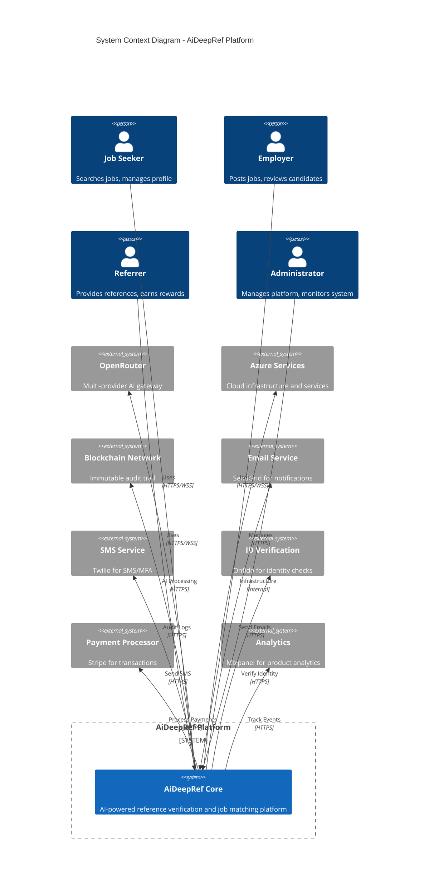
```mermaid
C4Context
    title System Context Diagram - AiDeepRef Platform

    Person(jobSeeker, "Job Seeker", "Searches jobs, manages profile")
    Person(employer, "Employer", "Posts jobs, reviews candidates")
    Person(referrer, "Referrer", "Provides references, earns rewards")
    Person(admin, "Administrator", "Manages platform, monitors system")

    System_Boundary(aiDeepRef, "AiDeepRef Platform") {
        System(platform, "AiDeepRef Core", "AI-powered reference verification and job matching platform")
    }

    System_Ext(openRouter, "OpenRouter", "Multi-provider AI gateway")
    System_Ext(azure, "Azure Services", "Cloud infrastructure and services")
    System_Ext(blockchain, "Blockchain Network", "Immutable audit trail")
    System_Ext(emailService, "Email Service", "SendGrid for notifications")
    System_Ext(smsService, "SMS Service", "Twilio for SMS/MFA")
    System_Ext(idVerification, "ID Verification", "Onfido for identity checks")
    System_Ext(paymentProcessor, "Payment Processor", "Stripe for transactions")
    System_Ext(analyticsService, "Analytics", "Mixpanel for product analytics")

    Rel(jobSeeker, platform, "Uses", "HTTPS/WSS")
    Rel(employer, platform, "Uses", "HTTPS/WSS")
    Rel(referrer, platform, "Uses", "HTTPS/WSS")
    Rel(admin, platform, "Manages", "HTTPS")

    Rel(platform, openRouter, "AI Processing", "HTTPS")
    Rel(platform, azure, "Infrastructure", "Internal")
    Rel(platform, blockchain, "Audit Logs", "HTTPS")
    Rel(platform, emailService, "Send Emails", "HTTPS")
    Rel(platform, smsService, "Send SMS", "HTTPS")
    Rel(platform, idVerification, "Verify Identity", "HTTPS")
    Rel(platform, paymentProcessor, "Process Payments", "HTTPS")
    Rel(platform, analyticsService, "Track Events", "HTTPS")
```

### Container Diagram


```mermaid
C4Container
    title Container Diagram - AiDeepRef Platform

    Person(user, "Platform User", "Job Seeker/Employer/Referrer")
    Person(admin, "Administrator", "Platform Admin")

    Container_Boundary(web, "Web Applications") {
        Container(webApp, "Progressive Web App", "React, TypeScript", "Responsive web application")
        Container(adminPortal, "Admin Portal", "React, TypeScript", "Administration interface")
    }

    Container_Boundary(mobile, "Mobile Applications") {
        Container(iosApp, "iOS App", "Swift, SwiftUI", "Native iOS application")
        Container(androidApp, "Android App", "Kotlin, Jetpack Compose", "Native Android application")
    }

    Container_Boundary(backend, "Backend Services") {
        Container(apiGateway, "API Gateway", "Node.js, Express", "Routes requests, rate limiting")
        Container(authService, "Auth Service", "Node.js, Passport", "Authentication & authorization")
        Container(coreAPI, "Core API", "Node.js, NestJS", "Business logic, orchestration")
        Container(aiService, "AI Service", "Python, FastAPI", "AI processing, OpenRouter integration")
        Container(syncService, "Sync Service", "Node.js", "Offline sync, conflict resolution")
        Container(notificationService, "Notification Service", "Node.js", "Push, email, SMS notifications")
        Container(blockchainService, "Blockchain Service", "Node.js, Web3", "Audit trail management")
        Container(jobQueue, "Job Queue", "Node.js, Bull", "Background job processing")
    }

    Container_Boundary(data, "Data Layer") {
        ContainerDb(primaryDB, "Primary Database", "PostgreSQL", "Main application data")
        ContainerDb(cacheDB, "Cache Layer", "Redis", "Session, cache, real-time")
        ContainerDb(vectorDB, "Vector Database", "Pinecone", "AI embeddings, similarity search")
        ContainerDb(blobStorage, "Blob Storage", "Azure Blob", "Files, documents, media")
    }

    Container_Boundary(infrastructure, "Infrastructure") {
        Container(cdn, "CDN", "Azure CDN", "Static assets, edge caching")
        Container(loadBalancer, "Load Balancer", "Azure LB", "Traffic distribution")
        Container(monitoring, "Monitoring", "Azure Monitor", "Metrics, logs, alerts")
    }

    Rel(user, webApp, "Uses", "HTTPS")
    Rel(user, iosApp, "Uses", "HTTPS/WSS")
    Rel(user, androidApp, "Uses", "HTTPS/WSS")
    Rel(admin, adminPortal, "Manages", "HTTPS")

    Rel(webApp, cdn, "Static Assets", "HTTPS")
    Rel(webApp, loadBalancer, "API Calls", "HTTPS/WSS")
    Rel(iosApp, loadBalancer, "API Calls", "HTTPS/WSS")
    Rel(androidApp, loadBalancer, "API Calls", "HTTPS/WSS")
    Rel(adminPortal, loadBalancer, "API Calls", "HTTPS")

    Rel(loadBalancer, apiGateway, "Routes", "Internal")
    Rel(apiGateway, authService, "Auth", "gRPC")
    Rel(apiGateway, coreAPI, "Business Logic", "HTTP")
    Rel(coreAPI, aiService, "AI Processing", "gRPC")
    Rel(coreAPI, syncService, "Sync", "gRPC")
    Rel(coreAPI, notificationService, "Notify", "AMQP")
    Rel(coreAPI, blockchainService, "Audit", "gRPC")
    Rel(coreAPI, jobQueue, "Queue Jobs", "Redis")

    Rel(authService, primaryDB, "User Data", "SQL")
    Rel(authService, cacheDB, "Sessions", "Redis Protocol")
    Rel(coreAPI, primaryDB, "App Data", "SQL")
    Rel(coreAPI, cacheDB, "Cache", "Redis Protocol")
    Rel(aiService, vectorDB, "Embeddings", "HTTPS")
    Rel(coreAPI, blobStorage, "Files", "HTTPS")
    Rel(syncService, primaryDB, "Sync Data", "SQL")
    Rel(blockchainService, primaryDB, "Audit Refs", "SQL")
```

### Deployment Architecture (Azure)

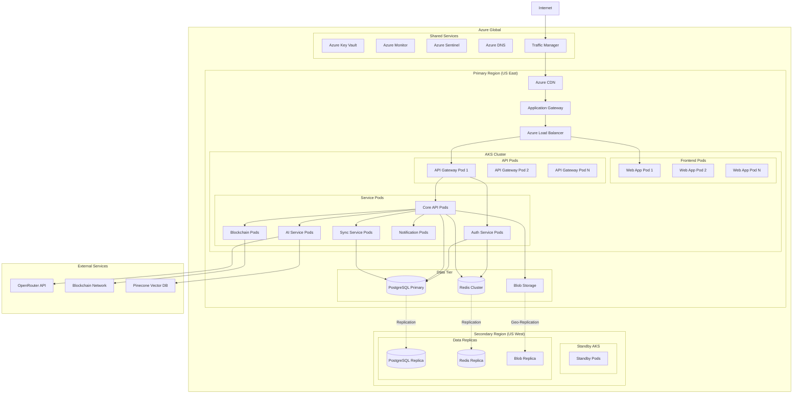
```mermaid
graph TB
    subgraph "Azure Global"
        subgraph "Primary Region (US East)"
            subgraph "AKS Cluster"
                subgraph "Frontend Pods"
                    FE1[Web App Pod 1]
                    FE2[Web App Pod 2]
                    FE3[Web App Pod N]
                end

                subgraph "API Pods"
                    API1[API Gateway Pod 1]
                    API2[API Gateway Pod 2]
                    APIN[API Gateway Pod N]
                end

                subgraph "Service Pods"
                    AUTH[Auth Service Pods]
                    CORE[Core API Pods]
                    AI[AI Service Pods]
                    SYNC[Sync Service Pods]
                    NOTIFY[Notification Pods]
                    BLOCKCHAIN[Blockchain Pods]
                end
            end

            subgraph "Data Tier"
                PG1[(PostgreSQL Primary)]
                REDIS1[(Redis Cluster)]
                BLOB1[Blob Storage]
            end

            LB1[Azure Load Balancer]
            AGW1[Application Gateway]
            CDN1[Azure CDN]
        end

        subgraph "Secondary Region (US West)"
            subgraph "Standby AKS"
                STANDBY[Standby Pods]
            end

            subgraph "Data Replicas"
                PG2[(PostgreSQL Replica)]
                REDIS2[(Redis Replica)]
                BLOB2[Blob Replica]
            end
        end

        subgraph "Shared Services"
            KV[Azure Key Vault]
            MONITOR[Azure Monitor]
            SENTINEL[Azure Sentinel]
            DNS[Azure DNS]
            TM[Traffic Manager]
        end
    end

    subgraph "External Services"
        OPENROUTER[OpenRouter API]
        BLOCKCHAIN_EXT[Blockchain Network]
        PINECONE[Pinecone Vector DB]
    end

    Internet --> TM
    TM --> CDN1
    CDN1 --> AGW1
    AGW1 --> LB1
    LB1 --> FE1
    LB1 --> API1

    API1 --> AUTH
    API1 --> CORE
    CORE --> AI
    CORE --> SYNC
    CORE --> NOTIFY
    CORE --> BLOCKCHAIN

    AUTH --> PG1
    CORE --> PG1
    SYNC --> PG1
    AUTH --> REDIS1
    CORE --> REDIS1
    CORE --> BLOB1

    AI --> OPENROUTER
    AI --> PINECONE
    BLOCKCHAIN --> BLOCKCHAIN_EXT

    PG1 -.->|Replication| PG2
    REDIS1 -.->|Replication| REDIS2
    BLOB1 -.->|Geo-Replication| BLOB2
```

---

## Service Architecture

### Microservices Breakdown

#### Core Services

| Service | Responsibility | Technology | Scaling Strategy |
|---------|---------------|------------|------------------|
| **API Gateway** | Request routing, rate limiting, authentication | Node.js + Express | Horizontal (3-10 instances) |
| **Auth Service** | Authentication, authorization, MFA, session management | Node.js + Passport | Horizontal (2-5 instances) |
| **Core API** | Business logic orchestration, workflow management | Node.js + NestJS | Horizontal (5-20 instances) |
| **AI Service** | AI processing, prompt management, OpenRouter integration | Python + FastAPI | Horizontal + GPU nodes (2-10) |
| **Sync Service** | Offline sync, conflict resolution, CRDT management | Node.js | Horizontal (2-5 instances) |
| **Notification Service** | Push, email, SMS notifications | Node.js | Horizontal (2-5 instances) |
| **Blockchain Service** | Audit trail, immutable logging | Node.js + Web3 | Vertical (2 instances) |
| **Search Service** | Full-text search, filtering, ranking | Elasticsearch cluster | Horizontal (3 nodes min) |
| **Analytics Service** | Event collection, processing | Node.js | Horizontal (2-5 instances) |

### Service Communication Patterns

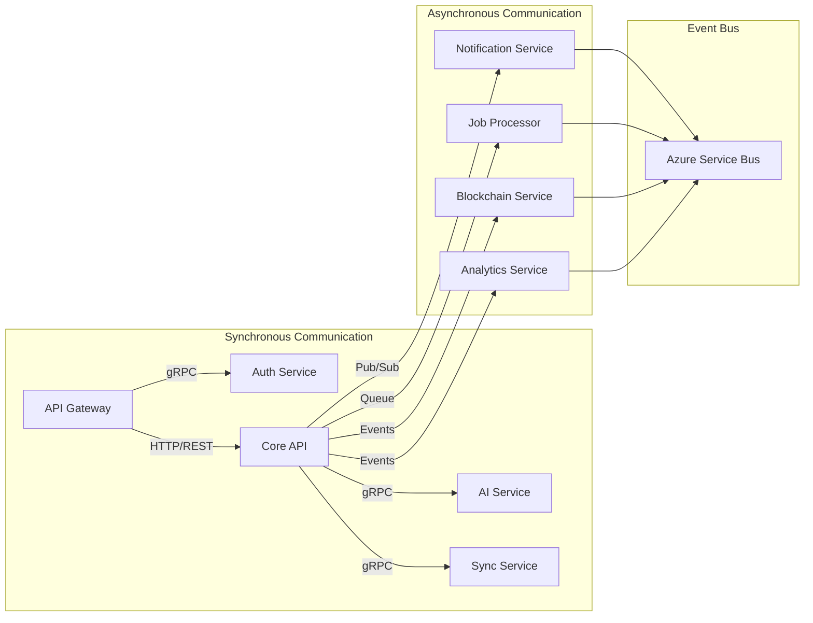
```mermaid
graph LR
    subgraph "Synchronous Communication"
        A[API Gateway] -->|gRPC| B[Auth Service]
        A -->|HTTP/REST| C[Core API]
        C -->|gRPC| D[AI Service]
        C -->|gRPC| E[Sync Service]
    end

    subgraph "Asynchronous Communication"
        C -->|Pub/Sub| F[Notification Service]
        C -->|Queue| G[Job Processor]
        C -->|Events| H[Blockchain Service]
        C -->|Events| I[Analytics Service]
    end

    subgraph "Event Bus"
        J[Azure Service Bus]
        F --> J
        G --> J
        H --> J
        I --> J
    end
```

### Event-Driven Architecture

```yaml
# Event Catalog
events:
  user:
    - user.registered
    - user.verified
    - user.profile.updated
    - user.deactivated

  job:
    - job.posted
    - job.updated
    - job.application.submitted
    - job.application.reviewed
    - job.closed

  reference:
    - reference.requested
    - reference.submitted
    - reference.verified
    - reference.ai.analyzed

  payment:
    - payment.initiated
    - payment.completed
    - payment.failed
    - payment.refunded

  security:
    - security.login.success
    - security.login.failed
    - security.mfa.enabled
    - security.suspicious.activity

# Event Processing
processors:
  - name: NotificationProcessor
    consumes: [all user.*, reference.*, payment.*]
    produces: [notification.sent]

  - name: AuditProcessor
    consumes: [all events]
    produces: [audit.logged]

  - name: AnalyticsProcessor
    consumes: [all events]
    produces: [analytics.tracked]
```

---

## Data Architecture

### Database Strategy

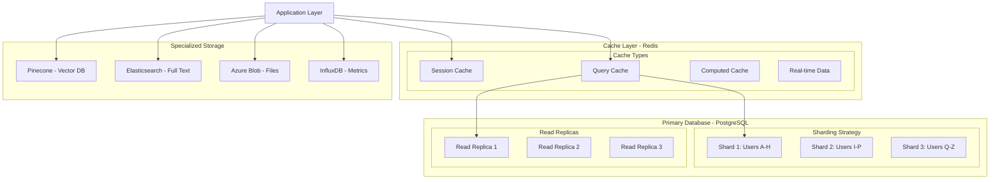
```mermaid
graph TB
    subgraph "Primary Database - PostgreSQL"
        subgraph "Sharding Strategy"
            SHARD1[Shard 1: Users A-H]
            SHARD2[Shard 2: Users I-P]
            SHARD3[Shard 3: Users Q-Z]
        end

        subgraph "Read Replicas"
            READ1[Read Replica 1]
            READ2[Read Replica 2]
            READ3[Read Replica 3]
        end
    end

    subgraph "Cache Layer - Redis"
        subgraph "Cache Types"
            SESSION[Session Cache]
            QUERY[Query Cache]
            COMPUTE[Computed Cache]
            RT[Real-time Data]
        end
    end

    subgraph "Specialized Storage"
        VECTOR[Pinecone - Vector DB]
        SEARCH[Elasticsearch - Full Text]
        BLOB[Azure Blob - Files]
        TIMESERIES[InfluxDB - Metrics]
    end

    APP[Application Layer]

    APP --> SESSION
    APP --> QUERY
    QUERY --> SHARD1
    QUERY --> READ1
    APP --> VECTOR
    APP --> SEARCH
    APP --> BLOB
    APP --> TIMESERIES
```

### Data Models (Core Entities)

```sql
-- Users Domain
CREATE TABLE users (
    id UUID PRIMARY KEY DEFAULT gen_random_uuid(),
    email VARCHAR(255) UNIQUE NOT NULL,
    email_verified BOOLEAN DEFAULT FALSE,
    password_hash VARCHAR(255) NOT NULL,
    encryption_key_id VARCHAR(255), -- Reference to Azure Key Vault
    mfa_enabled BOOLEAN DEFAULT FALSE,
    mfa_secret TEXT ENCRYPTED,
    role VARCHAR(50) NOT NULL,
    status VARCHAR(50) DEFAULT 'active',
    created_at TIMESTAMP DEFAULT CURRENT_TIMESTAMP,
    updated_at TIMESTAMP DEFAULT CURRENT_TIMESTAMP,
    last_login_at TIMESTAMP,
    metadata JSONB ENCRYPTED
);

-- Jobs Domain
CREATE TABLE jobs (
    id UUID PRIMARY KEY DEFAULT gen_random_uuid(),
    employer_id UUID REFERENCES users(id),
    title VARCHAR(255) NOT NULL,
    description TEXT ENCRYPTED,
    requirements JSONB ENCRYPTED,
    location JSONB,
    salary_range JSONB ENCRYPTED,
    status VARCHAR(50) DEFAULT 'draft',
    visibility VARCHAR(50) DEFAULT 'public',
    ai_analysis JSONB ENCRYPTED,
    posted_at TIMESTAMP,
    expires_at TIMESTAMP,
    created_at TIMESTAMP DEFAULT CURRENT_TIMESTAMP,
    updated_at TIMESTAMP DEFAULT CURRENT_TIMESTAMP
);

-- References Domain
CREATE TABLE references (
    id UUID PRIMARY KEY DEFAULT gen_random_uuid(),
    candidate_id UUID REFERENCES users(id),
    referrer_id UUID REFERENCES users(id),
    job_id UUID REFERENCES jobs(id),
    request_data JSONB ENCRYPTED,
    response_data JSONB ENCRYPTED,
    ai_analysis JSONB ENCRYPTED,
    verification_status VARCHAR(50),
    blockchain_tx_hash VARCHAR(255),
    created_at TIMESTAMP DEFAULT CURRENT_TIMESTAMP,
    submitted_at TIMESTAMP,
    verified_at TIMESTAMP
);

-- Audit Trail (Blockchain-backed)
CREATE TABLE audit_trail (
    id UUID PRIMARY KEY DEFAULT gen_random_uuid(),
    entity_type VARCHAR(100) NOT NULL,
    entity_id UUID NOT NULL,
    action VARCHAR(100) NOT NULL,
    actor_id UUID REFERENCES users(id),
    changes JSONB ENCRYPTED,
    ip_address INET,
    user_agent TEXT,
    blockchain_tx_hash VARCHAR(255),
    blockchain_block_number BIGINT,
    created_at TIMESTAMP DEFAULT CURRENT_TIMESTAMP
);
```

### Caching Strategy

```yaml
# Multi-Level Cache Configuration
cache:
  L1_Browser:
    - static_assets: 1 year
    - api_responses: 5 minutes (with ETag)
    - user_profile: 30 minutes

  L2_CDN:
    - static_assets: 1 year
    - public_api: 5 minutes
    - images: 30 days

  L3_Application:
    redis:
      sessions:
        ttl: 24 hours
        max_size: 10GB

      query_cache:
        ttl: 5 minutes
        max_size: 20GB
        invalidation: event-driven

      computed_results:
        ttl: 1 hour
        max_size: 10GB

      real_time:
        ttl: 10 seconds
        max_size: 5GB

  L4_Database:
    query_cache: 30 seconds
    connection_pool: 50-200 connections
```

### Data Flow Architecture

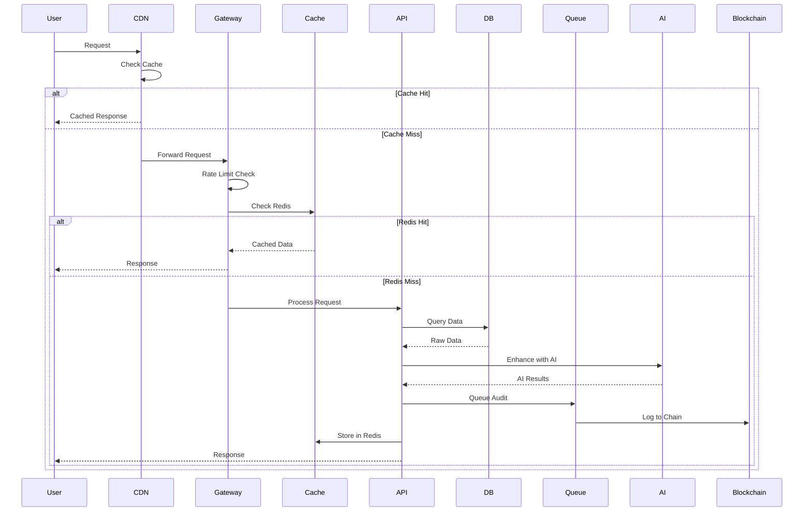
```mermaid
sequenceDiagram
    participant User
    participant CDN
    participant Gateway
    participant Cache
    participant API
    participant DB
    participant Queue
    participant AI
    participant Blockchain

    User->>CDN: Request
    CDN->>CDN: Check Cache
    alt Cache Hit
        CDN-->>User: Cached Response
    else Cache Miss
        CDN->>Gateway: Forward Request
        Gateway->>Gateway: Rate Limit Check
        Gateway->>Cache: Check Redis
        alt Redis Hit
            Cache-->>Gateway: Cached Data
            Gateway-->>User: Response
        else Redis Miss
            Gateway->>API: Process Request
            API->>DB: Query Data
            DB-->>API: Raw Data
            API->>AI: Enhance with AI
            AI-->>API: AI Results
            API->>Queue: Queue Audit
            Queue->>Blockchain: Log to Chain
            API->>Cache: Store in Redis
            API-->>User: Response
        end
    end
```

---

## API Architecture

### API Gateway Design

```yaml
# API Gateway Configuration
gateway:
  endpoints:
    public:
      - /api/v1/auth/*
      - /api/v1/jobs/search
      - /api/v1/public/*

    authenticated:
      - /api/v1/user/*
      - /api/v1/jobs/*
      - /api/v1/references/*

    admin:
      - /api/v1/admin/*
      - /api/v1/analytics/*

  middleware:
    - cors
    - helmet
    - compression
    - request_id
    - rate_limiting
    - authentication
    - authorization
    - request_validation
    - response_transformation
    - error_handling
    - logging

  rate_limiting:
    public: 100 req/min
    authenticated: 1000 req/min
    admin: unlimited
    ai_endpoints: 10 req/min
```

### REST vs GraphQL Decision

```markdown
# ADR-001: API Protocol Selection

## Status: Approved

## Context
Need to choose between REST, GraphQL, or hybrid approach for API architecture.

## Decision
Use REST as primary with GraphQL for specific use cases:
- REST: 90% of endpoints (CRUD, simple queries)
- GraphQL: Complex queries, mobile BFF, reporting

## Rationale
- REST is simpler, better caching, easier monitoring
- GraphQL for mobile reduces over-fetching
- Team familiarity with REST
- Better tooling ecosystem for REST

## Consequences
- Two API paradigms to maintain
- Need GraphQL expertise for mobile team
- Better mobile performance with GraphQL
```

### WebSocket Architecture

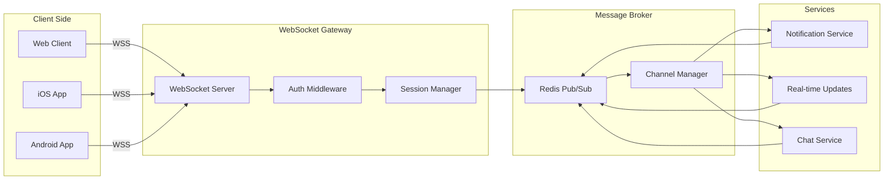
```mermaid
graph LR
    subgraph "Client Side"
        C1[Web Client]
        C2[iOS App]
        C3[Android App]
    end

    subgraph "WebSocket Gateway"
        WS[WebSocket Server]
        SM[Session Manager]
        AUTH[Auth Middleware]
    end

    subgraph "Message Broker"
        REDIS[Redis Pub/Sub]
        CHANNELS[Channel Manager]
    end

    subgraph "Services"
        S1[Notification Service]
        S2[Real-time Updates]
        S3[Chat Service]
    end

    C1 -->|WSS| WS
    C2 -->|WSS| WS
    C3 -->|WSS| WS

    WS --> AUTH
    AUTH --> SM
    SM --> REDIS

    REDIS --> CHANNELS
    CHANNELS --> S1
    CHANNELS --> S2
    CHANNELS --> S3

    S1 --> REDIS
    S2 --> REDIS
    S3 --> REDIS
```

### API Versioning Strategy

```yaml
# API Versioning Configuration
versioning:
  strategy: url-path  # /api/v1/, /api/v2/

  deprecation_policy:
    notice_period: 6 months
    sunset_period: 12 months

  version_support:
    v1:
      status: deprecated
      sunset_date: 2025-06-01

    v2:
      status: current
      features: full

    v3:
      status: beta
      features: experimental

  migration_tools:
    - auto_migration_scripts
    - version_bridge_middleware
    - backward_compatibility_layer
```

---

## Client Architecture

### Progressive Web App (PWA) Architecture

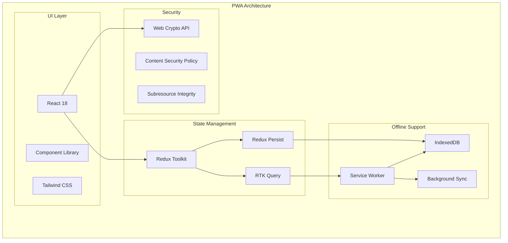
```mermaid
graph TB
    subgraph "PWA Architecture"
        subgraph "UI Layer"
            REACT[React 18]
            COMPONENTS[Component Library]
            STYLES[Tailwind CSS]
        end

        subgraph "State Management"
            REDUX[Redux Toolkit]
            RTK[RTK Query]
            PERSIST[Redux Persist]
        end

        subgraph "Offline Support"
            SW[Service Worker]
            IDB[IndexedDB]
            SYNC[Background Sync]
        end

        subgraph "Security"
            CRYPTO[Web Crypto API]
            CSP[Content Security Policy]
            SRI[Subresource Integrity]
        end
    end

    REACT --> REDUX
    REDUX --> RTK
    RTK --> SW
    SW --> IDB
    SW --> SYNC
    REDUX --> PERSIST
    PERSIST --> IDB
    REACT --> CRYPTO
```

### Native Mobile Architecture

```yaml
# iOS Architecture (Swift + SwiftUI)
ios:
  architecture: MVVM-C

  layers:
    presentation:
      - SwiftUI Views
      - ViewModels
      - Coordinators

    domain:
      - Use Cases
      - Domain Models
      - Repositories

    data:
      - API Client
      - Core Data
      - Keychain

    infrastructure:
      - WebSocket Manager
      - Encryption Service
      - Sync Engine

# Android Architecture (Kotlin + Jetpack Compose)
android:
  architecture: Clean Architecture + MVI

  layers:
    presentation:
      - Compose UI
      - ViewModels
      - Navigation

    domain:
      - Use Cases
      - Domain Models
      - Repositories

    data:
      - Retrofit Client
      - Room Database
      - DataStore

    infrastructure:
      - WebSocket Manager
      - Encryption Service
      - WorkManager Sync
```

### Offline-First Sync Strategy

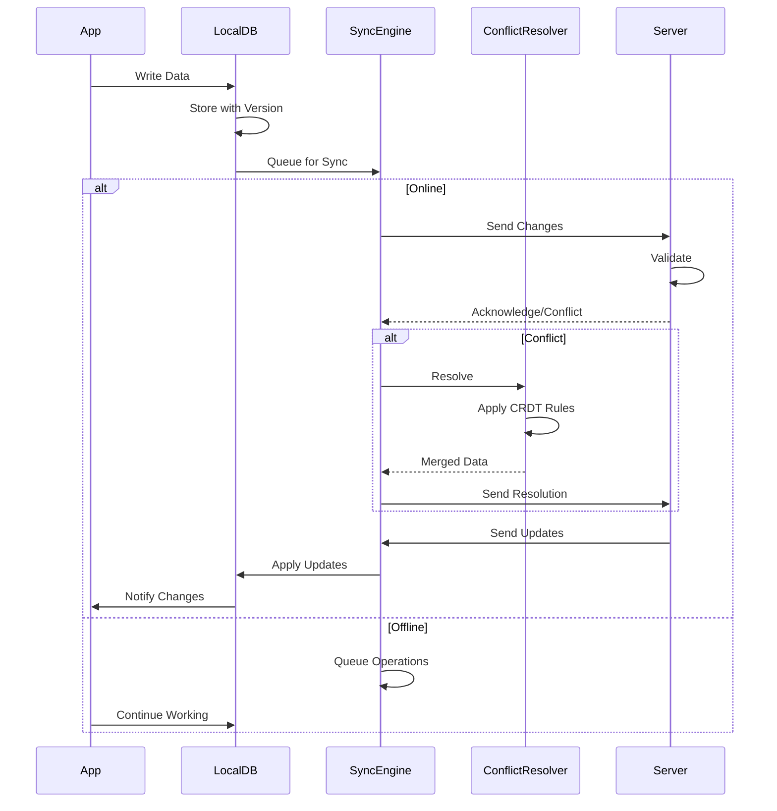
```mermaid
sequenceDiagram
    participant App
    participant LocalDB
    participant SyncEngine
    participant ConflictResolver
    participant Server

    App->>LocalDB: Write Data
    LocalDB->>LocalDB: Store with Version
    LocalDB->>SyncEngine: Queue for Sync

    alt Online
        SyncEngine->>Server: Send Changes
        Server->>Server: Validate
        Server-->>SyncEngine: Acknowledge/Conflict

        alt Conflict
            SyncEngine->>ConflictResolver: Resolve
            ConflictResolver->>ConflictResolver: Apply CRDT Rules
            ConflictResolver-->>SyncEngine: Merged Data
            SyncEngine->>Server: Send Resolution
        end

        Server->>SyncEngine: Send Updates
        SyncEngine->>LocalDB: Apply Updates
        LocalDB->>App: Notify Changes
    else Offline
        SyncEngine->>SyncEngine: Queue Operations
        App->>LocalDB: Continue Working
    end
```

### State Management Strategy

```typescript
// Client State Architecture
interface AppState {
  // Local UI State
  ui: {
    theme: 'light' | 'dark';
    navigation: NavigationState;
    modals: ModalState;
  };

  // Cached Server State (RTK Query)
  api: {
    user: UserApiState;
    jobs: JobsApiState;
    references: ReferencesApiState;
  };

  // Offline Queue
  offline: {
    queue: OfflineAction[];
    syncStatus: SyncStatus;
    conflicts: Conflict[];
  };

  // Real-time State
  realtime: {
    notifications: Notification[];
    presence: PresenceState;
    typing: TypingIndicators;
  };

  // Security State
  security: {
    encryptionKeys: KeyState;
    sessionToken: string | null;
    deviceTrust: DeviceTrustLevel;
  };
}
```

---

## AI/ML Architecture

### OpenRouter Integration

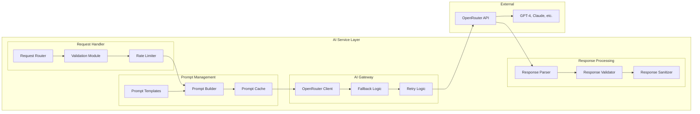
```mermaid
graph LR
    subgraph "AI Service Layer"
        subgraph "Request Handler"
            RH[Request Router]
            VM[Validation Module]
            RL[Rate Limiter]
        end

        subgraph "Prompt Management"
            PT[Prompt Templates]
            PB[Prompt Builder]
            PC[Prompt Cache]
        end

        subgraph "AI Gateway"
            OR[OpenRouter Client]
            FB[Fallback Logic]
            RT[Retry Logic]
        end

        subgraph "Response Processing"
            RP[Response Parser]
            RV[Response Validator]
            RS[Response Sanitizer]
        end
    end

    subgraph "External"
        OPENROUTER[OpenRouter API]
        MODELS[GPT-4, Claude, etc.]
    end

    RH --> VM
    VM --> RL
    RL --> PB
    PT --> PB
    PB --> PC
    PC --> OR
    OR --> FB
    FB --> RT
    RT --> OPENROUTER
    OPENROUTER --> MODELS
    OPENROUTER --> RP
    RP --> RV
    RV --> RS
```

### Prompt Management System

```yaml
# Server-Side Prompt Management
prompts:
  storage:
    location: PostgreSQL (encrypted)
    versioning: Git-style with SHA hashes

  categories:
    reference_analysis:
      - verify_authenticity
      - extract_skills
      - sentiment_analysis

    job_matching:
      - parse_requirements
      - match_candidates
      - rank_results

    content_moderation:
      - detect_inappropriate
      - check_discrimination
      - verify_compliance

  security:
    encryption: AES-256-GCM
    access_control: Role-based
    audit: Every access logged

  optimization:
    caching: Redis with 5min TTL
    compression: Brotli
    batching: Up to 10 requests
```

### Response Streaming Architecture

```typescript
// AI Response Streaming
interface StreamingConfig {
  enableStreaming: boolean;
  chunkSize: number; // bytes
  timeout: number; // ms
  backpressure: {
    highWaterMark: number;
    lowWaterMark: number;
    pauseThreshold: number;
  };
}

class AIStreamHandler {
  async streamResponse(
    prompt: string,
    config: StreamingConfig
  ): AsyncGenerator<AIChunk> {
    const stream = await openRouter.createStream(prompt);

    for await (const chunk of stream) {
      // Validate chunk
      if (!this.validateChunk(chunk)) continue;

      // Apply backpressure if needed
      await this.handleBackpressure(config.backpressure);

      // Yield processed chunk
      yield this.processChunk(chunk);
    }
  }
}
```

### Model Fallback Strategy

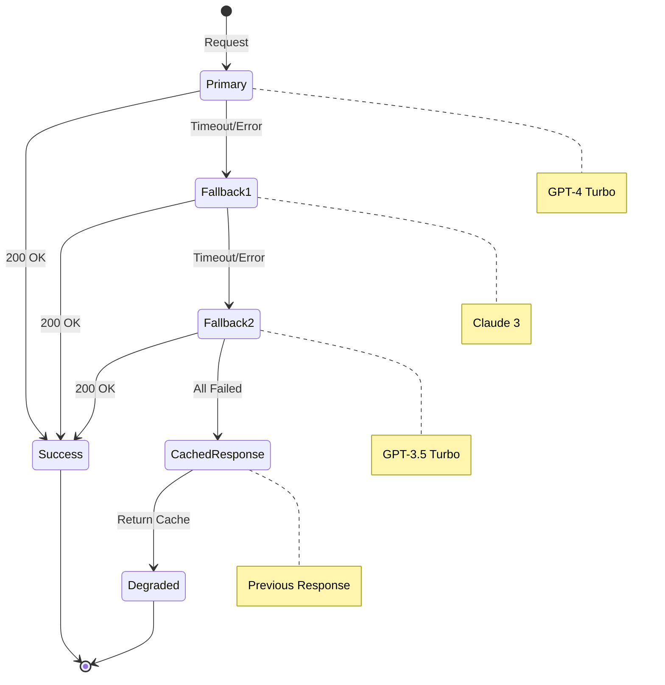
```mermaid
stateDiagram-v2
    [*] --> Primary: Request
    Primary --> Success: 200 OK
    Primary --> Fallback1: Timeout/Error
    Fallback1 --> Success: 200 OK
    Fallback1 --> Fallback2: Timeout/Error
    Fallback2 --> Success: 200 OK
    Fallback2 --> CachedResponse: All Failed
    CachedResponse --> Degraded: Return Cache
    Success --> [*]
    Degraded --> [*]

    note right of Primary: GPT-4 Turbo
    note right of Fallback1: Claude 3
    note right of Fallback2: GPT-3.5 Turbo
    note right of CachedResponse: Previous Response
```

---

## Security Architecture

### Zero-Knowledge Implementation

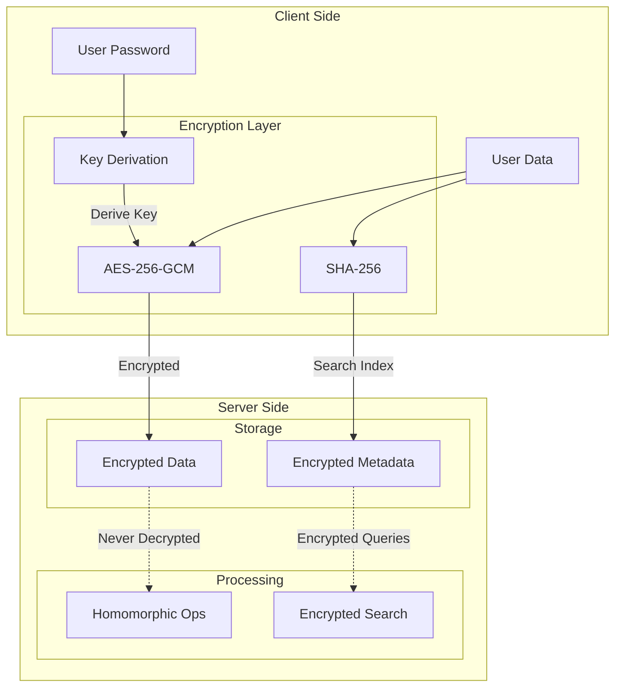
```mermaid
graph TB
    subgraph "Client Side"
        subgraph "Encryption Layer"
            KDF[Key Derivation]
            ENC[AES-256-GCM]
            HASH[SHA-256]
        end

        PLAINTEXT[User Data]
        PASSWORD[User Password]
    end

    subgraph "Server Side"
        subgraph "Storage"
            ENCRYPTED[Encrypted Data]
            METADATA[Encrypted Metadata]
        end

        subgraph "Processing"
            HOMO[Homomorphic Ops]
            SEARCH[Encrypted Search]
        end
    end

    PASSWORD --> KDF
    KDF --> |Derive Key| ENC
    PLAINTEXT --> ENC
    ENC --> |Encrypted| ENCRYPTED
    PLAINTEXT --> HASH
    HASH --> |Search Index| METADATA

    ENCRYPTED -.->|Never Decrypted| HOMO
    METADATA -.->|Encrypted Queries| SEARCH
```

### Authentication Flow

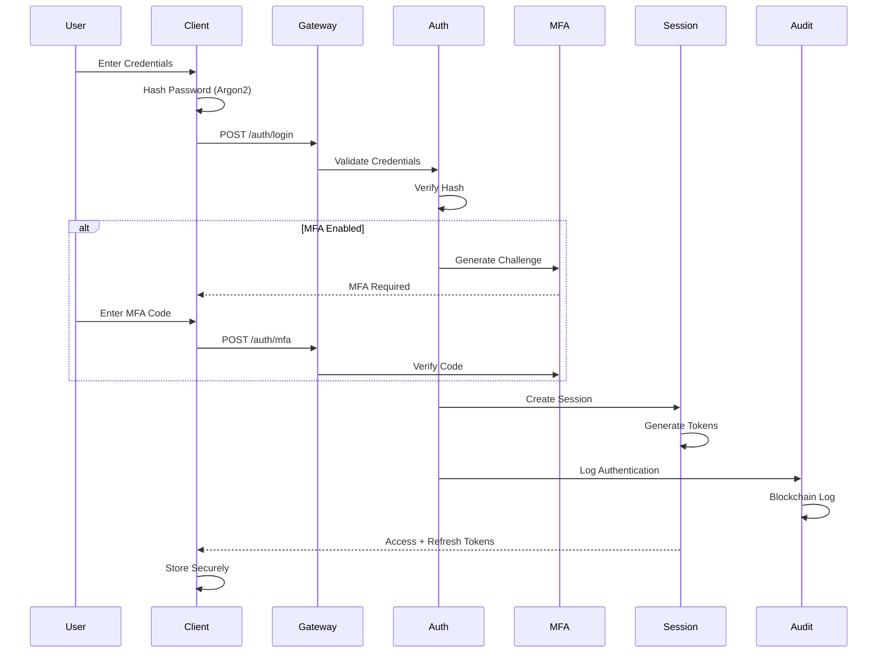
```mermaid
sequenceDiagram
    participant User
    participant Client
    participant Gateway
    participant Auth
    participant MFA
    participant Session
    participant Audit

    User->>Client: Enter Credentials
    Client->>Client: Hash Password (Argon2)
    Client->>Gateway: POST /auth/login
    Gateway->>Auth: Validate Credentials
    Auth->>Auth: Verify Hash

    alt MFA Enabled
        Auth->>MFA: Generate Challenge
        MFA-->>Client: MFA Required
        User->>Client: Enter MFA Code
        Client->>Gateway: POST /auth/mfa
        Gateway->>MFA: Verify Code
    end

    Auth->>Session: Create Session
    Session->>Session: Generate Tokens
    Auth->>Audit: Log Authentication
    Audit->>Audit: Blockchain Log
    Session-->>Client: Access + Refresh Tokens
    Client->>Client: Store Securely
```

### Authorization Model (RBAC + ABAC)

```yaml
# Role-Based Access Control
roles:
  admin:
    permissions: ['*']

  employer:
    permissions:
      - jobs.create
      - jobs.update.own
      - jobs.delete.own
      - candidates.view
      - references.request

  job_seeker:
    permissions:
      - profile.manage.own
      - jobs.search
      - jobs.apply
      - references.manage.own

  referrer:
    permissions:
      - references.provide
      - profile.view.limited

# Attribute-Based Access Control
policies:
  - id: own-resource
    effect: allow
    condition: "resource.owner_id == user.id"

  - id: time-based
    effect: allow
    condition: "current_time between 9am and 6pm"

  - id: location-based
    effect: allow
    condition: "user.location in allowed_countries"
```

### Encryption Architecture

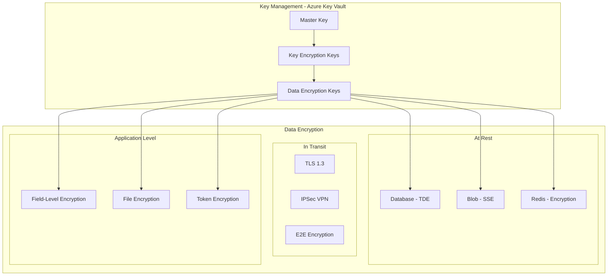
```mermaid
graph TB
    subgraph "Key Management - Azure Key Vault"
        MK[Master Key]
        DEK[Data Encryption Keys]
        KEK[Key Encryption Keys]
    end

    subgraph "Data Encryption"
        subgraph "At Rest"
            DB_ENC[Database - TDE]
            BLOB_ENC[Blob - SSE]
            CACHE_ENC[Redis - Encryption]
        end

        subgraph "In Transit"
            TLS[TLS 1.3]
            IPSEC[IPSec VPN]
            E2E[E2E Encryption]
        end

        subgraph "Application Level"
            FIELD[Field-Level Encryption]
            FILE[File Encryption]
            TOKEN[Token Encryption]
        end
    end

    MK --> KEK
    KEK --> DEK
    DEK --> DB_ENC
    DEK --> BLOB_ENC
    DEK --> CACHE_ENC
    DEK --> FIELD
    DEK --> FILE
    DEK --> TOKEN
```

### Blockchain Audit Trail

```solidity
// Simplified Audit Smart Contract
contract AuditTrail {
    struct AuditEntry {
        bytes32 dataHash;
        address actor;
        uint256 timestamp;
        string action;
        bytes32 previousHash;
    }

    mapping(bytes32 => AuditEntry) public entries;
    bytes32 public lastEntryHash;

    event AuditLogged(
        bytes32 indexed entryHash,
        address indexed actor,
        string action,
        uint256 timestamp
    );

    function logAudit(
        bytes32 _dataHash,
        string memory _action
    ) external returns (bytes32) {
        bytes32 entryHash = keccak256(
            abi.encodePacked(
                _dataHash,
                msg.sender,
                block.timestamp,
                _action,
                lastEntryHash
            )
        );

        entries[entryHash] = AuditEntry({
            dataHash: _dataHash,
            actor: msg.sender,
            timestamp: block.timestamp,
            action: _action,
            previousHash: lastEntryHash
        });

        lastEntryHash = entryHash;

        emit AuditLogged(
            entryHash,
            msg.sender,
            _action,
            block.timestamp
        );

        return entryHash;
    }
}
```

---

## Integration Architecture

### Third-Party Integration Patterns

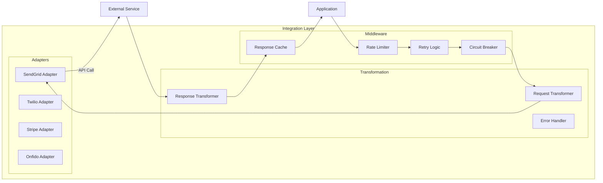
```mermaid
graph LR
    subgraph "Integration Layer"
        subgraph "Adapters"
            A1[SendGrid Adapter]
            A2[Twilio Adapter]
            A3[Stripe Adapter]
            A4[Onfido Adapter]
        end

        subgraph "Middleware"
            RL[Rate Limiter]
            RT[Retry Logic]
            CB[Circuit Breaker]
            CACHE[Response Cache]
        end

        subgraph "Transformation"
            REQ[Request Transformer]
            RES[Response Transformer]
            ERR[Error Handler]
        end
    end

    APP[Application] --> RL
    RL --> RT
    RT --> CB
    CB --> REQ
    REQ --> A1
    A1 --> |API Call| EXT[External Service]
    EXT --> RES
    RES --> CACHE
    CACHE --> APP
```

### Webhook Architecture

```yaml
# Webhook Processing System
webhooks:
  ingestion:
    endpoint: /webhooks/{provider}/{event}
    authentication:
      - signature_verification
      - ip_whitelist
      - timestamp_validation

  processing:
    queue: Azure Service Bus
    workers: 5-20 (auto-scale)
    retry_policy:
      max_attempts: 3
      backoff: exponential

  providers:
    stripe:
      events:
        - payment_intent.succeeded
        - payment_intent.failed
        - subscription.updated

    twilio:
      events:
        - message.delivered
        - message.failed

    onfido:
      events:
        - check.completed
        - report.completed
```

### OAuth Flow Implementation

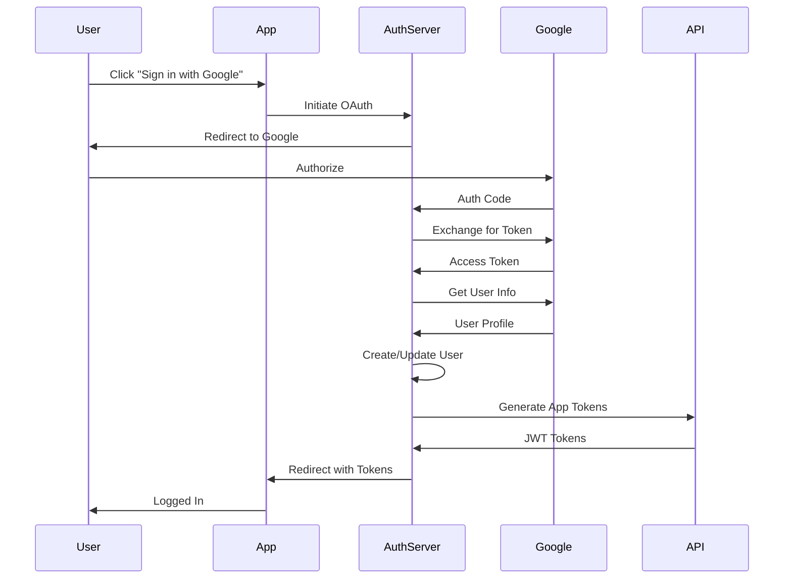
```mermaid
sequenceDiagram
    participant User
    participant App
    participant AuthServer
    participant Google
    participant API

    User->>App: Click "Sign in with Google"
    App->>AuthServer: Initiate OAuth
    AuthServer->>User: Redirect to Google
    User->>Google: Authorize
    Google->>AuthServer: Auth Code
    AuthServer->>Google: Exchange for Token
    Google->>AuthServer: Access Token
    AuthServer->>Google: Get User Info
    Google->>AuthServer: User Profile
    AuthServer->>AuthServer: Create/Update User
    AuthServer->>API: Generate App Tokens
    API->>AuthServer: JWT Tokens
    AuthServer->>App: Redirect with Tokens
    App->>User: Logged In
```

---

## Scalability & Performance

### Horizontal Scaling Strategy

```yaml
# Auto-Scaling Configuration
scaling:
  metrics:
    - cpu_utilization: 70%
    - memory_utilization: 80%
    - request_rate: 1000 req/s
    - response_time: 500ms p95

  services:
    api_gateway:
      min: 3
      max: 10
      scale_up: +2 instances
      scale_down: -1 instance
      cooldown: 300s

    core_api:
      min: 5
      max: 20
      scale_up: +3 instances
      scale_down: -2 instances
      cooldown: 300s

    ai_service:
      min: 2
      max: 10
      scale_up: +1 instance
      scale_down: -1 instance
      cooldown: 600s
```

### Load Balancing Architecture

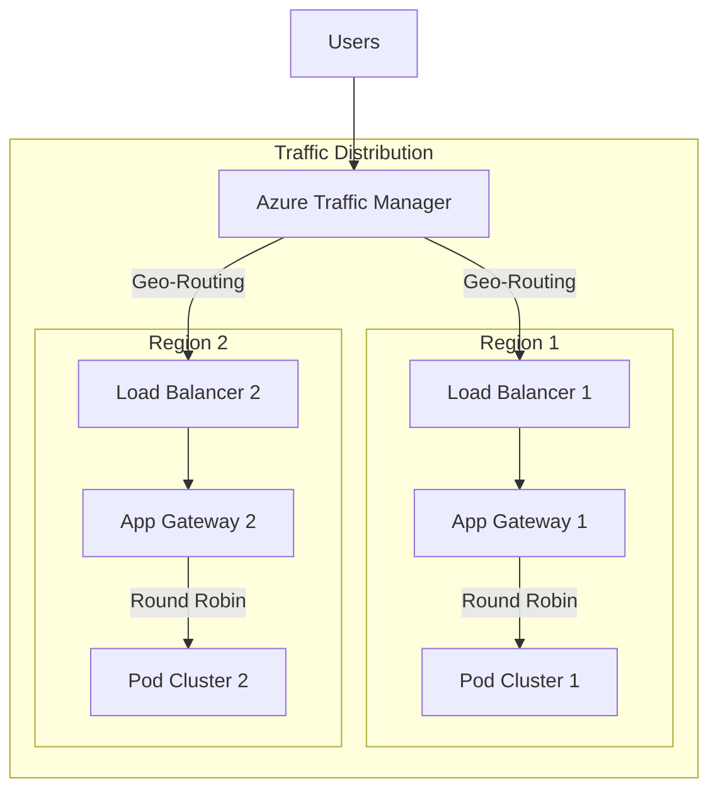
```mermaid
graph TB
    subgraph "Traffic Distribution"
        TM[Azure Traffic Manager]

        subgraph "Region 1"
            LB1[Load Balancer 1]
            AG1[App Gateway 1]
            PODS1[Pod Cluster 1]
        end

        subgraph "Region 2"
            LB2[Load Balancer 2]
            AG2[App Gateway 2]
            PODS2[Pod Cluster 2]
        end
    end

    Users --> TM
    TM -->|Geo-Routing| LB1
    TM -->|Geo-Routing| LB2

    LB1 --> AG1
    AG1 -->|Round Robin| PODS1

    LB2 --> AG2
    AG2 -->|Round Robin| PODS2
```

### CDN Strategy

```yaml
# Azure CDN Configuration
cdn:
  profiles:
    static_assets:
      origin: blob.core.windows.net
      caching_rules:
        - images: 30 days
        - css: 7 days
        - js: 7 days
        - fonts: 365 days

    api_acceleration:
      origin: api.aideepref.com
      caching_rules:
        - public_endpoints: 5 minutes
        - search_results: 1 minute

  optimization:
    - compression: brotli, gzip
    - minification: html, css, js
    - image_optimization: webp, avif

  purge_strategy:
    - on_deployment: /assets/*
    - on_demand: specific paths
    - scheduled: daily at 3am
```

### Database Scaling

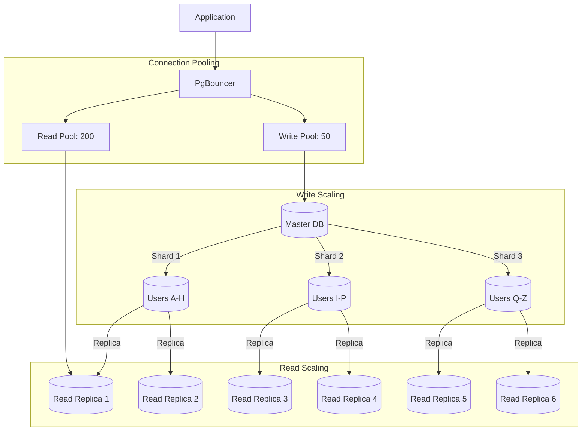
```mermaid
graph TB
    subgraph "Write Scaling"
        MASTER[(Master DB)]
        MASTER -->|Shard 1| S1[(Users A-H)]
        MASTER -->|Shard 2| S2[(Users I-P)]
        MASTER -->|Shard 3| S3[(Users Q-Z)]
    end

    subgraph "Read Scaling"
        S1 -->|Replica| R1[(Read Replica 1)]
        S1 -->|Replica| R2[(Read Replica 2)]
        S2 -->|Replica| R3[(Read Replica 3)]
        S2 -->|Replica| R4[(Read Replica 4)]
        S3 -->|Replica| R5[(Read Replica 5)]
        S3 -->|Replica| R6[(Read Replica 6)]
    end

    subgraph "Connection Pooling"
        PGBOUNCER[PgBouncer]
        WRITES[Write Pool: 50]
        READS[Read Pool: 200]
    end

    APP[Application] --> PGBOUNCER
    PGBOUNCER --> WRITES
    PGBOUNCER --> READS
    WRITES --> MASTER
    READS --> R1
```

### Caching Layers

```yaml
# Multi-Level Cache Architecture
caching:
  L1_Browser:
    localStorage:
      - user_preferences: persistent
      - draft_data: persistent

    sessionStorage:
      - navigation_state: session
      - form_data: session

    serviceWorker:
      - static_assets: 1 year
      - api_responses: 5 minutes

  L2_CDN:
    edge_locations: 50+ global
    cache_rules:
      - static/*: 365 days
      - api/public/*: 5 minutes
      - api/search/*: 1 minute

  L3_Redis:
    clusters:
      session_cluster:
        nodes: 3
        memory: 16GB each

      cache_cluster:
        nodes: 5
        memory: 32GB each

      realtime_cluster:
        nodes: 3
        memory: 8GB each

  L4_Application:
    memory_cache:
      - computed_results: 5 minutes
      - frequent_queries: 1 minute

  L5_Database:
    query_cache: 256MB
    buffer_pool: 8GB
```

---

## Resilience & Recovery

### Disaster Recovery Plan

```yaml
# DR Configuration
disaster_recovery:
  RTO: 4 hours  # Recovery Time Objective
  RPO: 1 hour   # Recovery Point Objective

  backup_strategy:
    databases:
      frequency: hourly snapshots
      retention: 30 days
      geo_redundancy: 3 regions

    files:
      frequency: real-time
      retention: 90 days
      versioning: enabled

    configurations:
      frequency: on change
      retention: infinite
      storage: git + key vault

  failover_strategy:
    automatic:
      trigger: 3 failed health checks
      timeout: 5 minutes

    manual:
      approval: 2 admins required
      procedure: documented runbook

  testing:
    frequency: quarterly
    scope: full failover
    duration: 4 hours
```

### Circuit Breaker Implementation

```typescript
// Circuit Breaker Pattern
class CircuitBreaker {
  private state: 'CLOSED' | 'OPEN' | 'HALF_OPEN' = 'CLOSED';
  private failures = 0;
  private successCount = 0;
  private lastFailureTime?: Date;

  constructor(
    private threshold = 5,
    private timeout = 60000,
    private successThreshold = 3
  ) {}

  async execute<T>(fn: () => Promise<T>): Promise<T> {
    if (this.state === 'OPEN') {
      if (Date.now() - this.lastFailureTime!.getTime() > this.timeout) {
        this.state = 'HALF_OPEN';
        this.successCount = 0;
      } else {
        throw new Error('Circuit breaker is OPEN');
      }
    }

    try {
      const result = await fn();
      this.onSuccess();
      return result;
    } catch (error) {
      this.onFailure();
      throw error;
    }
  }

  private onSuccess() {
    this.failures = 0;

    if (this.state === 'HALF_OPEN') {
      this.successCount++;
      if (this.successCount >= this.successThreshold) {
        this.state = 'CLOSED';
      }
    }
  }

  private onFailure() {
    this.failures++;
    this.lastFailureTime = new Date();

    if (this.failures >= this.threshold) {
      this.state = 'OPEN';
    }
  }
}
```

### Retry Policies

```yaml
# Retry Configuration
retry_policies:
  default:
    max_attempts: 3
    backoff: exponential
    initial_delay: 1000ms
    max_delay: 30000ms
    jitter: true

  ai_requests:
    max_attempts: 5
    backoff: exponential
    initial_delay: 2000ms
    max_delay: 60000ms

  payment_processing:
    max_attempts: 2
    backoff: fixed
    delay: 5000ms

  blockchain_writes:
    max_attempts: 10
    backoff: linear
    delay_increment: 3000ms

  idempotent_operations:
    max_attempts: unlimited
    backoff: exponential
    max_delay: 300000ms
```

### Graceful Degradation

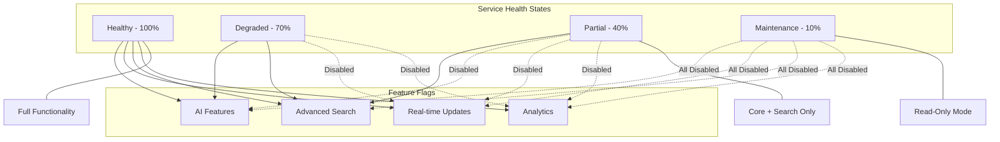
```mermaid
graph TB
    subgraph "Service Health States"
        HEALTHY[Healthy - 100%]
        DEGRADED[Degraded - 70%]
        PARTIAL[Partial - 40%]
        MAINTENANCE[Maintenance - 10%]
    end

    subgraph "Feature Flags"
        FF1[AI Features]
        FF2[Real-time Updates]
        FF3[Advanced Search]
        FF4[Analytics]
    end

    HEALTHY --> FF1 & FF2 & FF3 & FF4
    DEGRADED --> FF1 & FF3
    DEGRADED -.->|Disabled| FF2 & FF4
    PARTIAL --> FF3
    PARTIAL -.->|Disabled| FF1 & FF2 & FF4
    MAINTENANCE -.->|All Disabled| FF1 & FF2 & FF3 & FF4

    note1[Full Functionality]
    note2[Core + Search Only]
    note3[Read-Only Mode]

    HEALTHY --- note1
    PARTIAL --- note2
    MAINTENANCE --- note3
```

---

## Observability

### Logging Strategy

```yaml
# Structured Logging Configuration
logging:
  format: JSON

  levels:
    - ERROR: System errors, exceptions
    - WARN: Performance issues, deprecations
    - INFO: Business events, state changes
    - DEBUG: Detailed execution flow
    - TRACE: Full request/response data

  fields:
    required:
      - timestamp: ISO8601
      - level: LOG_LEVEL
      - message: string
      - service: string
      - correlation_id: UUID

    contextual:
      - user_id: UUID
      - tenant_id: UUID
      - request_id: UUID
      - session_id: UUID
      - trace_id: string
      - span_id: string

    performance:
      - duration_ms: number
      - memory_mb: number
      - cpu_percent: number

  destinations:
    - stdout: JSON format
    - azure_monitor: Application Insights
    - elasticsearch: Long-term storage

  retention:
    ERROR: 1 year
    WARN: 90 days
    INFO: 30 days
    DEBUG: 7 days
    TRACE: 1 day
```

### Metrics & Monitoring

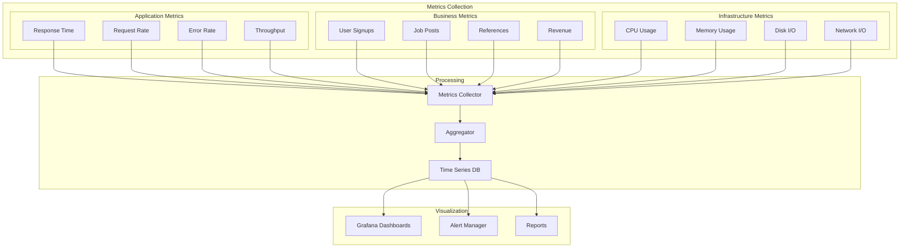
```mermaid
graph TB
    subgraph "Metrics Collection"
        subgraph "Application Metrics"
            AM1[Response Time]
            AM2[Request Rate]
            AM3[Error Rate]
            AM4[Throughput]
        end

        subgraph "Business Metrics"
            BM1[User Signups]
            BM2[Job Posts]
            BM3[References]
            BM4[Revenue]
        end

        subgraph "Infrastructure Metrics"
            IM1[CPU Usage]
            IM2[Memory Usage]
            IM3[Disk I/O]
            IM4[Network I/O]
        end
    end

    subgraph "Processing"
        COLLECTOR[Metrics Collector]
        AGGREGATOR[Aggregator]
        STORAGE[Time Series DB]
    end

    subgraph "Visualization"
        DASHBOARD[Grafana Dashboards]
        ALERTS[Alert Manager]
        REPORTS[Reports]
    end

    AM1 & AM2 & AM3 & AM4 --> COLLECTOR
    BM1 & BM2 & BM3 & BM4 --> COLLECTOR
    IM1 & IM2 & IM3 & IM4 --> COLLECTOR

    COLLECTOR --> AGGREGATOR
    AGGREGATOR --> STORAGE
    STORAGE --> DASHBOARD
    STORAGE --> ALERTS
    STORAGE --> REPORTS
```

### Distributed Tracing

```yaml
# OpenTelemetry Configuration
tracing:
  provider: Azure Application Insights

  sampling:
    strategy: adaptive
    base_rate: 0.1  # 10% baseline
    error_rate: 1.0  # 100% errors
    slow_rate: 0.5  # 50% slow requests

  instrumentation:
    automatic:
      - http_requests
      - database_queries
      - cache_operations
      - external_api_calls

    manual:
      - business_operations
      - ai_processing
      - blockchain_writes

  propagation:
    formats:
      - w3c_trace_context
      - baggage

  exporters:
    - application_insights
    - jaeger
    - console (dev only)
```

### Alerting Rules

```yaml
# Alert Configuration
alerts:
  critical:
    - name: API Gateway Down
      condition: availability < 99%
      duration: 1 minute
      action: [page_oncall, create_incident]

    - name: Database Connection Pool Exhausted
      condition: available_connections < 5
      duration: 30 seconds
      action: [page_oncall, auto_scale]

    - name: Payment Failures Spike
      condition: error_rate > 5%
      duration: 5 minutes
      action: [page_oncall, notify_finance]

  warning:
    - name: High Response Time
      condition: p95_latency > 1000ms
      duration: 5 minutes
      action: [notify_dev, create_ticket]

    - name: Memory Usage High
      condition: memory_percent > 85%
      duration: 10 minutes
      action: [notify_ops, consider_scaling]

  info:
    - name: Deployment Completed
      condition: deployment_status = success
      action: [notify_channel]

    - name: Daily Report Ready
      condition: report_generated = true
      action: [email_stakeholders]
```

---

## Architecture Decision Records

### ADR-001: Microservices vs Monolith

```markdown
# ADR-001: Microservices vs Monolith

## Status
Accepted

## Context
Need to decide between microservices and monolithic architecture for the platform.

## Decision
Hybrid approach: Modular monolith with extracted microservices for specific domains.

## Rationale
- Start with modular monolith for faster development
- Extract services as scaling needs emerge
- AI and Blockchain services as separate microservices from start
- Reduces initial complexity while maintaining flexibility

## Consequences
- Simpler initial deployment
- Easier debugging and monitoring
- Can extract services gradually
- Some refactoring needed for service extraction
```

### ADR-002: Database Selection

```markdown
# ADR-002: Database Selection

## Status
Accepted

## Context
Need to select primary database for application data.

## Decision
PostgreSQL as primary database with specialized databases for specific needs.

## Rationale
- PostgreSQL: ACID compliance, JSON support, full-text search
- Redis: Caching and real-time data
- Pinecone: Vector similarity search for AI
- InfluxDB: Time-series metrics

## Consequences
- Multiple database technologies to manage
- Need data synchronization strategies
- Better performance for specialized operations
```

### ADR-003: Zero-Knowledge Architecture

```markdown
# ADR-003: Zero-Knowledge Architecture

## Status
Accepted

## Context
Need to implement privacy-preserving architecture where server cannot access user data.

## Decision
Implement client-side encryption with server storing only encrypted data.

## Rationale
- Maximum privacy protection
- Compliance with strictest regulations
- Competitive differentiator
- User trust and confidence

## Consequences
- Complex key management
- Limited server-side processing capabilities
- Need homomorphic operations for some features
- Higher client-side computational requirements
```

### ADR-004: AI Provider Strategy

```markdown
# ADR-004: AI Provider Strategy

## Status
Accepted

## Context
Need to select AI/ML provider strategy for the platform.

## Decision
Use OpenRouter as AI gateway with multi-model support.

## Rationale
- Model agnostic approach
- Automatic failover between models
- Cost optimization through routing
- No vendor lock-in

## Consequences
- Dependency on OpenRouter availability
- Need fallback strategies
- Variable model performance
- Complex prompt optimization across models
```

### ADR-005: Mobile Development Approach

```markdown
# ADR-005: Mobile Development Approach

## Status
Accepted

## Context
Need to decide on mobile development strategy.

## Decision
Native apps for job seekers and employers, PWA for referrers.

## Rationale
- Native: Better performance, offline support, device integration
- PWA for referrers: Lower friction, easier updates
- Platform-specific optimizations possible

## Consequences
- Two native codebases to maintain
- Higher development cost
- Better user experience
- Platform-specific features available
```

### ADR-006: Event Streaming Platform

```markdown
# ADR-006: Event Streaming Platform

## Status
Accepted

## Context
Need to select event streaming/messaging platform.

## Decision
Azure Service Bus for event streaming and message queuing.

## Rationale
- Native Azure integration
- Managed service (no operations overhead)
- Good performance for our scale
- Cost-effective

## Consequences
- Azure vendor lock-in for messaging
- Limited to Service Bus features
- Easier operations and maintenance
```

---

## Implementation Priorities

### Phase 1: Foundation (Weeks 1-4)
1. **Infrastructure Setup**
   - Azure environment provisioning
   - Kubernetes cluster setup
   - Database initialization
   - CI/CD pipelines

2. **Core Services**
   - Authentication service
   - Basic API gateway
   - Database schema
   - Redis cache setup

3. **Security Baseline**
   - TLS certificates
   - Key Vault setup
   - Basic encryption
   - CORS/CSP configuration

### Phase 2: Core Platform (Weeks 5-8)
1. **Business Logic**
   - User management
   - Job posting system
   - Basic matching algorithm
   - Reference system

2. **Client Applications**
   - PWA foundation
   - Mobile app scaffolding
   - Admin portal

3. **Integration Foundation**
   - Email service
   - SMS service
   - Payment processing

### Phase 3: Advanced Features (Weeks 9-12)
1. **AI Integration**
   - OpenRouter setup
   - Prompt management
   - AI-powered matching

2. **Real-time Features**
   - WebSocket implementation
   - Push notifications
   - Live updates

3. **Offline Support**
   - Sync engine
   - Conflict resolution
   - Mobile offline mode

### Phase 4: Scale & Polish (Weeks 13-16)
1. **Performance Optimization**
   - Query optimization
   - Caching strategy
   - CDN configuration

2. **Observability**
   - Comprehensive logging
   - Metrics dashboards
   - Alerting rules

3. **Security Hardening**
   - Security audit
   - Penetration testing
   - Compliance validation

---

## Risk Mitigation

### Technical Risks

| Risk | Impact | Likelihood | Mitigation |
|------|--------|------------|------------|
| **OpenRouter Unavailability** | High | Medium | Multiple fallback models, cached responses |
| **Database Scaling Issues** | High | Medium | Sharding strategy, read replicas, caching |
| **Zero-Knowledge Complexity** | High | High | Progressive implementation, fallback options |
| **Real-time Scaling** | Medium | Medium | WebSocket clustering, fallback to polling |
| **Mobile Sync Conflicts** | Medium | High | CRDT implementation, clear conflict resolution |

### Operational Risks

| Risk | Impact | Likelihood | Mitigation |
|------|--------|------------|------------|
| **Azure Outage** | High | Low | Multi-region deployment, DR plan |
| **Data Breach** | Critical | Low | E2E encryption, security audits |
| **Compliance Violation** | High | Low | Automated compliance checks, audit trail |
| **Cost Overrun** | Medium | Medium | Cost monitoring, auto-scaling limits |

---

## Cost Optimization

### Azure Service Optimization

```yaml
# Cost Optimization Strategies
optimization:
  compute:
    - Use spot instances for non-critical workloads
    - Reserved instances for baseline capacity
    - Auto-scaling with conservative limits

  storage:
    - Lifecycle policies for blob storage
    - Archive tier for old data
    - Compression for all applicable data

  network:
    - CDN for static content
    - Minimize cross-region transfers
    - Use private endpoints

  database:
    - Right-size database instances
    - Use read replicas efficiently
    - Implement connection pooling

  monitoring:
    - Sample non-critical metrics
    - Aggregate before storing
    - Set retention policies
```

### Estimated Monthly Costs (500K users, 1500 concurrent)

| Service | Configuration | Est. Cost |
|---------|--------------|-----------|
| AKS Cluster | 20 nodes D4s v3 | $2,800 |
| PostgreSQL | 8 vCores, 256GB | $1,500 |
| Redis Cache | P2 Premium | $800 |
| Application Gateway | Standard v2 | $400 |
| Load Balancer | Standard | $200 |
| Blob Storage | 10TB + transactions | $500 |
| CDN | 50TB transfer | $1,200 |
| Service Bus | Premium | $700 |
| Key Vault | Operations | $100 |
| Monitor/Insights | Logs + metrics | $800 |
| **Total** | | **$9,000** |

---

## Conclusion

This architecture provides a robust, scalable, and secure foundation for the AiDeepRef platform. The server-centric approach with thin clients ensures consistent business logic execution while minimizing client-side complexity. The zero-knowledge architecture provides industry-leading privacy protection, while the multi-provider AI strategy through OpenRouter ensures flexibility and reliability.

Key strengths of this architecture:
- **Scalability**: Horizontal scaling at every layer
- **Security**: Defense in depth with zero-knowledge encryption
- **Reliability**: Multiple failover strategies and circuit breakers
- **Performance**: Multi-level caching and CDN optimization
- **Observability**: Comprehensive monitoring and tracing

The phased implementation approach allows for iterative development and validation, reducing risk while delivering value quickly. The architecture is designed to evolve with the platform's needs while maintaining the core principles of security, scalability, and simplicity.

---

## Appendix: Technology Stack Summary

### Backend
- **Runtime**: Node.js 20 LTS
- **Frameworks**: NestJS (Core API), Express (Gateway), FastAPI (AI Service)
- **Languages**: TypeScript, Python (AI), Solidity (Smart Contracts)

### Frontend
- **Web**: React 18, TypeScript, Tailwind CSS
- **iOS**: Swift 5, SwiftUI
- **Android**: Kotlin, Jetpack Compose

### Data
- **Primary DB**: PostgreSQL 15
- **Cache**: Redis 7
- **Vector DB**: Pinecone
- **Search**: Elasticsearch 8
- **Storage**: Azure Blob Storage

### Infrastructure
- **Cloud**: Azure (AKS, Service Bus, Key Vault, Monitor)
- **Container**: Docker, Kubernetes
- **CI/CD**: GitHub Actions, ArgoCD
- **Monitoring**: Azure Monitor, Application Insights, Grafana

### Security
- **Authentication**: JWT, OAuth 2.0, OIDC
- **Encryption**: AES-256-GCM, TLS 1.3
- **Secrets**: Azure Key Vault
- **Audit**: Custom blockchain implementation

### AI/ML
- **Gateway**: OpenRouter
- **Models**: GPT-4, Claude, Gemini (via OpenRouter)
- **Embeddings**: OpenAI Ada, Cohere (via Pinecone)

---

*End of System Architecture Document*