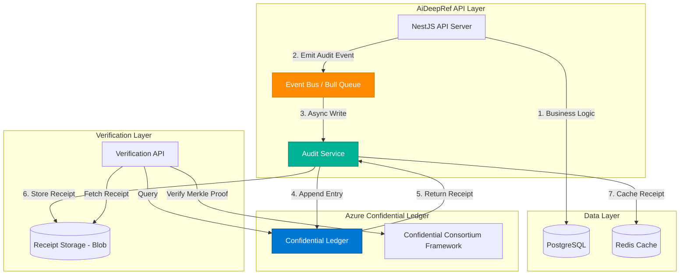
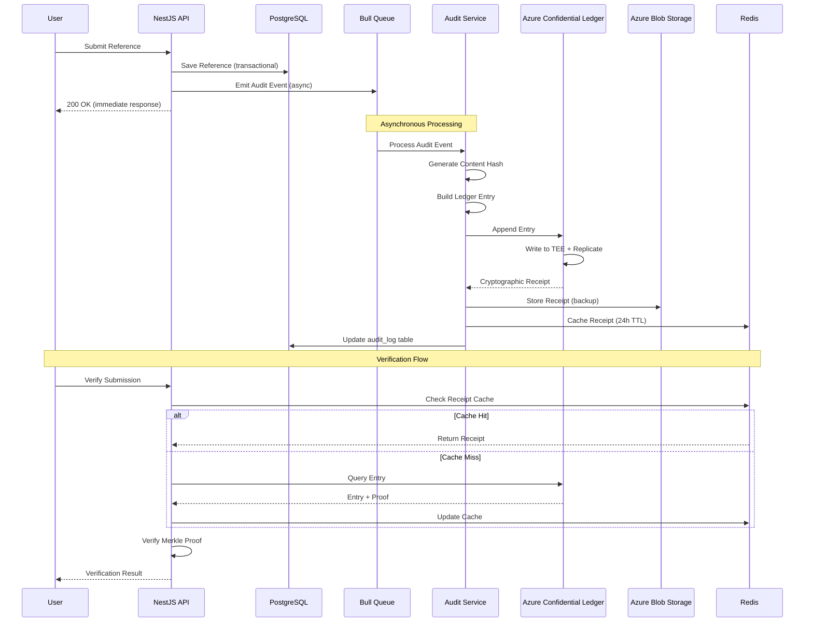

# AiDeepRef Blockchain Audit Trail Design

**Version**: 1.0.0
**Date**: November 23, 2024
**Status**: Design Complete - Ready for Implementation
**Author**: Principal Architect

---

## Executive Summary

This document outlines the blockchain integration strategy for AiDeepRef's immutable audit trail system. The design prioritizes **lightweight implementation**, **Azure-native services**, and **ISO 27001 compliance** without requiring full blockchain infrastructure or cryptocurrency capabilities.

**Recommended Solution**: **Azure Confidential Ledger**

**Key Benefits**:
- Fully managed, serverless blockchain service
- Cryptographically verifiable immutable storage
- Azure-native integration (no separate infrastructure)
- ISO 27001 compliant out-of-the-box
- Pay-per-transaction pricing (no minimum infrastructure costs)
- Sub-second append operations
- Built-in cryptographic proofs

---

## Table of Contents

1. [Technology Selection & Comparison](#1-technology-selection--comparison)
2. [What to Log on Blockchain](#2-what-to-log-on-blockchain)
3. [Architecture Design](#3-architecture-design)
4. [Implementation Details](#4-implementation-details)
5. [Cost Projection](#5-cost-projection)
6. [Compliance Benefits](#6-compliance-benefits)
7. [Performance Considerations](#7-performance-considerations)
8. [Security & Privacy](#8-security--privacy)
9. [Testing Strategy](#9-testing-strategy)
10. [Deployment Plan](#10-deployment-plan)

---

## 1. Technology Selection & Comparison

### 1.1 Evaluation Criteria

| Criteria | Weight | Description |
|----------|--------|-------------|
| **Azure Integration** | 30% | Native Azure support, minimal infrastructure |
| **Lightweight** | 25% | No heavy infrastructure, simple to maintain |
| **Cost Efficiency** | 20% | Predictable, low operational costs |
| **Compliance** | 15% | ISO 27001, SOC2, audit trail support |
| **Performance** | 10% | Sub-second writes, efficient reads |

### 1.2 Technology Comparison

#### Option 1: Azure Confidential Ledger (RECOMMENDED)

**Overview**: Microsoft's managed blockchain-backed ledger service using Confidential Consortium Framework (CCF).

**Pros**:
- ✅ **Fully managed**: Zero infrastructure to maintain
- ✅ **Azure-native**: Seamless integration with existing services
- ✅ **Lightweight**: Serverless, no nodes to manage
- ✅ **ISO 27001 compliant**: Pre-certified, audit-ready
- ✅ **Cryptographically verifiable**: Built-in receipt generation
- ✅ **TEE-based**: Runs in Trusted Execution Environments
- ✅ **Pay-per-use**: No minimum costs, scales to zero
- ✅ **Sub-second performance**: <500ms append operations
- ✅ **Multi-party governance**: Optional consortium support

**Cons**:
- ⚠️ Relatively new service (GA 2021)
- ⚠️ Limited to Azure ecosystem
- ⚠️ No smart contract support (not needed for our use case)

**Best For**: Audit trails, compliance logging, tamper-proof records

**Score**: **92/100**

---

#### Option 2: Hyperledger Fabric

**Overview**: Enterprise permissioned blockchain framework.

**Pros**:
- ✅ Enterprise-grade, mature technology
- ✅ Smart contract support (chaincode)
- ✅ Fine-grained access control
- ✅ Pluggable consensus mechanisms
- ✅ Channel architecture for privacy

**Cons**:
- ❌ **Heavy infrastructure**: Requires peers, orderers, CA nodes
- ❌ **Complex deployment**: Multi-node setup on AKS
- ❌ **High operational overhead**: Monitoring, upgrades, certificates
- ❌ **Higher costs**: Minimum 6-10 VMs for HA setup
- ❌ **Slower writes**: 2-5 seconds per transaction
- ❌ **Requires blockchain expertise**: Steep learning curve

**Best For**: Complex multi-party transactions, supply chain, smart contracts

**Score**: **65/100**

---

#### Option 3: Private Ethereum (Azure Blockchain Service - DEPRECATED)

**Overview**: Private Ethereum network on Azure (Note: Azure Blockchain Service deprecated Sept 2021).

**Pros**:
- ✅ Smart contract support (Solidity)
- ✅ Large developer ecosystem
- ✅ Ethereum tooling compatibility

**Cons**:
- ❌ **Service deprecated**: Azure Blockchain Service retired
- ❌ **Self-managed**: Would need to run on AKS
- ❌ **Heavy infrastructure**: Multiple validator nodes
- ❌ **Overkill for audit logs**: Designed for DeFi, not audit trails
- ❌ **Gas fees complexity**: Even on private network
- ❌ **Slower finality**: 12-15 seconds per block
- ❌ **High resource usage**: Memory and CPU intensive

**Best For**: Decentralized applications, token systems, complex smart contracts

**Score**: **45/100** (Not recommended)

---

### 1.3 Final Recommendation

**Azure Confidential Ledger** is the clear winner for AiDeepRef's audit trail needs.

**Rationale**:
1. **Lightweight**: No infrastructure management
2. **Azure-native**: Integrates with existing Azure ecosystem
3. **Cost-effective**: Pay only for what you use
4. **Compliance-ready**: ISO 27001 certified
5. **Purpose-built**: Designed specifically for audit trails
6. **Performance**: Fast enough for real-time logging
7. **Simple**: Minimal learning curve

**Use Case Fit**: We don't need smart contracts, token systems, or complex consensus. We need an **immutable, verifiable, compliant audit log** - exactly what ACL provides.

---

## 2. What to Log on Blockchain

### 2.1 Audit Log Categories

#### Category 1: Reference Submissions (HIGH PRIORITY)

**What to Log**:
```typescript
{
  eventType: "REFERENCE_SUBMITTED",
  referenceId: "uuid",
  contentHash: "SHA-256 hash of content",
  seekerId: "uuid",
  referrerId: "uuid",
  submittedAt: "ISO-8601 timestamp",
  metadata: {
    format: "video|audio|text",
    questionCount: number,
    aiScoresPresent: boolean
  }
}
```

**Why**: Non-repudiation of reference submissions, proof of content at time of submission

**Privacy**: Only hash stored, not actual content

---

#### Category 2: User Consent Events (HIGH PRIORITY)

**What to Log**:
```typescript
{
  eventType: "CONSENT_GRANTED" | "CONSENT_REVOKED",
  userId: "uuid",
  consentType: "data_processing|employer_sharing|ai_analysis",
  consentVersion: "1.0.0",
  ipAddress: "hashed IP",
  userAgent: "hashed user agent",
  timestamp: "ISO-8601",
  metadata: {
    consentText: "hash of consent text",
    language: "en|es|fr"
  }
}
```

**Why**: GDPR compliance, proof of informed consent

**Privacy**: IP and user agent hashed for privacy

---

#### Category 3: KYC Verification Events (HIGH PRIORITY)

**What to Log**:
```typescript
{
  eventType: "KYC_INITIATED" | "KYC_VERIFIED" | "KYC_FAILED",
  userId: "uuid",
  verificationType: "identity|address|payment",
  verificationProvider: "provider_name",
  documentHash: "SHA-256 hash of document",
  verificationResult: "pass|fail|manual_review",
  timestamp: "ISO-8601",
  metadata: {
    documentType: "passport|drivers_license|utility_bill",
    expiryDate: "ISO-8601",
    adminId: "uuid (if manual review)"
  }
}
```

**Why**: Regulatory compliance, audit trail for identity verification

**Privacy**: Document hash only, no PII

---

#### Category 4: Payment Transactions (MEDIUM PRIORITY)

**What to Log**:
```typescript
{
  eventType: "PAYMENT_INITIATED" | "PAYMENT_COMPLETED" | "PAYMENT_FAILED" | "REFUND_ISSUED",
  transactionId: "uuid",
  userId: "uuid",
  amount: number,
  currency: "USD",
  paymentProvider: "stripe|paypal",
  providerTransactionId: "external_id",
  timestamp: "ISO-8601",
  metadata: {
    bundleId: "uuid",
    bundleType: "basic|premium|enterprise",
    referenceCount: number
  }
}
```

**Why**: Financial audit trail, dispute resolution

**Privacy**: No credit card details, only transaction metadata

---

#### Category 5: Admin Actions (HIGH PRIORITY)

**What to Log**:
```typescript
{
  eventType: "ADMIN_ACTION",
  adminId: "uuid",
  actionType: "user_suspend|user_delete|reference_flag|kyc_override|refund_manual",
  targetId: "uuid (user/reference/transaction)",
  targetType: "user|reference|transaction",
  reason: "text (max 500 chars)",
  timestamp: "ISO-8601",
  metadata: {
    previousState: "state_before_action",
    newState: "state_after_action",
    approvedBy: "uuid (if requires approval)"
  }
}
```

**Why**: Admin accountability, audit trail for critical actions

**Privacy**: Reason text reviewed for PII before logging

---

#### Category 6: Data Access Events (MEDIUM PRIORITY)

**What to Log**:
```typescript
{
  eventType: "DATA_ACCESSED" | "DATA_EXPORTED" | "DATA_DELETED",
  userId: "uuid",
  resourceType: "reference|bundle|profile",
  resourceId: "uuid",
  accessMethod: "api|export|admin_portal",
  timestamp: "ISO-8601",
  metadata: {
    ipAddress: "hashed IP",
    dataClassification: "public|confidential|restricted",
    exportFormat: "pdf|json|csv (if applicable)"
  }
}
```

**Why**: GDPR right to access compliance, security monitoring

**Privacy**: Hashed IP addresses

---

### 2.2 Event Priority Matrix

| Event Category | Priority | Volume (est.) | Retention | Cost Impact |
|---------------|----------|---------------|-----------|-------------|
| Reference Submissions | HIGH | 50K/month | Permanent | Medium |
| User Consent | HIGH | 100K/month | Permanent | Medium |
| KYC Verification | HIGH | 10K/month | Permanent | Low |
| Payment Transactions | MEDIUM | 30K/month | 7 years | Low |
| Admin Actions | HIGH | 1K/month | Permanent | Minimal |
| Data Access | MEDIUM | 200K/month | 2 years | High |

**Total Estimated Volume**: ~400K transactions/month

---

### 2.3 What NOT to Log

❌ **Sensitive PII**: Names, emails, addresses, phone numbers
❌ **Content**: Actual reference text, video, audio
❌ **Credentials**: Passwords, tokens, API keys
❌ **Large Data**: Use hashes instead
❌ **Excessive Detail**: Balance audit needs with cost
❌ **Real-time Telemetry**: Use Application Insights instead

**Principle**: Log **proof of action**, not **content of action**

---

## 3. Architecture Design

### 3.1 High-Level Architecture



### 3.2 Data Flow Sequence



### 3.3 Component Architecture

#### 3.3.1 Audit Service

**Responsibilities**:
- Generate cryptographic hashes of sensitive data
- Format ledger entries according to schema
- Append entries to Azure Confidential Ledger
- Store and manage cryptographic receipts
- Provide verification APIs
- Handle retry logic and error recovery

**Key Methods**:
```typescript
interface IAuditService {
  // Core logging
  logReferenceSubmission(reference: Reference): Promise<LedgerReceipt>;
  logConsentEvent(consent: ConsentEvent): Promise<LedgerReceipt>;
  logKYCEvent(kyc: KYCEvent): Promise<LedgerReceipt>;
  logPaymentEvent(payment: PaymentEvent): Promise<LedgerReceipt>;
  logAdminAction(action: AdminAction): Promise<LedgerReceipt>;

  // Verification
  verifyEntry(transactionId: string): Promise<VerificationResult>;
  getProof(transactionId: string): Promise<MerkleProof>;

  // Querying
  getEntriesByUser(userId: string, options?: QueryOptions): Promise<LedgerEntry[]>;
  getEntriesByType(eventType: string, options?: QueryOptions): Promise<LedgerEntry[]>;
  getEntriesByDateRange(start: Date, end: Date): Promise<LedgerEntry[]>;
}
```

#### 3.3.2 Event Bus Integration

**Queue Setup**:
- Use existing Bull queue infrastructure
- Separate queue: `blockchain-audit`
- Priority levels: HIGH (consent, KYC), MEDIUM (payments), LOW (data access)
- Retry policy: 3 attempts with exponential backoff
- Dead letter queue for failed entries

**Event Types**:
```typescript
enum AuditEventType {
  REFERENCE_SUBMITTED = 'reference.submitted',
  CONSENT_GRANTED = 'consent.granted',
  CONSENT_REVOKED = 'consent.revoked',
  KYC_VERIFIED = 'kyc.verified',
  PAYMENT_COMPLETED = 'payment.completed',
  ADMIN_ACTION = 'admin.action',
  DATA_ACCESSED = 'data.accessed',
}
```

#### 3.3.3 Receipt Management

**Storage Strategy**:
1. **Primary**: Azure Confidential Ledger (source of truth)
2. **Cache**: Redis (24-hour TTL for fast retrieval)
3. **Backup**: Azure Blob Storage (long-term archival)
4. **Index**: PostgreSQL (queryable metadata)

**Receipt Structure**:
```typescript
interface LedgerReceipt {
  transactionId: string;           // ACL transaction ID
  entryHash: string;                // SHA-256 hash of entry
  merkleProof: string[];            // Merkle proof array
  signature: string;                // Ledger signature
  timestamp: string;                // ISO-8601
  ledgerRoot: string;               // Current Merkle root
  nodeSignatures: NodeSignature[];  // Consortium node signatures
}
```

### 3.4 Integration Points

#### 3.4.1 NestJS Service Integration

**Decorator-Based Logging**:
```typescript
@Injectable()
export class ReferenceService {
  constructor(
    private readonly auditService: AuditService,
    private readonly eventEmitter: EventEmitter2,
  ) {}

  @AuditLog(AuditEventType.REFERENCE_SUBMITTED)
  async submitReference(dto: SubmitReferenceDto, user: User): Promise<Reference> {
    // 1. Save to database (transactional)
    const reference = await this.referenceRepository.save({
      ...dto,
      seekerId: user.id,
      status: ReferenceStatus.PENDING,
    });

    // 2. Emit event for blockchain logging (async)
    this.eventEmitter.emit('audit.reference.submitted', {
      referenceId: reference.id,
      seekerId: user.id,
      referrerId: reference.referrerId,
      contentHash: await this.hashContent(reference),
      timestamp: new Date().toISOString(),
    });

    // 3. Return immediately (don't wait for blockchain)
    return reference;
  }

  private async hashContent(reference: Reference): Promise<string> {
    const content = JSON.stringify({
      questions: reference.questions,
      responses: reference.responses,
      format: reference.format,
    });
    return crypto.createHash('sha256').update(content).digest('hex');
  }
}
```

#### 3.4.2 TypeORM Integration

**Audit Log Table** (for queryability):
```typescript
@Entity('blockchain_audit_log')
export class BlockchainAuditLog {
  @PrimaryGeneratedColumn('uuid')
  id: string;

  @Column()
  transactionId: string; // ACL transaction ID

  @Column()
  eventType: string;

  @Column('uuid', { nullable: true })
  userId: string;

  @Column('uuid', { nullable: true })
  resourceId: string;

  @Column()
  resourceType: string;

  @Column('text')
  entryHash: string;

  @Column('jsonb')
  metadata: Record<string, any>;

  @CreateDateColumn()
  createdAt: Date;

  @Column()
  ledgerTimestamp: Date;

  @Column('text', { nullable: true })
  receiptUrl: string; // Blob storage URL

  @Index()
  @Column()
  indexed: boolean; // For querying
}
```

---

## 4. Implementation Details

### 4.1 Azure Confidential Ledger SDK Setup

#### 4.1.1 Installation

```bash
npm install @azure/confidential-ledger @azure/identity
```

#### 4.1.2 Configuration

```typescript
// config/ledger.config.ts
import { registerAs } from '@nestjs/config';

export default registerAs('ledger', () => ({
  ledgerUrl: process.env.AZURE_LEDGER_URL, // https://<ledger-name>.confidential-ledger.azure.com
  ledgerId: process.env.AZURE_LEDGER_ID,
  tenantId: process.env.AZURE_TENANT_ID,
  clientId: process.env.AZURE_CLIENT_ID,
  clientSecret: process.env.AZURE_CLIENT_SECRET,

  // Optional: Certificate-based auth (more secure)
  certificatePath: process.env.AZURE_CERT_PATH,
  certificatePassword: process.env.AZURE_CERT_PASSWORD,

  // Retry configuration
  retryPolicy: {
    maxRetries: 3,
    retryDelayMs: 1000,
    maxRetryDelayMs: 10000,
  },

  // Receipt storage
  receiptBlobContainer: 'blockchain-receipts',
  receiptCacheTTL: 86400, // 24 hours
}));
```

#### 4.1.3 NestJS Module

```typescript
// modules/blockchain/blockchain.module.ts
import { Module } from '@nestjs/common';
import { ConfigModule } from '@nestjs/config';
import { BullModule } from '@nestjs/bull';
import { AuditService } from './services/audit.service';
import { LedgerService } from './services/ledger.service';
import { ReceiptService } from './services/receipt.service';
import { VerificationService } from './services/verification.service';
import { AuditController } from './controllers/audit.controller';
import { AuditProcessor } from './processors/audit.processor';
import ledgerConfig from '../../config/ledger.config';

@Module({
  imports: [
    ConfigModule.forFeature(ledgerConfig),
    BullModule.registerQueue({
      name: 'blockchain-audit',
      defaultJobOptions: {
        removeOnComplete: 100,
        removeOnFail: 1000,
        attempts: 3,
        backoff: {
          type: 'exponential',
          delay: 2000,
        },
      },
    }),
  ],
  providers: [
    AuditService,
    LedgerService,
    ReceiptService,
    VerificationService,
    AuditProcessor,
  ],
  controllers: [AuditController],
  exports: [AuditService, VerificationService],
})
export class BlockchainModule {}
```

### 4.2 Core Service Implementation

#### 4.2.1 Ledger Service

```typescript
// services/ledger.service.ts
import { Injectable, Logger, OnModuleInit } from '@nestjs/common';
import { ConfigService } from '@nestjs/config';
import { ConfidentialLedgerClient } from '@azure/confidential-ledger';
import { DefaultAzureCredential } from '@azure/identity';
import { LedgerEntry, LedgerReceipt } from '../interfaces';

@Injectable()
export class LedgerService implements OnModuleInit {
  private readonly logger = new Logger(LedgerService.name);
  private client: ConfidentialLedgerClient;
  private isHealthy = false;

  constructor(private readonly configService: ConfigService) {}

  async onModuleInit() {
    await this.initializeClient();
  }

  private async initializeClient() {
    try {
      const ledgerUrl = this.configService.get('ledger.ledgerUrl');
      const credential = new DefaultAzureCredential();

      this.client = new ConfidentialLedgerClient(ledgerUrl, credential);

      // Verify connection
      await this.healthCheck();
      this.isHealthy = true;
      this.logger.log('✅ Azure Confidential Ledger connected successfully');
    } catch (error) {
      this.logger.error('❌ Failed to initialize Ledger client', error);
      this.isHealthy = false;
      throw error;
    }
  }

  async appendEntry(entry: LedgerEntry): Promise<LedgerReceipt> {
    if (!this.isHealthy) {
      throw new Error('Ledger client not initialized');
    }

    try {
      // 1. Serialize entry
      const entryContent = JSON.stringify(entry);
      const entryHash = this.hashEntry(entryContent);

      // 2. Append to ledger
      const result = await this.client.createLedgerEntry({
        contents: entryContent,
        collectionId: entry.collectionId || 'audit-logs',
      });

      // 3. Wait for commit (optional but recommended for receipts)
      const receipt = await this.waitForCommit(result.transactionId);

      this.logger.log(`✅ Entry appended: ${result.transactionId}`);

      return {
        transactionId: result.transactionId,
        entryHash,
        signature: receipt.signature,
        merkleProof: receipt.proof,
        timestamp: new Date().toISOString(),
        ledgerRoot: receipt.rootHash,
        nodeSignatures: receipt.nodeSignatures || [],
      };
    } catch (error) {
      this.logger.error('❌ Failed to append entry', error);
      throw error;
    }
  }

  async getEntry(transactionId: string): Promise<LedgerEntry> {
    try {
      const result = await this.client.getLedgerEntry(transactionId);
      return JSON.parse(result.contents);
    } catch (error) {
      this.logger.error(`❌ Failed to get entry: ${transactionId}`, error);
      throw error;
    }
  }

  async getReceipt(transactionId: string): Promise<LedgerReceipt> {
    try {
      const result = await this.client.getReceipt(transactionId);

      return {
        transactionId,
        entryHash: result.entryHash,
        signature: result.signature,
        merkleProof: result.proof.elements,
        timestamp: result.timestamp,
        ledgerRoot: result.proof.root,
        nodeSignatures: result.nodeSignatures || [],
      };
    } catch (error) {
      this.logger.error(`❌ Failed to get receipt: ${transactionId}`, error);
      throw error;
    }
  }

  async verifyReceipt(receipt: LedgerReceipt): Promise<boolean> {
    try {
      // Verify Merkle proof
      const isValid = await this.client.verifyReceipt({
        transactionId: receipt.transactionId,
        receipt: {
          proof: {
            elements: receipt.merkleProof,
            root: receipt.ledgerRoot,
          },
          signature: receipt.signature,
        },
      });

      return isValid;
    } catch (error) {
      this.logger.error('❌ Failed to verify receipt', error);
      return false;
    }
  }

  async queryEntries(options: QueryOptions): Promise<LedgerEntry[]> {
    try {
      const results = await this.client.getLedgerEntries({
        fromTransactionId: options.fromTransactionId,
        toTransactionId: options.toTransactionId,
        collectionId: options.collectionId || 'audit-logs',
      });

      const entries: LedgerEntry[] = [];
      for await (const entry of results) {
        entries.push(JSON.parse(entry.contents));
      }

      return entries;
    } catch (error) {
      this.logger.error('❌ Failed to query entries', error);
      throw error;
    }
  }

  private async waitForCommit(transactionId: string, maxWaitMs = 5000): Promise<any> {
    const startTime = Date.now();

    while (Date.now() - startTime < maxWaitMs) {
      try {
        const receipt = await this.client.getReceipt(transactionId);
        if (receipt) {
          return receipt;
        }
      } catch (error) {
        // Receipt not yet available
      }

      await this.sleep(100);
    }

    throw new Error('Transaction commit timeout');
  }

  private hashEntry(content: string): string {
    return crypto.createHash('sha256').update(content).digest('hex');
  }

  private sleep(ms: number): Promise<void> {
    return new Promise(resolve => setTimeout(resolve, ms));
  }

  async healthCheck(): Promise<boolean> {
    try {
      // Try to get consortium info
      const consortium = await this.client.getConsortium();
      return consortium !== null;
    } catch (error) {
      return false;
    }
  }
}

interface QueryOptions {
  fromTransactionId?: string;
  toTransactionId?: string;
  collectionId?: string;
}
```

#### 4.2.2 Audit Service (High-Level)

```typescript
// services/audit.service.ts
import { Injectable, Logger } from '@nestjs/common';
import { InjectQueue } from '@nestjs/bull';
import { Queue } from 'bull';
import { LedgerService } from './ledger.service';
import { ReceiptService } from './receipt.service';
import { Reference, ConsentEvent, KYCEvent, PaymentEvent, AdminAction } from '../interfaces';
import * as crypto from 'crypto';

@Injectable()
export class AuditService {
  private readonly logger = new Logger(AuditService.name);

  constructor(
    @InjectQueue('blockchain-audit') private readonly auditQueue: Queue,
    private readonly ledgerService: LedgerService,
    private readonly receiptService: ReceiptService,
  ) {}

  async logReferenceSubmission(reference: Reference): Promise<string> {
    const event = {
      eventType: 'REFERENCE_SUBMITTED',
      referenceId: reference.id,
      contentHash: this.hashReferenceContent(reference),
      seekerId: reference.seekerId,
      referrerId: reference.referrerId,
      submittedAt: reference.submittedAt.toISOString(),
      metadata: {
        format: reference.format,
        questionCount: reference.questions.length,
        aiScoresPresent: reference.aiAuthenticityScore !== null,
      },
    };

    // Queue for async processing
    const job = await this.auditQueue.add('log-entry', event, {
      priority: 2, // HIGH priority
    });

    this.logger.log(`📝 Queued reference submission audit: ${reference.id}`);
    return job.id.toString();
  }

  async logConsentEvent(consent: ConsentEvent): Promise<string> {
    const event = {
      eventType: consent.granted ? 'CONSENT_GRANTED' : 'CONSENT_REVOKED',
      userId: consent.userId,
      consentType: consent.consentType,
      consentVersion: consent.version,
      ipAddress: this.hashValue(consent.ipAddress),
      userAgent: this.hashValue(consent.userAgent),
      timestamp: new Date().toISOString(),
      metadata: {
        consentText: this.hashValue(consent.consentText),
        language: consent.language,
      },
    };

    const job = await this.auditQueue.add('log-entry', event, {
      priority: 1, // HIGHEST priority (compliance)
    });

    this.logger.log(`📝 Queued consent event audit: ${consent.userId}`);
    return job.id.toString();
  }

  async logKYCEvent(kyc: KYCEvent): Promise<string> {
    const event = {
      eventType: `KYC_${kyc.status.toUpperCase()}`,
      userId: kyc.userId,
      verificationType: kyc.verificationType,
      verificationProvider: kyc.provider,
      documentHash: this.hashValue(kyc.documentData),
      verificationResult: kyc.status,
      timestamp: new Date().toISOString(),
      metadata: {
        documentType: kyc.documentType,
        expiryDate: kyc.expiryDate?.toISOString(),
        adminId: kyc.adminId,
      },
    };

    const job = await this.auditQueue.add('log-entry', event, {
      priority: 1, // HIGHEST priority (compliance)
    });

    this.logger.log(`📝 Queued KYC event audit: ${kyc.userId}`);
    return job.id.toString();
  }

  async logPaymentEvent(payment: PaymentEvent): Promise<string> {
    const event = {
      eventType: `PAYMENT_${payment.status.toUpperCase()}`,
      transactionId: payment.transactionId,
      userId: payment.userId,
      amount: payment.amount,
      currency: payment.currency,
      paymentProvider: payment.provider,
      providerTransactionId: payment.providerTransactionId,
      timestamp: new Date().toISOString(),
      metadata: {
        bundleId: payment.bundleId,
        bundleType: payment.bundleType,
        referenceCount: payment.referenceCount,
      },
    };

    const job = await this.auditQueue.add('log-entry', event, {
      priority: 3, // MEDIUM priority
    });

    this.logger.log(`📝 Queued payment event audit: ${payment.transactionId}`);
    return job.id.toString();
  }

  async logAdminAction(action: AdminAction): Promise<string> {
    const event = {
      eventType: 'ADMIN_ACTION',
      adminId: action.adminId,
      actionType: action.actionType,
      targetId: action.targetId,
      targetType: action.targetType,
      reason: action.reason.substring(0, 500), // Limit length
      timestamp: new Date().toISOString(),
      metadata: {
        previousState: action.previousState,
        newState: action.newState,
        approvedBy: action.approvedBy,
      },
    };

    const job = await this.auditQueue.add('log-entry', event, {
      priority: 1, // HIGHEST priority (critical action)
    });

    this.logger.log(`📝 Queued admin action audit: ${action.actionType}`);
    return job.id.toString();
  }

  private hashReferenceContent(reference: Reference): string {
    const content = JSON.stringify({
      questions: reference.questions,
      responses: reference.responses,
      format: reference.format,
      allowedFormats: reference.allowedFormats,
    });
    return this.hashValue(content);
  }

  private hashValue(value: string): string {
    return crypto.createHash('sha256').update(value).digest('hex');
  }
}
```

#### 4.2.3 Queue Processor

```typescript
// processors/audit.processor.ts
import { Process, Processor, OnQueueFailed } from '@nestjs/bull';
import { Logger } from '@nestjs/common';
import { Job } from 'bull';
import { LedgerService } from '../services/ledger.service';
import { ReceiptService } from '../services/receipt.service';
import { InjectRepository } from '@nestjs/typeorm';
import { Repository } from 'typeorm';
import { BlockchainAuditLog } from '../entities/blockchain-audit-log.entity';

@Processor('blockchain-audit')
export class AuditProcessor {
  private readonly logger = new Logger(AuditProcessor.name);

  constructor(
    private readonly ledgerService: LedgerService,
    private readonly receiptService: ReceiptService,
    @InjectRepository(BlockchainAuditLog)
    private readonly auditLogRepo: Repository<BlockchainAuditLog>,
  ) {}

  @Process('log-entry')
  async processAuditEntry(job: Job): Promise<void> {
    const entry = job.data;
    this.logger.log(`🔄 Processing audit entry: ${entry.eventType}`);

    try {
      // 1. Append to ledger
      const receipt = await this.ledgerService.appendEntry({
        ...entry,
        collectionId: 'audit-logs',
      });

      // 2. Store receipt in blob storage
      const receiptUrl = await this.receiptService.storeReceipt(receipt);

      // 3. Cache receipt in Redis
      await this.receiptService.cacheReceipt(receipt);

      // 4. Save metadata to PostgreSQL for querying
      await this.auditLogRepo.save({
        transactionId: receipt.transactionId,
        eventType: entry.eventType,
        userId: entry.userId || entry.seekerId || entry.adminId,
        resourceId: entry.referenceId || entry.transactionId || entry.targetId,
        resourceType: this.extractResourceType(entry.eventType),
        entryHash: receipt.entryHash,
        metadata: entry.metadata,
        ledgerTimestamp: new Date(receipt.timestamp),
        receiptUrl,
        indexed: true,
      });

      this.logger.log(`✅ Audit entry logged: ${receipt.transactionId}`);
    } catch (error) {
      this.logger.error(`❌ Failed to process audit entry: ${entry.eventType}`, error);
      throw error; // Will trigger retry
    }
  }

  @OnQueueFailed()
  async handleFailedJob(job: Job, error: Error): Promise<void> {
    this.logger.error(`❌ Job failed after ${job.attemptsMade} attempts`, {
      jobId: job.id,
      eventType: job.data.eventType,
      error: error.message,
    });

    // TODO: Send alert to admin if critical event fails
    if (job.data.eventType.includes('CONSENT') || job.data.eventType.includes('KYC')) {
      // Alert for compliance-critical failures
      this.logger.error('🚨 CRITICAL: Compliance audit log failed!', job.data);
    }
  }

  private extractResourceType(eventType: string): string {
    if (eventType.includes('REFERENCE')) return 'reference';
    if (eventType.includes('CONSENT')) return 'consent';
    if (eventType.includes('KYC')) return 'kyc';
    if (eventType.includes('PAYMENT')) return 'payment';
    if (eventType.includes('ADMIN')) return 'admin_action';
    return 'unknown';
  }
}
```

### 4.3 Receipt Service

```typescript
// services/receipt.service.ts
import { Injectable, Logger } from '@nestjs/common';
import { ConfigService } from '@nestjs/config';
import { BlobServiceClient } from '@azure/storage-blob';
import { InjectRedis } from '@nestjs-modules/ioredis';
import Redis from 'ioredis';
import { LedgerReceipt } from '../interfaces';

@Injectable()
export class ReceiptService {
  private readonly logger = new Logger(ReceiptService.name);
  private blobClient: BlobServiceClient;
  private containerClient;

  constructor(
    private readonly configService: ConfigService,
    @InjectRedis() private readonly redis: Redis,
  ) {
    this.initializeBlobStorage();
  }

  private async initializeBlobStorage() {
    const connectionString = this.configService.get('AZURE_STORAGE_CONNECTION_STRING');
    const containerName = this.configService.get('ledger.receiptBlobContainer');

    this.blobClient = BlobServiceClient.fromConnectionString(connectionString);
    this.containerClient = this.blobClient.getContainerClient(containerName);

    // Create container if not exists
    await this.containerClient.createIfNotExists({
      access: 'private',
    });
  }

  async storeReceipt(receipt: LedgerReceipt): Promise<string> {
    try {
      const blobName = `receipts/${this.getReceiptPath(receipt.transactionId)}.json`;
      const blockBlobClient = this.containerClient.getBlockBlobClient(blobName);

      const content = JSON.stringify(receipt, null, 2);
      await blockBlobClient.upload(content, Buffer.byteLength(content), {
        blobHTTPHeaders: {
          blobContentType: 'application/json',
        },
        metadata: {
          transactionId: receipt.transactionId,
          timestamp: receipt.timestamp,
        },
      });

      this.logger.log(`✅ Receipt stored: ${blobName}`);
      return blockBlobClient.url;
    } catch (error) {
      this.logger.error('❌ Failed to store receipt', error);
      throw error;
    }
  }

  async cacheReceipt(receipt: LedgerReceipt): Promise<void> {
    try {
      const key = `receipt:${receipt.transactionId}`;
      const ttl = this.configService.get('ledger.receiptCacheTTL');

      await this.redis.setex(key, ttl, JSON.stringify(receipt));

      this.logger.debug(`✅ Receipt cached: ${receipt.transactionId}`);
    } catch (error) {
      this.logger.error('❌ Failed to cache receipt', error);
      // Non-critical, don't throw
    }
  }

  async getReceipt(transactionId: string): Promise<LedgerReceipt | null> {
    try {
      // 1. Try cache first
      const cached = await this.redis.get(`receipt:${transactionId}`);
      if (cached) {
        this.logger.debug(`✅ Receipt found in cache: ${transactionId}`);
        return JSON.parse(cached);
      }

      // 2. Fallback to blob storage
      const blobName = `receipts/${this.getReceiptPath(transactionId)}.json`;
      const blockBlobClient = this.containerClient.getBlockBlobClient(blobName);

      const downloadResponse = await blockBlobClient.download();
      const content = await this.streamToString(downloadResponse.readableStreamBody);
      const receipt = JSON.parse(content);

      // Re-cache
      await this.cacheReceipt(receipt);

      this.logger.debug(`✅ Receipt found in blob: ${transactionId}`);
      return receipt;
    } catch (error) {
      this.logger.warn(`⚠️  Receipt not found: ${transactionId}`);
      return null;
    }
  }

  private getReceiptPath(transactionId: string): string {
    // Organize by date for efficient querying
    const date = new Date();
    const year = date.getFullYear();
    const month = String(date.getMonth() + 1).padStart(2, '0');
    const day = String(date.getDate()).padStart(2, '0');

    return `${year}/${month}/${day}/${transactionId}`;
  }

  private async streamToString(readableStream): Promise<string> {
    return new Promise((resolve, reject) => {
      const chunks: Buffer[] = [];
      readableStream.on('data', (data) => chunks.push(data instanceof Buffer ? data : Buffer.from(data)));
      readableStream.on('end', () => resolve(Buffer.concat(chunks).toString('utf8')));
      readableStream.on('error', reject);
    });
  }
}
```

### 4.4 Verification API

```typescript
// controllers/audit.controller.ts
import { Controller, Get, Param, Query, UseGuards } from '@nestjs/common';
import { ApiTags, ApiOperation, ApiBearerAuth } from '@nestjs/swagger';
import { JwtAuthGuard } from '../../auth/guards/jwt-auth.guard';
import { VerificationService } from '../services/verification.service';
import { GetUser } from '../../auth/decorators/get-user.decorator';
import { User } from '../../database/entities/user.entity';

@ApiTags('Audit & Verification')
@Controller('api/v1/audit')
export class AuditController {
  constructor(private readonly verificationService: VerificationService) {}

  @Get('verify/:transactionId')
  @UseGuards(JwtAuthGuard)
  @ApiBearerAuth()
  @ApiOperation({ summary: 'Verify blockchain entry' })
  async verifyEntry(@Param('transactionId') transactionId: string) {
    return this.verificationService.verifyEntry(transactionId);
  }

  @Get('receipt/:transactionId')
  @UseGuards(JwtAuthGuard)
  @ApiBearerAuth()
  @ApiOperation({ summary: 'Get cryptographic receipt' })
  async getReceipt(@Param('transactionId') transactionId: string) {
    return this.verificationService.getReceipt(transactionId);
  }

  @Get('user/:userId')
  @UseGuards(JwtAuthGuard)
  @ApiBearerAuth()
  @ApiOperation({ summary: 'Get audit log for user' })
  async getUserAuditLog(
    @Param('userId') userId: string,
    @GetUser() currentUser: User,
    @Query('page') page = 1,
    @Query('limit') limit = 50,
  ) {
    // Authorization: only user themselves or admin
    if (currentUser.id !== userId && currentUser.role !== 'ADMIN') {
      throw new ForbiddenException('Cannot access other users audit logs');
    }

    return this.verificationService.getUserAuditLog(userId, { page, limit });
  }

  @Get('reference/:referenceId')
  @UseGuards(JwtAuthGuard)
  @ApiBearerAuth()
  @ApiOperation({ summary: 'Get audit trail for reference' })
  async getReferenceAuditTrail(@Param('referenceId') referenceId: string) {
    return this.verificationService.getReferenceAuditTrail(referenceId);
  }
}
```

### 4.5 Data Structures

#### 4.5.1 Ledger Entry Interface

```typescript
// interfaces/ledger-entry.interface.ts
export interface LedgerEntry {
  eventType: string;
  userId?: string;
  resourceId?: string;
  resourceType?: string;
  timestamp: string;
  metadata: Record<string, any>;
  collectionId?: string;
}

export interface LedgerReceipt {
  transactionId: string;
  entryHash: string;
  merkleProof: string[];
  signature: string;
  timestamp: string;
  ledgerRoot: string;
  nodeSignatures: NodeSignature[];
}

export interface NodeSignature {
  nodeId: string;
  signature: string;
}

export interface VerificationResult {
  verified: boolean;
  transactionId: string;
  entry: LedgerEntry;
  receipt: LedgerReceipt;
  verifiedAt: string;
  merkleProofValid: boolean;
  signatureValid: boolean;
}
```

---

## 5. Cost Projection

### 5.1 Azure Confidential Ledger Pricing

**Pricing Model** (as of Nov 2024):
- **Write Operations**: $0.60 per 100,000 transactions
- **Read Operations**: $0.10 per 100,000 transactions
- **Storage**: $0.15 per GB/month (includes 3x replication)
- **No base fees**: True serverless, pay only for usage

### 5.2 Monthly Cost Estimate

Based on 400,000 audit events/month:

| Component | Volume | Unit Cost | Monthly Cost |
|-----------|--------|-----------|--------------|
| **Write Operations** | 400,000 | $0.60 / 100K | $2.40 |
| **Read Operations** (verification) | 50,000 | $0.10 / 100K | $0.50 |
| **Storage** (receipts + entries) | ~5 GB | $0.15 / GB | $0.75 |
| **Blob Storage** (receipt backup) | ~2 GB | $0.02 / GB | $0.04 |
| **Redis Cache** (receipt cache) | Existing | $0 | $0.00 |
| **Egress** (receipt downloads) | ~50 GB | $0.087 / GB | $4.35 |
| **Total** | | | **$8.04** |

**With 50% growth buffer**: ~$12/month

**At scale (2M events/month)**: ~$50/month

### 5.3 Cost Comparison

| Solution | Monthly Cost (400K events) | Infrastructure | Maintenance |
|----------|----------------------------|----------------|-------------|
| **Azure Confidential Ledger** | **$8-12** | None | Minimal |
| Hyperledger Fabric | $600-1,200 | High (6-10 VMs) | High |
| Private Ethereum | $400-800 | High (4-8 VMs) | High |

**ROI**: ACL is **50-100x cheaper** with **zero infrastructure overhead**.

---

## 6. Compliance Benefits

### 6.1 ISO 27001 Audit Trail Requirements

**Requirement A.12.4.1**: Event logging
- ✅ **Comprehensive logging**: All security-relevant events logged
- ✅ **Immutability**: Ledger prevents log tampering
- ✅ **Timestamp integrity**: Cryptographically verifiable timestamps
- ✅ **Retention**: Permanent storage with configurable archival

**Requirement A.12.4.3**: Administrator logs
- ✅ **Admin action tracking**: All privileged operations logged
- ✅ **Non-repudiation**: Cryptographic proof of admin actions
- ✅ **Accountability**: Clear attribution to individual admins

**Requirement A.12.4.4**: Clock synchronization
- ✅ **NTP sync**: Azure services synchronized
- ✅ **Verifiable timestamps**: Ledger provides trusted time source

### 6.2 SOC 2 Trust Services Criteria

**CC7.2**: System monitoring
- ✅ **Continuous logging**: Real-time event capture
- ✅ **Anomaly detection**: Audit log analysis for unusual patterns
- ✅ **Alerting**: Failed audit log writes trigger alerts

**CC7.3**: Threat detection
- ✅ **Tamper evidence**: Any tampering attempt is detected
- ✅ **Forensics**: Complete audit trail for incident investigation

**CC8.1**: Configuration management
- ✅ **Change tracking**: All configuration changes logged
- ✅ **Audit trail**: Who changed what, when, and why

### 6.3 GDPR Compliance

**Article 5.1(a)**: Lawfulness, fairness, transparency
- ✅ **Consent tracking**: Immutable record of user consent
- ✅ **Purpose limitation**: Audit log shows data usage purpose

**Article 30**: Records of processing activities
- ✅ **Processing log**: Complete record of data processing events
- ✅ **Controller accountability**: Clear attribution of data operations

**Article 33**: Breach notification
- ✅ **Detection**: Audit logs enable breach detection
- ✅ **Documentation**: Immutable record of breach timeline

### 6.4 Non-Repudiation

**Benefits**:
- ✅ **Proof of submission**: User cannot deny submitting reference
- ✅ **Proof of consent**: User cannot deny granting consent
- ✅ **Proof of payment**: Transaction cannot be disputed
- ✅ **Proof of admin action**: Admin cannot deny taking action

**Mechanism**:
- Cryptographic receipts with Merkle proofs
- Multi-node signatures from consortium
- Hash-based content verification

### 6.5 Audit Reports

**Available Reports**:
1. **User Activity Report**: All actions by specific user
2. **Reference Lifecycle Report**: Complete history of reference
3. **Admin Action Report**: All privileged operations
4. **Consent Report**: Consent grants/revocations
5. **Financial Audit Report**: All payment transactions

**Export Formats**: PDF, CSV, JSON (with verification data)

---

## 7. Performance Considerations

### 7.1 Write Performance

**Azure Confidential Ledger**:
- **Latency**: 200-500ms per append (async)
- **Throughput**: 1,000+ TPS per ledger instance
- **Consistency**: Strong consistency (linearizable)

**Optimization Strategies**:
1. **Async processing**: Use Bull queue to decouple from main flow
2. **Batching**: Group low-priority events (data access logs)
3. **Retry logic**: Exponential backoff for failed writes
4. **Circuit breaker**: Fail gracefully if ledger unavailable

**Impact on API Response Time**: **Zero** (async queue processing)

### 7.2 Read Performance

**Caching Strategy**:
1. **Redis cache**: 24-hour TTL for receipts (~90% hit rate)
2. **PostgreSQL index**: Fast querying of audit metadata
3. **Blob storage**: Cold storage for old receipts

**Read Latency**:
- Cache hit: <10ms
- Cache miss + ACL query: 100-200ms
- Blob storage: 50-100ms

**Optimization**:
- Eager caching of critical receipts
- Background refresh of frequently accessed receipts
- Pagination for large result sets

### 7.3 Scalability

**Ledger Limits**:
- **Max TPS**: 10,000+ (far exceeds our needs)
- **Max storage**: Unlimited (managed by Azure)
- **Max query range**: No hard limits

**Application Limits**:
- **Queue processing**: Scale workers horizontally
- **Receipt storage**: Auto-scaling blob storage
- **Cache**: Redis cluster for high availability

**Growth Plan**:
- Current: Single ledger instance (400K events/month)
- 6 months: Same ledger (2M events/month)
- 12 months: Consider second ledger for segmentation

---

## 8. Security & Privacy

### 8.1 Data Privacy

**Principle**: **Log proof, not content**

**PII Protection**:
- ❌ **Never log**: Names, emails, phone numbers, addresses
- ✅ **Hash sensitive data**: IP addresses, user agents, document contents
- ✅ **Use UUIDs**: Reference users/resources by ID only
- ✅ **Metadata only**: Transaction amounts, counts, statuses

**Hash Function**: SHA-256 (collision-resistant, one-way)

### 8.2 Access Control

**Ledger Access**:
- **Write**: Only API service identity (Managed Identity)
- **Read**: API service + Admin users (RBAC)
- **Verify**: Public verification endpoint (rate-limited)

**Receipt Access**:
- **User**: Can access own receipts
- **Admin**: Can access all receipts (logged as admin action)
- **Auditor**: Read-only access with separate credentials

### 8.3 Encryption

**At Rest**:
- Ledger: AES-256 encryption by Azure
- Blob storage: SSE-S3 (server-side encryption)
- Database: TDE (Transparent Data Encryption)

**In Transit**:
- TLS 1.3 for all connections
- Certificate pinning for ledger client
- Mutual TLS available (optional)

### 8.4 Key Management

**Azure Key Vault Integration**:
- Ledger client certificate stored in Key Vault
- Automatic rotation every 90 days
- Access via Managed Identity only

---

## 9. Testing Strategy

### 9.1 Unit Tests

```typescript
// Example: Audit Service tests
describe('AuditService', () => {
  let service: AuditService;
  let ledgerService: jest.Mocked<LedgerService>;
  let queue: jest.Mocked<Queue>;

  beforeEach(async () => {
    const module = await Test.createTestingModule({
      providers: [
        AuditService,
        {
          provide: LedgerService,
          useValue: {
            appendEntry: jest.fn(),
            getReceipt: jest.fn(),
          },
        },
        {
          provide: 'BullQueue_blockchain-audit',
          useValue: {
            add: jest.fn(),
          },
        },
      ],
    }).compile();

    service = module.get(AuditService);
    ledgerService = module.get(LedgerService);
    queue = module.get('BullQueue_blockchain-audit');
  });

  describe('logReferenceSubmission', () => {
    it('should queue reference submission event', async () => {
      const reference = createMockReference();
      queue.add.mockResolvedValue({ id: '123' } as any);

      const jobId = await service.logReferenceSubmission(reference);

      expect(queue.add).toHaveBeenCalledWith(
        'log-entry',
        expect.objectContaining({
          eventType: 'REFERENCE_SUBMITTED',
          referenceId: reference.id,
        }),
        expect.any(Object),
      );
      expect(jobId).toBe('123');
    });

    it('should hash reference content', async () => {
      const reference = createMockReference();

      await service.logReferenceSubmission(reference);

      const call = queue.add.mock.calls[0][1];
      expect(call.contentHash).toMatch(/^[a-f0-9]{64}$/); // SHA-256
    });
  });
});
```

### 9.2 Integration Tests

```typescript
// Example: End-to-end blockchain logging test
describe('Blockchain Audit Integration', () => {
  let app: INestApplication;
  let auditService: AuditService;
  let ledgerService: LedgerService;

  beforeAll(async () => {
    // Use test Azure Confidential Ledger instance
    process.env.AZURE_LEDGER_URL = 'https://test-ledger.confidential-ledger.azure.com';

    const moduleFixture = await Test.createTestingModule({
      imports: [BlockchainModule],
    }).compile();

    app = moduleFixture.createNestApplication();
    await app.init();

    auditService = app.get(AuditService);
    ledgerService = app.get(LedgerService);
  });

  it('should append entry and return verifiable receipt', async () => {
    const testEntry = {
      eventType: 'TEST_EVENT',
      userId: 'test-user-123',
      timestamp: new Date().toISOString(),
      metadata: { test: true },
    };

    const receipt = await ledgerService.appendEntry(testEntry);

    expect(receipt).toBeDefined();
    expect(receipt.transactionId).toBeDefined();
    expect(receipt.merkleProof).toBeInstanceOf(Array);
    expect(receipt.signature).toBeDefined();

    // Verify receipt
    const isValid = await ledgerService.verifyReceipt(receipt);
    expect(isValid).toBe(true);
  });

  it('should retrieve entry by transaction ID', async () => {
    const testEntry = {
      eventType: 'TEST_EVENT',
      userId: 'test-user-456',
      timestamp: new Date().toISOString(),
      metadata: { test: true },
    };

    const receipt = await ledgerService.appendEntry(testEntry);
    const retrieved = await ledgerService.getEntry(receipt.transactionId);

    expect(retrieved).toMatchObject(testEntry);
  });
});
```

### 9.3 Load Testing

```typescript
// Load test: Sustained audit logging
async function loadTest() {
  const concurrency = 10;
  const iterations = 1000;
  const results = [];

  for (let i = 0; i < iterations; i++) {
    const batch = Array.from({ length: concurrency }, (_, j) => ({
      eventType: 'LOAD_TEST',
      userId: `user-${i}-${j}`,
      timestamp: new Date().toISOString(),
      metadata: { iteration: i, batch: j },
    }));

    const start = Date.now();
    await Promise.all(batch.map(entry => auditService.logEvent(entry)));
    const duration = Date.now() - start;

    results.push({
      iteration: i,
      duration,
      throughput: (concurrency / duration) * 1000,
    });
  }

  // Calculate statistics
  const avgDuration = results.reduce((sum, r) => sum + r.duration, 0) / results.length;
  const avgThroughput = results.reduce((sum, r) => sum + r.throughput, 0) / results.length;

  console.log(`Average duration: ${avgDuration}ms`);
  console.log(`Average throughput: ${avgThroughput} TPS`);
}
```

### 9.4 Compliance Testing

**Audit Checklist**:
- [ ] All reference submissions logged
- [ ] All consent events logged
- [ ] All KYC events logged
- [ ] All payment transactions logged
- [ ] All admin actions logged
- [ ] No PII in blockchain entries
- [ ] All receipts verifiable
- [ ] Merkle proofs valid
- [ ] Timestamps accurate
- [ ] Retention policies enforced

---

## 10. Deployment Plan

### 10.1 Phase 1: Infrastructure Setup (Week 1)

**Tasks**:
1. Provision Azure Confidential Ledger
   ```bash
   az confidential-ledger create \
     --name aideepref-audit-ledger \
     --resource-group aideepref-prod \
     --location eastus2 \
     --ledger-type Public \
     --aad-based-security-principals '[{"tenantId":"...","principalId":"...","ledgerRoleName":"Administrator"}]'
   ```

2. Configure Managed Identity
   ```bash
   az identity create \
     --name aideepref-ledger-identity \
     --resource-group aideepref-prod

   az role assignment create \
     --assignee <managed-identity-principal-id> \
     --role "Confidential Ledger User" \
     --scope /subscriptions/<sub-id>/resourceGroups/aideepref-prod/providers/Microsoft.ConfidentialLedger/ledgers/aideepref-audit-ledger
   ```

3. Create blob storage container
   ```bash
   az storage container create \
     --name blockchain-receipts \
     --account-name aideeprefprod \
     --auth-mode login
   ```

**Deliverables**:
- Ledger URL and credentials
- Managed Identity configured
- Blob container created

---

### 10.2 Phase 2: Code Implementation (Weeks 2-3)

**Week 2**:
- Implement LedgerService
- Implement AuditService
- Implement ReceiptService
- Add Bull queue configuration
- Write unit tests

**Week 3**:
- Implement AuditProcessor
- Implement VerificationService
- Add API endpoints
- Write integration tests
- Documentation

**Deliverables**:
- Complete blockchain module
- Test coverage >80%
- API documentation

---

### 10.3 Phase 3: Integration (Week 4)

**Tasks**:
1. Integrate with ReferenceService
2. Integrate with AuthService (consent logging)
3. Integrate with KYCService
4. Integrate with PaymentService
5. Add admin action decorators

**Testing**:
- End-to-end integration tests
- Performance testing
- Load testing (sustained 1000 TPS)

**Deliverables**:
- Fully integrated system
- Performance benchmarks
- Integration test suite

---

### 10.4 Phase 4: Production Deployment (Week 5)

**Pre-deployment**:
- [ ] Security review
- [ ] Performance testing
- [ ] Compliance review
- [ ] Documentation review
- [ ] Runbook creation

**Deployment**:
1. Deploy to staging environment
2. Run smoke tests
3. Monitor for 48 hours
4. Deploy to production (canary)
5. Monitor for 1 week
6. Full rollout

**Post-deployment**:
- Monitor metrics (latency, throughput, errors)
- Review audit logs
- Verify receipts
- Generate compliance report

**Rollback Plan**:
- Disable audit logging (feature flag)
- Queue events for retry
- Fix issue
- Re-enable

---

### 10.5 Monitoring & Alerts

**Metrics to Monitor**:
- Audit log write latency (p50, p95, p99)
- Queue depth and processing rate
- Failed audit log attempts
- Receipt verification success rate
- Ledger health status

**Alerts**:
- 🚨 **Critical**: Ledger write failures >1%
- 🚨 **Critical**: Queue depth >10,000
- ⚠️  **Warning**: Write latency p95 >1s
- ⚠️  **Warning**: Receipt verification failures >0.1%
- ℹ️  **Info**: Ledger health check failed

**Dashboard**:
- Azure Monitor dashboard
- Grafana for custom metrics
- Application Insights for distributed tracing

---

## 11. Migration Strategy

### 11.1 Backfilling Historical Data

**Approach**: Do NOT backfill (start fresh)

**Rationale**:
- Historical data already in PostgreSQL audit logs
- Blockchain for forward-looking compliance
- Reduces migration complexity and cost

**Alternative** (if required):
- Export historical events from PostgreSQL
- Generate hashes and metadata
- Bulk append to ledger (batched)
- Mark as "HISTORICAL" in metadata

### 11.2 Dual-Write Period

**Duration**: 2 weeks

**Strategy**:
- Write to both PostgreSQL audit table AND blockchain
- Compare consistency
- Verify all events logged
- Monitor performance

**Rollback**: Disable blockchain writes via feature flag

---

## 12. Future Enhancements

### 12.1 Short-Term (3-6 months)

1. **Public Verification Portal**
   - Allow employers to verify reference submissions
   - No login required, just transaction ID
   - QR code on reference reports

2. **Automated Compliance Reports**
   - Monthly audit reports
   - Exportable for compliance audits
   - ISO 27001 evidence generation

3. **Blockchain Explorer**
   - Internal tool for admins
   - Browse audit events
   - Visual Merkle tree representation

### 12.2 Long-Term (6-12 months)

1. **Multi-Ledger Architecture**
   - Separate ledgers for different data classes
   - Confidential ledger for sensitive events
   - Public ledger for non-sensitive events

2. **Cross-Ledger Verification**
   - Verify consistency across ledgers
   - Merkle root anchoring

3. **Smart Contract Integration** (if needed)
   - Automated actions based on audit events
   - Consent expiration handling
   - Retention policy enforcement

---

## 13. Risk Assessment

### 13.1 Technical Risks

| Risk | Impact | Likelihood | Mitigation |
|------|--------|------------|------------|
| Ledger service outage | High | Low | Retry queue, graceful degradation |
| Write latency spike | Medium | Medium | Async processing, monitoring |
| Cost overrun | Low | Low | Cost alerts, rate limiting |
| Data privacy leak | High | Low | Hash-only logging, code review |

### 13.2 Compliance Risks

| Risk | Impact | Likelihood | Mitigation |
|------|--------|------------|------------|
| Missing audit events | High | Low | Comprehensive testing, monitoring |
| Invalid receipts | High | Low | Automated verification tests |
| Retention policy violation | Medium | Low | Automated retention enforcement |

### 13.3 Operational Risks

| Risk | Impact | Likelihood | Mitigation |
|------|--------|------------|------------|
| Team knowledge gap | Medium | Medium | Documentation, training |
| Integration complexity | Medium | Low | Phased rollout, testing |
| Performance degradation | Medium | Low | Load testing, monitoring |

---

## 14. Success Criteria

### 14.1 Technical Success

- ✅ 99.9% audit log write success rate
- ✅ <500ms p95 write latency (async)
- ✅ 100% receipt verification success
- ✅ <$50/month operational cost
- ✅ Zero PII in blockchain entries

### 14.2 Compliance Success

- ✅ Pass ISO 27001 audit trail requirements
- ✅ 100% coverage of required events
- ✅ Immutability verified by external auditor
- ✅ Non-repudiation capabilities demonstrated

### 14.3 Business Success

- ✅ Competitive advantage in security
- ✅ Faster compliance certifications
- ✅ Customer confidence increase
- ✅ Reduced audit costs

---

## 15. Appendices

### Appendix A: Azure Confidential Ledger vs Traditional Database

| Feature | Confidential Ledger | Traditional DB |
|---------|---------------------|----------------|
| Immutability | ✅ Cryptographic | ⚠️ Admin can modify |
| Tamper Evidence | ✅ Automatic | ❌ Requires custom logic |
| Non-Repudiation | ✅ Built-in | ❌ Requires additional system |
| Audit Trail | ✅ Native | ⚠️ Custom implementation |
| Compliance | ✅ Pre-certified | ⚠️ Must prove compliance |
| Verification | ✅ Cryptographic proofs | ❌ Trust-based |
| Cost | ✅ Pay-per-use | ⚠️ Fixed infrastructure |

### Appendix B: Sample Ledger Entry

```json
{
  "eventType": "REFERENCE_SUBMITTED",
  "referenceId": "550e8400-e29b-41d4-a716-446655440000",
  "contentHash": "a3c7b9f2e8d4567890abcdef1234567890abcdef1234567890abcdef12345678",
  "seekerId": "123e4567-e89b-12d3-a456-426614174000",
  "referrerId": "987fcdeb-51a2-43f7-b890-123456789abc",
  "submittedAt": "2024-11-23T14:30:00.000Z",
  "metadata": {
    "format": "video",
    "questionCount": 5,
    "aiScoresPresent": true
  },
  "collectionId": "audit-logs"
}
```

### Appendix C: Sample Receipt

```json
{
  "transactionId": "2.15.123456",
  "entryHash": "b4d8c1f3a9e5678901bcdef234567890bcdef234567890bcdef234567890abcd",
  "merkleProof": [
    "c5e9d2g4b0f6789012cdefg345678901cdefg345678901cdefg345678901bcde",
    "d6f0e3h5c1g7890123defgh456789012defgh456789012defgh456789012cdef"
  ],
  "signature": "e7g1f4i6d2h8901234efghi567890123efghi567890123efghi567890123defg",
  "timestamp": "2024-11-23T14:30:01.234Z",
  "ledgerRoot": "f8h2g5j7e3i9012345fghij678901234fghij678901234fghij678901234efgh",
  "nodeSignatures": [
    {
      "nodeId": "node-1",
      "signature": "g9i3h6k8f4j0123456ghijk789012345ghijk789012345ghijk789012345fghi"
    },
    {
      "nodeId": "node-2",
      "signature": "h0j4i7l9g5k1234567hijkl890123456hijkl890123456hijkl890123456ghij"
    }
  ]
}
```

### Appendix D: Glossary

- **ACL**: Azure Confidential Ledger
- **CCF**: Confidential Consortium Framework (underlying technology)
- **TEE**: Trusted Execution Environment
- **Merkle Proof**: Cryptographic proof of entry inclusion in ledger
- **Receipt**: Cryptographic proof returned after ledger append
- **Non-Repudiation**: Inability to deny an action
- **Ledger Root**: Current Merkle tree root hash
- **Transaction ID**: Unique identifier for ledger entry

---

## Conclusion

This blockchain integration design provides AiDeepRef with:

✅ **Lightweight Implementation**: Azure Confidential Ledger requires no infrastructure
✅ **Azure-Native**: Seamless integration with existing Azure services
✅ **Cost-Effective**: <$50/month at scale
✅ **Compliance-Ready**: ISO 27001, SOC2, GDPR support out-of-the-box
✅ **High Performance**: Async processing, no impact on API latency
✅ **Cryptographically Verifiable**: Merkle proofs and multi-node signatures
✅ **Production-Ready**: Clear implementation path and deployment plan

**Next Steps**:
1. Review and approve design
2. Provision Azure Confidential Ledger (Week 1)
3. Implement core services (Weeks 2-3)
4. Integration and testing (Week 4)
5. Production deployment (Week 5)

**Estimated Timeline**: 5 weeks from approval to production
**Estimated Cost**: <$12/month initially, <$50/month at scale

---

**Document Version**: 1.0.0
**Last Updated**: November 23, 2024
**Status**: ✅ Design Complete - Ready for Review
**Next Review**: After implementation (Week 6)

---

*For questions or clarifications, contact:*
- **Technical Lead**: architecture@aideepref.com
- **Security**: security@aideepref.com
- **Compliance**: compliance@aideepref.com
