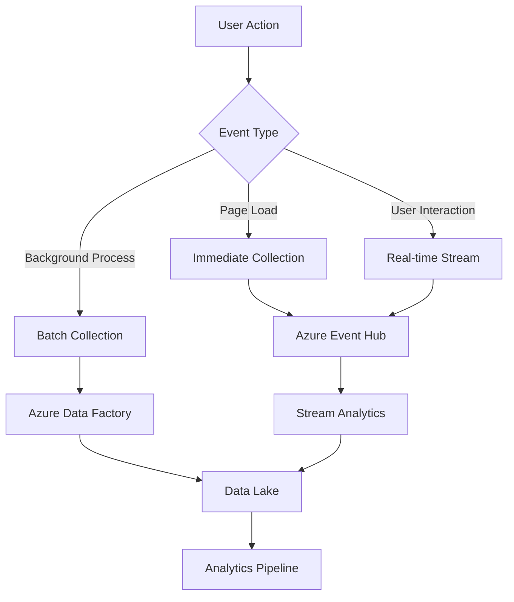
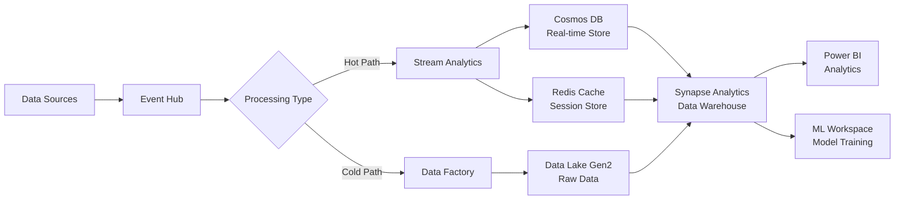
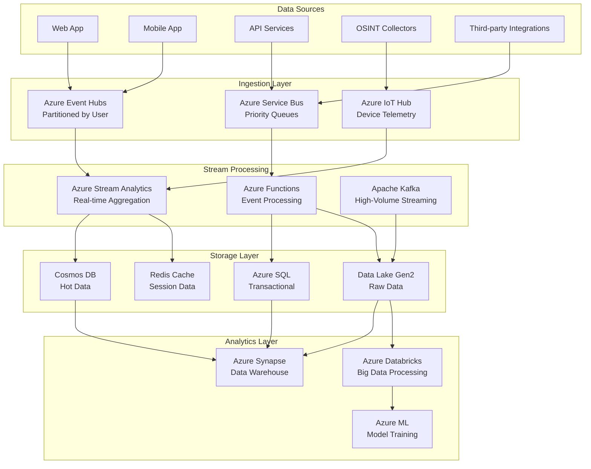
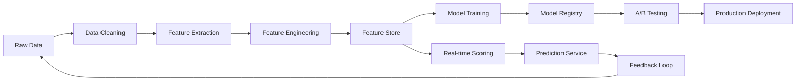
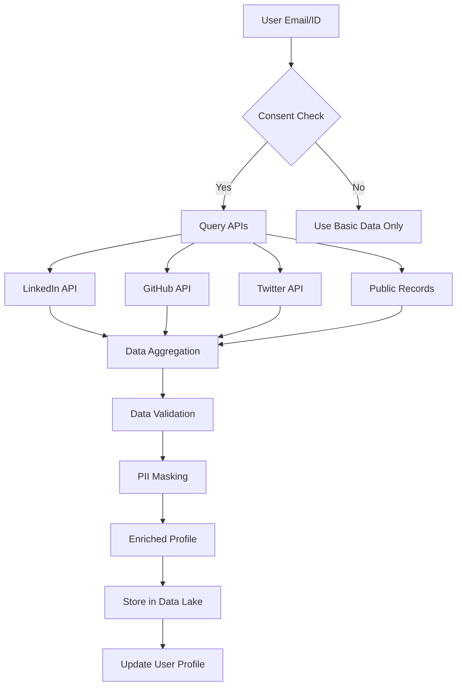
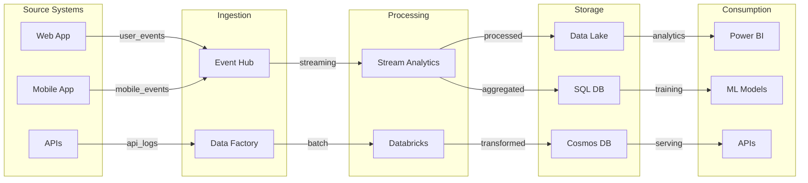
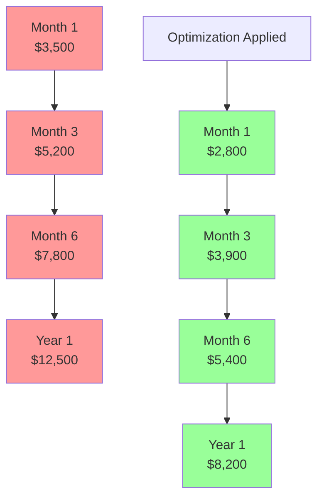

# AiDeepRef Data Collection & Metadata Architecture
## Version 1.0 | Date: 2024-11-23

---

## Executive Summary

This document outlines the comprehensive data collection, metadata management, and analytics architecture for AiDeepRef. The system is designed to capture all possible user interactions, application performance metrics, and external data sources while maintaining strict privacy compliance and enabling advanced ML model training capabilities.

---

## 1. Data Collection Strategy

### 1.1 What to Collect

#### User Interaction Data
```json
{
  "user_events": {
    "authentication": ["login", "logout", "session_start", "session_end", "mfa_challenge"],
    "navigation": ["page_view", "tab_switch", "scroll_depth", "link_click", "back_button"],
    "form_interactions": ["field_focus", "field_blur", "field_change", "form_submit", "validation_error"],
    "ai_interactions": {
      "prompt_submission": ["text", "timestamp", "context", "model_used"],
      "response_received": ["latency", "token_count", "success_rate"],
      "feedback": ["rating", "correction", "flag_inappropriate"]
    },
    "document_operations": ["create", "edit", "delete", "share", "export", "version_control"],
    "search_behavior": ["query_terms", "filters_applied", "results_clicked", "refinements"],
    "collaboration": ["invite_sent", "comment_added", "mention", "real_time_edit"]
  }
}
```

#### System Performance Data
```json
{
  "performance_metrics": {
    "client_side": {
      "page_load_time": "milliseconds",
      "time_to_interactive": "milliseconds",
      "first_contentful_paint": "milliseconds",
      "javascript_errors": ["error_message", "stack_trace", "user_agent"],
      "network_requests": ["endpoint", "duration", "status_code", "payload_size"]
    },
    "server_side": {
      "api_latency": "milliseconds",
      "database_query_time": "milliseconds",
      "cache_hit_rate": "percentage",
      "cpu_utilization": "percentage",
      "memory_usage": "megabytes",
      "concurrent_users": "count"
    }
  }
}
```

#### Business Metrics Data
```json
{
  "business_events": {
    "subscription": ["trial_start", "trial_end", "upgrade", "downgrade", "cancel", "payment"],
    "usage": ["daily_active_users", "feature_adoption", "retention_cohorts"],
    "content": ["references_created", "references_shared", "ai_prompts_used"],
    "revenue": ["mrr", "arr", "ltv", "churn_rate", "expansion_revenue"]
  }
}
```

### 1.2 When to Collect (Event Triggers)



### 1.3 How to Collect (Instrumentation)

#### Frontend Instrumentation
```javascript
// Example telemetry wrapper
class AiDeepRefTelemetry {
  constructor() {
    this.sessionId = generateSessionId();
    this.userId = getUserId();
    this.eventBuffer = [];
    this.batchSize = 50;
    this.flushInterval = 5000; // 5 seconds
  }

  track(eventName, properties = {}) {
    const event = {
      eventId: generateUUID(),
      eventName,
      timestamp: new Date().toISOString(),
      sessionId: this.sessionId,
      userId: this.userId,
      properties: {
        ...properties,
        url: window.location.href,
        userAgent: navigator.userAgent,
        screenResolution: `${window.screen.width}x${window.screen.height}`,
        viewport: `${window.innerWidth}x${window.innerHeight}`,
        referrer: document.referrer
      }
    };

    this.eventBuffer.push(event);

    if (this.eventBuffer.length >= this.batchSize) {
      this.flush();
    }
  }

  flush() {
    if (this.eventBuffer.length === 0) return;

    // Send to Azure Event Hub via API
    fetch('/api/telemetry/events', {
      method: 'POST',
      headers: { 'Content-Type': 'application/json' },
      body: JSON.stringify(this.eventBuffer)
    });

    this.eventBuffer = [];
  }
}
```

#### Backend Instrumentation
```python
# Example backend telemetry decorator
import functools
import time
from azure.eventhub import EventHubProducerClient

def track_api_call(event_name):
    def decorator(func):
        @functools.wraps(func)
        async def wrapper(*args, **kwargs):
            start_time = time.time()
            metadata = {
                'function_name': func.__name__,
                'event_name': event_name,
                'timestamp': datetime.utcnow().isoformat(),
                'request_id': generate_request_id()
            }

            try:
                result = await func(*args, **kwargs)
                metadata['status'] = 'success'
                metadata['duration_ms'] = (time.time() - start_time) * 1000

                # Send to Event Hub
                await send_to_event_hub(metadata)
                return result

            except Exception as e:
                metadata['status'] = 'error'
                metadata['error_type'] = type(e).__name__
                metadata['error_message'] = str(e)
                metadata['duration_ms'] = (time.time() - start_time) * 1000

                # Send to Event Hub
                await send_to_event_hub(metadata)
                raise

        return wrapper
    return decorator
```

### 1.4 Where to Store



---

## 2. Metadata Categories

### 2.1 User Behavior Metadata

```yaml
user_behavior_schema:
  user_profile:
    - user_id: string (hashed)
    - account_type: enum [free, trial, pro, enterprise]
    - created_date: timestamp
    - last_active: timestamp
    - total_sessions: integer
    - average_session_duration: float
    - preferred_language: string
    - timezone: string

  interaction_patterns:
    - most_used_features: array
    - average_daily_usage: float (minutes)
    - peak_usage_hours: array
    - device_preferences: object
    - browser_distribution: object

  engagement_metrics:
    - feature_adoption_rate: float
    - retention_rate: float
    - churn_risk_score: float
    - nps_score: integer
    - support_tickets: integer
```

### 2.2 Application Performance Metadata

```yaml
performance_schema:
  api_metrics:
    - endpoint: string
    - method: enum [GET, POST, PUT, DELETE]
    - average_latency: float
    - p95_latency: float
    - p99_latency: float
    - error_rate: float
    - requests_per_second: float

  resource_utilization:
    - cpu_usage: float
    - memory_usage: float
    - disk_io: float
    - network_throughput: float
    - database_connections: integer
    - cache_hit_ratio: float

  availability:
    - uptime_percentage: float
    - incident_count: integer
    - mean_time_to_recovery: float
    - failed_request_count: integer
```

### 2.3 AI Interaction Metadata

```yaml
ai_interaction_schema:
  prompt_analysis:
    - prompt_id: uuid
    - prompt_text: text (encrypted)
    - prompt_length: integer
    - prompt_complexity: float
    - language: string
    - intent_classification: array
    - sentiment_score: float

  response_metrics:
    - response_id: uuid
    - model_used: string
    - token_count: integer
    - generation_time: float
    - confidence_score: float
    - feedback_rating: integer
    - edited_by_user: boolean

  usage_patterns:
    - daily_prompt_count: integer
    - average_prompt_length: float
    - preferred_models: array
    - success_rate: float
    - regeneration_rate: float
```

### 2.4 Security Event Metadata

```yaml
security_schema:
  authentication_events:
    - event_type: enum [login, logout, mfa, password_reset]
    - timestamp: datetime
    - ip_address: string (hashed)
    - geolocation: object
    - device_fingerprint: string
    - risk_score: float

  access_control:
    - resource_accessed: string
    - permission_level: enum
    - access_granted: boolean
    - reason: string

  threat_detection:
    - threat_type: enum [brute_force, sql_injection, xss, ddos]
    - severity: enum [low, medium, high, critical]
    - source_ip: string (hashed)
    - mitigation_action: string
    - blocked: boolean
```

### 2.5 Business Analytics Metadata

```yaml
business_analytics_schema:
  subscription_metrics:
    - customer_id: uuid
    - subscription_tier: enum
    - monthly_recurring_revenue: decimal
    - lifetime_value: decimal
    - payment_method: enum
    - billing_country: string

  usage_economics:
    - compute_costs: decimal
    - storage_costs: decimal
    - api_call_costs: decimal
    - margin_per_user: decimal

  growth_metrics:
    - acquisition_channel: string
    - conversion_rate: float
    - trial_to_paid_rate: float
    - expansion_revenue: decimal
    - net_revenue_retention: float
```

### 2.6 OSINT-Gathered Metadata

```yaml
osint_schema:
  linkedin_data:
    - profile_url: string
    - company: string
    - job_title: string
    - industry: string
    - company_size: string
    - skills: array
    - education: array
    - connections_count: integer

  github_data:
    - username: string
    - repositories_count: integer
    - stars_received: integer
    - primary_language: string
    - contribution_streak: integer
    - organizations: array

  social_presence:
    - twitter_handle: string
    - twitter_followers: integer
    - twitter_verified: boolean
    - professional_website: string
    - published_articles: array

  public_records:
    - business_registrations: array
    - patents: array
    - publications: array
    - certifications: array
```

---

## 3. Data Pipeline Architecture

### 3.1 Event Streaming Architecture



### 3.2 Real-time Processing (Azure Stream Analytics)

```sql
-- Example Stream Analytics Query for User Behavior Analysis
WITH UserEvents AS (
    SELECT
        UserId,
        EventName,
        EventTimestamp,
        SessionId,
        Properties,
        System.Timestamp() AS WindowEnd
    FROM
        EventHub TIMESTAMP BY EventTimestamp
),

SessionMetrics AS (
    SELECT
        UserId,
        SessionId,
        COUNT(*) as EventCount,
        MIN(EventTimestamp) as SessionStart,
        MAX(EventTimestamp) as SessionEnd,
        System.Timestamp() AS WindowEnd
    FROM
        UserEvents
    GROUP BY
        UserId,
        SessionId,
        TumblingWindow(minute, 5)
),

UserEngagement AS (
    SELECT
        UserId,
        AVG(DATEDIFF(second, SessionStart, SessionEnd)) as AvgSessionDuration,
        SUM(EventCount) as TotalEvents,
        COUNT(DISTINCT SessionId) as SessionCount,
        System.Timestamp() AS CalculatedAt
    FROM
        SessionMetrics
    GROUP BY
        UserId,
        HoppingWindow(minute, 60, 5)
)

-- Output to multiple sinks
SELECT * INTO RealTimeCache FROM UserEngagement
SELECT * INTO DataLake FROM UserEvents
SELECT * INTO AlertingSystem FROM SessionMetrics WHERE EventCount > 1000
```

### 3.3 Batch Processing (Azure Data Factory)

```json
{
  "name": "DailyDataProcessingPipeline",
  "properties": {
    "activities": [
      {
        "name": "ExtractRawData",
        "type": "Copy",
        "inputs": [{"referenceName": "DataLakeRawDataset"}],
        "outputs": [{"referenceName": "StagingDataset"}],
        "typeProperties": {
          "source": {
            "type": "ParquetSource",
            "storeSettings": {
              "type": "AzureBlobFSReadSettings",
              "recursive": true,
              "wildcardFileName": "*.parquet"
            }
          }
        }
      },
      {
        "name": "TransformData",
        "type": "DataFlow",
        "dependsOn": [{"activity": "ExtractRawData"}],
        "typeProperties": {
          "dataFlow": {
            "referenceName": "UserBehaviorTransformation"
          },
          "compute": {
            "coreCount": 8,
            "computeType": "General"
          }
        }
      },
      {
        "name": "LoadToWarehouse",
        "type": "SqlServerStoredProcedure",
        "dependsOn": [{"activity": "TransformData"}],
        "typeProperties": {
          "storedProcedureName": "sp_MergeUserMetrics"
        }
      }
    ],
    "triggers": [
      {
        "name": "DailyTrigger",
        "type": "ScheduleTrigger",
        "typeProperties": {
          "recurrence": {
            "frequency": "Day",
            "interval": 1,
            "timeZone": "UTC",
            "schedule": {"hours": [2]}
          }
        }
      }
    ]
  }
}
```

---

## 4. ML Training Data

### 4.1 Reference Text Corpus Collection

```python
# Reference Pattern Analysis Pipeline
class ReferenceCorpusBuilder:
    def __init__(self):
        self.storage_client = DataLakeServiceClient()
        self.ml_client = MLClient()

    def collect_training_data(self):
        """Collect and prepare reference text for model training"""

        # Data collection schema
        training_schema = {
            "reference_id": "uuid",
            "original_text": "text",
            "reference_style": "enum",
            "field_of_study": "string",
            "quality_score": "float",
            "user_feedback": "array",
            "corrections": "array",
            "metadata": {
                "source": "string",
                "timestamp": "datetime",
                "user_tier": "enum",
                "success_rate": "float"
            }
        }

        # Feature extraction
        features = {
            "text_features": [
                "length",
                "complexity_score",
                "readability_index",
                "citation_count",
                "format_compliance"
            ],
            "user_features": [
                "experience_level",
                "domain_expertise",
                "historical_accuracy"
            ],
            "context_features": [
                "document_type",
                "academic_level",
                "time_constraints"
            ]
        }

        return self.process_corpus(training_schema, features)
```

### 4.2 AI Interaction Logging

```yaml
ai_training_data:
  prompt_response_pairs:
    - prompt_id: uuid
    - prompt_text: text
    - prompt_embedding: vector[768]
    - response_text: text
    - response_embedding: vector[768]
    - model_version: string
    - feedback_score: float
    - corrections_made: boolean
    - final_output: text

  success_patterns:
    - pattern_id: uuid
    - prompt_template: string
    - success_rate: float
    - average_quality_score: float
    - common_use_cases: array

  failure_patterns:
    - pattern_id: uuid
    - error_type: enum
    - prompt_characteristics: object
    - mitigation_applied: string
    - recovery_success: boolean
```

### 4.3 Fraud Detection Data

```python
# Fraud Detection Training Pipeline
fraud_detection_features = {
    "user_behavior_anomalies": {
        "sudden_usage_spike": "boolean",
        "unusual_access_times": "boolean",
        "multiple_ip_locations": "boolean",
        "rapid_api_calls": "integer",
        "suspicious_prompt_patterns": "array"
    },

    "account_patterns": {
        "account_age": "integer",
        "payment_method_changes": "integer",
        "failed_payment_attempts": "integer",
        "subscription_abuse": "boolean"
    },

    "content_patterns": {
        "plagiarism_score": "float",
        "repetitive_queries": "integer",
        "automated_behavior_score": "float",
        "api_key_sharing": "boolean"
    }
}
```

### 4.4 Feature Engineering Pipeline



---

## 5. OSINT Integration

### 5.1 LinkedIn API Integration

```python
class LinkedInDataCollector:
    def __init__(self):
        self.api_client = LinkedInAPIClient()
        self.rate_limiter = RateLimiter(calls=100, period=86400)

    def collect_profile_data(self, email):
        """Collect professional data from LinkedIn"""

        data_points = {
            "basic_profile": {
                "full_name": "string",
                "headline": "string",
                "location": "object",
                "industry": "string",
                "profile_picture": "url"
            },

            "professional_info": {
                "current_company": "string",
                "position": "string",
                "experience_years": "integer",
                "skills": ["skill1", "skill2"],
                "endorsements": "integer"
            },

            "education": {
                "degree": "string",
                "institution": "string",
                "graduation_year": "integer"
            },

            "network": {
                "connections": "integer",
                "followers": "integer",
                "mutual_connections": "array"
            }
        }

        # Privacy-compliant collection
        if self.has_consent(email):
            return self.api_client.get_profile(email, data_points)
        return None
```

### 5.2 GitHub API Integration

```python
class GitHubDataCollector:
    def __init__(self):
        self.github_client = Github()

    def collect_developer_profile(self, username):
        """Collect public developer activity data"""

        profile_data = {
            "activity_metrics": {
                "total_repos": "integer",
                "public_repos": "integer",
                "total_stars": "integer",
                "followers": "integer",
                "following": "integer"
            },

            "contribution_data": {
                "commits_last_year": "integer",
                "pull_requests": "integer",
                "issues_opened": "integer",
                "code_reviews": "integer"
            },

            "technology_stack": {
                "primary_languages": ["Python", "JavaScript"],
                "frameworks": ["React", "Django"],
                "topics": ["machine-learning", "web-dev"]
            },

            "collaboration": {
                "organizations": "array",
                "contributed_projects": "array",
                "maintained_projects": "array"
            }
        }

        return self.sanitize_data(profile_data)
```

### 5.3 Social Media APIs

```yaml
social_media_collection:
  twitter_x:
    data_points:
      - handle: string
      - verified: boolean
      - followers_count: integer
      - tweets_count: integer
      - bio: text
      - website: url
      - location: string

  rate_limits:
    - endpoint: /users/by/username
    - calls_per_window: 300
    - window_duration: 900 # seconds

  compliance:
    - respect_privacy_settings: true
    - only_public_data: true
    - user_consent_required: true
```

### 5.4 Data Enrichment Workflows



### 5.5 Legal/Ethical Boundaries

```yaml
osint_compliance:
  legal_requirements:
    - gdpr_compliant: true
    - ccpa_compliant: true
    - coppa_compliant: true

  ethical_guidelines:
    - no_private_data_collection: true
    - explicit_consent_required: true
    - transparent_data_use: true
    - opt_out_mechanism: true

  prohibited_actions:
    - scraping_without_api: false
    - bypassing_rate_limits: false
    - collecting_minor_data: false
    - selling_user_data: false

  data_retention:
    - osint_data_ttl: 90_days
    - refresh_cycle: 30_days
    - deletion_on_request: immediate
```

---

## 6. Analytics & Business Intelligence

### 6.1 Real-time Dashboards (Power BI)

```json
{
  "dashboard_configuration": {
    "real_time_metrics": {
      "active_users": {
        "query": "SELECT COUNT(DISTINCT user_id) FROM sessions WHERE last_activity > DATEADD(minute, -5, GETUTCDATE())",
        "refresh_interval": 30,
        "visualization": "card"
      },
      "api_latency": {
        "query": "SELECT endpoint, AVG(latency_ms) as avg_latency FROM api_logs WHERE timestamp > DATEADD(minute, -1, GETUTCDATE()) GROUP BY endpoint",
        "refresh_interval": 10,
        "visualization": "line_chart"
      },
      "error_rate": {
        "query": "SELECT COUNT(CASE WHEN status >= 400 THEN 1 END) * 100.0 / COUNT(*) as error_rate FROM api_logs WHERE timestamp > DATEADD(hour, -1, GETUTCDATE())",
        "refresh_interval": 60,
        "visualization": "gauge"
      }
    }
  }
}
```

### 6.2 User Analytics

```python
# Cohort Analysis Configuration
cohort_analysis = {
    "retention_cohorts": {
        "definition": "Users grouped by signup week",
        "metrics": [
            "week_1_retention",
            "week_2_retention",
            "week_4_retention",
            "week_8_retention",
            "week_12_retention"
        ],
        "segments": [
            "free_tier",
            "paid_tier",
            "enterprise"
        ]
    },

    "behavior_cohorts": {
        "power_users": "users with > 100 AI interactions per week",
        "casual_users": "users with 10-100 AI interactions per week",
        "dormant_users": "users with < 10 AI interactions per week"
    },

    "conversion_funnels": {
        "trial_to_paid": [
            "trial_signup",
            "first_ai_interaction",
            "feature_exploration",
            "payment_page_view",
            "subscription_complete"
        ]
    }
}
```

### 6.3 Business Metrics

```sql
-- MRR Calculation Query
WITH monthly_revenue AS (
    SELECT
        DATE_TRUNC('month', subscription_date) as month,
        SUM(CASE
            WHEN subscription_type = 'monthly' THEN amount
            WHEN subscription_type = 'annual' THEN amount / 12
        END) as mrr
    FROM subscriptions
    WHERE status = 'active'
    GROUP BY DATE_TRUNC('month', subscription_date)
),

churn_metrics AS (
    SELECT
        DATE_TRUNC('month', cancellation_date) as month,
        COUNT(*) as churned_customers,
        SUM(monthly_value) as churned_mrr
    FROM cancellations
    GROUP BY DATE_TRUNC('month', cancellation_date)
),

ltv_calculation AS (
    SELECT
        customer_segment,
        AVG(lifetime_value) as avg_ltv,
        AVG(customer_lifetime_months) as avg_lifetime
    FROM customer_metrics
    GROUP BY customer_segment
)

SELECT
    m.month,
    m.mrr,
    m.mrr - LAG(m.mrr) OVER (ORDER BY m.month) as mrr_growth,
    c.churned_customers,
    c.churned_mrr,
    (c.churned_mrr / m.mrr) * 100 as churn_rate
FROM monthly_revenue m
LEFT JOIN churn_metrics c ON m.month = c.month
ORDER BY m.month DESC;
```

### 6.4 Product Analytics

```yaml
product_analytics:
  feature_usage:
    tracking_method: "event_based"
    metrics:
      - feature_adoption_rate
      - time_to_first_use
      - usage_frequency
      - feature_retention

  user_journeys:
    - onboarding_flow:
        steps: [signup, email_verify, first_login, tutorial, first_action]
        dropout_analysis: true

    - feature_discovery:
        paths_analyzed: 100
        common_patterns: true
        optimization_opportunities: true

  a_b_testing:
    framework: "Azure ML Experiments"
    metrics_tracked:
      - conversion_rate
      - engagement_score
      - revenue_per_user
    statistical_significance: 0.95
```

### 6.5 AI Performance Metrics

```python
# AI Model Performance Tracking
ai_metrics = {
    "quality_metrics": {
        "accuracy": "float",
        "precision": "float",
        "recall": "float",
        "f1_score": "float",
        "bleu_score": "float",  # for text generation
        "perplexity": "float"    # for language models
    },

    "operational_metrics": {
        "average_latency_ms": "float",
        "p95_latency_ms": "float",
        "tokens_per_second": "float",
        "queue_depth": "integer",
        "model_availability": "percentage"
    },

    "business_impact": {
        "user_satisfaction_score": "float",
        "reference_quality_improvement": "percentage",
        "time_saved_per_user": "minutes",
        "support_ticket_reduction": "percentage"
    }
}
```

---

## 7. Data Privacy & Compliance

### 7.1 PII Handling and Masking

```python
class PIIMaskingEngine:
    def __init__(self):
        self.sensitive_fields = [
            'email', 'phone', 'ssn', 'credit_card',
            'ip_address', 'full_name', 'date_of_birth'
        ]

    def mask_data(self, data):
        """Apply appropriate masking based on data type"""

        masking_rules = {
            'email': lambda x: f"{x[:3]}***@***.***",
            'phone': lambda x: f"***-***-{x[-4:]}",
            'ssn': lambda x: f"***-**-{x[-4:]}",
            'credit_card': lambda x: f"****-****-****-{x[-4:]}",
            'ip_address': lambda x: f"{x.split('.')[0]}.***.***.***",
            'full_name': lambda x: f"{x.split()[0][0]}*** {x.split()[-1][0]}***",
            'date_of_birth': lambda x: f"**/**/****"
        }

        return self.apply_masking(data, masking_rules)

    def tokenize_for_analytics(self, pii_value):
        """Create consistent tokens for analytics while preserving privacy"""
        return hashlib.sha256(pii_value.encode()).hexdigest()[:16]
```

### 7.2 User Consent Management

```yaml
consent_management:
  consent_types:
    - data_collection:
        required: true
        scope: "basic application functionality"
        opt_out_impact: "limited features"

    - analytics:
        required: false
        scope: "performance improvement"
        opt_out_impact: "none"

    - osint_enrichment:
        required: false
        scope: "profile enrichment from public sources"
        opt_out_impact: "reduced personalization"

    - marketing:
        required: false
        scope: "promotional communications"
        opt_out_impact: "no marketing emails"

  consent_storage:
    location: "Cosmos DB"
    encryption: "AES-256"
    audit_trail: true
    version_tracking: true

  consent_ui:
    granular_controls: true
    easy_withdrawal: true
    clear_explanations: true
```

### 7.3 Data Retention Policies

```json
{
  "retention_policies": {
    "user_data": {
      "active_users": "indefinite",
      "inactive_users": "2_years",
      "deleted_accounts": "30_days"
    },

    "operational_data": {
      "api_logs": "90_days",
      "error_logs": "180_days",
      "security_logs": "1_year",
      "audit_logs": "7_years"
    },

    "analytics_data": {
      "raw_events": "60_days",
      "aggregated_metrics": "2_years",
      "ml_training_data": "1_year"
    },

    "compliance_data": {
      "gdpr_requests": "3_years",
      "consent_records": "indefinite",
      "data_breaches": "indefinite"
    }
  },

  "archival_strategy": {
    "hot_tier": "0-30_days",
    "cool_tier": "31-90_days",
    "archive_tier": "91+_days"
  }
}
```

### 7.4 Right to Deletion (CCPA/GDPR)

```python
class DataDeletionService:
    def __init__(self):
        self.data_stores = [
            'cosmos_db', 'sql_database', 'data_lake',
            'cache', 'backup_storage', 'analytics_warehouse'
        ]

    async def process_deletion_request(self, user_id, request_id):
        """Handle user data deletion request"""

        deletion_workflow = {
            "validate_request": self.validate_identity(user_id),
            "create_audit_log": self.log_deletion_request(request_id),
            "export_user_data": self.export_before_deletion(user_id),
            "delete_from_primary": self.delete_from_databases(user_id),
            "delete_from_secondary": self.delete_from_storage(user_id),
            "delete_from_backups": self.schedule_backup_deletion(user_id),
            "clear_caches": self.purge_cache_entries(user_id),
            "anonymize_logs": self.anonymize_historical_logs(user_id),
            "confirm_deletion": self.send_confirmation(user_id)
        }

        return await self.execute_workflow(deletion_workflow)
```

### 7.5 Anonymization Techniques

```python
# K-Anonymity Implementation
class AnonymizationEngine:
    def __init__(self, k_value=5):
        self.k = k_value

    def generalize_data(self, dataset):
        """Apply generalization for k-anonymity"""

        generalization_rules = {
            'age': lambda x: f"{(x // 10) * 10}-{(x // 10) * 10 + 9}",
            'zipcode': lambda x: x[:3] + "**",
            'salary': lambda x: f"${(x // 10000) * 10000}-${(x // 10000 + 1) * 10000}",
            'date': lambda x: x.strftime("%Y-%m")
        }

        return self.apply_generalizations(dataset, generalization_rules)

    def add_noise(self, value, epsilon=1.0):
        """Differential privacy through noise addition"""
        noise = numpy.random.laplace(0, 1/epsilon)
        return value + noise
```

---

## 8. Data Export System

### 8.1 User Data Export (CCPA/GDPR)

```python
class UserDataExporter:
    def __init__(self):
        self.export_formats = ['json', 'csv', 'xml', 'parquet']

    async def export_user_data(self, user_id, format='json'):
        """Complete user data export for compliance"""

        export_schema = {
            "user_profile": await self.get_profile_data(user_id),
            "account_settings": await self.get_account_settings(user_id),
            "usage_history": await self.get_usage_history(user_id),
            "ai_interactions": await self.get_ai_history(user_id),
            "documents": await self.get_user_documents(user_id),
            "billing_history": await self.get_billing_data(user_id),
            "consent_records": await self.get_consent_history(user_id),
            "support_tickets": await self.get_support_history(user_id)
        }

        # Generate secure download link
        export_file = await self.create_export_package(export_schema, format)
        download_url = await self.generate_secure_url(export_file)

        return {
            "export_id": generate_uuid(),
            "download_url": download_url,
            "expires_at": datetime.utcnow() + timedelta(days=7),
            "size_bytes": export_file.size,
            "checksum": export_file.checksum
        }
```

### 8.2 Business Intelligence Exports

```yaml
bi_export_capabilities:
  scheduled_reports:
    - daily_metrics:
        format: "excel"
        recipients: ["executives@company.com"]
        metrics: ["dau", "revenue", "churn", "nps"]

    - weekly_analytics:
        format: "power_bi_dataset"
        destination: "shared_drive"
        includes: ["user_cohorts", "feature_usage", "performance"]

    - monthly_board_report:
        format: "pdf"
        template: "executive_dashboard"
        kpis: ["mrr", "growth_rate", "ltv", "cac"]

  ad_hoc_exports:
    max_rows: 1000000
    formats: ["csv", "excel", "json", "parquet"]
    compression: ["gzip", "zip", "none"]
    delivery: ["download", "email", "sftp", "azure_storage"]
```

### 8.3 Raw Log Exports

```python
class LogExporter:
    def __init__(self):
        self.storage_client = DataLakeServiceClient()

    def export_logs(self, start_date, end_date, log_types):
        """Export raw logs for analysis"""

        export_config = {
            "log_types": {
                "application": "app_*.log",
                "security": "security_*.log",
                "api": "api_*.log",
                "audit": "audit_*.log"
            },

            "filters": {
                "date_range": (start_date, end_date),
                "severity": ["ERROR", "WARNING", "INFO"],
                "sources": ["web", "api", "worker"]
            },

            "output": {
                "format": "json_lines",
                "compression": "gzip",
                "partition_by": "date",
                "max_file_size": "1GB"
            }
        }

        return self.stream_export(export_config)
```

### 8.4 ML Training Data Exports

```yaml
ml_data_export:
  training_datasets:
    format: "parquet"
    features:
      - user_features
      - interaction_features
      - contextual_features
      - temporal_features

    labels:
      - success_indicator
      - quality_score
      - user_satisfaction

    splits:
      train: 0.7
      validation: 0.15
      test: 0.15

  feature_store_export:
    format: "delta"
    versioning: true
    time_travel: true
    schema_evolution: true
```

### 8.5 API for Programmatic Access

```python
# Data Export API Endpoints
from fastapi import FastAPI, HTTPException
from pydantic import BaseModel

app = FastAPI()

class ExportRequest(BaseModel):
    data_type: str
    format: str
    filters: dict
    date_range: dict

@app.post("/api/v1/export/request")
async def request_export(request: ExportRequest):
    """Initiate data export request"""

    # Validate request
    if not validate_export_permissions(request):
        raise HTTPException(status_code=403, detail="Insufficient permissions")

    # Queue export job
    job_id = await queue_export_job(request)

    return {
        "job_id": job_id,
        "status": "queued",
        "estimated_completion": estimate_completion_time(request),
        "webhook_url": f"/api/v1/export/status/{job_id}"
    }

@app.get("/api/v1/export/download/{export_id}")
async def download_export(export_id: str):
    """Download completed export"""

    export = await get_export_status(export_id)

    if export.status != "completed":
        raise HTTPException(status_code=404, detail="Export not ready")

    return {
        "download_url": generate_signed_url(export.file_path),
        "expires_in": 3600,
        "file_size": export.file_size,
        "checksum": export.checksum
    }
```

---

## 9. Data Governance

### 9.1 Data Catalog

```yaml
data_catalog:
  metadata_repository:
    platform: "Azure Purview"

    catalog_entries:
      - datasets:
          name: "user_interactions"
          description: "All user interaction events"
          owner: "data_team"
          classification: "confidential"
          update_frequency: "real-time"

      - data_products:
          name: "customer_360_view"
          description: "Unified customer profile"
          consumers: ["analytics", "ml", "support"]
          sla: "99.9% availability"

    discovery_features:
      - semantic_search
      - lineage_visualization
      - impact_analysis
      - quality_scores
```

### 9.2 Data Lineage Tracking



### 9.3 Data Quality Monitoring

```python
class DataQualityMonitor:
    def __init__(self):
        self.quality_rules = self.load_quality_rules()

    def define_quality_checks(self):
        return {
            "completeness": {
                "null_check": "COUNT(*) WHERE field IS NULL",
                "threshold": 0.05  # Max 5% nulls
            },

            "consistency": {
                "format_check": "REGEX_MATCH(field, pattern)",
                "range_check": "field BETWEEN min AND max",
                "referential_integrity": "EXISTS in reference_table"
            },

            "accuracy": {
                "outlier_detection": "zscore > 3",
                "duplicate_check": "COUNT(*) GROUP BY key HAVING COUNT > 1"
            },

            "timeliness": {
                "freshness_check": "MAX(timestamp) > NOW() - INTERVAL '1 hour'",
                "latency_check": "processing_time < SLA"
            }
        }

    async def run_quality_checks(self, dataset):
        """Execute quality checks and generate report"""

        results = {
            "dataset": dataset,
            "timestamp": datetime.utcnow(),
            "checks_passed": 0,
            "checks_failed": 0,
            "quality_score": 0.0,
            "issues": []
        }

        for check in self.quality_rules:
            result = await self.execute_check(check, dataset)
            if not result.passed:
                results["issues"].append(result)

        return results
```

### 9.4 Access Controls

```yaml
access_control_matrix:
  roles:
    data_scientist:
      permissions:
        - read: ["ml_datasets", "aggregated_metrics"]
        - write: ["feature_store", "model_artifacts"]
        - execute: ["training_pipelines", "scoring_apis"]
      restrictions:
        - no_pii_access
        - aggregated_data_only

    business_analyst:
      permissions:
        - read: ["business_metrics", "dashboards"]
        - write: ["reports", "queries"]
        - execute: ["bi_tools", "export_apis"]
      restrictions:
        - masked_pii
        - no_raw_logs

    data_engineer:
      permissions:
        - read: ["all_datasets"]
        - write: ["pipelines", "schemas"]
        - execute: ["etl_jobs", "maintenance"]
      restrictions:
        - audit_all_actions
        - approval_for_pii

    compliance_officer:
      permissions:
        - read: ["audit_logs", "consent_records"]
        - write: ["retention_policies", "deletion_requests"]
        - execute: ["compliance_reports", "data_exports"]
      restrictions:
        - none
```

### 9.5 Audit Logging

```python
class AuditLogger:
    def __init__(self):
        self.audit_store = CosmosClient()

    def log_data_access(self, event):
        """Log all data access events"""

        audit_record = {
            "event_id": generate_uuid(),
            "timestamp": datetime.utcnow().isoformat(),
            "user": {
                "id": event.user_id,
                "role": event.user_role,
                "ip_address": hash_ip(event.ip_address)
            },
            "action": {
                "type": event.action_type,  # READ, WRITE, DELETE, EXPORT
                "resource": event.resource_path,
                "query": sanitize_query(event.query),
                "rows_affected": event.row_count
            },
            "context": {
                "application": event.app_name,
                "session_id": event.session_id,
                "request_id": event.request_id
            },
            "compliance": {
                "has_pii": event.contains_pii,
                "consent_verified": event.consent_check,
                "retention_compliant": event.retention_check
            }
        }

        # Immutable write to audit store
        self.audit_store.create_item(audit_record)

        # Alert on suspicious activity
        if self.is_suspicious(audit_record):
            self.trigger_security_alert(audit_record)
```

---

## 10. Storage Strategy

### 10.1 Hot vs Cold Storage Tiers

```yaml
storage_tiers:
  hot_tier:
    description: "Frequently accessed data (0-30 days)"
    storage_type: "Premium SSD"
    services:
      - cosmos_db: "user sessions, real-time metrics"
      - redis_cache: "session data, frequently accessed content"
      - sql_database: "transactional data, current subscriptions"
    cost_per_gb: $0.15
    access_latency: "<10ms"

  cool_tier:
    description: "Occasionally accessed data (31-90 days)"
    storage_type: "Standard SSD"
    services:
      - data_lake_cool: "recent analytics data"
      - blob_storage_cool: "recent backups"
    cost_per_gb: $0.01
    access_latency: "<100ms"

  archive_tier:
    description: "Rarely accessed data (90+ days)"
    storage_type: "Archive Storage"
    services:
      - data_lake_archive: "historical data"
      - blob_archive: "compliance archives"
    cost_per_gb: $0.00099
    access_latency: "1-15 hours"
```

### 10.2 Data Archival Strategy

```python
class DataArchivalService:
    def __init__(self):
        self.storage_client = BlobServiceClient()

    def archive_policy(self):
        """Define archival rules based on business model"""

        return {
            "user_data": {
                "active_to_cool": 30,  # days
                "cool_to_archive": 60,  # As per business model
                "archive_to_delete": 730  # 2 years for inactive users
            },

            "transaction_data": {
                "active_to_cool": 90,
                "cool_to_archive": 365,
                "archive_to_delete": 2555  # 7 years for compliance
            },

            "log_data": {
                "active_to_cool": 7,
                "cool_to_archive": 30,
                "archive_to_delete": 180
            },

            "ml_training_data": {
                "active_to_cool": 30,
                "cool_to_archive": 90,
                "archive_to_delete": 365
            }
        }

    async def execute_archival(self):
        """Move data between tiers based on age"""

        lifecycle_rules = {
            "rule1": {
                "filter": {"age_days": 30},
                "action": "move_to_cool"
            },
            "rule2": {
                "filter": {"age_days": 60},
                "action": "move_to_archive"
            },
            "rule3": {
                "filter": {"age_days": 730, "user_status": "inactive"},
                "action": "delete"
            }
        }

        return await self.apply_lifecycle_rules(lifecycle_rules)
```

### 10.3 Backup and Recovery

```yaml
backup_strategy:
  automated_backups:
    databases:
      frequency: "daily"
      retention: "30 days"
      geo_redundant: true
      point_in_time_restore: true

    data_lake:
      frequency: "weekly"
      retention: "90 days"
      incremental: true
      compression: "gzip"

    configuration:
      frequency: "on_change"
      versioning: true
      retention: "unlimited"

  disaster_recovery:
    rpo: "1 hour"  # Recovery Point Objective
    rto: "4 hours"  # Recovery Time Objective

    failover_regions:
      primary: "East US"
      secondary: "West US"
      tertiary: "North Europe"

    testing_schedule: "quarterly"
```

### 10.4 Cost Optimization

```python
class StorageCostOptimizer:
    def __init__(self):
        self.cost_analyzer = CostManagementClient()

    def calculate_storage_costs(self):
        """Project storage costs based on data growth"""

        current_usage = {
            "hot_storage_gb": 500,
            "cool_storage_gb": 2000,
            "archive_storage_gb": 10000
        }

        growth_projections = {
            "daily_data_growth_gb": 10,
            "user_growth_rate": 0.15,  # 15% monthly
            "retention_impact": 0.8  # 80% data retained after archival
        }

        monthly_costs = {
            "current": self.calculate_current_cost(current_usage),
            "month_1": self.project_cost(current_usage, growth_projections, 30),
            "month_3": self.project_cost(current_usage, growth_projections, 90),
            "month_6": self.project_cost(current_usage, growth_projections, 180),
            "year_1": self.project_cost(current_usage, growth_projections, 365)
        }

        optimization_recommendations = [
            "Implement aggressive archival for logs older than 7 days",
            "Use compression for all cold storage data",
            "Implement data deduplication for backup storage",
            "Consider reserved capacity for predictable workloads"
        ]

        return {
            "costs": monthly_costs,
            "recommendations": optimization_recommendations,
            "potential_savings": "$2,400/month"
        }
```

---

## Implementation Roadmap

### Phase 1: Foundation (Weeks 1-4)
- Set up Azure Event Hubs and Stream Analytics
- Implement basic telemetry collection
- Deploy Cosmos DB for hot data storage
- Create initial Power BI dashboards

### Phase 2: Advanced Analytics (Weeks 5-8)
- Implement Azure Synapse Analytics
- Set up ML feature store
- Deploy OSINT collectors
- Implement PII masking engine

### Phase 3: Compliance & Governance (Weeks 9-12)
- Implement GDPR/CCPA compliance features
- Deploy data catalog with Azure Purview
- Set up comprehensive audit logging
- Implement user data export system

### Phase 4: Optimization (Weeks 13-16)
- Optimize storage tiers and archival
- Implement advanced ML pipelines
- Fine-tune real-time processing
- Complete cost optimization

---

## Privacy Compliance Matrix

| Requirement | GDPR | CCPA | Implementation |
|------------|------|------|----------------|
| User Consent | ✅ Required | ✅ Required | Consent management system |
| Data Portability | ✅ Required | ✅ Required | Export API implemented |
| Right to Delete | ✅ Required | ✅ Required | Automated deletion workflow |
| Data Minimization | ✅ Required | ⚠️ Recommended | Collection limits enforced |
| Purpose Limitation | ✅ Required | ⚠️ Recommended | Usage tracking implemented |
| Breach Notification | ✅ 72 hours | ✅ Without delay | Automated alerting system |
| Privacy by Design | ✅ Required | ⚠️ Recommended | Built into architecture |
| DPO Requirement | ✅ Sometimes | ❌ Not required | DPO dashboard available |

---

## Storage Cost Projections



### Cost Breakdown by Service
- **Azure Event Hubs**: $500/month (Standard tier, 10 throughput units)
- **Azure Stream Analytics**: $350/month (6 streaming units)
- **Cosmos DB**: $1,200/month (50,000 RU/s provisioned)
- **Data Lake Storage**: $800/month (50TB with lifecycle management)
- **Azure Synapse**: $1,500/month (DW1000c)
- **Power BI**: $200/month (Premium capacity)
- **Redis Cache**: $400/month (Premium P2)

---

## Security Considerations

1. **Encryption**
   - Data at rest: AES-256
   - Data in transit: TLS 1.3
   - Key management: Azure Key Vault

2. **Access Control**
   - Azure AD integration
   - Role-based access control (RBAC)
   - Conditional access policies
   - Multi-factor authentication required

3. **Network Security**
   - Private endpoints for all services
   - Network security groups
   - Azure Firewall for egress control
   - DDoS protection standard

4. **Monitoring**
   - Azure Sentinel for SIEM
   - Continuous security monitoring
   - Anomaly detection
   - Automated threat response

---

## Conclusion

This comprehensive data architecture provides AiDeepRef with:

1. **Complete visibility** into all user interactions and system behavior
2. **ML-ready data** for continuous model improvement
3. **Privacy compliance** with major regulations
4. **Scalable infrastructure** supporting growth
5. **Cost-optimized storage** with intelligent tiering
6. **Rich analytics** for business insights
7. **Robust governance** ensuring data quality and security

The architecture is designed to scale with the business while maintaining compliance, security, and cost-effectiveness. Regular reviews and optimizations should be conducted quarterly to ensure alignment with business objectives and technological advances.