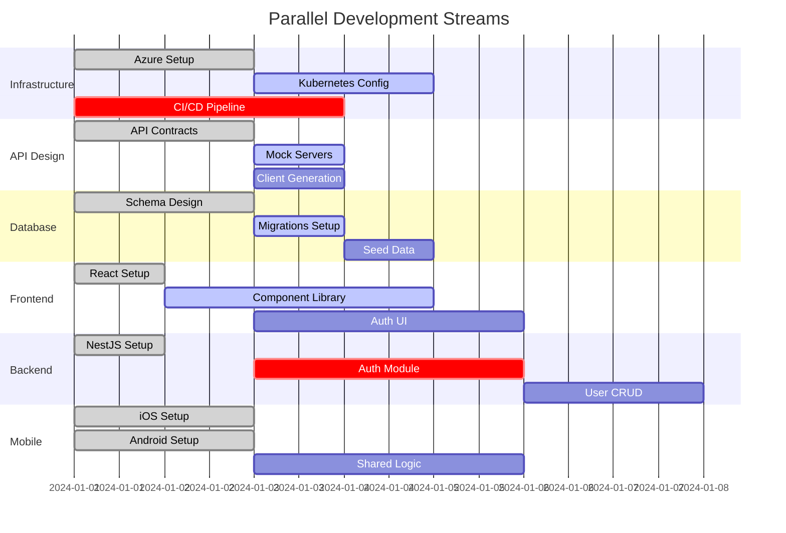

# AiDeepRef Critical Path & Dependency Matrix

**Purpose**: Visual guide for AI agents to understand task dependencies and parallelization opportunities
**Key**: 🟢 Can start immediately | 🟡 Has dependencies | 🔴 Blocker for others | ⚡ Can be parallelized

---

## Parallelization Matrix

### What Can Run in Parallel (Maximum Efficiency)



---

## Critical Path Analysis

### 🔴 CRITICAL PATH (Must Complete in Order)
These tasks block everything else and must be prioritized:

```yaml
critical_path:
  week_1:
    day_1:
      - task: "Azure Infrastructure"
        team: DevSecOps
        blocks: ["All deployment", "Database setup", "Redis setup"]
        duration: 4h

    day_2:
      - task: "API Contracts"
        team: API Team
        blocks: ["All client development", "Frontend", "Mobile", "Backend endpoints"]
        duration: 8h

    day_3:
      - task: "Database Schema"
        team: Metadata
        blocks: ["All CRUD operations", "ORM setup", "Migrations"]
        duration: 6h

  week_2:
    day_6:
      - task: "Authentication System"
        team: Backend
        blocks: ["All authenticated endpoints", "User features", "Authorization"]
        duration: 8h

    day_7:
      - task: "User Management"
        team: Backend
        blocks: ["Profiles", "References", "All user-related features"]
        duration: 6h

  week_3:
    day_11:
      - task: "Reference CRUD"
        team: Backend
        blocks: ["AI processing", "Referrer flow", "Scoring"]
        duration: 8h
```

---

## Parallel Work Opportunities

### 🟢 Phase 0: Maximum Parallelization (Week 1-2)

| Team | Can Start Immediately | Dependencies | Provides to Others |
|------|----------------------|--------------|-------------------|
| **DevSecOps** | ✅ Azure setup<br>✅ Docker compose<br>✅ CI/CD templates | None | Infrastructure for all |
| **API Team** | ✅ OpenAPI specs<br>✅ Contract design<br>✅ Mock data | None | API contracts for all |
| **Metadata** | ✅ Data models<br>✅ Schema design<br>✅ ER diagrams | None | Database structure |
| **Frontend** | ✅ Project setup<br>✅ Component library<br>✅ Storybook | API contracts (Day 2) | UI components |
| **Backend** | ✅ NestJS setup<br>✅ Module structure | Database (Day 3) | API endpoints |
| **AI Layer** | ✅ Python setup<br>✅ OpenRouter test<br>✅ Prompt library | None | AI services |
| **Mobile** | ✅ iOS project<br>✅ Android project<br>✅ UI mockups | API contracts (Day 2) | Mobile apps |
| **OSINT** | ✅ Research APIs<br>✅ Data sources<br>✅ Verification logic | None | External data |

### 🟡 Phase 1: Partial Parallelization (Week 3-4)

```yaml
parallel_streams:
  stream_1_backend:
    team: Backend
    tasks:
      - Authentication implementation
      - JWT strategy
      - RBAC setup
    dependencies: ["Database schema"]
    can_mock: ["User service"]

  stream_2_frontend:
    team: Frontend
    tasks:
      - Login UI
      - Register UI
      - Dashboard shell
    dependencies: ["API contracts"]
    can_mock: ["Auth API calls"]

  stream_3_mobile:
    team: Mobile
    tasks:
      - Auth screens
      - Navigation setup
      - Local storage
    dependencies: ["API contracts"]
    can_mock: ["All API calls"]

  stream_4_ai:
    team: AI Layer
    tasks:
      - Question generation
      - Prompt templates
      - OpenRouter integration
    dependencies: None
    can_mock: Nothing
```

---

## Dependency Resolution Strategies

### How to Unblock Teams

#### 1. Mock-First Development
```javascript
// Teams can use mocks to continue working while waiting for dependencies

// Frontend mock while waiting for Backend
const mockAuthService = {
  login: (email, password) =>
    Promise.resolve({
      token: 'mock-jwt-token',
      user: { id: '123', email, role: 'seeker' }
    }),

  register: (data) =>
    Promise.resolve({
      token: 'mock-jwt-token',
      user: { id: '124', ...data }
    })
};

// Backend mock while waiting for AI service
const mockAIService = {
  generateQuestions: (context) =>
    Promise.resolve([
      "What were the key responsibilities?",
      "How would you rate performance?",
      "Would you hire again?"
    ]),

  scoreReference: (reference) =>
    Promise.resolve({
      score: 0.85,
      insights: ["Positive sentiment", "Strong skills mentioned"]
    })
};
```

#### 2. Interface-First Development
```typescript
// Define interfaces first, implement later

// All teams agree on this interface Day 1
interface IUserService {
  create(dto: CreateUserDto): Promise<User>;
  findById(id: string): Promise<User>;
  update(id: string, dto: UpdateUserDto): Promise<User>;
  delete(id: string): Promise<void>;
}

// Teams can code against interface immediately
class MockUserService implements IUserService {
  // Mock implementation for development
}

class RealUserService implements IUserService {
  // Real implementation when ready
}
```

#### 3. Feature Flags for Progressive Integration
```javascript
// Use feature flags to gradually integrate real services

const config = {
  features: {
    useRealAuth: process.env.USE_REAL_AUTH === 'true',
    useRealAI: process.env.USE_REAL_AI === 'true',
    useRealPayments: process.env.USE_REAL_PAYMENTS === 'true'
  }
};

// Service selection based on feature flags
const authService = config.features.useRealAuth
  ? new RealAuthService()
  : new MockAuthService();
```

---

## Daily Dependency Check Matrix

### Use This Every Morning

| Team | Check These Dependencies | If Blocked, Use This Mock | Escalate If Blocked > |
|------|--------------------------|---------------------------|----------------------|
| **Frontend** | ✓ API contracts<br>✓ Auth endpoints<br>✓ User endpoints | Mock API server<br>`json-server` | 4 hours |
| **Backend** | ✓ Database connection<br>✓ Redis connection<br>✓ AI service | In-memory DB<br>In-memory cache<br>Mock AI responses | 2 hours |
| **Mobile** | ✓ API endpoints<br>✓ Auth flow<br>✓ Push notifications | Offline-first mode<br>Local mock data | 6 hours |
| **AI Layer** | ✓ OpenRouter API<br>✓ Message queue | Direct OpenAI API<br>Direct HTTP calls | 2 hours |
| **OSINT** | ✓ External APIs<br>✓ Rate limits | Cached responses<br>Mock data | 8 hours |

---

## Parallel Execution Playbook

### Week 1: Maximum Parallel Execution

```bash
# All teams can start these simultaneously on Day 1

# Team 1: DevSecOps
terraform init && terraform plan

# Team 2: API Team
npx openapi-generator-cli generate

# Team 3: Frontend
npx create-react-app web --template typescript

# Team 4: Backend
nest new api --skip-git

# Team 5: Mobile
react-native init AiDeepRef

# Team 6: AI Layer
python -m venv venv && pip install -r requirements.txt

# Team 7: Metadata
psql -c "CREATE DATABASE aideepref"

# Team 8: OSINT
scrapy startproject osint
```

### Integration Checkpoints

```yaml
integration_schedule:
  daily:
    time: "14:00 UTC"
    duration: 30 minutes
    agenda:
      - API contract changes
      - Breaking changes
      - New dependencies
      - Blockers

  phase_end:
    frequency: "Every 2 weeks"
    duration: 2 hours
    agenda:
      - Full integration test
      - Performance benchmarks
      - Security scan
      - Demo preparation
```

---

## Bottleneck Prevention Strategies

### Common Bottlenecks and Solutions

| Bottleneck | Impact | Prevention | Resolution |
|------------|--------|------------|------------|
| **API Contract Changes** | Blocks all clients | Version from Day 1<br>Use semantic versioning | Add new version<br>Deprecate old slowly |
| **Database Schema Changes** | Blocks Backend | Use migrations<br>Never break backward compatibility | Add columns, don't remove<br>Use feature flags |
| **Authentication Delays** | Blocks everything | Implement mock auth early<br>Use JWT standard | Provide auth bypass for dev<br>Mock tokens |
| **AI Service Availability** | Blocks reference flow | Have fallback providers<br>Cache responses | Use degraded mode<br>Queue for later |
| **Third-party API Limits** | Blocks OSINT | Implement caching<br>Use multiple providers | Reduce frequency<br>Batch requests |

---

## Success Metrics for Parallelization

### Daily Metrics
```yaml
metrics:
  team_productivity:
    - PRs created per team per day: ≥2
    - PRs merged per team per day: ≥1
    - Blocked time per team: <2 hours

  integration_health:
    - Integration tests passing: 100%
    - Cross-team dependencies resolved: <4 hours
    - Mock usage vs real services: Track ratio

  velocity:
    - Story points completed per sprint: Track trend
    - Features delivered per week: ≥5
    - Bug discovery rate: <5 per week
```

### Phase Completion Indicators

```yaml
phase_0_complete:
  - All teams have dev environment: ✓
  - API contracts defined: ✓
  - Database schema deployed: ✓
  - CI/CD running: ✓
  - Mock services available: ✓

phase_1_complete:
  - Auth flow working E2E: ✓
  - User CRUD operational: ✓
  - Mobile apps authenticate: ✓
  - Frontend displays data: ✓
  - 80% test coverage: ✓

phase_2_complete:
  - Reference flow complete: ✓
  - AI generates questions: ✓
  - Scoring works: ✓
  - Notifications sent: ✓
  - OSINT enrichment active: ✓
```

---

## AI Agent Coordination Protocol

### How AI Agents Should Coordinate

```python
class AIAgentCoordinator:
    """
    Protocol for AI agents working in parallel
    """

    def morning_sync(self):
        """Run every morning before starting work"""
        # 1. Check dependencies
        dependencies = self.check_dependencies()
        if dependencies.blocked:
            self.use_mocks(dependencies.blocked_services)

        # 2. Pull latest changes
        self.git_pull()

        # 3. Check for breaking changes
        breaking_changes = self.check_breaking_changes()
        if breaking_changes:
            self.adapt_to_changes(breaking_changes)

        # 4. Start assigned tasks
        self.start_daily_tasks()

    def before_commit(self):
        """Run before every commit"""
        # 1. Run tests
        self.run_tests()

        # 2. Check integration
        self.run_integration_tests()

        # 3. Update documentation
        self.update_docs()

        # 4. Create PR
        self.create_pull_request()

    def handle_blocking(self):
        """When blocked by dependency"""
        # 1. Document blocker
        self.document_blocker()

        # 2. Switch to mock
        self.implement_mock()

        # 3. Continue with other tasks
        self.switch_to_unblocked_task()

        # 4. Set reminder to check
        self.set_reminder(hours=2)
```

---

## Quick Reference: Who Can Do What When

### Phase 0 (Week 1-2)
- **Everyone**: Setup, contracts, mocks ⚡
- **No one blocked**: All parallel work

### Phase 1 (Week 3-4)
- **Frontend**: Needs API contracts ✓ (has mocks)
- **Backend**: Needs database ✓ (Day 3)
- **Mobile**: Needs API contracts ✓ (has mocks)
- **Others**: Independent work ⚡

### Phase 2 (Week 5-6)
- **Frontend**: Needs auth API (Day 6)
- **Backend**: Building core features ⚡
- **AI**: Independent development ⚡
- **Mobile**: Using mocks still ⚡

### Phase 3 (Week 7-9)
- **All teams**: Integration focus
- **Dependencies**: Most resolved
- **Parallel**: Feature development ⚡

### Phase 4 (Week 10-11)
- **DevSecOps**: Security lead
- **All teams**: Performance optimization ⚡
- **Parallel**: Testing and hardening ⚡

### Phase 5 (Week 12)
- **All teams**: Final integration
- **Sequential**: Deployment steps
- **Parallel**: Documentation ⚡

---

This matrix provides AI agents with a clear understanding of dependencies and parallelization opportunities, enabling maximum efficiency in the development process.