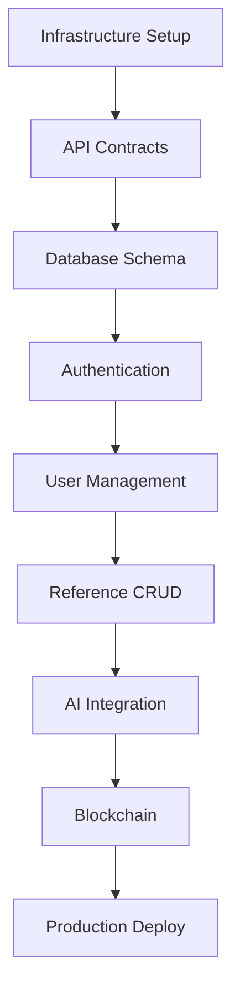

# AiDeepRef Phased Development Plan for AI Agents

**Version**: 1.0.0
**Date**: November 23, 2024
**MVP Target**: 12 Weeks (3 Months)
**Execution Model**: Parallel AI Agent Teams

---

## Executive Summary

This document provides a detailed, actionable development plan for AI agents to rebuild AiDeepRef. The plan emphasizes PARALLEL execution, clear dependencies, and specific deliverables that AI agents can implement independently.

### Key Success Factors
- **Maximum Parallelization**: 8 teams working simultaneously
- **Clear Interfaces**: Well-defined API contracts enable parallel work
- **Mock-First Development**: Teams use mocks to avoid blocking each other
- **Continuous Integration**: Daily integration of parallel workstreams
- **Automated Testing**: Every component has tests from day one

---

## Phase Overview

| Phase | Duration | Teams | Key Deliverables | Status Gate |
|-------|----------|-------|------------------|-------------|
| **Phase 0: Foundation** | Week 1-2 | All 8 teams | Infrastructure, Dev Environment, API Contracts | M1: Infrastructure Ready |
| **Phase 1: Core Systems** | Week 3-4 | 6 teams | Auth, Database, Basic CRUD, UI Shell | M2: Auth + Basic CRUD |
| **Phase 2: Business Logic** | Week 5-6 | 7 teams | Reference Flow, AI Integration, Mobile Foundation | M3: Core Features Working |
| **Phase 3: Advanced Features** | Week 7-9 | 8 teams | OSINT, Blockchain, Analytics, Payments | M4: AI Integration Complete |
| **Phase 4: Hardening** | Week 10-11 | 4 teams | Security, Performance, Compliance | M5: Production Ready |
| **Phase 5: Launch Prep** | Week 12 | All teams | Final Testing, Documentation, Deployment | MVP Launch |

---

## Team Structure & Responsibilities

### 1. Frontend Team
**Mission**: Build responsive React UI with server-side rendering focus
**Tech Stack**: React 18, TypeScript, Tailwind CSS, Vite
**Key Interfaces**: REST API, WebSocket, Authentication

### 2. Backend Team
**Mission**: Develop NestJS API with modular monolith architecture
**Tech Stack**: NestJS, PostgreSQL, Redis, TypeORM
**Key Interfaces**: Database, Cache, Message Queue

### 3. API Team
**Mission**: Design and implement RESTful and GraphQL APIs
**Tech Stack**: OpenAPI 3.0, GraphQL, API Gateway
**Key Interfaces**: All services, Rate limiting, Versioning

### 4. AI Layer Team
**Mission**: Integrate AI capabilities via OpenRouter
**Tech Stack**: Python FastAPI, LangChain, OpenRouter
**Key Interfaces**: NLP Processing, Document Analysis, Scoring

### 5. Metadata Team
**Mission**: Implement data models and search capabilities
**Tech Stack**: PostgreSQL, Elasticsearch, Vector DB
**Key Interfaces**: CRUD Operations, Search, Analytics

### 6. OSINT Team
**Mission**: Build external data verification systems
**Tech Stack**: Python, Scrapy, APIs (LinkedIn, GitHub)
**Key Interfaces**: Data enrichment, Verification, Scoring

### 7. Mobile Team
**Mission**: Native iOS/Android apps with offline-first architecture
**Tech Stack**: Swift/SwiftUI, Kotlin/Compose, SQLite
**Key Interfaces**: REST API, WebSocket, Offline Sync

### 8. DevSecOps Team
**Mission**: Infrastructure, CI/CD, security, and monitoring
**Tech Stack**: Terraform, Azure DevOps, Docker, Kubernetes
**Key Interfaces**: Deployment, Monitoring, Security Scanning

---

## PHASE 0: FOUNDATION (Week 1-2)
**Goal**: Establish development environment and contracts for parallel work

### Parallel Workstreams

#### Stream A: Infrastructure Setup (DevSecOps Team)
```yaml
tasks:
  - task: "Setup Azure Resource Groups"
    duration: 2 hours
    files_to_create:
      - /infrastructure/terraform/main.tf
      - /infrastructure/terraform/variables.tf
    commands: |
      terraform init
      terraform plan
      terraform apply

  - task: "Configure AKS Cluster"
    duration: 4 hours
    dependencies: ["Azure Resource Groups"]
    files_to_create:
      - /infrastructure/k8s/cluster-config.yaml
      - /infrastructure/k8s/namespaces.yaml

  - task: "Setup CI/CD Pipelines"
    duration: 6 hours
    files_to_create:
      - /.github/workflows/ci.yml
      - /.github/workflows/cd.yml
      - /azure-pipelines.yml
```

#### Stream B: API Contract Definition (API Team + All Teams)
```yaml
tasks:
  - task: "Define OpenAPI Specifications"
    duration: 8 hours
    files_to_create:
      - /api/openapi/auth.yaml
      - /api/openapi/references.yaml
      - /api/openapi/users.yaml
      - /api/openapi/ai.yaml
    validation: |
      npx @openapitools/openapi-generator-cli validate -i api/openapi/*.yaml

  - task: "Generate API Client Libraries"
    duration: 2 hours
    dependencies: ["OpenAPI Specifications"]
    commands: |
      npm run generate:api-clients
      npm run generate:api-types
```

#### Stream C: Database Schema (Metadata Team)
```yaml
tasks:
  - task: "Design Core Database Schema"
    duration: 6 hours
    files_to_create:
      - /database/schema/001_users.sql
      - /database/schema/002_references.sql
      - /database/schema/003_companies.sql
      - /database/schema/004_audit.sql

  - task: "Setup Database Migrations"
    duration: 2 hours
    files_to_create:
      - /apps/api/src/database/migrations/
    commands: |
      npm run migration:generate
      npm run migration:run
```

#### Stream D: Development Environment (All Teams)
```yaml
tasks:
  - task: "Setup Docker Compose Environment"
    duration: 4 hours
    files_to_create:
      - /docker-compose.yml
      - /docker-compose.dev.yml
      - /.env.example
    validation: |
      docker-compose up -d
      docker-compose ps
```

### Phase 0 Integration Points
- **Day 2**: API contracts review meeting (all teams)
- **Day 3**: Database schema finalized
- **Day 4**: Dev environment operational
- **Day 5**: CI/CD pipelines active

### Phase 0 Success Criteria
- [ ] All developers can run local environment
- [ ] API contracts agreed and documented
- [ ] Database schema deployed
- [ ] CI/CD pipeline runs on every commit
- [ ] Azure infrastructure provisioned

---

## PHASE 1: CORE SYSTEMS (Week 3-4)
**Goal**: Authentication, basic CRUD, and UI shell operational

### Parallel Workstreams

#### Stream A: Authentication System (Backend Team)
```yaml
tasks:
  - task: "Implement JWT Authentication"
    duration: 8 hours
    files_to_create:
      - /apps/api/src/auth/auth.module.ts
      - /apps/api/src/auth/auth.service.ts
      - /apps/api/src/auth/jwt.strategy.ts
    tests:
      - /apps/api/src/auth/auth.service.spec.ts

  - task: "Add OAuth2 Providers"
    duration: 6 hours
    providers: ["Google", "Microsoft", "LinkedIn"]
    files_to_create:
      - /apps/api/src/auth/oauth/

  - task: "Implement RBAC"
    duration: 4 hours
    files_to_create:
      - /apps/api/src/auth/rbac/
      - /apps/api/src/auth/guards/
```

#### Stream B: UI Foundation (Frontend Team)
```yaml
tasks:
  - task: "Setup React Project Structure"
    duration: 4 hours
    files_to_create:
      - /apps/web/src/app/layout/
      - /apps/web/src/app/routes/
      - /apps/web/src/app/components/

  - task: "Implement Authentication UI"
    duration: 8 hours
    components:
      - LoginForm
      - RegisterForm
      - ForgotPassword
      - OAuthButtons
    files_to_create:
      - /apps/web/src/features/auth/

  - task: "Create Dashboard Shell"
    duration: 6 hours
    files_to_create:
      - /apps/web/src/features/dashboard/
```

#### Stream C: User Management CRUD (Backend Team)
```yaml
tasks:
  - task: "User Service Implementation"
    duration: 6 hours
    operations: ["create", "read", "update", "delete", "list"]
    files_to_create:
      - /apps/api/src/users/users.service.ts
      - /apps/api/src/users/users.controller.ts

  - task: "Profile Management"
    duration: 4 hours
    files_to_create:
      - /apps/api/src/profiles/
```

#### Stream D: Mobile App Foundation (Mobile Team)
```yaml
tasks:
  - task: "iOS App Scaffold"
    duration: 8 hours
    files_to_create:
      - /apps/ios/AiDeepRef/
      - /apps/ios/AiDeepRef.xcodeproj

  - task: "Android App Scaffold"
    duration: 8 hours
    files_to_create:
      - /apps/android/app/
      - /apps/android/build.gradle

  - task: "Authentication Flow Mobile"
    duration: 6 hours
    platforms: ["iOS", "Android"]
```

### Phase 1 Integration Points
- **Day 8**: Auth API integrated with Frontend
- **Day 9**: Mobile apps connect to API
- **Day 10**: End-to-end authentication test

### Phase 1 Success Criteria
- [ ] Users can register/login via web
- [ ] JWT tokens properly validated
- [ ] Basic user CRUD operational
- [ ] Mobile apps authenticate successfully
- [ ] 100% test coverage on auth module

---

## PHASE 2: BUSINESS LOGIC (Week 5-6)
**Goal**: Core reference workflow operational

### Parallel Workstreams

#### Stream A: Reference Management (Backend Team)
```yaml
tasks:
  - task: "Reference CRUD Operations"
    duration: 8 hours
    files_to_create:
      - /apps/api/src/references/
    features:
      - Create reference request
      - Update reference status
      - Reference validation

  - task: "Reference Workflow Engine"
    duration: 10 hours
    states: ["draft", "pending", "in_progress", "completed", "verified"]
    files_to_create:
      - /apps/api/src/workflow/

  - task: "Notification System"
    duration: 6 hours
    channels: ["email", "sms", "push"]
    files_to_create:
      - /apps/api/src/notifications/
```

#### Stream B: AI Integration Foundation (AI Layer Team)
```yaml
tasks:
  - task: "OpenRouter Integration"
    duration: 8 hours
    files_to_create:
      - /services/ai/src/openrouter/
      - /services/ai/src/config/

  - task: "Question Generation Service"
    duration: 10 hours
    files_to_create:
      - /services/ai/src/questions/
    capabilities:
      - Role-specific questions
      - Industry-specific questions
      - Competency mapping

  - task: "Reference Scoring Engine"
    duration: 8 hours
    files_to_create:
      - /services/ai/src/scoring/
    metrics:
      - Sentiment analysis
      - Competency scoring
      - Authenticity score
```

#### Stream C: Reference UI (Frontend Team)
```yaml
tasks:
  - task: "Reference Request Flow"
    duration: 10 hours
    pages:
      - RequestReference
      - SelectReferrers
      - CustomizeQuestions
      - TrackProgress
    files_to_create:
      - /apps/web/src/features/references/

  - task: "Referrer Response Interface"
    duration: 8 hours
    files_to_create:
      - /apps/web/src/features/referrer/
    features:
      - Video recording
      - Audio recording
      - Text responses
```

#### Stream D: Data Enrichment (OSINT Team)
```yaml
tasks:
  - task: "LinkedIn Integration"
    duration: 8 hours
    files_to_create:
      - /services/osint/src/linkedin/

  - task: "Email Verification"
    duration: 4 hours
    files_to_create:
      - /services/osint/src/email/

  - task: "Company Verification"
    duration: 6 hours
    files_to_create:
      - /services/osint/src/company/
```

### Phase 2 Integration Points
- **Day 12**: Reference API complete
- **Day 13**: AI services integrated
- **Day 14**: End-to-end reference flow test

### Phase 2 Success Criteria
- [ ] Complete reference request flow works
- [ ] AI generates relevant questions
- [ ] Referrers can submit responses
- [ ] Basic scoring operational
- [ ] Email notifications working

---

## PHASE 3: ADVANCED FEATURES (Week 7-9)
**Goal**: AI-powered features, blockchain, and advanced capabilities

### Parallel Workstreams

#### Stream A: Advanced AI Features (AI Layer Team)
```yaml
tasks:
  - task: "Deepfake Detection"
    duration: 12 hours
    files_to_create:
      - /services/ai/src/deepfake/
    integration:
      - Video analysis
      - Audio analysis
      - Biometric matching

  - task: "Natural Language Processing"
    duration: 10 hours
    files_to_create:
      - /services/ai/src/nlp/
    features:
      - Sentiment extraction
      - Key phrase detection
      - Consistency checking

  - task: "AI Coaching Module"
    duration: 8 hours
    files_to_create:
      - /services/ai/src/coaching/
```

#### Stream B: Blockchain Integration (Backend Team)
```yaml
tasks:
  - task: "Smart Contract Development"
    duration: 10 hours
    files_to_create:
      - /contracts/ReferenceVerification.sol
      - /contracts/migrations/
    blockchain: "Ethereum L2 (Polygon)"

  - task: "Blockchain Service"
    duration: 8 hours
    files_to_create:
      - /apps/api/src/blockchain/
    features:
      - Reference hashing
      - Verification recording
      - Audit trail

  - task: "Zero-Knowledge Proofs"
    duration: 12 hours
    files_to_create:
      - /apps/api/src/zkp/
```

#### Stream C: Analytics Dashboard (Frontend Team)
```yaml
tasks:
  - task: "Analytics Components"
    duration: 10 hours
    files_to_create:
      - /apps/web/src/features/analytics/
    charts:
      - Reference metrics
      - Response rates
      - Time to completion
      - Quality scores

  - task: "Reporting Module"
    duration: 6 hours
    files_to_create:
      - /apps/web/src/features/reports/
    formats: ["PDF", "CSV", "Excel"]
```

#### Stream D: Payment Integration (Backend Team)
```yaml
tasks:
  - task: "Stripe Integration"
    duration: 8 hours
    files_to_create:
      - /apps/api/src/payments/stripe/
    features:
      - Subscription management
      - One-time payments
      - Invoicing

  - task: "Billing Management"
    duration: 6 hours
    files_to_create:
      - /apps/api/src/billing/

  - task: "Usage Tracking"
    duration: 4 hours
    files_to_create:
      - /apps/api/src/usage/
```

#### Stream E: Mobile Advanced Features (Mobile Team)
```yaml
tasks:
  - task: "Offline Sync Architecture"
    duration: 12 hours
    files_to_create:
      - /apps/ios/AiDeepRef/Sync/
      - /apps/android/app/src/sync/
    features:
      - Conflict resolution
      - Queue management
      - Incremental sync

  - task: "Biometric Authentication"
    duration: 6 hours
    platforms: ["iOS FaceID/TouchID", "Android Biometric"]

  - task: "Push Notifications"
    duration: 4 hours
    services: ["FCM", "APNS"]
```

### Phase 3 Integration Points
- **Day 18**: AI services fully integrated
- **Day 20**: Blockchain verification working
- **Day 21**: Payment flow complete

### Phase 3 Success Criteria
- [ ] Deepfake detection operational
- [ ] References recorded on blockchain
- [ ] Payments processing successfully
- [ ] Mobile offline sync working
- [ ] Analytics dashboard populated

---

## PHASE 4: HARDENING (Week 10-11)
**Goal**: Security, performance, and compliance

### Parallel Workstreams

#### Stream A: Security Hardening (DevSecOps Team)
```yaml
tasks:
  - task: "Security Audit"
    duration: 8 hours
    tools: ["OWASP ZAP", "Snyk", "SonarQube"]
    deliverables:
      - Security report
      - Vulnerability fixes

  - task: "Penetration Testing"
    duration: 12 hours
    scope:
      - API endpoints
      - Authentication flows
      - Payment processing

  - task: "WAF Configuration"
    duration: 4 hours
    files_to_create:
      - /infrastructure/waf/rules.json

  - task: "Rate Limiting"
    duration: 4 hours
    files_to_create:
      - /apps/api/src/middleware/rate-limit.ts
```

#### Stream B: Performance Optimization (All Teams)
```yaml
tasks:
  - task: "Database Optimization"
    duration: 8 hours
    optimizations:
      - Index creation
      - Query optimization
      - Connection pooling

  - task: "Caching Implementation"
    duration: 6 hours
    layers:
      - Redis caching
      - CDN configuration
      - Browser caching

  - task: "Frontend Performance"
    duration: 6 hours
    optimizations:
      - Code splitting
      - Lazy loading
      - Bundle optimization

  - task: "Load Testing"
    duration: 8 hours
    tools: ["K6", "JMeter"]
    targets:
      - 1000 concurrent users
      - 10K requests/minute
```

#### Stream C: Compliance (Backend Team)
```yaml
tasks:
  - task: "GDPR Compliance"
    duration: 8 hours
    features:
      - Data export
      - Data deletion
      - Consent management
    files_to_create:
      - /apps/api/src/compliance/gdpr/

  - task: "SOC2 Preparation"
    duration: 10 hours
    deliverables:
      - Security policies
      - Audit logs
      - Access controls

  - task: "Data Encryption"
    duration: 6 hours
    implementation:
      - At-rest encryption
      - In-transit encryption
      - Key rotation
```

### Phase 4 Integration Points
- **Day 24**: Security audit complete
- **Day 25**: Performance benchmarks met
- **Day 26**: Compliance checklist complete

### Phase 4 Success Criteria
- [ ] Zero critical security vulnerabilities
- [ ] <200ms API response time (p95)
- [ ] 99.9% uptime achieved
- [ ] GDPR compliant
- [ ] Load tests pass at 1000 concurrent users

---

## PHASE 5: LAUNCH PREPARATION (Week 12)
**Goal**: Final testing, documentation, and production deployment

### Parallel Workstreams

#### Stream A: End-to-End Testing (All Teams)
```yaml
tasks:
  - task: "E2E Test Scenarios"
    duration: 8 hours
    scenarios:
      - Complete reference cycle
      - Payment processing
      - Mobile sync
      - AI verification
    tools: ["Playwright", "Cypress"]

  - task: "User Acceptance Testing"
    duration: 6 hours
    participants: 10 beta users

  - task: "Regression Testing"
    duration: 4 hours
```

#### Stream B: Documentation (All Teams)
```yaml
tasks:
  - task: "API Documentation"
    duration: 4 hours
    format: "OpenAPI + Postman"

  - task: "User Documentation"
    duration: 6 hours
    deliverables:
      - User guide
      - Video tutorials
      - FAQ

  - task: "Developer Documentation"
    duration: 4 hours
    deliverables:
      - Setup guide
      - Architecture docs
      - Deployment guide
```

#### Stream C: Production Deployment (DevSecOps Team)
```yaml
tasks:
  - task: "Production Environment Setup"
    duration: 6 hours
    checklist:
      - SSL certificates
      - Domain configuration
      - Backup strategy

  - task: "Deployment Automation"
    duration: 4 hours
    files_to_create:
      - /deployment/production/

  - task: "Monitoring Setup"
    duration: 4 hours
    tools:
      - Application Insights
      - Log Analytics
      - Alerts configuration

  - task: "Rollback Strategy"
    duration: 2 hours
    deliverables:
      - Rollback procedures
      - Database backup
      - Blue-green deployment
```

### Phase 5 Integration Points
- **Day 28**: All tests passing
- **Day 29**: Documentation complete
- **Day 30**: Production deployment

### Phase 5 Success Criteria
- [ ] 100% E2E tests passing
- [ ] Documentation complete
- [ ] Production environment stable
- [ ] Monitoring and alerts configured
- [ ] Rollback tested successfully

---

## Critical Path Analysis

### Dependencies That Cannot Be Parallelized



### Bottleneck Mitigation Strategies

1. **API Contract Bottleneck**
   - Solution: Define contracts in Phase 0, use mock servers
   - Tools: Postman Mock Server, JSON Server

2. **Database Schema Changes**
   - Solution: Use migrations, version all changes
   - Tools: TypeORM migrations, Flyway

3. **Authentication Dependency**
   - Solution: Implement JWT mock for parallel development
   - Provide: Mock auth middleware

4. **AI Service Integration**
   - Solution: Mock AI responses initially
   - Provide: Response templates

5. **Third-party Services**
   - Solution: Use sandbox environments
   - Fallback: Local mock services

---

## Team Coordination Matrix

### Daily Standup Schedule (All Times UTC)

| Time | Team | Focus |
|------|------|-------|
| 09:00 | DevSecOps | Infrastructure status |
| 09:15 | Backend | API development |
| 09:30 | Frontend | UI progress |
| 09:45 | Mobile | App development |
| 10:00 | AI Layer | AI services |
| 10:15 | Metadata | Data operations |
| 10:30 | OSINT | External integrations |
| 10:45 | API Team | Contract updates |

### Integration Points

#### Weekly Integration Milestones

**Monday**: API contract updates
**Tuesday**: Database schema review
**Wednesday**: Integration testing
**Thursday**: Performance testing
**Friday**: Demo and retrospective

### Communication Channels

```yaml
channels:
  slack:
    - #general: Announcements
    - #backend: Backend team
    - #frontend: Frontend team
    - #mobile: Mobile team
    - #ai: AI team
    - #devops: DevOps team
    - #integration: Cross-team issues
    - #blockers: Blocking issues

  documentation:
    - Confluence: Architecture decisions
    - GitHub Wiki: Technical docs
    - Postman: API documentation

  code_review:
    - GitHub PRs: All code reviews
    - Automated checks: CI/CD pipeline
```

---

## Testing Strategy

### Test Pyramid

```
         /\
        /E2E\       5% - End-to-end tests
       /------\
      /Integration\ 15% - Integration tests
     /------------\
    /   Unit Tests \ 80% - Unit tests
   /----------------\
```

### Testing Requirements by Phase

| Phase | Unit Tests | Integration | E2E | Performance |
|-------|-----------|-------------|-----|-------------|
| Phase 0 | - | - | - | - |
| Phase 1 | 90% coverage | Auth flow | Login flow | - |
| Phase 2 | 90% coverage | API tests | Reference flow | Basic load |
| Phase 3 | 85% coverage | All APIs | All features | 500 users |
| Phase 4 | 85% coverage | All APIs | All features | 1000 users |
| Phase 5 | 85% coverage | All APIs | All features | Production load |

### Automated Testing Tools

```yaml
testing_stack:
  unit:
    backend: ["Jest", "Supertest"]
    frontend: ["Jest", "React Testing Library"]
    mobile: ["XCTest", "JUnit"]

  integration:
    api: ["Postman", "Newman"]
    database: ["TestContainers"]

  e2e:
    web: ["Playwright", "Cypress"]
    mobile: ["Appium", "Detox"]

  performance:
    load: ["K6", "JMeter"]
    stress: ["Gatling"]

  security:
    sast: ["SonarQube", "Snyk"]
    dast: ["OWASP ZAP"]
```

---

## Risk Management

### High-Risk Areas

1. **AI Service Reliability**
   - Risk: OpenRouter downtime
   - Mitigation: Fallback providers, caching
   - Owner: AI Layer Team

2. **Blockchain Gas Costs**
   - Risk: High Ethereum gas fees
   - Mitigation: Batch transactions, L2 solutions
   - Owner: Backend Team

3. **Mobile App Store Approval**
   - Risk: Rejection or delays
   - Mitigation: Early TestFlight/Beta testing
   - Owner: Mobile Team

4. **GDPR Compliance**
   - Risk: Non-compliance penalties
   - Mitigation: Legal review, privacy by design
   - Owner: Backend Team

5. **Scaling Beyond 1000 Users**
   - Risk: Performance degradation
   - Mitigation: Load testing, auto-scaling
   - Owner: DevSecOps Team

### Contingency Plans

```yaml
contingencies:
  ai_failure:
    primary: OpenRouter
    fallback: Direct OpenAI API
    emergency: Pre-computed responses

  database_failure:
    primary: PostgreSQL cluster
    fallback: Read replicas
    emergency: Cache-only mode

  payment_failure:
    primary: Stripe
    fallback: PayPal
    emergency: Invoice generation
```

---

## Success Metrics

### Phase Completion Criteria

Each phase must meet these criteria before proceeding:

1. **Code Quality**
   - [ ] All PRs reviewed and approved
   - [ ] No critical SonarQube issues
   - [ ] Test coverage meets requirements

2. **Functionality**
   - [ ] All user stories completed
   - [ ] Acceptance criteria met
   - [ ] Integration tests passing

3. **Performance**
   - [ ] API response < 500ms (p95)
   - [ ] Frontend FCP < 2 seconds
   - [ ] Mobile app launch < 3 seconds

4. **Security**
   - [ ] No high/critical vulnerabilities
   - [ ] Security headers configured
   - [ ] Authentication working correctly

### MVP Success Criteria

The MVP is considered successful when:

- [ ] 100 beta users successfully create references
- [ ] 90% referrer response rate achieved
- [ ] <48 hour average turnaround time
- [ ] 99.9% uptime over 7 days
- [ ] NPS score > 50
- [ ] Zero critical bugs in production
- [ ] All compliance requirements met

---

## AI Agent Execution Instructions

### For Each Team's AI Agent

```yaml
execution_model:
  daily_workflow:
    1_morning:
      - Check assigned tasks in this document
      - Review dependencies and blockers
      - Pull latest code changes
      - Create feature branch

    2_development:
      - Implement assigned features
      - Write tests alongside code
      - Follow coding standards
      - Commit frequently with clear messages

    3_testing:
      - Run unit tests locally
      - Run integration tests
      - Fix any failures
      - Check code coverage

    4_integration:
      - Create pull request
      - Address review comments
      - Ensure CI/CD passes
      - Merge when approved

    5_communication:
      - Update task status
      - Report blockers immediately
      - Document decisions
      - Participate in standups

  coding_standards:
    - Follow team style guide
    - Write self-documenting code
    - Include JSDoc/comments
    - Handle errors properly
    - Log appropriately

  git_workflow:
    - Branch from main
    - Prefix: feat/, fix/, chore/
    - Commit message format: "type(scope): description"
    - Squash commits before merge
    - Delete branch after merge
```

### Task Assignment Protocol

```yaml
task_assignment:
  format:
    id: "TEAM-PHASE-NUMBER"
    title: "Clear, actionable title"
    description: "What needs to be done"
    acceptance_criteria:
      - "Specific measurable outcome"
      - "Test coverage requirement"
      - "Documentation requirement"
    dependencies:
      - "List of blocking tasks"
    estimated_hours: 8
    files_to_modify:
      - "/exact/path/to/file.ts"
    tests_to_write:
      - "/exact/path/to/test.spec.ts"

  priority_levels:
    P0: "Blocker - stops all work"
    P1: "Critical - blocks other teams"
    P2: "High - core functionality"
    P3: "Medium - nice to have"
    P4: "Low - future enhancement"
```

### Integration Checklist

Before marking any task as complete:

- [ ] Code compiles without errors
- [ ] All tests pass locally
- [ ] API contracts match specification
- [ ] Documentation updated
- [ ] PR created and reviewed
- [ ] CI/CD pipeline passes
- [ ] Integration test with dependent teams
- [ ] Performance benchmarks met
- [ ] Security scan passes
- [ ] Accessibility standards met

---

## Conclusion

This phased development plan provides a clear roadmap for AI agents to rebuild AiDeepRef with maximum parallelization and minimal dependencies. By following this plan, eight AI agent teams can work simultaneously to deliver an MVP in 12 weeks.

### Key Success Factors

1. **Clear Contracts**: Well-defined API contracts enable parallel work
2. **Mock-First**: Teams use mocks to avoid blocking each other
3. **Continuous Integration**: Daily integration prevents drift
4. **Automated Testing**: Quality gates at every level
5. **Communication**: Regular sync points and clear channels

### Next Steps for AI Agents

1. Review your team's assigned tasks for Phase 0
2. Set up your development environment
3. Familiarize yourself with the codebase
4. Begin implementing Phase 0 tasks
5. Communicate blockers immediately

**Remember**: The goal is rapid, parallel development with continuous integration. Don't wait for perfection - iterate quickly and improve continuously.

---

*This document is version controlled and should be updated as the project evolves. All changes must be reviewed by the technical lead.*