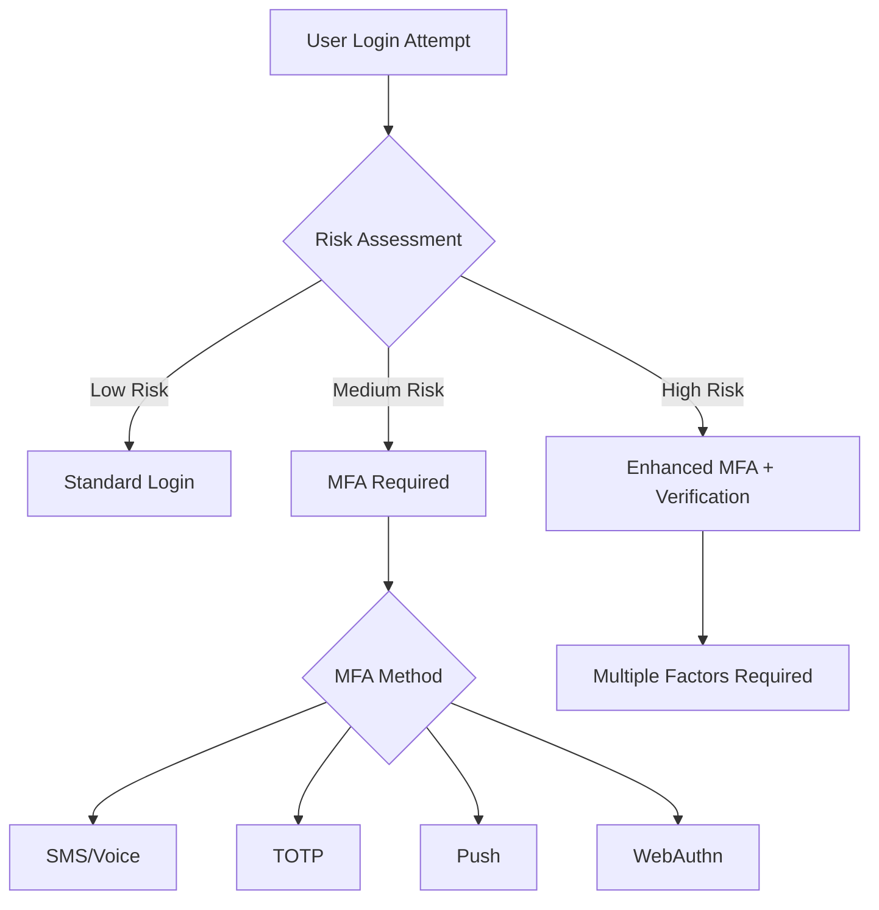
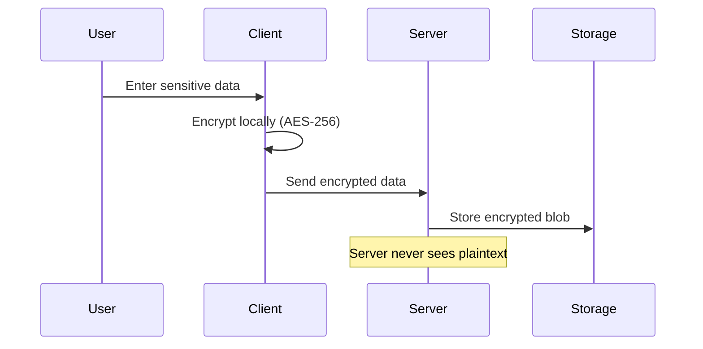
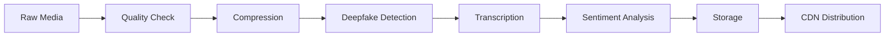
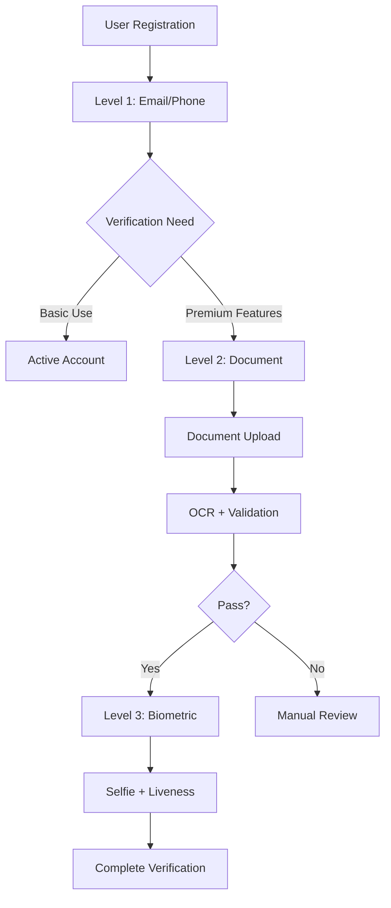
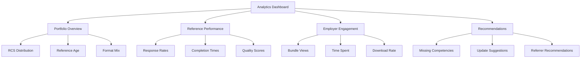
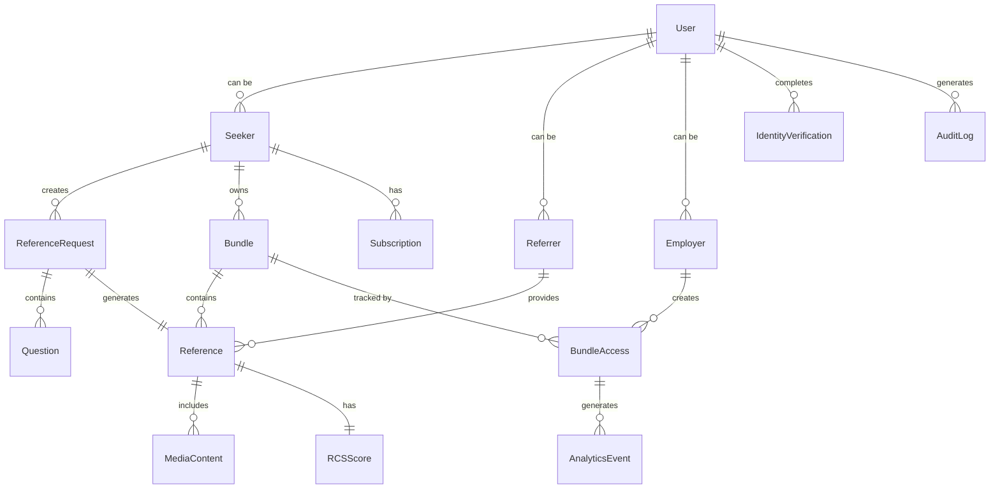
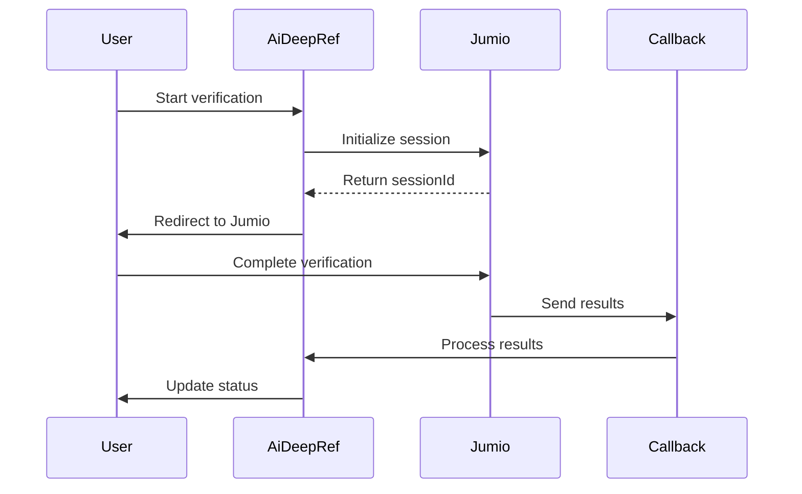

# AiDeepRef Product Requirements Document (PRD)

## Document Version Control

| Version | Date | Author | Description |
|---------|------|--------|-------------|
| 1.0 | 2025-11-23 | Product Team | Initial PRD for AiDeepRef Rebuild |

---

## Executive Summary

AiDeepRef is a next-generation professional reference verification platform that leverages artificial intelligence, blockchain technology, and zero-knowledge cryptography to revolutionize the reference checking process. The platform creates a trusted, secure, and efficient ecosystem for job seekers, referrers, and employers to exchange verified professional references while maintaining privacy and authenticity.

---

## Table of Contents

1. [Product Vision & Strategy](#1-product-vision--strategy)
2. [User Personas](#2-user-personas)
3. [User Stories & Acceptance Criteria](#3-user-stories--acceptance-criteria)
4. [Feature Specifications](#4-feature-specifications)
5. [Non-Functional Requirements](#5-non-functional-requirements)
6. [Data Model Overview](#6-data-model-overview)
7. [Integration Requirements](#7-integration-requirements)
8. [Compliance Requirements](#8-compliance-requirements)
9. [Analytics & Data Collection](#9-analytics--data-collection)

---

## 1. Product Vision & Strategy

### 1.1 Mission Statement

"To transform professional reference verification through AI-powered insights and blockchain-secured authenticity, creating a trusted global standard for career credentials that empowers professionals, streamlines hiring, and eliminates reference fraud."

### 1.2 Vision

By 2028, AiDeepRef will be the global standard for professional reference verification, trusted by Fortune 500 companies and integrated with major ATS and HRIS platforms worldwide.

### 1.3 Target Market Segments

#### Primary Markets
- **Individual Professionals (B2C)**
  - Active job seekers (15M+ in US annually)
  - Passive candidates building career portfolios
  - Recent graduates entering workforce
  - Career changers and consultants

- **Enterprises (B2B)**
  - Mid-market companies (1,000-5,000 employees)
  - Enterprise organizations (5,000+ employees)
  - Staffing and recruitment agencies
  - Background check companies

#### Secondary Markets
- **Academic Institutions**
  - Universities and colleges for alumni services
  - Professional certification bodies

- **Government Agencies**
  - Security clearance verification
  - Public sector hiring

### 1.4 Value Propositions

#### For Seekers
- **Career Ownership**: Portable, lifetime reference portfolio
- **Privacy Control**: Zero-knowledge architecture ensures data sovereignty
- **AI Coaching**: Personalized guidance for reference preparation
- **Instant Verification**: Blockchain-verified credentials reduce hiring delays
- **Universal Access**: Works across all industries and platforms

#### For Referrers
- **Frictionless Experience**: One-click responses via PWA
- **Time Efficiency**: AI-generated questions save 80% of time
- **Legal Protection**: Standardized, compliant reference format
- **Authenticity Guarantee**: Biometric and deepfake detection
- **Flexible Formats**: Video, audio, or text options

#### For Employers
- **Fraud Prevention**: 99.9% authenticity verification
- **Cost Reduction**: 60% reduction in reference checking costs
- **Speed**: 5-day to same-day reference turnaround
- **Quality Insights**: AI-powered Reference Context Score (RCS)
- **Compliance**: EEOC and global regulatory compliance built-in
- **Integration**: Seamless ATS/HRIS connectivity

### 1.5 Success Metrics (KPIs)

#### Business Metrics
- **Monthly Recurring Revenue (MRR)**: Target $2M by Year 2
- **Customer Acquisition Cost (CAC)**: <$50 for B2C, <$5,000 for B2B
- **Lifetime Value (LTV)**: >$500 for individuals, >$50,000 for enterprises
- **Churn Rate**: <5% monthly for individuals, <10% annually for enterprises

#### Product Metrics
- **User Activation Rate**: >60% complete first reference within 7 days
- **Referrer Response Rate**: >85% complete references
- **Time to Reference**: <48 hours average
- **RCS Score Accuracy**: >90% correlation with job performance
- **Platform Uptime**: 99.99% availability SLA

#### Engagement Metrics
- **Daily Active Users (DAU)**: 100,000+ by Year 2
- **Monthly Active Users (MAU)**: 500,000+ by Year 2
- **Reference Completion Rate**: >80%
- **NPS Score**: >70 for all user types

---

## 2. User Personas

### 2.1 Sarah Chen - The Career Climber (Seeker)

**Demographics**
- Age: 32
- Location: San Francisco, CA
- Education: MBA from Stanford
- Current Role: Senior Product Manager at tech startup
- Income: $150,000

**Background**
Sarah has worked at 4 companies over 8 years, building strong relationships with colleagues and managers. She's actively interviewing for Director-level positions at larger tech companies.

**Goals**
- Maintain portable reference portfolio across job changes
- Demonstrate consistent high performance across roles
- Accelerate interview process with pre-verified references
- Control which references employers can access

**Pain Points**
- Previous managers have left companies, making references hard to obtain
- Reference checking delays have caused lost opportunities
- Concerns about current employer discovering job search
- Difficulty tracking who provided references and when

**Technology Profile**
- Heavy mobile user (iPhone 14 Pro)
- Uses LinkedIn daily, familiar with ATS systems
- Comfortable with video calls and recording
- Privacy-conscious about personal data

**User Journey Highlights**
1. Discovers AiDeepRef through LinkedIn ad
2. Signs up for free tier during job search
3. Upgrades to paid plan after receiving first reference
4. Becomes advocate after landing dream job

### 2.2 Marcus Johnson - The Trusted Mentor (Referrer)

**Demographics**
- Age: 48
- Location: Chicago, IL
- Education: BS Computer Science
- Current Role: VP of Engineering at Fortune 500
- Income: $250,000

**Background**
Marcus has managed over 100 engineers in his 25-year career. He receives 2-3 reference requests monthly from former team members and takes pride in helping their careers.

**Goals**
- Provide meaningful, detailed references efficiently
- Protect himself legally while being honest
- Maintain relationships with former team members
- Balance reference requests with busy schedule

**Pain Points**
- Repetitive reference calls take significant time
- Worried about legal liability for references
- Difficulty remembering specific examples from years ago
- No record of references provided

**Technology Profile**
- Primarily desktop user (Windows)
- Basic smartphone user (Android)
- Prefers email communication
- Low tolerance for complex apps

**User Journey Highlights**
1. Receives reference request via email link
2. Reviews AI-generated questions on mobile
3. Records video reference during lunch break
4. Appreciates legal protection and simplicity

### 2.3 Jennifer Park - The Talent Acquisition Lead (Employer)

**Demographics**
- Age: 38
- Location: Austin, TX
- Education: MS Human Resources
- Current Role: Director of Talent Acquisition
- Company: 5,000-employee fintech
- Income: $120,000

**Background**
Jennifer leads a team of 15 recruiters handling 500+ hires annually. She's responsible for improving quality of hire while reducing time-to-fill and cost-per-hire metrics.

**Goals**
- Reduce time-to-hire from 45 to 30 days
- Improve quality of hire scores by 20%
- Eliminate reference fraud incidents
- Integrate seamlessly with Workday ATS

**Pain Points**
- Reference checking bottleneck in hiring process
- 15% of references are fake or embellished
- Inconsistent reference quality across recruiters
- Manual process doesn't scale with growth

**Technology Profile**
- Power user of Workday, LinkedIn Recruiter
- Manages via dashboards and analytics
- Mobile and desktop equally
- API integration experience

**User Journey Highlights**
1. Discovers AiDeepRef at HR Tech conference
2. Runs pilot with 50 engineering hires
3. Achieves 40% reduction in reference time
4. Rolls out company-wide with ATS integration

### 2.4 Admin Persona - Alex Thompson (Platform Administrator)

**Demographics**
- Age: 35
- Location: Remote (Miami, FL)
- Education: BS Information Systems
- Current Role: Senior DevOps Engineer at AiDeepRef
- Income: $140,000

**Background**
Alex manages platform operations, security, and compliance. Responsible for maintaining 99.99% uptime, implementing security patches, and managing user escalations.

**Goals**
- Maintain platform stability and performance
- Implement security best practices
- Automate operational tasks
- Provide excellent internal support

**Pain Points**
- Managing scale during peak hiring seasons
- Balancing security with user experience
- Coordinating with multiple third-party services
- Handling sensitive user data responsibly

**Technology Profile**
- Expert in cloud infrastructure (AWS)
- Proficient in multiple programming languages
- Uses extensive monitoring and automation tools
- Security and compliance focused

---

## 3. User Stories & Acceptance Criteria

### 3.1 Epic: Seeker Onboarding & Profile Creation

#### User Story 3.1.1: Account Creation
**As a** job seeker
**I want to** create an account quickly using my existing credentials
**So that I** can start building my reference portfolio immediately

**Acceptance Criteria:**
- User can sign up with email/password in <30 seconds
- Social login available (Google, LinkedIn, Apple)
- Email verification sent within 60 seconds
- Progressive profile completion (not all fields required upfront)
- WCAG 2.1 AA compliance for accessibility
- Support for password managers
- Clear privacy policy and terms acceptance

**Edge Cases:**
- Duplicate email addresses handled gracefully
- Invalid email formats rejected with clear messaging
- Social login email conflicts resolved
- Email verification link expiry (24 hours)
- Rate limiting on registration attempts (5 per hour)

#### User Story 3.1.2: Identity Verification
**As a** job seeker
**I want to** verify my identity securely
**So that** employers trust my reference portfolio

**Acceptance Criteria:**
- Multiple verification methods offered (driver's license, passport, ID card)
- Document upload supports drag-drop and mobile camera
- Real-time document validation with AI
- Selfie capture with liveness detection
- Biometric matching accuracy >99%
- Verification status clearly displayed
- Re-verification process for expired documents
- Manual review escalation path available

**Error Scenarios:**
- Poor quality document images rejected with guidance
- Document-selfie mismatch handled with retry option
- Expired documents flagged appropriately
- Suspected fraud escalated to manual review
- Technical failures allow save and resume

### 3.2 Epic: Reference Request Workflow

#### User Story 3.2.1: Creating Reference Request
**As a** seeker
**I want to** create and customize reference requests
**So that I** can gather relevant references for specific opportunities

**Acceptance Criteria:**
- Add referrer with name, email, phone (optional)
- Relationship context fields (company, role, duration)
- AI-generated question suggestions based on job description
- Question customization and reordering
- Format selection (video/audio/text)
- Deadline setting with automatic reminders
- Preview before sending
- Bulk request creation for multiple referrers
- Template saving for reuse

**Complex Scenarios:**
- Duplicate referrer detection and merging
- International phone number validation
- Job description parsing for question generation
- Question relevance scoring by AI
- Multi-language support for questions

#### User Story 3.2.2: AI-Powered Question Generation
**As a** seeker
**I want to** receive intelligent question suggestions
**So that I** can gather comprehensive and relevant references

**Acceptance Criteria:**
- Parse job description to identify key competencies
- Generate 5-10 relevant questions per request
- Questions mapped to competency categories
- Behavioral question format (STAR method)
- Industry-specific question templates
- Customization while maintaining quality
- Question effectiveness tracking
- A/B testing of question variations

**AI Requirements:**
- Response time <3 seconds for generation
- Support for 50+ job categories
- Multi-language question generation
- Bias detection and removal
- Continuous learning from successful references

### 3.3 Epic: Referrer Response Experience

#### User Story 3.3.1: Frictionless Reference Submission
**As a** referrer
**I want to** complete references quickly on any device
**So that I** can help candidates without disrupting my schedule

**Acceptance Criteria:**
- No account creation required (guest mode)
- One-click access from email link
- PWA launches on mobile without app store
- Clear time estimate shown upfront (5-10 minutes)
- Progress saving with auto-draft
- Multiple format options clearly presented
- Questions displayed one at a time (wizard format)
- Skip non-required questions option
- Review and edit before submission

**Mobile Optimization:**
- Touch-optimized interface elements
- Landscape/portrait orientation support
- Offline capability with sync
- Camera/microphone permissions handled gracefully
- Low bandwidth mode available

#### User Story 3.3.2: Video Reference Recording
**As a** referrer
**I want to** record video references easily
**So that I** can provide authentic, detailed feedback

**Acceptance Criteria:**
- In-browser recording (no downloads required)
- Countdown timer before recording starts
- Pause and resume capability
- Re-record individual answers
- Preview before submission
- Automatic quality checks (audio/video)
- Upload size optimization (compression)
- Time limits clearly shown (2-3 minutes per answer)
- Teleprompter-style question display

**Technical Requirements:**
- WebRTC for browser recording
- Fallback to upload for unsupported browsers
- Maximum file size: 100MB per video
- Supported formats: MP4, WebM
- Automatic transcription generation
- Deepfake detection during recording

### 3.4 Epic: Employer Bundle Access

#### User Story 3.4.1: Secure Bundle Viewing
**As an** employer
**I want to** access candidate reference bundles securely
**So that I** can make informed hiring decisions

**Acceptance Criteria:**
- Access via unique link or integration
- Password protection option
- Time-limited access control
- Watermarked content (if enabled)
- Mobile-responsive design
- Print/download controls
- Analytics tracking for candidate
- Reach-back request capability
- Bulk bundle comparison view

**Security Features:**
- End-to-end encryption for content
- IP address logging
- Session timeout after inactivity
- Copy/paste prevention for text
- Screen recording detection/prevention

#### User Story 3.4.2: RCS Score Interpretation
**As an** employer
**I want to** understand Reference Context Scores
**So that I** can quickly assess reference quality

**Acceptance Criteria:**
- Overall RCS score prominently displayed (0-100)
- Score breakdown by components
- Benchmark comparisons (industry/role)
- Confidence intervals shown
- Detailed methodology available
- Historical score trends (if available)
- Red flag alerts for anomalies
- Score factors explanation in plain language

**RCS Components:**
- Authenticity score (verification level)
- Consistency score (cross-reference alignment)
- Detail score (specificity of examples)
- Sentiment analysis (positive/constructive balance)
- Recency factor (how recent the relationship)

### 3.5 Epic: Payment & Subscription Management

#### User Story 3.5.1: Subscription Purchase
**As a** seeker
**I want to** upgrade my subscription easily
**So that I** can access premium features

**Acceptance Criteria:**
- Clear pricing tiers displayed
- Free tier capabilities highlighted
- Upgrade prompts at logical points
- Multiple payment methods (card, PayPal, etc.)
- Automatic billing with notifications
- Usage tracking against limits
- Upgrade/downgrade without data loss
- Refund policy clearly stated
- Student/military discounts available

**Billing Scenarios:**
- Free trial to paid conversion
- Hot to cold storage transition
- Usage-based overage handling
- Payment failure retry logic
- Currency conversion for international users

### 3.6 Epic: Admin Portal

#### User Story 3.6.1: User Management
**As an** admin
**I want to** manage user accounts efficiently
**So that I** can maintain platform integrity

**Acceptance Criteria:**
- Search users by email, name, ID
- View user activity history
- Flag suspicious accounts
- Handle verification escalations
- Process refund requests
- Access audit logs
- Generate user reports
- Bulk user operations
- Role-based access control

**Admin Capabilities:**
- Suspend/reinstate accounts
- Reset user passwords
- Verify identity manually
- Investigate fraud reports
- Export user data for compliance

---

## 4. Feature Specifications

### 4.1 Authentication & Security System

#### 4.1.1 Multi-Factor Authentication (MFA)
**Purpose:** Provide enterprise-grade security for all user types

**Core Components:**
- **Primary Methods:**
  - SMS OTP with fallback to voice
  - TOTP (Google Authenticator, Authy)
  - Push notifications to mobile app
  - WebAuthn/FIDO2 (biometric, hardware keys)
  - Backup codes (12 single-use codes)

- **Adaptive Authentication:**
  - Risk scoring based on:
    - Device fingerprinting
    - Location/IP analysis
    - Behavioral biometrics
    - Time-based patterns
  - Step-up authentication for sensitive operations
  - Trusted device management

**Implementation Details:**


#### 4.1.2 Zero-Knowledge Architecture
**Purpose:** Ensure user data privacy while maintaining functionality

**Technical Architecture:**
- **Client-Side Encryption:**
  - AES-256-GCM for data encryption
  - RSA-4096 for key exchange
  - PBKDF2 for key derivation (100,000+ iterations)
  - All encryption happens in browser/app

- **Server-Side Handling:**
  - No plaintext storage ever
  - Encrypted blob storage only
  - Search via homomorphic encryption
  - Secure multi-party computation for analytics

**Data Flow:**


### 4.2 Reference Request Workflow

#### 4.2.1 AI-Powered Coaching System
**Purpose:** Guide seekers through optimal reference strategy

**Components:**
- **Reference Strategy Advisor:**
  - Analyzes job description and seeker profile
  - Recommends optimal referrer mix (manager, peer, report)
  - Suggests number of references (3-5 typically)
  - Identifies competency gaps to address

- **Question Intelligence Engine:**
  - NLP analysis of job requirements
  - Maps to O*NET competency framework
  - Generates behavioral questions (STAR format)
  - Industry-specific question banks
  - Continuous learning from successful placements

**AI Model Architecture:**
```python
# Simplified AI Pipeline
class ReferenceCoachingEngine:
    def __init__(self):
        self.job_parser = JobDescriptionParser()
        self.competency_mapper = CompetencyMapper()
        self.question_generator = QuestionGenerator()
        self.success_predictor = OutcomePredictor()

    def generate_strategy(self, job_desc, seeker_profile):
        # Extract key requirements
        requirements = self.job_parser.parse(job_desc)

        # Map to competencies
        competencies = self.competency_mapper.map(requirements)

        # Generate questions
        questions = self.question_generator.create(
            competencies,
            seeker_profile.industry,
            seeker_profile.level
        )

        # Predict success and optimize
        success_score = self.success_predictor.score(
            questions,
            seeker_profile
        )

        return {
            'questions': questions,
            'referrer_recommendations': self.recommend_referrers(),
            'success_probability': success_score
        }
```

#### 4.2.2 Smart Scheduling System
**Purpose:** Optimize referrer response rates through intelligent scheduling

**Features:**
- **Optimal Send Time Prediction:**
  - ML model trained on response patterns
  - Considers timezone, industry, seniority
  - A/B tested sending strategies
  - Personalized per referrer over time

- **Follow-up Automation:**
  - Intelligent reminder cadence (3, 7, 14 days)
  - Sentiment-aware messaging tone
  - Multi-channel outreach (email, SMS, LinkedIn)
  - Automatic escalation paths

### 4.3 Reference Submission Workflow

#### 4.3.1 Progressive Web App (PWA) for Referrers
**Purpose:** Frictionless experience without app installation

**Technical Specifications:**
- **Core PWA Features:**
  - Service Worker for offline functionality
  - Web App Manifest for installability
  - Push notifications support
  - Background sync for reliability
  - App shell architecture for performance

- **Performance Requirements:**
  - Time to Interactive (TTI) <3 seconds on 3G
  - First Contentful Paint (FCP) <1.5 seconds
  - Lighthouse score >90
  - Works offline after initial load
  - Progressive enhancement for older browsers

**PWA Architecture:**
```javascript
// Service Worker Registration
if ('serviceWorker' in navigator) {
  navigator.serviceWorker.register('/sw.js').then(reg => {
    // Handle updates
    reg.addEventListener('updatefound', () => {
      const newWorker = reg.installing;
      newWorker.addEventListener('statechange', () => {
        if (newWorker.state === 'activated') {
          // Prompt user to refresh for new version
        }
      });
    });
  });
}

// Offline-first strategy
self.addEventListener('fetch', event => {
  event.respondWith(
    caches.match(event.request).then(response => {
      return response || fetch(event.request);
    })
  );
});
```

#### 4.3.2 Media Recording & Processing
**Purpose:** High-quality video/audio references with authenticity verification

**Recording Specifications:**
- **Video Requirements:**
  - Resolution: 720p minimum, 1080p preferred
  - Frame rate: 30fps
  - Bitrate: 2.5 Mbps
  - Format: H.264/MP4 primary, WebM fallback
  - Maximum duration: 5 minutes per question

- **Audio Requirements:**
  - Sample rate: 44.1 kHz
  - Bit depth: 16-bit minimum
  - Format: AAC primary, MP3 fallback
  - Noise reduction: Real-time processing

**Processing Pipeline:**


### 4.4 AI Coaching & Intelligence System

#### 4.4.1 Reference Context Score (RCS) Engine
**Purpose:** Provide standardized quality measurement for references

**Scoring Components:**
- **Authenticity (25% weight):**
  - Identity verification level
  - Deepfake detection confidence
  - Device/location consistency
  - Historical referrer reliability

- **Consistency (25% weight):**
  - Cross-reference alignment
  - Timeline verification
  - Fact checking against resume
  - LinkedIn/public data correlation

- **Detail Quality (25% weight):**
  - Specific examples provided
  - STAR method completeness
  - Quantifiable achievements mentioned
  - Technical depth (for technical roles)

- **Sentiment Balance (25% weight):**
  - Positive/constructive ratio
  - Emotional authenticity
  - Red flag detection
  - Growth areas mentioned appropriately

**Calculation Algorithm:**
```python
class RCSCalculator:
    def calculate_score(self, reference):
        scores = {
            'authenticity': self.calculate_authenticity(reference),
            'consistency': self.calculate_consistency(reference),
            'detail': self.calculate_detail_quality(reference),
            'sentiment': self.calculate_sentiment(reference)
        }

        # Weighted average with confidence intervals
        weighted_score = sum(
            scores[component] * WEIGHTS[component]
            for component in scores
        )

        # Apply confidence adjustments
        confidence = self.calculate_confidence(reference)
        final_score = weighted_score * confidence

        return {
            'score': final_score,
            'components': scores,
            'confidence': confidence,
            'percentile': self.calculate_percentile(final_score)
        }
```

#### 4.4.2 Continuous Learning System
**Purpose:** Improve AI accuracy through feedback loops

**Learning Mechanisms:**
- **Outcome Tracking:**
  - Placement success correlation
  - Employer satisfaction scores
  - Reference quality ratings
  - Time-to-hire impact

- **Model Updates:**
  - Weekly retaining on new data
  - A/B testing of model versions
  - Gradual rollout with monitoring
  - Rollback capability

### 4.5 Identity Verification System

#### 4.5.1 Know Your Customer (KYC) Implementation
**Purpose:** Ensure user authenticity and prevent fraud

**Verification Levels:**
- **Level 1 - Basic (Email/Phone):**
  - Email verification required
  - Phone number SMS verification
  - Social media account linking (optional)
  - IP geolocation checking

- **Level 2 - Enhanced (Document):**
  - Government ID upload (license, passport)
  - OCR data extraction
  - Document authenticity checks
  - Watchlist screening

- **Level 3 - Comprehensive (Biometric):**
  - Selfie with liveness detection
  - Facial recognition matching
  - Voice print analysis (optional)
  - Behavioral biometrics

**Verification Flow:**


### 4.6 Reference Bundle Management

#### 4.6.1 Dynamic Bundle Creation
**Purpose:** Package references optimally for specific opportunities

**Features:**
- **Smart Selection:**
  - AI recommends best references for job
  - Competency coverage analysis
  - Recency weighting
  - Diversity considerations

- **Customization Options:**
  - Custom cover letter per bundle
  - Reference ordering
  - Selective question/answer inclusion
  - Supplementary document attachment

- **Bundle Analytics:**
  - View tracking with heatmaps
  - Time spent per reference
  - Download/print tracking
  - Employer engagement scoring

### 4.7 Payment Processing System

#### 4.7.1 Stripe Integration
**Purpose:** Secure, compliant payment processing

**Implementation:**
- **Payment Methods:**
  - Credit/debit cards (all major)
  - ACH/bank transfers (US)
  - Digital wallets (Apple Pay, Google Pay)
  - International payments (150+ currencies)
  - Corporate invoicing (NET 30/60)

- **Subscription Logic:**
  ```javascript
  class SubscriptionManager {
    async createSubscription(userId, planId) {
      // Create or retrieve Stripe customer
      const customer = await this.getOrCreateCustomer(userId);

      // Create subscription
      const subscription = await stripe.subscriptions.create({
        customer: customer.id,
        items: [{ price: planId }],
        payment_behavior: 'default_incomplete',
        expand: ['latest_invoice.payment_intent'],
        metadata: {
          userId,
          source: 'web_signup'
        }
      });

      // Handle SCA/3D Secure if required
      if (subscription.status === 'incomplete') {
        return {
          requiresAction: true,
          clientSecret: subscription.latest_invoice.payment_intent.client_secret
        };
      }

      return { subscription, requiresAction: false };
    }

    async handleStorageTransition(userId) {
      // Check last activity
      const lastActivity = await this.getLastActivity(userId);
      const daysSinceActivity = moment().diff(lastActivity, 'days');

      if (daysSinceActivity >= 60) {
        // Transition to cold storage pricing
        await this.updateSubscription(userId, COLD_STORAGE_PLAN);
        await this.notifyUser(userId, 'storage_transition');
      }
    }
  }
  ```

### 4.8 Analytics Dashboard

#### 4.8.1 Seeker Analytics
**Purpose:** Provide insights into reference portfolio performance

**Key Metrics:**
- **Portfolio Health:**
  - Average RCS score trends
  - Reference freshness index
  - Coverage across competencies
  - Response rate by referrer type

- **Performance Analytics:**
  - Bundle view-to-interview conversion
  - Time-to-hire impact
  - Employer engagement patterns
  - Competitive benchmarking

**Dashboard Components:**


### 4.9 Integration Hub

#### 4.9.1 OSINT (Open Source Intelligence) Integration
**Purpose:** Enhance reference verification with public data

**Data Sources:**
- **Professional Networks:**
  - LinkedIn profile verification
  - GitHub contributions (for developers)
  - Professional association memberships
  - Published articles/papers

- **Public Records:**
  - Business registrations
  - Professional licenses
  - Court records (where legal)
  - Academic credentials

**Implementation Approach:**
```python
class OSINTAggregator:
    def __init__(self):
        self.sources = [
            LinkedInScraper(),
            GitHubAnalyzer(),
            GoogleScholarSearch(),
            CompanyRegistryAPI()
        ]

    async def verify_claims(self, reference_data):
        verification_results = []

        for source in self.sources:
            try:
                result = await source.verify(reference_data)
                verification_results.append(result)
            except Exception as e:
                # Log but don't fail on individual source errors
                logger.warning(f"OSINT source {source.name} failed: {e}")

        # Aggregate and score verification confidence
        confidence_score = self.calculate_confidence(verification_results)

        return {
            'verified_facts': self.extract_verified_facts(verification_results),
            'discrepancies': self.identify_discrepancies(verification_results),
            'confidence_score': confidence_score,
            'sources_checked': len(verification_results)
        }
```

### 4.10 Notification System

#### 4.10.1 Multi-Channel Notifications
**Purpose:** Ensure timely communication across all touchpoints

**Channels:**
- **Email:**
  - Transactional (SendGrid/AWS SES)
  - Marketing (with unsubscribe)
  - Digest options (daily/weekly)
  - Template personalization

- **SMS:**
  - Critical alerts only
  - Opt-in required
  - International support (Twilio)
  - Cost optimization routing

- **In-App:**
  - Real-time WebSocket updates
  - Push notifications (PWA/Native)
  - Notification center with history
  - Read/unread status sync

- **Integrations:**
  - Slack webhooks for teams
  - Microsoft Teams connectors
  - WhatsApp Business API
  - Telegram Bot API

**Notification Rules Engine:**
```yaml
notification_rules:
  reference_request_received:
    channels:
      - email: immediate
      - sms: if_urgent
      - in_app: immediate
    template: reference_request
    variables:
      - seeker_name
      - deadline
      - question_count

  reference_completed:
    channels:
      - email: immediate
      - in_app: immediate
    template: reference_complete
    variables:
      - referrer_name
      - rcs_score
      - view_link

  bundle_viewed:
    channels:
      - in_app: immediate
      - email: digest
    template: bundle_engagement
    variables:
      - company_name
      - view_duration
      - sections_viewed
```

---

## 5. Non-Functional Requirements

### 5.1 Performance Requirements

#### Response Time SLAs
- **API Response Times:**
  - GET requests: <200ms (p95)
  - POST requests: <500ms (p95)
  - File uploads: <10 seconds for 100MB
  - AI processing: <3 seconds for standard operations

- **Page Load Performance:**
  - Time to First Byte (TTFB): <600ms
  - First Contentful Paint (FCP): <1.5s
  - Time to Interactive (TTI): <3.5s
  - Cumulative Layout Shift (CLS): <0.1

#### Throughput Requirements
- **Concurrent Users:**
  - Support 10,000 concurrent active users
  - 100,000 concurrent sessions
  - 1,000 concurrent video uploads
  - 5,000 concurrent API requests

- **Transaction Volume:**
  - 1 million API calls/day
  - 100,000 reference submissions/day
  - 50,000 video processing jobs/day
  - 10,000 payment transactions/day

### 5.2 Security Requirements

#### Encryption Standards
- **Data at Rest:**
  - AES-256-GCM encryption for all PII
  - Encrypted database (Transparent Data Encryption)
  - Encrypted file storage (S3 SSE-KMS)
  - Key rotation every 90 days

- **Data in Transit:**
  - TLS 1.3 minimum for all connections
  - Certificate pinning for mobile apps
  - Perfect Forward Secrecy (PFS)
  - HSTS with preloading

#### Access Control
- **Authentication:**
  - OAuth 2.0 / OpenID Connect
  - JWT with refresh tokens (15min/7day expiry)
  - Rate limiting (100 requests/minute per user)
  - Account lockout after 5 failed attempts

- **Authorization:**
  - Role-Based Access Control (RBAC)
  - Attribute-Based Access Control (ABAC) for fine-grained permissions
  - Principle of least privilege
  - Regular permission audits

### 5.3 Scalability Requirements

#### Horizontal Scaling
- **Architecture:**
  - Microservices with Kubernetes orchestration
  - Auto-scaling based on CPU/memory/custom metrics
  - Database read replicas for load distribution
  - CDN for global content delivery

- **Scaling Targets:**
  - 0 to 10,000 users: Single region
  - 10,000 to 100,000: Multi-AZ in single region
  - 100,000+: Multi-region with geo-routing
  - Elastic scaling for 10x traffic spikes

### 5.4 Reliability Requirements

#### Availability SLA
- **Uptime Targets:**
  - 99.99% for core services (52 minutes downtime/year)
  - 99.95% for auxiliary services
  - 99.9% for batch processing jobs
  - Planned maintenance windows excluded

#### Disaster Recovery
- **Recovery Objectives:**
  - Recovery Time Objective (RTO): <1 hour
  - Recovery Point Objective (RPO): <15 minutes
  - Automated failover for critical services
  - Cross-region backup replication

### 5.5 Usability Requirements

#### Accessibility Standards
- **WCAG 2.1 Level AA Compliance:**
  - Screen reader compatibility
  - Keyboard navigation support
  - Color contrast ratios (4.5:1 minimum)
  - Alt text for all images
  - Captions for video content

#### User Experience Principles
- **Design Standards:**
  - Mobile-first responsive design
  - Maximum 3 clicks to any feature
  - Consistent design language
  - Progressive disclosure of complexity
  - Contextual help and tooltips

---

## 6. Data Model Overview

### 6.1 Core Entities



### 6.2 Key Entity Specifications

#### User Entity
```typescript
interface User {
  id: UUID;
  email: string;
  emailVerified: boolean;
  phone?: string;
  phoneVerified: boolean;
  firstName: string;
  lastName: string;
  profileImageUrl?: string;
  mfaEnabled: boolean;
  mfaSecret?: string;  // Encrypted
  roles: UserRole[];
  status: 'active' | 'suspended' | 'deleted';
  lastLoginAt: DateTime;
  createdAt: DateTime;
  updatedAt: DateTime;
  deletedAt?: DateTime;  // Soft delete
}
```

#### Reference Entity
```typescript
interface Reference {
  id: UUID;
  requestId: UUID;
  seekerId: UUID;
  referrerId: UUID;
  format: 'video' | 'audio' | 'text';
  status: ReferenceStatus;
  content?: EncryptedString;  // For text
  mediaUrl?: string;  // S3/CDN URL
  transcription?: string;
  questions: Question[];
  answers: Answer[];
  rcsScore: RCSScore;
  authenticityScore: number;
  deepfakeScore?: number;
  metadata: {
    recordingDevice?: string;
    location?: GeoLocation;
    duration?: number;
    ipAddress: string;  // Hashed
  };
  submittedAt: DateTime;
  expiresAt?: DateTime;
  createdAt: DateTime;
  updatedAt: DateTime;
}
```

### 6.3 Data Retention Policies

#### Retention Schedule
- **Active User Data:** Retained while account active
- **References:** 7 years from creation (legal requirement)
- **Video/Audio Files:** 2 years in hot storage, then archived
- **Audit Logs:** 3 years for compliance
- **Analytics Data:** 2 years detailed, 5 years aggregated
- **Deleted Accounts:** 30-day grace period, then permanent deletion

#### Data Archival Strategy
```python
class DataArchivalService:
    def __init__(self):
        self.hot_storage = S3Client(bucket='deepref-hot')
        self.cold_storage = GlacierClient(vault='deepref-cold')

    async def archive_reference_media(self, reference_id: str):
        reference = await Reference.get(reference_id)

        if reference.age_days >= 60 and reference.subscription_tier == 'basic':
            # Move to cold storage
            media_key = reference.media_url
            await self.cold_storage.archive(
                self.hot_storage.get_object(media_key)
            )

            # Update reference with retrieval information
            reference.storage_tier = 'cold'
            reference.retrieval_time = '4-6 hours'
            await reference.save()
```

### 6.4 Privacy Considerations

#### Data Minimization
- Collect only necessary information
- Progressive data collection
- Anonymous analytics where possible
- Automatic PII redaction in logs

#### Privacy Controls
- Granular privacy settings
- Data export functionality (GDPR Article 20)
- Right to deletion (GDPR Article 17)
- Consent management platform integration

---

## 7. Integration Requirements

### 7.1 HRIS/ATS Integrations

#### Workday Integration
**Purpose:** Seamless reference checking within Workday recruiting

**Integration Points:**
- **Candidate Import:** Pull candidate data and job requirements
- **Reference Initiation:** Trigger reference requests from Workday
- **Status Sync:** Real-time updates on reference progress
- **Bundle Delivery:** Embed reference bundles in candidate profile

**Technical Specifications:**
```xml
<!-- Workday Web Service Request -->
<soapenv:Envelope xmlns:soapenv="http://schemas.xmlsoap.org/soap/envelope/">
  <soapenv:Body>
    <wd:Get_Applicants_Request xmlns:wd="urn:com.workday/bsvc">
      <wd:Request_Criteria>
        <wd:Job_Requisition_Reference>
          <wd:ID wd:type="Job_Requisition_ID">JR-2024-001</wd:ID>
        </wd:Job_Requisition_Reference>
      </wd:Request_Criteria>
    </wd:Get_Applicants_Request>
  </soapenv:Body>
</soapenv:Envelope>
```

#### BambooHR Integration
**Purpose:** Reference management for SMB market

**API Endpoints:**
```javascript
// BambooHR Integration
class BambooHRConnector {
  async syncCandidate(applicationId) {
    const candidate = await bambooAPI.get(`/applications/${applicationId}`);

    // Create reference request
    const request = await this.createReferenceRequest({
      candidateName: candidate.name,
      candidateEmail: candidate.email,
      jobTitle: candidate.position,
      requiredBy: candidate.startDate
    });

    // Update BambooHR with tracking link
    await bambooAPI.patch(`/applications/${applicationId}`, {
      customFields: {
        deeprefStatus: 'Initiated',
        deeprefLink: request.trackingUrl
      }
    });
  }
}
```

### 7.2 Identity Verification Providers

#### Jumio Integration
**Purpose:** Document verification and biometric matching

**Integration Flow:**


### 7.3 Communication Platforms

#### LinkedIn Integration
**Purpose:** Professional network verification and messaging

**Features:**
- OAuth 2.0 authentication
- Profile data import
- InMail for reference requests
- Employment history verification
- Shared connections discovery

#### Slack Integration
**Purpose:** Team notifications and reference management

**Slash Commands:**
```
/deepref status - Check pending references
/deepref request @user - Request reference from colleague
/deepref bundle [id] - View reference bundle
/deepref help - Show available commands
```

#### Microsoft Teams Integration
**Purpose:** Enterprise reference workflow

**Bot Capabilities:**
- Adaptive cards for reference requests
- Approval workflows
- Meeting scheduling for video references
- Document sharing for bundles

### 7.4 Video Platform Integration

#### WebRTC Implementation
**Purpose:** Browser-based video recording

**Configuration:**
```javascript
const rtcConfig = {
  iceServers: [
    { urls: 'stun:stun.l.google.com:19302' },
    {
      urls: 'turn:turn.deepref.com:3478',
      username: 'user',
      credential: 'pass'
    }
  ],
  iceCandidatePoolSize: 10
};

class VideoRecorder {
  async startRecording() {
    const stream = await navigator.mediaDevices.getUserMedia({
      video: {
        width: { ideal: 1920 },
        height: { ideal: 1080 },
        facingMode: 'user'
      },
      audio: {
        echoCancellation: true,
        noiseSuppression: true,
        autoGainControl: true
      }
    });

    this.mediaRecorder = new MediaRecorder(stream, {
      mimeType: 'video/webm;codecs=vp9,opus',
      videoBitsPerSecond: 2500000
    });
  }
}
```

### 7.5 Payment Processing

#### Stripe Integration Detail
**Purpose:** Complete payment solution

**Implementation:**
```javascript
// Subscription Management
class StripeSubscriptionService {
  async handleWebhook(event) {
    switch(event.type) {
      case 'customer.subscription.created':
        await this.activateUserFeatures(event.data.object);
        break;

      case 'customer.subscription.updated':
        await this.updateUserTier(event.data.object);
        break;

      case 'customer.subscription.deleted':
        await this.handleCancellation(event.data.object);
        break;

      case 'invoice.payment_failed':
        await this.handlePaymentFailure(event.data.object);
        break;

      case 'customer.subscription.trial_will_end':
        await this.sendTrialEndingNotification(event.data.object);
        break;
    }
  }

  async createUsageRecord(userId, type) {
    // Track usage for metered billing
    const subscription = await this.getUserSubscription(userId);

    await stripe.subscriptionItems.createUsageRecord(
      subscription.items.data[0].id,
      {
        quantity: 1,
        timestamp: Math.floor(Date.now() / 1000),
        action: 'increment'
      }
    );
  }
}
```

---

## 8. Compliance Requirements

### 8.1 OWASP Top 10 Mitigation

#### A01:2021 – Broken Access Control
**Mitigation Strategies:**
- Implement principle of least privilege
- Use RBAC/ABAC for all resources
- Validate permissions on every request
- Secure direct object references
- Rate limiting on all endpoints

#### A02:2021 – Cryptographic Failures
**Mitigation Strategies:**
- Use strong encryption (AES-256-GCM)
- TLS 1.3 for all connections
- Secure key management (AWS KMS/HSM)
- Regular key rotation
- No hardcoded secrets

#### A03:2021 – Injection
**Mitigation Strategies:**
- Parameterized queries for all database operations
- Input validation on all user inputs
- Output encoding for all contexts
- Use of ORM with sanitization
- Regular security scanning

### 8.2 NIST Cybersecurity Framework

#### Core Functions Implementation

**Identify (ID):**
- Asset inventory management
- Risk assessment processes
- Governance policies
- Supply chain risk management

**Protect (PR):**
- Access control implementation
- Data security measures
- Maintenance procedures
- Protective technology deployment

**Detect (DE):**
- Anomaly detection systems
- Continuous monitoring
- Detection processes
- Security event logging

**Respond (RS):**
- Incident response plan
- Communications protocols
- Analysis procedures
- Mitigation activities

**Recover (RC):**
- Recovery planning
- Improvements based on lessons learned
- Communications during recovery

### 8.3 ISO 27001 Requirements

#### Key Control Objectives

**Information Security Policies (A.5):**
- Documented security policy
- Regular review and updates
- Management approval
- Communication to all staff

**Human Resource Security (A.7):**
- Background verification for employees
- Security awareness training
- Termination procedures
- Confidentiality agreements

**Access Control (A.9):**
- User access management
- Privileged access management
- Password management system
- Review of access rights

### 8.4 Data Privacy Compliance

#### CCPA Compliance (California)
**Requirements Implementation:**
- Privacy policy with required disclosures
- Right to know (data collection disclosure)
- Right to delete (account deletion)
- Right to opt-out (data sale prohibition)
- Non-discrimination for privacy rights

**Technical Implementation:**
```python
class CCPAComplianceService:
    async def handle_data_request(user_id, request_type):
        if request_type == 'access':
            # Generate comprehensive data report
            data = await self.collect_all_user_data(user_id)
            return self.format_data_report(data)

        elif request_type == 'delete':
            # Delete all personal information
            await self.anonymize_references(user_id)
            await self.delete_personal_data(user_id)
            await self.remove_from_marketing(user_id)

        elif request_type == 'opt_out':
            # Opt out of data sharing
            await self.update_privacy_preferences(user_id, {
                'data_sharing': False,
                'marketing': False,
                'analytics': False
            })
```

#### GDPR Compliance (EU)
**Key Requirements:**
- Lawful basis for processing
- Consent management
- Data portability
- Privacy by design
- Data Protection Officer (if applicable)

---

## 9. Analytics & Data Collection

### 9.1 User Behavior Tracking

#### Event Tracking Framework
```javascript
class AnalyticsTracker {
  constructor() {
    this.providers = [
      new MixpanelProvider(),
      new AmplitudeProvider(),
      new CustomAnalytics()
    ];
  }

  track(eventName, properties, context) {
    const enrichedEvent = {
      event: eventName,
      properties: {
        ...properties,
        timestamp: Date.now(),
        sessionId: context.sessionId,
        userId: context.userId,
        deviceId: context.deviceId,
        platform: context.platform,
        version: context.appVersion
      },
      context: {
        ip: this.hashIP(context.ip),
        userAgent: context.userAgent,
        locale: context.locale,
        timezone: context.timezone
      }
    };

    // Send to all providers
    this.providers.forEach(provider =>
      provider.track(enrichedEvent)
    );
  }
}
```

#### Key Events to Track
**User Journey Events:**
- Registration started/completed
- Verification initiated/completed
- First reference requested
- First reference received
- Bundle created
- Subscription upgraded
- Feature discovered/used

**Engagement Metrics:**
- Session duration
- Pages per session
- Feature adoption
- Referral sources
- Drop-off points
- Error encounters

### 9.2 Metadata Collection

#### Comprehensive Metadata Framework

**User Metadata:**
```typescript
interface UserMetadata {
  // Demographics (with consent)
  age_range?: string;
  industry?: string;
  job_level?: string;
  years_experience?: number;
  education_level?: string;

  // Behavioral
  signup_source: string;
  signup_campaign?: string;
  first_touch_attribution: Attribution;
  last_touch_attribution: Attribution;
  lifecycle_stage: 'new' | 'active' | 'churned' | 'reactivated';

  // Engagement
  total_sessions: number;
  total_time_spent_seconds: number;
  last_active_date: Date;
  features_used: string[];
  preferred_device: 'mobile' | 'desktop' | 'tablet';

  // Business
  subscription_tier?: string;
  ltv: number;
  churn_risk_score?: number;
  nps_score?: number;
}
```

**Reference Metadata:**
```typescript
interface ReferenceMetadata {
  // Content Analysis
  word_count?: number;
  speaking_time_seconds?: number;
  languages_detected: string[];
  key_phrases: string[];
  entities_mentioned: Entity[];

  // Quality Indicators
  audio_quality_score?: number;
  video_quality_score?: number;
  background_noise_level?: number;
  lighting_quality?: number;

  // Behavioral
  time_to_complete_minutes: number;
  number_of_retakes: number;
  draft_saves: number;
  device_type: string;
  browser: string;

  // Context
  referrer_response_time_hours: number;
  reminder_count: number;
  completion_time_of_day: string;
  completion_day_of_week: string;
}
```

### 9.3 ML Training Data Requirements

#### Data Pipeline for ML Models
```python
class MLDataPipeline:
    def __init__(self):
        self.feature_store = FeatureStore()
        self.label_store = LabelStore()

    def prepare_training_data(self):
        features = {
            # Reference Quality Prediction
            'reference_features': [
                'word_count',
                'specific_examples_count',
                'quantifiable_achievements',
                'sentiment_scores',
                'relationship_duration_days',
                'referrer_seniority_level'
            ],

            # Fraud Detection
            'fraud_indicators': [
                'ip_reputation_score',
                'email_domain_age',
                'typing_patterns',
                'device_fingerprint_changes',
                'content_similarity_score',
                'temporal_patterns'
            ],

            # Response Rate Optimization
            'response_predictors': [
                'time_of_day_sent',
                'day_of_week_sent',
                'referrer_industry',
                'referrer_timezone',
                'previous_response_rate',
                'message_personalization_score'
            ],

            # Churn Prediction
            'churn_signals': [
                'days_since_last_login',
                'declining_usage_trend',
                'support_ticket_count',
                'feature_adoption_rate',
                'payment_failure_count',
                'competitor_job_posting_views'
            ]
        }

        return self.feature_store.get_features(features)

    def generate_labels(self):
        return {
            'reference_quality': self.label_store.get_quality_labels(),
            'fraud_labels': self.label_store.get_fraud_labels(),
            'response_outcome': self.label_store.get_response_labels(),
            'churn_outcome': self.label_store.get_churn_labels()
        }
```

### 9.4 Business Intelligence Requirements

#### Executive Dashboard Metrics

**Revenue Analytics:**
- MRR/ARR growth trends
- Customer acquisition cost (CAC)
- Lifetime value (LTV) by segment
- Churn and retention rates
- Revenue per user (ARPU)
- Conversion funnel metrics

**Operational Metrics:**
- Platform usage statistics
- Feature adoption rates
- Support ticket volume and resolution time
- System performance metrics
- Third-party API costs
- Infrastructure utilization

**Strategic Insights:**
- Market penetration by industry
- Competitive win/loss analysis
- Product-market fit scores
- Customer satisfaction trends
- Referral program performance

#### Data Warehouse Schema
```sql
-- Dimensional Model for BI
CREATE SCHEMA analytics;

-- Fact Table: Reference Completions
CREATE TABLE analytics.fact_references (
    reference_id UUID PRIMARY KEY,
    seeker_key INT REFERENCES dim_users,
    referrer_key INT REFERENCES dim_users,
    date_key INT REFERENCES dim_date,
    time_key INT REFERENCES dim_time,

    -- Metrics
    rcs_score DECIMAL(5,2),
    completion_time_seconds INT,
    word_count INT,
    authentication_score DECIMAL(5,2),

    -- Dimensions
    format VARCHAR(20),
    status VARCHAR(20),
    source VARCHAR(50)
);

-- Dimension Table: Users
CREATE TABLE analytics.dim_users (
    user_key SERIAL PRIMARY KEY,
    user_id UUID,
    user_type VARCHAR(20),
    industry VARCHAR(100),
    company_size VARCHAR(50),
    geographic_region VARCHAR(100),
    subscription_tier VARCHAR(50),
    lifecycle_stage VARCHAR(50),

    -- SCD Type 2 fields
    valid_from DATE,
    valid_to DATE,
    is_current BOOLEAN
);

-- Dimension Table: Date
CREATE TABLE analytics.dim_date (
    date_key INT PRIMARY KEY,
    date DATE,
    day_of_week VARCHAR(10),
    day_of_month INT,
    week_of_year INT,
    month VARCHAR(20),
    quarter VARCHAR(10),
    year INT,
    is_weekend BOOLEAN,
    is_holiday BOOLEAN
);
```

---

## Appendices

### Appendix A: Glossary

| Term | Definition |
|------|------------|
| **RCS** | Reference Context Score - AI-generated quality score for references |
| **PWA** | Progressive Web App - Web application with native app-like features |
| **KYC** | Know Your Customer - Identity verification process |
| **OSINT** | Open Source Intelligence - Publicly available information gathering |
| **SLA** | Service Level Agreement - Performance guarantees |
| **MFA** | Multi-Factor Authentication - Additional security layers beyond password |
| **Zero-Knowledge** | Cryptographic method where service provider has no access to user data |
| **Deepfake** | AI-manipulated media that appears authentic |
| **STAR Method** | Situation, Task, Action, Result - Behavioral interview response format |
| **Cold Storage** | Lower-cost data storage for infrequently accessed information |

### Appendix B: Technology Stack

**Frontend:**
- React Native (Mobile)
- Next.js 14 (Web)
- TypeScript
- TailwindCSS
- Zustand (State Management)
- React Query (API State)

**Backend:**
- Node.js with NestJS
- PostgreSQL (Primary Database)
- Redis (Caching & Sessions)
- Elasticsearch (Search)
- RabbitMQ (Message Queue)

**Infrastructure:**
- AWS (Primary Cloud)
- Kubernetes (Orchestration)
- Terraform (IaC)
- GitHub Actions (CI/CD)
- DataDog (Monitoring)

**AI/ML:**
- OpenAI GPT-5 (Question Generation)
- Claude Opus (Reference Analysis)
- Custom TensorFlow Models (Fraud Detection)
- Amazon Transcribe (Speech-to-Text)
- Amazon Rekognition (Deepfake Detection)

### Appendix C: Risk Matrix

| Risk | Probability | Impact | Mitigation Strategy |
|------|------------|--------|-------------------|
| Data Breach | Low | Critical | Zero-knowledge architecture, encryption, regular audits |
| Deepfake References | Medium | High | Multiple detection methods, continuous model updates |
| Platform Downtime | Low | High | Multi-region deployment, auto-failover, 24/7 monitoring |
| Regulatory Changes | Medium | Medium | Legal team monitoring, flexible compliance framework |
| Market Competition | High | Medium | Rapid feature development, strategic partnerships |
| Reference Fraud | Medium | High | Multi-layer verification, OSINT correlation, ML detection |
| Payment Processing Issues | Low | Medium | Multiple payment providers, retry logic, clear communication |
| Third-party API Failures | Medium | Low | Fallback providers, caching, graceful degradation |

---

## Document Sign-off

This Product Requirements Document represents the complete specification for the AiDeepRef platform rebuild. It should be reviewed and approved by:

- [ ] Product Management
- [ ] Engineering Leadership
- [ ] Security Team
- [ ] Legal & Compliance
- [ ] Executive Team

**Last Updated:** November 23, 2025
**Next Review:** January 15, 2026

---

*End of Product Requirements Document*