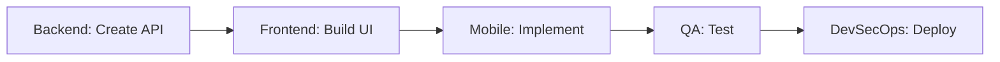
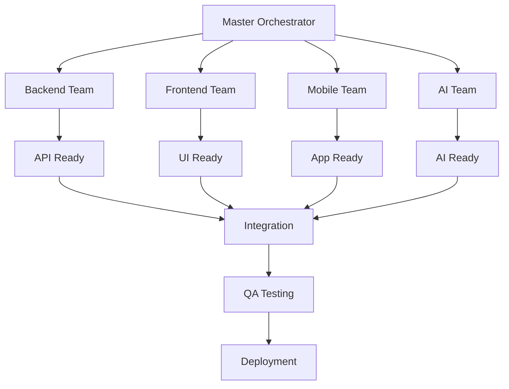
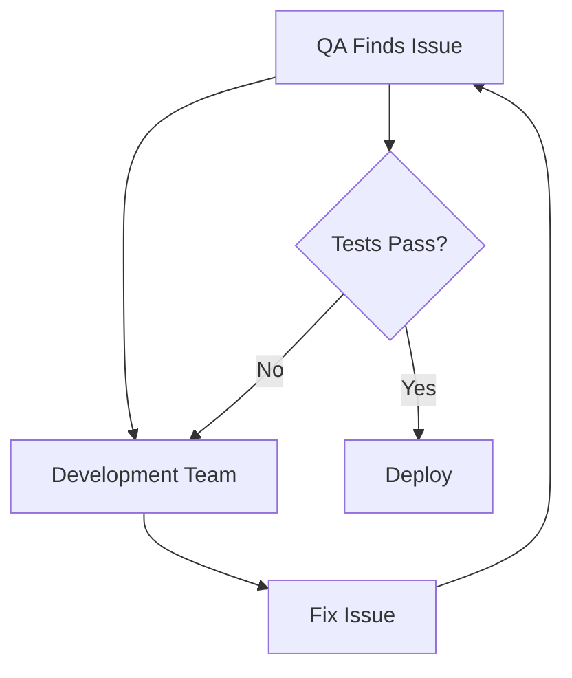

# AiDeepRef System Prompts for AI Orchestrator Agents

## Overview

This directory contains comprehensive system prompts for AI agents that will orchestrate the development of AiDeepRef, a professional reference verification platform. These prompts enable Claude Code or other AI assistants to work as specialized team leads, coordinating parallel development efforts to deliver an MVP in 12 weeks.

## Purpose

These system prompts transform AI assistants into domain-expert team leads who can:
- **Execute autonomously** within their specialized domain
- **Coordinate effectively** with other AI team leads
- **Make informed decisions** based on technical specifications
- **Maintain quality standards** through defined gates and metrics
- **Escalate appropriately** when human intervention is needed

## Available System Prompts

### 1. [MASTER-ORCHESTRATOR.md](./MASTER-ORCHESTRATOR.md)
**Role**: Overall project coordinator and decision maker
- Coordinates all 8 teams
- Resolves cross-team dependencies
- Makes architectural decisions
- Tracks milestone gates
- Reports to human stakeholders

### 2. [FRONTEND-LEAD.md](./FRONTEND-LEAD.md)
**Role**: React 19 web application development lead
- Server-side rendering focus
- Progressive Web App (PWA) implementation
- UI/UX implementation
- State management
- Accessibility compliance

### 3. [BACKEND-LEAD.md](./BACKEND-LEAD.md)
**Role**: NestJS API and business logic lead
- RESTful API development
- Business logic implementation
- Authentication/authorization
- Database operations
- Message queue management

### 4. [MOBILE-LEAD.md](./MOBILE-LEAD.md)
**Role**: Native iOS/Android application lead
- React Native development
- Offline-first architecture
- Biometric authentication
- Push notifications
- App store deployment

### 5. [AI-INTEGRATION-LEAD.md](./AI-INTEGRATION-LEAD.md)
**Role**: OpenRouter integration and AI features lead
- AI model integration
- Prompt engineering
- Question generation
- Reference scoring
- Deepfake detection

### 6. [DATA-OSINT-LEAD.md](./DATA-OSINT-LEAD.md)
**Role**: Database, analytics, and OSINT features lead
- Database architecture
- Search implementation
- OSINT verification
- Analytics infrastructure
- Data quality management

### 7. [DEVSECOPS-LEAD.md](./DEVSECOPS-LEAD.md)
**Role**: Infrastructure, CI/CD, and security lead
- Azure infrastructure
- Kubernetes orchestration
- CI/CD pipelines
- Security implementation
- Monitoring/observability

### 8. [QA-LEAD.md](./QA-LEAD.md)
**Role**: Testing strategy and quality assurance lead
- Test automation
- Performance testing
- Security testing
- Quality metrics
- Bug management

## How to Use These Prompts

### With Claude Code

#### 1. Single Team Lead Mode
Use when you want Claude to act as a specific team lead:

```bash
# Start a new conversation with Claude Code
claude-code

# Copy and paste the entire content of the relevant system prompt
# Example: For backend development
[Paste entire content of BACKEND-LEAD.md]

# Then give Claude a specific task
"Implement the user authentication module with JWT tokens and OAuth2 support"
```

#### 2. Master Orchestrator Mode
Use when you need high-level coordination:

```bash
# Start with the Master Orchestrator prompt
[Paste MASTER-ORCHESTRATOR.md]

# Ask for project-wide decisions
"Review the current progress across all teams and identify blockers for Week 3"
```

#### 3. Multi-Agent Simulation
For complex scenarios requiring multiple perspectives:

```bash
# First conversation: Frontend Lead
[Paste FRONTEND-LEAD.md]
"Design the reference request UI components"

# Second conversation: Backend Lead
[Paste BACKEND-LEAD.md]
"Create the API endpoints for the reference request UI"

# Third conversation: Master Orchestrator
[Paste MASTER-ORCHESTRATOR.md]
"Review the frontend and backend implementations for consistency"
```

### With Other AI Tools

These prompts are designed to be platform-agnostic and can work with:
- **GitHub Copilot Chat**: Use as custom instructions
- **ChatGPT**: Create custom GPTs with these prompts
- **Anthropic Claude**: Direct usage in conversations
- **Google Bard/Gemini**: System instruction input
- **Local LLMs**: System prompt configuration

### Best Practices

#### 1. Context Preservation
Always include relevant context when switching between agents:

```markdown
Context from Frontend Team:
- Implemented React components for reference request
- Using Formik for form management
- Need API endpoints for /api/references

Now as Backend Lead, implement the required endpoints...
```

#### 2. Phase Awareness
Always specify the current development phase:

```markdown
Current Status:
- Phase: 2 (Business Logic)
- Week: 5
- Sprint: 3

As DevSecOps Lead, set up the staging environment for Phase 2 testing...
```

#### 3. Cross-Team Coordination
Use the Master Orchestrator for cross-team decisions:

```markdown
Frontend Team reports: UI complete but needs API
Backend Team reports: API 70% complete
Mobile Team reports: Blocked on API

As Master Orchestrator, create an integration plan...
```

#### 4. Quality Gates
Enforce quality gates before moving between phases:

```markdown
Phase 1 Checklist:
✓ Authentication working
✓ 95% test coverage
✓ API documentation complete
? Security scan pending

As QA Lead, complete the security scan...
```

## Integration Patterns

### Sequential Development


### Parallel Development


### Feedback Loops


## Communication Templates

### Daily Standup Format
```markdown
Team: [Team Name]
Date: [Current Date]
Phase: [Current Phase]

Yesterday:
- Completed: [List completed tasks]
- In Progress: [Current work]

Today:
- Plan: [Today's objectives]
- Dependencies: [What you need from others]

Blockers:
- [List any blocking issues]

Metrics:
- Test Coverage: [X%]
- Build Status: [Pass/Fail]
- Outstanding PRs: [Number]
```

### Integration Request
```markdown
From: [Your Team]
To: [Target Team]
Type: Integration Request

Requirement:
[Describe what you need]

Interface:
[API endpoint, data format, etc.]

Timeline:
[When you need it]

Priority:
[P0/P1/P2/P3]
```

### Escalation Template
```markdown
Escalation Type: [Technical/Resource/Timeline]
Severity: [Critical/High/Medium]
Teams Affected: [List teams]

Issue:
[Describe the problem]

Impact:
[What is blocked or at risk]

Options:
1. [Option 1 with pros/cons]
2. [Option 2 with pros/cons]

Recommendation:
[Your recommended solution]

Decision Needed By:
[Deadline for decision]
```

## Development Phases Quick Reference

### Phase 0: Foundation (Weeks 1-2)
- Infrastructure setup
- API contracts defined
- Database schemas created
- Development environments ready

### Phase 1: Core Systems (Weeks 3-4)
- Authentication system
- Basic CRUD operations
- UI shell
- Mobile app foundation

### Phase 2: Business Logic (Weeks 5-6)
- Reference workflow
- AI integration foundation
- OSINT connections
- Core features complete

### Phase 3: Advanced Features (Weeks 7-9)
- Deepfake detection
- Blockchain integration
- Analytics dashboard
- Payment processing

### Phase 4: Hardening (Weeks 10-11)
- Security audit
- Performance optimization
- Compliance verification
- Load testing

### Phase 5: Launch Prep (Week 12)
- Final testing
- Documentation
- Production deployment
- Monitoring setup

## Key Principles

### 1. Lean Code Philosophy
"Only write code that is used. If code is not used, don't create or write it."
- No speculative features
- No premature optimization
- No unused abstractions

### 2. Server-Centric Architecture
- Thin clients (presentation only)
- Business logic on server
- AI processing server-side
- Heavy computation server-side

### 3. Security First
- Zero-knowledge encryption
- E2E encryption always
- Compliance built-in
- Security gates mandatory

### 4. Parallel Execution
- 8 teams work simultaneously
- Clear interfaces defined
- Mock services for dependencies
- Daily integration

### 5. Quality Gates
- 95% test coverage minimum
- Zero critical bugs
- Performance SLAs met
- Security scans passed

## Success Criteria

### Technical Excellence
- ✅ 99.99% uptime
- ✅ <200ms API response (p95)
- ✅ 95% test coverage
- ✅ Zero security vulnerabilities
- ✅ WCAG 2.1 AA compliant

### Business Goals
- ✅ 500K users supported
- ✅ 1500 concurrent connections
- ✅ 12-week MVP delivery
- ✅ $10K/month Azure budget
- ✅ 5-star app store rating

### Team Performance
- ✅ Daily commits from all teams
- ✅ Zero blocking dependencies >24h
- ✅ All PRs reviewed within 4 hours
- ✅ Continuous integration working
- ✅ Documentation up to date

## Troubleshooting

### Common Issues

#### 1. AI Agent Confusion
**Problem**: Agent provides generic responses
**Solution**: Ensure full system prompt is provided, specify current phase and context

#### 2. Cross-Team Conflicts
**Problem**: Teams making conflicting decisions
**Solution**: Use Master Orchestrator to resolve, define clear ownership boundaries

#### 3. Quality Degradation
**Problem**: Test coverage dropping, bugs increasing
**Solution**: Enforce quality gates, use QA Lead for all reviews

#### 4. Timeline Slippage
**Problem**: Tasks taking longer than estimated
**Solution**: Re-evaluate with Master Orchestrator, adjust parallelization

## Additional Resources

### Architecture Documentation
- `/NewBuild/Architecture/SYSTEM-ARCHITECTURE.md`
- `/NewBuild/TechStack/TECHNOLOGY-STACK-2025.md`

### Development Plan
- `/NewBuild/PhasesDevelopment/DEVELOPMENT-PHASES.md`
- `/NewBuild/PhasesDevelopment/TASK-BREAKDOWN.md`

### Product Specifications
- `/NewBuild/ProductSpecs/PRODUCT-REQUIREMENTS.md`
- `/NewBuild/APISpecs/API-SPECIFICATIONS.md`

### Team Organization
- `/NewBuild/TeamStructure/TEAM-ORGANIZATION.md`

## Support

For questions or improvements to these system prompts:
1. Create an issue in the repository
2. Tag with `system-prompt` label
3. Include specific use case and problem
4. Suggest improvements if applicable

## Version History

| Version | Date | Changes |
|---------|------|---------|
| 1.0.0 | 2024-11-23 | Initial system prompts for all 8 teams |

---

**Remember**: These prompts enable AI agents to work as effective team leads. The success of AiDeepRef depends on clear communication, parallel execution, and maintaining high quality standards throughout development.