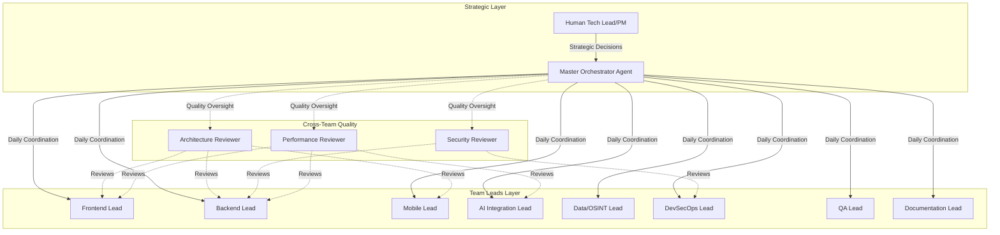
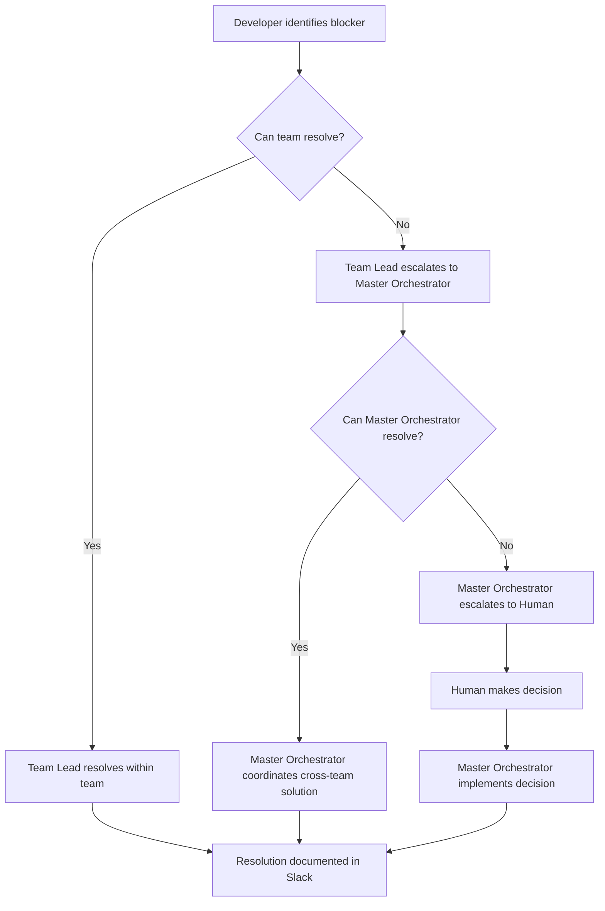
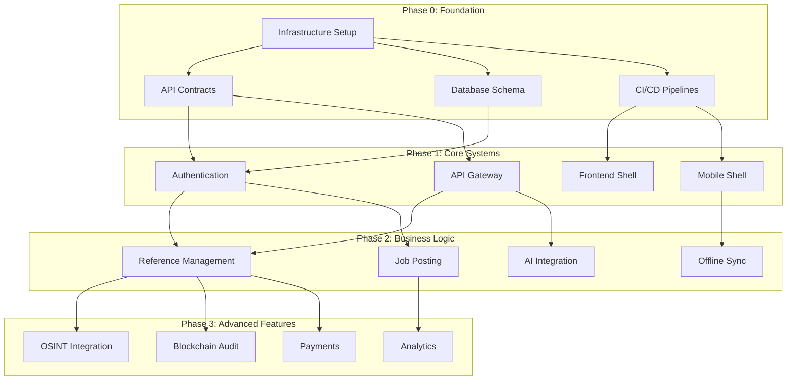
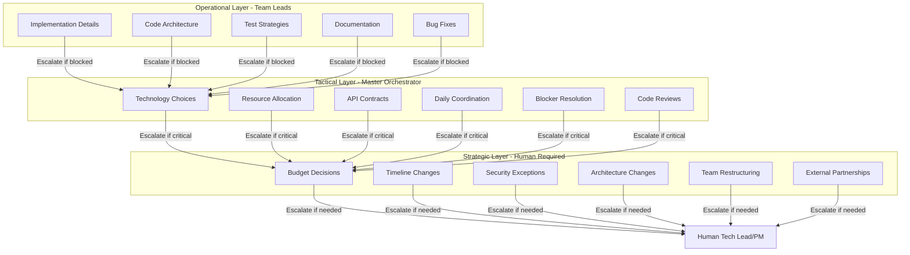
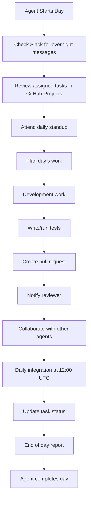
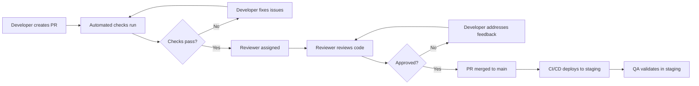
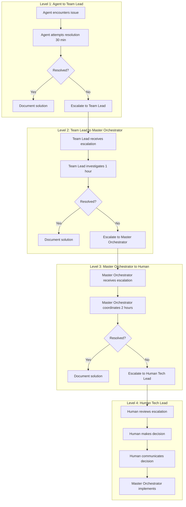

# AiDeepRef AI Agent Team Organization
## Comprehensive Team Structure for Parallel AI-Driven Development

**Version**: 1.0.0
**Date**: November 23, 2024
**Project**: AiDeepRef Professional Reference Verification Platform
**Execution Model**: 8 AI Agent Teams + Master Orchestrator
**Target**: 500K Users, 1000-1500 Concurrent Connections
**Timeline**: 12 Weeks to MVP

---

## Table of Contents

1. [Executive Summary](#executive-summary)
2. [Organizational Chart](#organizational-chart)
3. [Team Breakdown](#team-breakdown)
4. [Agent Roles & Specializations](#agent-roles--specializations)
5. [Communication Matrix](#communication-matrix)
6. [Parallel Work Optimization](#parallel-work-optimization)
7. [Human Oversight](#human-oversight)
8. [Daily Operations](#daily-operations)
9. [Escalation Protocols](#escalation-protocols)
10. [Success Metrics](#success-metrics)

---

## Executive Summary

This document defines the complete organizational structure for AI agents building AiDeepRef, a professional reference verification platform. The structure emphasizes **maximum parallelization**, **clear accountability**, and **continuous integration** across 8 specialized teams.

### Key Principles

1. **Autonomous Teams**: Each team operates independently with clear interfaces
2. **Parallel Execution**: 8 teams work simultaneously on separate workstreams
3. **Daily Integration**: Continuous merge and integration to prevent drift
4. **Human-in-the-Loop**: Strategic decision points require human approval
5. **Cross-Team Reviewers**: Quality gates prevent siloed development

### Team Count Summary

| Team | Lead Agents | Developer Agents | Reviewer Agents | Total |
|------|-------------|------------------|-----------------|-------|
| Frontend Team | 1 | 3 | 1 | 5 |
| Backend Team | 1 | 4 | 1 | 6 |
| Mobile Team | 1 | 3 | 1 | 5 |
| AI Integration Team | 1 | 2 | 1 | 4 |
| Data & OSINT Team | 1 | 2 | 1 | 4 |
| DevSecOps Team | 1 | 2 | 1 | 4 |
| QA Team | 1 | 2 | 1 | 4 |
| Documentation Team | 1 | 1 | 0 | 2 |
| **Master Orchestrator** | **1** | **-** | **-** | **1** |
| **TOTAL** | **9** | **19** | **7** | **35** |

---

## Organizational Chart

### Overall Hierarchy



### Detailed Team Structure

```mermaid
graph TB
    subgraph "Frontend Team - 5 Agents"
        FE_LEAD[Frontend Lead Agent]
        FE_UI[UI Components Agent]
        FE_STATE[State Management Agent]
        FE_SSR[Server Components Agent]
        FE_REV[Frontend Reviewer Agent]

        FE_LEAD --> FE_UI
        FE_LEAD --> FE_STATE
        FE_LEAD --> FE_SSR
        FE_UI -.->|Code Review| FE_REV
        FE_STATE -.->|Code Review| FE_REV
        FE_SSR -.->|Code Review| FE_REV
    end

    subgraph "Backend Team - 6 Agents"
        BE_LEAD[Backend Lead Agent]
        BE_API[API Development Agent]
        BE_DB[Database Agent]
        BE_AUTH[Authentication Agent]
        BE_BUSINESS[Business Logic Agent]
        BE_REV[Backend Reviewer Agent]

        BE_LEAD --> BE_API
        BE_LEAD --> BE_DB
        BE_LEAD --> BE_AUTH
        BE_LEAD --> BE_BUSINESS
        BE_API -.->|Code Review| BE_REV
        BE_DB -.->|Code Review| BE_REV
        BE_AUTH -.->|Code Review| BE_REV
        BE_BUSINESS -.->|Code Review| BE_REV
    end

    subgraph "Mobile Team - 5 Agents"
        MOB_LEAD[Mobile Lead Agent]
        MOB_IOS[iOS Development Agent]
        MOB_ANDROID[Android Development Agent]
        MOB_SYNC[Offline Sync Agent]
        MOB_REV[Mobile Reviewer Agent]

        MOB_LEAD --> MOB_IOS
        MOB_LEAD --> MOB_ANDROID
        MOB_LEAD --> MOB_SYNC
        MOB_IOS -.->|Code Review| MOB_REV
        MOB_ANDROID -.->|Code Review| MOB_REV
        MOB_SYNC -.->|Code Review| MOB_REV
    end

    subgraph "AI Integration Team - 4 Agents"
        AI_LEAD[AI Integration Lead]
        AI_PROMPT[Prompt Engineering Agent]
        AI_PIPELINE[AI Pipeline Agent]
        AI_REV[AI Reviewer Agent]

        AI_LEAD --> AI_PROMPT
        AI_LEAD --> AI_PIPELINE
        AI_PROMPT -.->|Code Review| AI_REV
        AI_PIPELINE -.->|Code Review| AI_REV
    end

    subgraph "Data & OSINT Team - 4 Agents"
        DATA_LEAD[Data/OSINT Lead]
        DATA_SCHEMA[Data Schema Agent]
        DATA_OSINT[OSINT Integration Agent]
        DATA_REV[Data Reviewer Agent]

        DATA_LEAD --> DATA_SCHEMA
        DATA_LEAD --> DATA_OSINT
        DATA_SCHEMA -.->|Code Review| DATA_REV
        DATA_OSINT -.->|Code Review| DATA_REV
    end

    subgraph "DevSecOps Team - 4 Agents"
        DEVOPS_LEAD[DevSecOps Lead]
        DEVOPS_INFRA[Infrastructure Agent]
        DEVOPS_CICD[CI/CD Agent]
        DEVOPS_REV[DevSecOps Reviewer]

        DEVOPS_LEAD --> DEVOPS_INFRA
        DEVOPS_LEAD --> DEVOPS_CICD
        DEVOPS_INFRA -.->|Review| DEVOPS_REV
        DEVOPS_CICD -.->|Review| DEVOPS_REV
    end

    subgraph "QA Team - 4 Agents"
        QA_LEAD[QA Lead Agent]
        QA_AUTO[Test Automation Agent]
        QA_E2E[E2E Testing Agent]
        QA_REV[QA Reviewer Agent]

        QA_LEAD --> QA_AUTO
        QA_LEAD --> QA_E2E
        QA_AUTO -.->|Review| QA_REV
        QA_E2E -.->|Review| QA_REV
    end

    subgraph "Documentation Team - 2 Agents"
        DOC_LEAD[Documentation Lead]
        DOC_TECH[Technical Writer Agent]

        DOC_LEAD --> DOC_TECH
    end
```



---

## Team Breakdown

### 1. Frontend Team (5 Agents)

**Mission**: Build responsive, performant web application using React 19 with Server Components

#### Agent Roster

##### 1.1 Frontend Lead Agent
- **Responsibility**: Team coordination, architecture decisions, code review oversight
- **Skills**: React 19, TypeScript, System Design, Performance Optimization
- **Modules Owned**: Overall frontend architecture, routing strategy, build configuration
- **Phases**: All phases (0-5)
- **Daily Tasks**:
  - Coordinate with Backend Lead on API contracts
  - Review PRs from frontend agents
  - Make architectural decisions for frontend
  - Ensure adherence to design system
  - Report status to Master Orchestrator

##### 1.2 UI Components Agent
- **Responsibility**: Implement reusable React components, design system integration
- **Skills**: React 19, Tailwind CSS, Accessibility, Component Libraries
- **Modules Owned**:
  - `/apps/web/src/components/` - Shared components
  - `/apps/web/src/design-system/` - Design tokens
  - `/apps/web/src/layouts/` - Layout components
- **Phases**: Phase 1-3
- **Daily Tasks**:
  - Build atomic components (buttons, forms, cards)
  - Implement accessibility features (ARIA, keyboard navigation)
  - Create Storybook documentation
  - Ensure responsive design across breakpoints
  - Write unit tests for all components

##### 1.3 State Management Agent
- **Responsibility**: Application state, data fetching, caching strategy
- **Skills**: Redux Toolkit, RTK Query, React Context, Performance Optimization
- **Modules Owned**:
  - `/apps/web/src/store/` - Redux store configuration
  - `/apps/web/src/api/` - RTK Query API definitions
  - `/apps/web/src/hooks/` - Custom React hooks
- **Phases**: Phase 1-4
- **Daily Tasks**:
  - Define Redux slices for application state
  - Configure RTK Query endpoints
  - Implement caching strategies
  - Optimize re-renders with memoization
  - Handle offline queue management

##### 1.4 Server Components Agent
- **Responsibility**: React 19 Server Components, SSR/SSG optimization
- **Skills**: React Server Components, Next.js/Vite SSR, Performance Metrics
- **Modules Owned**:
  - `/apps/web/src/app/` - App router pages
  - `/apps/web/src/server/` - Server-side logic
  - `/apps/web/server.js` - SSR entry point
- **Phases**: Phase 2-4
- **Daily Tasks**:
  - Implement Server Components for data-heavy pages
  - Optimize bundle splitting and code splitting
  - Configure streaming SSR
  - Measure and improve Core Web Vitals
  - Implement progressive enhancement

##### 1.5 Frontend Reviewer Agent
- **Responsibility**: Code quality, best practices enforcement, performance validation
- **Skills**: Code Review, Performance Profiling, Security Auditing
- **Review Focus**:
  - Component architecture and reusability
  - Performance bottlenecks (unnecessary re-renders)
  - Accessibility compliance (WCAG 2.1 AA)
  - Security issues (XSS, CSRF)
  - Test coverage (target: 85%+)
- **Daily Tasks**:
  - Review all PRs from frontend agents
  - Run performance profiling on new features
  - Validate bundle size increases
  - Check Lighthouse scores (target: 90+)
  - Provide actionable feedback within 2 hours

---

### 2. Backend Team (6 Agents)

**Mission**: Build scalable, secure .NET 9 API with clean architecture

#### Agent Roster

##### 2.1 Backend Lead Agent
- **Responsibility**: Backend architecture, API design, team coordination
- **Skills**: .NET 9, System Design, Microservices, Database Architecture
- **Modules Owned**: Overall backend architecture, API contracts, service boundaries
- **Phases**: All phases (0-5)
- **Daily Tasks**:
  - Define and maintain OpenAPI specifications
  - Coordinate with Frontend/Mobile teams on API contracts
  - Review architectural decisions
  - Ensure SOLID principles adherence
  - Manage database schema evolution

##### 2.2 API Development Agent
- **Responsibility**: RESTful API endpoints, GraphQL resolvers, API Gateway
- **Skills**: .NET 9 Minimal APIs, ASP.NET Core, GraphQL, OpenAPI
- **Modules Owned**:
  - `/apps/api/src/Controllers/` - API endpoints
  - `/apps/api/src/GraphQL/` - GraphQL schema and resolvers
  - `/apps/api/src/Middleware/` - Request pipeline middleware
- **Phases**: Phase 1-4
- **Daily Tasks**:
  - Implement API endpoints per OpenAPI spec
  - Add request validation and error handling
  - Implement rate limiting and throttling
  - Create API documentation
  - Write integration tests for all endpoints

##### 2.3 Database Agent
- **Responsibility**: Database schema, migrations, query optimization
- **Skills**: PostgreSQL, Cosmos DB, Entity Framework Core, Performance Tuning
- **Modules Owned**:
  - `/apps/api/src/Data/` - DbContext and configurations
  - `/database/migrations/` - Database migrations
  - `/apps/api/src/Repositories/` - Data access layer
- **Phases**: Phase 0-4
- **Daily Tasks**:
  - Design and implement database schemas
  - Create and test migrations
  - Optimize queries and indexes
  - Implement repository pattern
  - Configure connection pooling and caching

##### 2.4 Authentication Agent
- **Responsibility**: Authentication, authorization, session management, MFA
- **Skills**: OAuth 2.0, JWT, Azure AD B2C, RBAC, TOTP
- **Modules Owned**:
  - `/apps/api/src/Auth/` - Authentication services
  - `/apps/api/src/Security/` - Security middleware
  - `/apps/api/src/Identity/` - User identity management
- **Phases**: Phase 1-2
- **Daily Tasks**:
  - Implement JWT authentication flow
  - Configure OAuth providers (Google, LinkedIn, Microsoft)
  - Implement RBAC and ABAC policies
  - Add MFA support (TOTP, SMS)
  - Secure session management

##### 2.5 Business Logic Agent
- **Responsibility**: Core business workflows, reference management, job matching
- **Skills**: Domain-Driven Design, CQRS, Event Sourcing, Business Rules
- **Modules Owned**:
  - `/apps/api/src/Services/` - Business services
  - `/apps/api/src/Domain/` - Domain models and rules
  - `/apps/api/src/Workflows/` - Workflow orchestration
- **Phases**: Phase 2-4
- **Daily Tasks**:
  - Implement business logic for references
  - Create job matching algorithms
  - Manage reference workflows (states, transitions)
  - Implement notification triggers
  - Write comprehensive unit tests

##### 2.6 Backend Reviewer Agent
- **Responsibility**: Code quality, security auditing, performance validation
- **Skills**: Code Review, Security Analysis, Performance Profiling
- **Review Focus**:
  - Clean architecture principles
  - SOLID principles adherence
  - Security vulnerabilities (OWASP Top 10)
  - Performance and scalability issues
  - Test coverage (target: 90%+)
- **Daily Tasks**:
  - Review all PRs from backend agents
  - Run static analysis tools (SonarQube, Snyk)
  - Validate API response times (<200ms p95)
  - Check for SQL injection, authentication flaws
  - Ensure proper error handling and logging

---

### 3. Mobile Team (5 Agents)

**Mission**: Build native-quality mobile apps with React Native 0.76+ and offline-first architecture

#### Agent Roster

##### 3.1 Mobile Lead Agent
- **Responsibility**: Mobile architecture, platform coordination, release management
- **Skills**: React Native, iOS/Android ecosystems, Mobile UX, Performance
- **Modules Owned**: Mobile app architecture, navigation, shared components
- **Phases**: All phases (0-5)
- **Daily Tasks**:
  - Coordinate iOS and Android development
  - Ensure platform-specific guidelines compliance
  - Review mobile PRs for architecture
  - Manage app store submission process
  - Sync with Backend team on API contracts

##### 3.2 iOS Development Agent
- **Responsibility**: iOS-specific features, native modules, App Store optimization
- **Skills**: Swift, SwiftUI, React Native, iOS SDK, Xcode
- **Modules Owned**:
  - `/apps/mobile/ios/` - iOS native code
  - `/apps/mobile/src/ios/` - iOS-specific React Native code
  - iOS configuration and build settings
- **Phases**: Phase 1-4
- **Daily Tasks**:
  - Implement iOS-specific UI components
  - Integrate native iOS features (FaceID, push notifications)
  - Optimize for iOS performance
  - Handle iOS-specific permissions
  - Test on iOS simulators and devices

##### 3.3 Android Development Agent
- **Responsibility**: Android-specific features, native modules, Play Store optimization
- **Skills**: Kotlin, Jetpack Compose, React Native, Android SDK, Android Studio
- **Modules Owned**:
  - `/apps/mobile/android/` - Android native code
  - `/apps/mobile/src/android/` - Android-specific React Native code
  - Android configuration and build settings
- **Phases**: Phase 1-4
- **Daily Tasks**:
  - Implement Android-specific UI components
  - Integrate native Android features (Biometric, notifications)
  - Optimize for Android performance
  - Handle Android-specific permissions
  - Test on Android emulators and devices

##### 3.4 Offline Sync Agent
- **Responsibility**: Offline-first architecture, data synchronization, conflict resolution
- **Skills**: SQLite, CRDT, Conflict Resolution, Background Sync
- **Modules Owned**:
  - `/apps/mobile/src/sync/` - Sync engine
  - `/apps/mobile/src/storage/` - Local storage
  - `/apps/mobile/src/offline/` - Offline queue
- **Phases**: Phase 2-4
- **Daily Tasks**:
  - Implement local SQLite database
  - Build sync engine with conflict resolution
  - Create offline queue for actions
  - Handle background sync with WorkManager/BackgroundTasks
  - Test offline scenarios extensively

##### 3.5 Mobile Reviewer Agent
- **Responsibility**: Code quality, platform guidelines, performance validation
- **Skills**: Code Review, Mobile Performance, Security, App Store Guidelines
- **Review Focus**:
  - Platform-specific guidelines (Apple HIG, Material Design)
  - Performance optimization (startup time, frame drops)
  - Battery and memory efficiency
  - Security (biometric, keychain/keystore)
  - Test coverage (target: 80%+)
- **Daily Tasks**:
  - Review all mobile PRs
  - Validate iOS and Android builds
  - Check performance metrics (startup < 3s, 60fps)
  - Ensure offline-first functionality works
  - Test on real devices (iOS 15+, Android 10+)

---

### 4. AI Integration Team (4 Agents)

**Mission**: Integrate AI capabilities via Azure OpenAI and OpenRouter for intelligent features

#### Agent Roster

##### 4.1 AI Integration Lead Agent
- **Responsibility**: AI strategy, prompt management, model selection, integration architecture
- **Skills**: Azure OpenAI, OpenRouter, Prompt Engineering, LangChain
- **Modules Owned**: AI service architecture, prompt versioning, model routing
- **Phases**: Phase 2-4
- **Daily Tasks**:
  - Define AI use cases and requirements
  - Select appropriate models for each task
  - Coordinate with Backend team on AI service integration
  - Manage prompt library and versioning
  - Monitor AI service performance and costs

##### 4.2 Prompt Engineering Agent
- **Responsibility**: Design, test, and optimize prompts for AI models
- **Skills**: Prompt Engineering, Few-Shot Learning, Chain-of-Thought, RAG
- **Modules Owned**:
  - `/services/ai/prompts/` - Prompt templates
  - `/services/ai/examples/` - Few-shot examples
  - `/services/ai/evaluations/` - Prompt evaluations
- **Phases**: Phase 2-4
- **Daily Tasks**:
  - Create prompts for reference analysis
  - Design prompts for job matching
  - Implement chain-of-thought reasoning
  - Test prompts against evaluation datasets
  - Optimize prompts for cost and quality

##### 4.3 AI Pipeline Agent
- **Responsibility**: AI service implementation, API integration, response processing
- **Skills**: Python/FastAPI, Azure OpenAI SDK, Error Handling, Streaming
- **Modules Owned**:
  - `/services/ai/src/` - AI service code
  - `/services/ai/routers/` - API endpoints
  - `/services/ai/processors/` - Response processors
- **Phases**: Phase 2-4
- **Daily Tasks**:
  - Implement AI service endpoints
  - Integrate with Azure OpenAI and OpenRouter
  - Handle streaming responses
  - Implement retry logic and fallbacks
  - Add response validation and sanitization

##### 4.4 AI Reviewer Agent
- **Responsibility**: Validate AI outputs, quality assurance, bias detection
- **Skills**: AI Testing, Bias Detection, Quality Metrics, Security
- **Review Focus**:
  - Prompt injection vulnerabilities
  - Bias in AI outputs
  - Response quality and consistency
  - Cost optimization
  - Compliance with content policies
- **Daily Tasks**:
  - Review prompt templates for security
  - Test AI outputs for quality and bias
  - Validate cost per request
  - Check for PII leakage in prompts
  - Monitor AI service uptime and errors

---

### 5. Data & OSINT Team (4 Agents)

**Mission**: Design data architecture and implement external data verification systems

#### Agent Roster

##### 5.1 Data/OSINT Lead Agent
- **Responsibility**: Data strategy, OSINT architecture, external API integration
- **Skills**: Data Modeling, API Integration, Web Scraping, Data Privacy
- **Modules Owned**: Data architecture, OSINT service design, API contracts
- **Phases**: All phases
- **Daily Tasks**:
  - Define data models and relationships
  - Plan OSINT integration strategy
  - Coordinate with Backend team on data access
  - Ensure GDPR compliance for data collection
  - Monitor data quality and freshness

##### 5.2 Data Schema Agent
- **Responsibility**: Database schema design, data migrations, query optimization
- **Skills**: PostgreSQL, Cosmos DB, Data Modeling, Performance Tuning
- **Modules Owned**:
  - `/database/schema/` - Schema definitions
  - `/database/migrations/` - Migration scripts
  - `/apps/api/src/Models/` - Data models
- **Phases**: Phase 0-4
- **Daily Tasks**:
  - Design normalized database schemas
  - Create and test migrations
  - Optimize indexes and query performance
  - Implement data validation rules
  - Document schema with ERD diagrams

##### 5.3 OSINT Integration Agent
- **Responsibility**: External data sources, verification APIs, web scraping
- **Skills**: Python, Web Scraping, API Integration, Data Enrichment
- **Modules Owned**:
  - `/services/osint/` - OSINT service code
  - `/services/osint/scrapers/` - Web scrapers
  - `/services/osint/integrations/` - Third-party integrations
- **Phases**: Phase 2-4
- **Daily Tasks**:
  - Integrate LinkedIn, GitHub APIs
  - Build web scrapers for company data
  - Implement email verification service
  - Create data enrichment pipelines
  - Handle rate limiting and caching

##### 5.4 Data Reviewer Agent
- **Responsibility**: Data quality, privacy compliance, performance validation
- **Skills**: Data Quality, GDPR, Performance Analysis, Security
- **Review Focus**:
  - Schema normalization and efficiency
  - GDPR compliance (data minimization, consent)
  - Query performance (< 100ms for indexed queries)
  - Data integrity and validation
  - Privacy and security (PII handling)
- **Daily Tasks**:
  - Review schema changes for normalization
  - Validate GDPR compliance
  - Check query execution plans
  - Ensure proper data encryption
  - Monitor data quality metrics

---

### 6. DevSecOps Team (4 Agents)

**Mission**: Infrastructure, CI/CD, security, monitoring, and deployment automation

#### Agent Roster

##### 6.1 DevSecOps Lead Agent
- **Responsibility**: Infrastructure strategy, security oversight, deployment planning
- **Skills**: Azure, Terraform, Kubernetes, Security, Monitoring
- **Modules Owned**: Infrastructure architecture, CI/CD pipelines, security policies
- **Phases**: All phases
- **Daily Tasks**:
  - Plan infrastructure provisioning
  - Define security policies and standards
  - Coordinate deployments
  - Monitor system health and costs
  - Ensure compliance and auditing

##### 6.2 Infrastructure Agent
- **Responsibility**: Azure infrastructure, IaC, Kubernetes, scaling strategies
- **Skills**: Terraform, Azure CLI, AKS, Networking, Storage
- **Modules Owned**:
  - `/infrastructure/terraform/` - Infrastructure as Code
  - `/infrastructure/k8s/` - Kubernetes manifests
  - `/infrastructure/helm/` - Helm charts
- **Phases**: Phase 0-5
- **Daily Tasks**:
  - Provision Azure resources with Terraform
  - Configure AKS clusters and node pools
  - Setup networking (VNETs, NSGs, Load Balancers)
  - Configure auto-scaling policies
  - Manage Azure Key Vault and secrets

##### 6.3 CI/CD Agent
- **Responsibility**: Build pipelines, deployment automation, release management
- **Skills**: Azure DevOps, GitHub Actions, Docker, ArgoCD
- **Modules Owned**:
  - `/.github/workflows/` - GitHub Actions
  - `/azure-pipelines.yml` - Azure Pipelines
  - `/deployment/` - Deployment scripts
- **Phases**: Phase 0-5
- **Daily Tasks**:
  - Create CI/CD pipelines for all services
  - Implement automated testing in pipelines
  - Configure blue-green deployments
  - Manage Docker image builds and registry
  - Automate database migrations

##### 6.4 DevSecOps Reviewer Agent
- **Responsibility**: Security auditing, compliance validation, performance monitoring
- **Skills**: Security Scanning, Compliance, Monitoring, Incident Response
- **Review Focus**:
  - Infrastructure security (least privilege, network isolation)
  - CI/CD security (secrets management, supply chain)
  - Compliance (SOC2, GDPR, Azure Security Benchmark)
  - Performance (resource utilization, costs)
  - Monitoring coverage (logs, metrics, alerts)
- **Daily Tasks**:
  - Run security scans (Snyk, Trivy, OWASP ZAP)
  - Review infrastructure changes
  - Validate compliance requirements
  - Monitor security alerts
  - Conduct cost optimization reviews

---

### 7. QA Team (4 Agents)

**Mission**: Comprehensive testing strategy, test automation, quality assurance

#### Agent Roster

##### 7.1 QA Lead Agent
- **Responsibility**: Testing strategy, quality standards, test coordination
- **Skills**: Test Planning, Quality Metrics, Test Management, Automation
- **Modules Owned**: Test strategy, quality gates, test documentation
- **Phases**: All phases
- **Daily Tasks**:
  - Define test plans for features
  - Set quality standards and metrics
  - Coordinate testing across teams
  - Track defects and quality trends
  - Report quality status to Master Orchestrator

##### 7.2 Test Automation Agent
- **Responsibility**: Unit tests, integration tests, API testing automation
- **Skills**: Jest, xUnit, Playwright, Postman, Test Design
- **Modules Owned**:
  - `/apps/*/tests/` - Unit and integration tests
  - `/tests/api/` - API test suites
  - `/tests/integration/` - Integration tests
- **Phases**: Phase 1-5
- **Daily Tasks**:
  - Write unit tests for new code (target: 90% coverage)
  - Create integration tests for APIs
  - Automate API testing with Postman/Newman
  - Implement test data factories
  - Run tests in CI/CD pipelines

##### 7.3 E2E Testing Agent
- **Responsibility**: End-to-end tests, user journey validation, regression testing
- **Skills**: Playwright, Cypress, Appium, Scenario Design
- **Modules Owned**:
  - `/tests/e2e/` - E2E test suites
  - `/tests/visual/` - Visual regression tests
  - `/tests/mobile/` - Mobile E2E tests
- **Phases**: Phase 2-5
- **Daily Tasks**:
  - Create E2E tests for critical user journeys
  - Implement visual regression testing
  - Test mobile apps with Appium
  - Run smoke tests before deployments
  - Maintain test data and environments

##### 7.4 QA Reviewer Agent
- **Responsibility**: Test quality, coverage validation, defect triage
- **Skills**: Test Review, Quality Analysis, Risk Assessment
- **Review Focus**:
  - Test coverage metrics (unit: 90%, integration: 80%, E2E: 60%)
  - Test quality and maintainability
  - Defect severity and priority
  - Regression risk assessment
  - Performance test results
- **Daily Tasks**:
  - Review test code for quality
  - Validate test coverage reports
  - Triage and prioritize defects
  - Analyze test failures and flakiness
  - Report quality metrics to stakeholders

---

### 8. Documentation Team (2 Agents)

**Mission**: Comprehensive documentation for all stakeholders (users, developers, admins)

#### Agent Roster

##### 8.1 Documentation Lead Agent
- **Responsibility**: Documentation strategy, content planning, technical accuracy
- **Skills**: Technical Writing, API Documentation, User Guides, Diagramming
- **Modules Owned**: Documentation architecture, style guide, content strategy
- **Phases**: All phases
- **Daily Tasks**:
  - Plan documentation for new features
  - Review and approve all documentation
  - Ensure consistency across docs
  - Coordinate with all teams for content
  - Manage documentation site

##### 8.2 Technical Writer Agent
- **Responsibility**: Write and maintain all documentation
- **Skills**: Technical Writing, Markdown, OpenAPI, Diagrams (Mermaid)
- **Modules Owned**:
  - `/docs/api/` - API documentation
  - `/docs/user-guides/` - User documentation
  - `/docs/developer/` - Developer guides
  - `/docs/architecture/` - Architecture docs
- **Phases**: All phases
- **Daily Tasks**:
  - Write API documentation from OpenAPI specs
  - Create user guides and tutorials
  - Document architecture decisions (ADRs)
  - Maintain developer setup guides
  - Create diagrams and visual aids

---

### 9. Master Orchestrator (1 Agent)

**Role**: Supreme coordinator, strategic decision maker, integration manager

**Responsibilities**:
1. **Daily Coordination**: Run daily standups with all team leads
2. **Integration Management**: Ensure continuous integration across teams
3. **Blocker Resolution**: Identify and resolve cross-team blockers
4. **Quality Oversight**: Monitor code quality, test coverage, performance
5. **Risk Management**: Identify risks and coordinate mitigation
6. **Reporting**: Daily status reports to human stakeholders
7. **Decision Making**: Make strategic technical decisions
8. **Architecture Governance**: Ensure architectural consistency

**Daily Workflow**:
- **08:00-09:00 UTC**: Review overnight builds and test results
- **09:00-11:00 UTC**: Daily standups with all 8 team leads
- **11:00-12:00 UTC**: Review PRs flagged for architectural review
- **12:00-14:00 UTC**: Cross-team integration coordination
- **14:00-16:00 UTC**: Risk assessment and blocker resolution
- **16:00-17:00 UTC**: Status report to human stakeholders
- **17:00-18:00 UTC**: Plan next day's priorities

**Decision Authority**:
- ✅ Can decide: API contracts, technology choices within approved stack, resource allocation
- ❌ Cannot decide: Budget changes, timeline extensions, security exemptions (requires human approval)

**Escalation to Human**:
- Critical security vulnerabilities
- Architecture changes affecting multiple teams
- Timeline risks (>3 day delay)
- Budget overruns (>10%)
- Conflicts between team leads

---

## Agent Roles & Specializations

### Agent Classification System

All agents are classified by specialization level:

| Level | Title | Scope | Decision Authority |
|-------|-------|-------|-------------------|
| **L1** | Master Orchestrator | Cross-organizational | Strategic decisions within constraints |
| **L2** | Team Lead | Team-wide | Team-level technical decisions |
| **L3** | Developer | Module/Feature | Implementation decisions |
| **L4** | Reviewer | Quality Assurance | Accept/Reject code changes |

### Specialization Matrix

| Team | Agent | Primary Tech | Secondary Tech | Domain Expertise |
|------|-------|-------------|---------------|------------------|
| **Frontend** | Lead | React 19, TypeScript | System Design | Frontend Architecture |
| | UI Components | React 19, Tailwind | Accessibility | Design Systems |
| | State Management | Redux Toolkit | Performance | Application State |
| | Server Components | React Server Components | SSR/SSG | Web Performance |
| | Reviewer | Code Quality | Security | Best Practices |
| **Backend** | Lead | .NET 9, System Design | Azure | Backend Architecture |
| | API Development | ASP.NET Core | GraphQL | API Design |
| | Database | PostgreSQL, Cosmos DB | Performance Tuning | Data Modeling |
| | Authentication | OAuth 2.0, JWT | Azure AD B2C | Identity & Access |
| | Business Logic | DDD, CQRS | Event Sourcing | Business Rules |
| | Reviewer | Security | Code Quality | OWASP Top 10 |
| **Mobile** | Lead | React Native | iOS/Android | Mobile Architecture |
| | iOS Development | Swift, SwiftUI | React Native | iOS Ecosystem |
| | Android Development | Kotlin, Jetpack | React Native | Android Ecosystem |
| | Offline Sync | CRDT, SQLite | Conflict Resolution | Data Sync |
| | Reviewer | Performance | Platform Guidelines | Mobile UX |
| **AI Integration** | Lead | Azure OpenAI | Prompt Engineering | AI Strategy |
| | Prompt Engineering | Prompt Design | Few-Shot Learning | Prompt Optimization |
| | AI Pipeline | Python, FastAPI | LangChain | AI Service Dev |
| | Reviewer | AI Quality | Bias Detection | AI Ethics |
| **Data/OSINT** | Lead | Data Modeling | API Integration | Data Strategy |
| | Data Schema | PostgreSQL | Performance | Database Design |
| | OSINT Integration | Python, Web Scraping | API Integration | Data Enrichment |
| | Reviewer | Data Quality | GDPR | Privacy Compliance |
| **DevSecOps** | Lead | Azure, Terraform | Kubernetes | Infrastructure |
| | Infrastructure | Terraform, AKS | Networking | Cloud Architecture |
| | CI/CD | Azure DevOps | GitHub Actions | Deployment Automation |
| | Reviewer | Security Scanning | Compliance | Security Audit |
| **QA** | Lead | Test Strategy | Quality Metrics | Quality Assurance |
| | Test Automation | Jest, Playwright | API Testing | Test Design |
| | E2E Testing | Playwright, Appium | Visual Testing | User Journeys |
| | Reviewer | Test Quality | Coverage Analysis | Risk Assessment |
| **Documentation** | Lead | Technical Writing | Documentation Strategy | Content Planning |
| | Technical Writer | Markdown, Diagrams | API Docs | Technical Communication |

### File/Module Ownership Map

**Frontend Team**:
- `/apps/web/src/components/` - UI Components Agent
- `/apps/web/src/store/` - State Management Agent
- `/apps/web/src/app/` - Server Components Agent
- `/apps/web/src/design-system/` - UI Components Agent
- `/apps/web/src/api/` - State Management Agent

**Backend Team**:
- `/apps/api/src/Controllers/` - API Development Agent
- `/apps/api/src/Data/` - Database Agent
- `/apps/api/src/Auth/` - Authentication Agent
- `/apps/api/src/Services/` - Business Logic Agent
- `/apps/api/src/Domain/` - Business Logic Agent

**Mobile Team**:
- `/apps/mobile/ios/` - iOS Development Agent
- `/apps/mobile/android/` - Android Development Agent
- `/apps/mobile/src/sync/` - Offline Sync Agent
- `/apps/mobile/src/storage/` - Offline Sync Agent

**AI Integration Team**:
- `/services/ai/prompts/` - Prompt Engineering Agent
- `/services/ai/src/` - AI Pipeline Agent

**Data/OSINT Team**:
- `/database/schema/` - Data Schema Agent
- `/services/osint/` - OSINT Integration Agent

**DevSecOps Team**:
- `/infrastructure/` - Infrastructure Agent
- `/.github/workflows/` - CI/CD Agent
- `/deployment/` - CI/CD Agent

**QA Team**:
- `/tests/unit/` - Test Automation Agent
- `/tests/e2e/` - E2E Testing Agent
- `/tests/integration/` - Test Automation Agent

**Documentation Team**:
- `/docs/` - All documentation agents

---

## Communication Matrix

### Daily Standup Schedule (All Times UTC)

```mermaid
gantt
    title Daily Standup Schedule
    dateFormat HH:mm
    axisFormat %H:%M

    section Master Orchestrator
    Review Overnight     :09:00, 30m

    section Team Standups
    Frontend Standup     :09:30, 15m
    Backend Standup      :09:45, 15m
    Mobile Standup       :10:00, 15m
    AI Integration       :10:15, 15m
    Data/OSINT          :10:30, 15m
    DevSecOps           :10:45, 15m
    QA Team             :11:00, 15m
    Documentation       :11:15, 15m

    section Integration
    Cross-Team Sync     :11:30, 30m
```



### Communication Channels & Protocols

#### Slack Channels

| Channel | Purpose | Participants | Response SLA |
|---------|---------|--------------|--------------|
| **#master-orchestrator** | Strategic decisions, daily summaries | Master Orchestrator, Team Leads, Humans | 1 hour |
| **#team-frontend** | Frontend discussions | Frontend team | 30 min |
| **#team-backend** | Backend discussions | Backend team | 30 min |
| **#team-mobile** | Mobile discussions | Mobile team | 30 min |
| **#team-ai** | AI integration discussions | AI team | 30 min |
| **#team-data** | Data/OSINT discussions | Data team | 30 min |
| **#team-devops** | DevSecOps discussions | DevSecOps team | 30 min |
| **#team-qa** | QA discussions | QA team | 30 min |
| **#team-docs** | Documentation discussions | Documentation team | 1 hour |
| **#integration** | Cross-team integration issues | All team leads | 1 hour |
| **#blockers** | Critical blockers | Master Orchestrator, affected teams | 15 min |
| **#api-contracts** | API contract discussions | Backend, Frontend, Mobile leads | 1 hour |
| **#security-alerts** | Security vulnerabilities | Master Orchestrator, DevSecOps, Backend | Immediate |
| **#deployments** | Deployment notifications | All teams | Read-only |
| **#humans** | Human oversight required | Master Orchestrator, Humans | 2 hours |

#### Collaboration Patterns

##### Frontend ↔ Backend Collaboration
- **Frequency**: Multiple times daily
- **Topics**: API contracts, data models, authentication flows
- **Protocol**:
  1. Backend Lead publishes OpenAPI spec updates to `#api-contracts`
  2. Frontend Lead reviews and provides feedback within 1 hour
  3. Both teams update their mocks and tests
  4. Integration tested in daily CI/CD run

##### Backend ↔ Mobile Collaboration
- **Frequency**: Multiple times daily
- **Topics**: Mobile-optimized endpoints, offline sync, push notifications
- **Protocol**:
  1. Mobile Lead requests mobile-specific API enhancements
  2. Backend team implements GraphQL or optimized REST endpoints
  3. Mobile team tests with mocked data first
  4. Integration validated in staging environment

##### Backend ↔ AI Collaboration
- **Frequency**: Daily during AI integration phases
- **Topics**: AI service endpoints, prompt management, model responses
- **Protocol**:
  1. AI team provides service contract and sample responses
  2. Backend team integrates AI service endpoints
  3. Both teams coordinate on error handling and fallbacks
  4. Integration tested with real AI models in staging

##### All Teams ↔ DevSecOps Collaboration
- **Frequency**: Continuous
- **Topics**: Deployments, infrastructure, security, monitoring
- **Protocol**:
  1. Teams submit deployment requests via PR to deployment repo
  2. DevSecOps reviews and schedules deployment
  3. Teams monitor deployment in `#deployments`
  4. Post-deployment validation by requesting team

##### All Teams ↔ QA Collaboration
- **Frequency**: Continuous
- **Topics**: Test coverage, defects, quality metrics
- **Protocol**:
  1. Developers write unit tests with their code
  2. QA team writes integration and E2E tests
  3. QA team files defects in GitHub Issues
  4. Developers fix defects within SLA (Critical: 1 day, High: 3 days)

### Weekly Integration Meetings

| Meeting | Day | Time (UTC) | Duration | Attendees | Purpose |
|---------|-----|------------|----------|-----------|---------|
| **Architecture Review** | Monday | 14:00 | 60 min | Master Orchestrator, Team Leads, Architecture Reviewer | Review architectural decisions, resolve design conflicts |
| **Demo & Retrospective** | Friday | 14:00 | 90 min | All agents, Humans | Demo completed features, retrospective, plan next week |
| **Security Review** | Wednesday | 14:00 | 60 min | Master Orchestrator, DevSecOps, Backend, Security Reviewer | Security audit, vulnerability review, remediation planning |
| **Performance Review** | Thursday | 14:00 | 60 min | Master Orchestrator, relevant teams, Performance Reviewer | Performance metrics review, optimization planning |

### Handoff Protocols

#### Feature Completion Handoff

1. **Developer Agent** → **Reviewer Agent**:
   - Developer submits PR with feature implementation
   - PR description includes: feature summary, testing done, potential risks
   - Reviewer has 4 hours SLA to review

2. **Reviewer Agent** → **QA Team**:
   - Reviewer approves PR and merges to main
   - Reviewer notifies QA team in `#integration` channel
   - QA team has 24 hours to complete E2E tests

3. **QA Team** → **DevSecOps Team**:
   - QA team marks feature as "Ready for Staging"
   - DevSecOps deploys to staging environment
   - QA validates in staging

4. **DevSecOps Team** → **Documentation Team**:
   - DevSecOps notifies Documentation team of new features in staging
   - Documentation team updates docs within 48 hours
   - Docs reviewed by Documentation Lead

5. **All Teams** → **Master Orchestrator**:
   - Master Orchestrator reviews integrated feature
   - Marks feature as "Production Ready"
   - Schedules production deployment

#### Blocker Escalation Handoff



#### Phase Transition Handoff

At the end of each phase:

1. **Team Leads** compile phase completion reports:
   - Features completed
   - Test results
   - Known issues
   - Risks for next phase

2. **Master Orchestrator** consolidates reports:
   - Creates unified phase completion document
   - Identifies cross-team dependencies for next phase
   - Updates project timeline

3. **Human Review**:
   - Human stakeholders review phase completion
   - Approve/reject phase gate
   - Provide strategic direction for next phase

4. **Next Phase Kickoff**:
   - Master Orchestrator communicates next phase goals
   - Team Leads assign tasks to agents
   - All agents update their task lists

---

## Parallel Work Optimization

### Dependency Graph



### Parallel Work Streams

#### Week 1-2 (Phase 0: Foundation)

| Workstream | Team | Can Start Immediately | Depends On |
|------------|------|----------------------|------------|
| **Azure Infrastructure** | DevSecOps (Infrastructure Agent) | ✅ Yes | None |
| **API Contract Definition** | Backend Lead + All Leads | ✅ Yes | None |
| **Database Schema Design** | Data Team (Data Schema Agent) | ✅ Yes | None |
| **CI/CD Pipeline Setup** | DevSecOps (CI/CD Agent) | ⏳ No | Azure Infrastructure |
| **Dev Environment Setup** | All Agents | ⏳ No | CI/CD Pipeline |

**Parallelization Strategy**:
- Day 1-3: Infrastructure, API Contracts, Schema design run in parallel
- Day 4-5: CI/CD setup begins once infrastructure ready
- Day 6-10: All agents setup dev environments in parallel

#### Week 3-4 (Phase 1: Core Systems)

| Workstream | Team | Can Start Immediately | Depends On |
|------------|------|----------------------|------------|
| **JWT Authentication** | Backend (Auth Agent) | ⏳ No | Database Schema |
| **OAuth Integration** | Backend (Auth Agent) | ✅ Yes (Mock) | API Contracts |
| **API Gateway** | Backend (API Agent) | ⏳ No | Auth Service |
| **Frontend React Shell** | Frontend (All) | ✅ Yes (Mock Auth) | CI/CD |
| **Mobile App Scaffold** | Mobile (iOS + Android) | ✅ Yes (Mock Auth) | CI/CD |
| **User CRUD** | Backend (API + DB Agents) | ⏳ No | Auth Service |

**Parallelization Strategy**:
- Frontend and Mobile teams use mock authentication to work in parallel with Backend
- Backend Auth Agent focuses on JWT first, then OAuth
- All teams integrate auth once Backend Auth service is ready

#### Week 5-6 (Phase 2: Business Logic)

| Workstream | Team | Can Start Immediately | Depends On |
|------------|------|----------------------|------------|
| **Reference CRUD** | Backend (API + Business Logic) | ⏳ No | Auth Service |
| **Reference Workflow** | Backend (Business Logic) | ✅ Yes (Mock) | API Contracts |
| **AI OpenRouter Integration** | AI Team (Pipeline Agent) | ✅ Yes | API Contracts |
| **Prompt Engineering** | AI Team (Prompt Agent) | ✅ Yes | None |
| **Reference UI** | Frontend (UI + State) | ✅ Yes (Mock API) | API Contracts |
| **Mobile Reference Flow** | Mobile (iOS + Android) | ✅ Yes (Mock API) | API Contracts |
| **Offline Sync** | Mobile (Sync Agent) | ✅ Yes | Mobile Shell |
| **Job Posting Service** | Backend (Business Logic) | ✅ Yes (Mock) | API Contracts |

**Parallelization Strategy**:
- Maximum parallelization with mocks
- AI team works independently on prompts and integration
- Frontend and Mobile teams use mocked reference API
- Backend team focuses on reference logic and workflow
- Integration happens daily with real services replacing mocks incrementally

#### Week 7-9 (Phase 3: Advanced Features)

| Workstream | Team | Can Start Immediately | Depends On |
|------------|------|----------------------|------------|
| **OSINT LinkedIn** | Data/OSINT (OSINT Agent) | ⏳ No | Reference Service |
| **OSINT Email Verification** | Data/OSINT (OSINT Agent) | ✅ Yes | API Contracts |
| **Blockchain Service** | Backend (Business Logic) | ✅ Yes | API Contracts |
| **Analytics Dashboard** | Frontend (UI + State) | ✅ Yes (Mock Data) | API Contracts |
| **Payment Integration** | Backend (API Agent) | ✅ Yes (Stripe Sandbox) | API Contracts |
| **Mobile Offline Advanced** | Mobile (Sync Agent) | ⏳ No | Basic Offline Sync |
| **AI Deepfake Detection** | AI Team (Pipeline Agent) | ✅ Yes | AI Service Base |
| **Advanced AI Scoring** | AI Team (Prompt + Pipeline) | ✅ Yes | AI Service Base |

**Parallelization Strategy**:
- All teams work in parallel using mocks and sandboxes
- Integration happens incrementally as services become available
- High independence between workstreams

### Mock-First Development Strategy

All teams use mocks to avoid blocking:

1. **API Mocks**:
   - Backend team provides OpenAPI specs
   - Frontend/Mobile teams generate mock servers (Postman Mock, JSON Server)
   - Teams integrate with mocks initially, then switch to real APIs

2. **Auth Mocks**:
   - Simple JWT generator for local development
   - Frontend/Mobile teams use hardcoded tokens
   - Switch to real auth service when ready

3. **AI Mocks**:
   - Pre-defined AI responses for common prompts
   - Cached responses for consistent testing
   - Switch to real AI service incrementally

4. **Database Mocks**:
   - In-memory databases for unit tests
   - Docker PostgreSQL for integration tests
   - Production-like data in staging

### Daily Integration Points

Every day at **12:00 UTC**, all teams:

1. **Merge to Main**: All approved PRs merged to main branch
2. **Integration Build**: CI/CD runs full integration build
3. **Integration Tests**: Automated integration tests run
4. **Smoke Tests**: E2E smoke tests validate critical paths
5. **Status Report**: Master Orchestrator reports integration status

If integration fails:
- Blocking team identified automatically
- Team has 2 hours to fix or revert
- Master Orchestrator escalates if not resolved

### Maximizing Parallelization

**Success Metrics**:
- **Parallel Work %**: Target 80%+ of agent-hours in parallel work
- **Integration Frequency**: 2+ successful integrations per day
- **Blocking Time**: <5% of agent time spent blocked

**Strategies**:
1. **Clear Interfaces**: Well-defined API contracts enable independent work
2. **Mock Everything**: Teams never wait for dependencies
3. **Small Batches**: Frequent small merges reduce integration risk
4. **Continuous Integration**: Daily integration prevents divergence
5. **Async Communication**: Slack for non-blocking communication

---

## Human Oversight

### Human Involvement Framework



### Human Review Gates

| Phase | Review Type | What's Reviewed | Human Reviewer | Approval Criteria |
|-------|-------------|-----------------|----------------|-------------------|
| **Phase 0 End** | Architecture Review | Infrastructure design, API contracts, database schema | Tech Lead + Senior Architect | Architecture aligns with requirements, security standards met |
| **Phase 1 End** | Security Review | Authentication flow, authorization model, data encryption | CISO + Security Architect | No critical vulnerabilities, OWASP compliance |
| **Phase 2 End** | Product Review | Core features, UX flows, AI integration quality | Product Manager + UX Lead | Features meet product requirements, UX validated |
| **Phase 3 End** | Compliance Review | GDPR compliance, audit trails, data privacy | Legal + Compliance Officer | Full compliance with regulations |
| **Phase 4 End** | Production Readiness | Performance, security, monitoring, documentation | Tech Lead + DevOps Lead | Performance SLAs met, production-ready |
| **Phase 5 End** | Go/No-Go Decision | Overall system quality, launch readiness | Executive Team | All success criteria met |

### Critical Decision Points Requiring Human Approval

1. **Budget & Resources**:
   - Cloud spend exceeding $10,000/month
   - Need for additional agent resources
   - Third-party service contracts

2. **Security**:
   - Security exceptions or waivers
   - Changes to authentication/authorization model
   - Data encryption strategy changes
   - Handling of security incidents

3. **Architecture**:
   - Changes to core architecture (monolith → microservices)
   - Database technology changes
   - Introduction of new external services
   - API versioning strategy changes

4. **Timeline & Scope**:
   - Phase delays >3 days
   - Scope changes affecting multiple teams
   - MVP feature cuts or additions

5. **Compliance & Legal**:
   - Privacy policy changes
   - Data handling procedure changes
   - Compliance exceptions
   - Terms of service updates

6. **External Dependencies**:
   - New third-party integrations
   - Changes to AI providers
   - External API agreements
   - Vendor selection decisions

### Daily Human Touchpoints

| Time (UTC) | Touchpoint | Participants | Duration | Format |
|------------|------------|--------------|----------|--------|
| **09:00** | Morning Briefing | Human Tech Lead, Master Orchestrator | 15 min | Slack/Voice |
| **17:00** | Daily Status Report | Master Orchestrator → Human Tech Lead | 5 min | Slack |
| **As Needed** | Blocker Resolution | Human Tech Lead, relevant Team Leads | 30 min | Voice/Video |
| **Friday 16:00** | Weekly Review | All humans, Master Orchestrator | 60 min | Video |

### Human Review SLAs

| Review Type | Human Response SLA | Agent Wait Time | Escalation Protocol |
|-------------|-------------------|-----------------|---------------------|
| **Critical Security** | 30 minutes | Agents pause related work | Escalate to CISO if not responded |
| **Blocker Requiring Human** | 2 hours | Agents work on alternative tasks | Escalate to manager if not responded |
| **Architecture Decision** | 4 hours | Agents continue with provisional decision | Document assumption, proceed with caution |
| **Phase Gate Review** | 24 hours | Agents start next phase prep work | Schedule review meeting if delayed |
| **Budget Approval** | 48 hours | Agents use current resources | Seek alternative solutions if critical |

### Risk Mitigation - When Humans Unavailable

If humans are unavailable during critical decision points:

1. **Master Orchestrator Authority**:
   - Can make tactical decisions up to $5,000 in cloud spend
   - Can approve architecture changes within approved patterns
   - Can prioritize work to unblock teams

2. **Provisional Decisions**:
   - Master Orchestrator makes provisional decision
   - Decision documented with rationale in `#humans` channel
   - Human reviews and confirms/overrides when available
   - If overridden, Master Orchestrator coordinates rework

3. **Escalation Chain**:
   - Primary: Tech Lead
   - Secondary: Engineering Manager
   - Tertiary: CTO
   - Emergency: CEO (only for critical security/legal issues)

### Audit Trail for Human Decisions

All human decisions are logged:

**Location**: `/docs/decisions/YYYY-MM-DD-decision-name.md`

**Template**:
```markdown
# Decision: [Title]

**Date**: YYYY-MM-DD HH:MM UTC
**Decision Maker**: [Human Name, Title]
**Requestor**: [Agent/Team]
**Category**: [Architecture/Security/Budget/Timeline/Compliance]

## Context
[Why was this decision needed?]

## Options Considered
1. Option A: [Description, Pros/Cons]
2. Option B: [Description, Pros/Cons]
3. Option C: [Description, Pros/Cons]

## Decision
[Chosen option and rationale]

## Implementation Plan
[How agents will implement this decision]

## Risks & Mitigation
[Potential risks and how to mitigate]

## Review Date
[When to review this decision]
```

**Examples**:
- `2024-11-25-switch-to-openrouter-primary.md`
- `2024-12-01-extend-phase-2-by-3-days.md`
- `2024-12-10-approve-stripe-integration.md`

---

## Daily Operations

### Daily Agent Workflow



### Time Allocation (Per Agent Per Day)

| Activity | Time Allocation | Notes |
|----------|----------------|-------|
| **Standup & Planning** | 30 min (6%) | Daily standup + task prioritization |
| **Development** | 5 hours (63%) | Actual coding, configuration, writing |
| **Testing** | 1.5 hours (19%) | Unit tests, integration tests, debugging |
| **Code Review** | 45 min (9%) | Reviewing team members' PRs |
| **Communication** | 15 min (3%) | Slack, unblocking others, coordination |

**Total**: 8 hours/day

### Task Management System

**Tool**: GitHub Projects (Kanban board)

**Columns**:
1. **Backlog**: All tasks not yet started
2. **Ready**: Tasks ready to be picked up (no blockers)
3. **In Progress**: Currently being worked on (max 2 tasks/agent)
4. **In Review**: PR created, awaiting code review
5. **Testing**: In QA testing phase
6. **Done**: Completed and merged

**Task Assignment**:
- Team Leads assign tasks during planning
- Agents pick from "Ready" column during day
- Master Orchestrator reviews and adjusts priorities daily

**Task Tracking**:
- Every task has GitHub Issue with:
  - Title: Clear, actionable description
  - Labels: Team, Priority, Phase, Type
  - Assignee: Specific agent
  - Milestone: Phase number
  - Estimated hours
  - Acceptance criteria
  - Dependencies

**Example Task**:
```markdown
# Title: Implement JWT Authentication Service

**Labels**: `backend`, `P1`, `phase-1`, `feature`
**Assignee**: Backend Authentication Agent
**Milestone**: Phase 1
**Estimated**: 8 hours

## Description
Implement JWT authentication service for AiDeepRef API.

## Acceptance Criteria
- [ ] JWT token generation on successful login
- [ ] Token validation middleware
- [ ] Refresh token mechanism
- [ ] Unit tests with 90%+ coverage
- [ ] Integration tests for login flow
- [ ] API documentation updated

## Dependencies
- Database schema for users table
- Azure Key Vault for secret storage

## Technical Notes
- Use .NET 9 Identity with JWT bearer authentication
- Token expiry: 15 minutes (access), 7 days (refresh)
- Store refresh tokens in Redis
```

### Code Review Process



**Code Review SLAs**:
- **Time to First Review**: 2 hours max
- **Time to Approval/Rejection**: 4 hours max
- **Time to Merge**: 6 hours max (from PR creation to merge)

**Review Checklist**:
- [ ] Code follows team style guide
- [ ] Tests included and passing (unit + integration)
- [ ] No security vulnerabilities (Snyk scan passes)
- [ ] Performance acceptable (no obvious bottlenecks)
- [ ] Documentation updated (README, API docs, ADRs)
- [ ] Accessibility considered (if UI change)
- [ ] Error handling appropriate
- [ ] Logging added for debugging
- [ ] No hardcoded secrets or credentials

**Review Priorities**:
- **P0 (Critical)**: Security fixes, production hotfixes - Review within 30 min
- **P1 (High)**: Blocker fixes, core features - Review within 2 hours
- **P2 (Medium)**: Standard features - Review within 4 hours
- **P3 (Low)**: Refactoring, documentation - Review within 24 hours

### Continuous Integration

**CI Pipeline** (Triggered on every PR):
1. **Build**: Compile all code
2. **Lint**: Run linters (ESLint, dotnet format)
3. **Unit Tests**: Run all unit tests
4. **Integration Tests**: Run integration tests
5. **Security Scan**: Snyk, Trivy, OWASP ZAP
6. **Code Quality**: SonarQube analysis
7. **Build Artifacts**: Create Docker images (if needed)

**Success Criteria**:
- All checks must pass before PR can be merged
- Code coverage must not decrease
- SonarQube quality gate must pass
- No new security vulnerabilities

**Daily Integration Build** (12:00 UTC):
1. Merge all approved PRs to main
2. Run full integration build
3. Deploy to staging environment
4. Run E2E smoke tests
5. Notify all teams of results

**If Integration Fails**:
- Identify breaking change
- Notify responsible team immediately
- Team has 2 hours to fix or revert
- Master Orchestrator escalates if not resolved

---

## Escalation Protocols

### Escalation Levels



### Escalation Categories & Response Times

| Category | Severity | Initial Response | Resolution Target | Escalate If |
|----------|----------|------------------|-------------------|-------------|
| **Production Down** | Critical | Immediate | 30 minutes | Not resolved in 15 min |
| **Security Vulnerability** | Critical | Immediate | 2 hours | Not resolved in 30 min |
| **Blocking Issue** | High | 15 minutes | 4 hours | Not resolved in 1 hour |
| **Integration Failure** | High | 30 minutes | 4 hours | Not resolved in 2 hours |
| **Performance Degradation** | Medium | 1 hour | 8 hours | Not resolved in 4 hours |
| **Feature Question** | Low | 2 hours | 24 hours | Not resolved in 8 hours |

### Common Escalation Scenarios

#### Scenario 1: Dependency Blocker

**Example**: Mobile iOS Agent needs API endpoint that doesn't exist yet

**Resolution Path**:
1. **Agent**: Posts in `#integration` channel, tags Backend API Agent
2. **Backend API Agent**: Responds within 30 min with ETA or workaround
3. **If no response in 30 min**: Mobile Lead escalates to Backend Lead
4. **Backend Lead**: Prioritizes API endpoint or provides temporary mock
5. **If not resolved in 2 hours**: Mobile Lead escalates to Master Orchestrator
6. **Master Orchestrator**: Coordinates immediate solution (mock, reprioritization, or timeline adjustment)

#### Scenario 2: Test Failure Blocking Merge

**Example**: Integration test failing after PR merge, blocking other PRs

**Resolution Path**:
1. **CI/CD System**: Automatically notifies team that introduced failure
2. **Responsible Team**: Investigates immediately (SLA: 30 min)
3. **Team**: Either fixes forward or reverts PR within 2 hours
4. **If not resolved in 2 hours**: Team Lead escalates to Master Orchestrator
5. **Master Orchestrator**: Decides to revert and investigates root cause
6. **If systemic issue**: Escalates to Human Tech Lead for process improvement

#### Scenario 3: Security Vulnerability Discovered

**Example**: Snyk reports critical vulnerability in production dependency

**Resolution Path**:
1. **DevSecOps Reviewer**: Identifies vulnerability in security scan
2. **DevSecOps Reviewer**: Posts in `#security-alerts` immediately
3. **Master Orchestrator**: Assesses severity and impact (SLA: 15 min)
4. **Master Orchestrator**: Assigns to relevant team (Backend, Frontend, etc.)
5. **Team**: Creates hotfix PR within 1 hour
6. **DevSecOps**: Fast-tracks review and deploys to production
7. **Master Orchestrator**: Notifies Human Tech Lead of incident
8. **Human Tech Lead**: Reviews incident post-mortem

#### Scenario 4: Conflicting Architecture Decisions

**Example**: Frontend team wants GraphQL, Backend team wants REST only

**Resolution Path**:
1. **Frontend Lead & Backend Lead**: Discuss in `#architecture` channel
2. **Both Teams**: Present pros/cons with evidence (30 min)
3. **If no consensus**: Both escalate to Architecture Reviewer
4. **Architecture Reviewer**: Reviews options and makes recommendation (1 hour)
5. **If still disputed**: Architecture Reviewer escalates to Master Orchestrator
6. **Master Orchestrator**: Makes provisional decision or escalates to Human Tech Lead
7. **Human Tech Lead**: Makes final binding decision
8. **Decision documented in ADR**

### Escalation Communication Template

When escalating, use this template in Slack:

```markdown
🚨 **ESCALATION: [Category]**

**Severity**: [Critical/High/Medium/Low]
**Reporter**: [Agent Name, Team]
**Time Reported**: [HH:MM UTC]

**Issue Summary**:
[1-2 sentence description of the problem]

**Impact**:
- Blocking: [Which teams/agents are blocked]
- Scope: [How many features/services affected]
- Timeline: [How much delay if not resolved]

**Steps Already Taken**:
1. [Action 1 - outcome]
2. [Action 2 - outcome]

**Requested Action**:
[Specific help needed]

**Context**:
- Related PRs: [Links]
- Related Issues: [Links]
- Logs/Screenshots: [Attachments]
```

**Example**:
```markdown
🚨 **ESCALATION: Blocking Issue**

**Severity**: High
**Reporter**: Frontend State Management Agent, Frontend Team
**Time Reported**: 14:35 UTC

**Issue Summary**:
Cannot integrate with Reference API due to CORS errors in staging environment

**Impact**:
- Blocking: All frontend reference features (3 agents)
- Scope: Complete reference management UI
- Timeline: 1 day delay if not resolved today

**Steps Already Taken**:
1. Verified API endpoint is accessible via Postman - OK
2. Checked CORS configuration in API Gateway - appears correct
3. Tested with localhost:3000 and staging domain - both failing

**Requested Action**:
Backend API team to review CORS middleware configuration and allow staging frontend origin

**Context**:
- Related PRs: #234 (Frontend Reference UI)
- Related Issues: #456 (CORS Configuration)
- Logs: [browser console screenshot attached]
```

### Escalation Metrics

Tracked by Master Orchestrator and reported weekly:

| Metric | Target | Measurement |
|--------|--------|-------------|
| **Escalation Rate** | <5 per week per team | Count of escalations by team |
| **Resolution Time** | 90% within SLA | Time from escalation to resolution |
| **Human Escalations** | <2 per week | Count requiring human intervention |
| **Repeat Issues** | <10% | Escalations for same root cause |
| **Blocker Time** | <5% agent time | Time agents spent blocked |

---

## Success Metrics

### Team Performance Metrics

#### Frontend Team

| Metric | Target | Measurement Method |
|--------|--------|-------------------|
| **Component Reusability** | >80% of UI uses shared components | Component usage analysis |
| **Bundle Size** | <200KB initial, <1MB total | Webpack bundle analyzer |
| **Lighthouse Score** | >90 all categories | Lighthouse CI in pipeline |
| **Accessibility** | WCAG 2.1 AA compliance | Axe DevTools automated tests |
| **Test Coverage** | >85% | Jest coverage report |
| **Page Load Time** | <2s FCP, <3s LCP | Real User Monitoring |

#### Backend Team

| Metric | Target | Measurement Method |
|--------|--------|-------------------|
| **API Response Time** | <200ms p95 | Application Insights |
| **API Uptime** | >99.9% | Azure Monitor |
| **Test Coverage** | >90% | Code coverage tools |
| **Code Quality** | A rating | SonarQube |
| **Security Vulnerabilities** | 0 critical/high | Snyk scans |
| **API Documentation** | 100% endpoints documented | OpenAPI spec completeness |

#### Mobile Team

| Metric | Target | Measurement Method |
|--------|--------|-------------------|
| **App Startup Time** | <3s cold start | Performance profiler |
| **Frame Rate** | >55 fps average | Profiler (Xcode/Android Studio) |
| **Crash Rate** | <0.1% | App Center/Firebase Crashlytics |
| **Offline Functionality** | 100% core features work offline | Manual testing |
| **App Size** | <50MB download | App store analytics |
| **Test Coverage** | >80% | XCTest/JUnit coverage |

#### AI Integration Team

| Metric | Target | Measurement Method |
|--------|--------|-------------------|
| **Prompt Success Rate** | >95% valid responses | Evaluation dataset |
| **AI Response Time** | <5s p95 | Service telemetry |
| **Cost per Request** | <$0.05 | OpenRouter analytics |
| **AI Uptime** | >99.5% | Service monitoring |
| **Bias/Safety** | 0 policy violations | Content filtering logs |

#### Data/OSINT Team

| Metric | Target | Measurement Method |
|--------|--------|-------------------|
| **Data Freshness** | <24h for critical data | ETL pipeline monitoring |
| **Data Quality** | >98% accuracy | Data validation checks |
| **OSINT Coverage** | >90% profiles enriched | Enrichment rate tracking |
| **Query Performance** | <100ms p95 for indexed | Query profiler |
| **Schema Stability** | <1 breaking change/month | Migration tracking |

#### DevSecOps Team

| Metric | Target | Measurement Method |
|--------|--------|-------------------|
| **Deployment Frequency** | >5 per week | CI/CD analytics |
| **Deployment Success Rate** | >95% | CI/CD analytics |
| **Infrastructure Uptime** | >99.95% | Azure Monitor |
| **Security Scan Coverage** | 100% of code | Snyk/Trivy reports |
| **Critical Vulnerabilities** | 0 unresolved >24h | Vulnerability dashboard |
| **Incident Response Time** | <30 min | Incident tracking |

#### QA Team

| Metric | Target | Measurement Method |
|--------|--------|-------------------|
| **Test Automation Coverage** | >85% of test cases | Test management tool |
| **Defect Detection Rate** | >90% found before production | Defect tracking |
| **Test Execution Time** | <30 min full suite | CI/CD pipeline |
| **Flaky Test Rate** | <5% | Test result analysis |
| **Regression Detection** | 100% of critical paths | E2E test coverage |

#### Documentation Team

| Metric | Target | Measurement Method |
|--------|--------|-------------------|
| **Documentation Coverage** | 100% of features documented | Manual audit |
| **Documentation Freshness** | <48h lag behind features | Change tracking |
| **Documentation Quality** | >4.0/5.0 user rating | User surveys |
| **API Doc Accuracy** | 100% match OpenAPI spec | Automated validation |

### Cross-Team Metrics

| Metric | Target | Owner | Measurement |
|--------|--------|-------|-------------|
| **Overall Test Coverage** | >85% across all code | QA Lead | Aggregated coverage reports |
| **Integration Success Rate** | >95% builds succeed | Master Orchestrator | CI/CD analytics |
| **Blocker Time** | <5% agent time blocked | Master Orchestrator | Task tracking |
| **Parallel Work Efficiency** | >80% time in parallel work | Master Orchestrator | Time tracking |
| **PR Merge Time** | <6 hours from creation | All Team Leads | GitHub analytics |
| **Code Review SLA** | >90% reviewed within 4h | All Reviewers | GitHub PR analytics |
| **Sprint Velocity** | Consistent ±10% | Master Orchestrator | Story points completed |
| **Technical Debt** | <10% new debt per sprint | All Team Leads | SonarQube debt ratio |

### Quality Gates (Phase Completion Criteria)

#### Phase 0: Foundation

- [ ] All infrastructure provisioned and accessible
- [ ] CI/CD pipelines operational (>95% success rate)
- [ ] All agents have working dev environments
- [ ] API contracts defined and agreed by all teams
- [ ] Database schemas designed and approved
- [ ] Security baseline implemented (TLS, Key Vault, RBAC)

#### Phase 1: Core Systems

- [ ] Authentication working (JWT + OAuth)
- [ ] User registration and login flows complete
- [ ] Basic CRUD operations functional
- [ ] Frontend shell responsive on mobile/tablet/desktop
- [ ] Mobile apps authenticate successfully
- [ ] API response time <500ms p95
- [ ] Test coverage >80% overall

#### Phase 2: Business Logic

- [ ] Complete reference request flow working
- [ ] AI generates relevant questions
- [ ] Referrers can submit responses
- [ ] Job posting and searching functional
- [ ] Mobile offline sync operational
- [ ] Email notifications working
- [ ] Test coverage >85% overall

#### Phase 3: Advanced Features

- [ ] AI deepfake detection operational
- [ ] Blockchain audit trail recording
- [ ] OSINT data enrichment working
- [ ] Analytics dashboard populated
- [ ] Payment processing functional
- [ ] Advanced mobile features (biometric, push)
- [ ] Test coverage >85% overall

#### Phase 4: Hardening

- [ ] Zero critical/high security vulnerabilities
- [ ] API response time <200ms p95
- [ ] 99.9% uptime achieved in staging
- [ ] Load tests passing (1000 concurrent users)
- [ ] GDPR compliance validated
- [ ] All documentation complete
- [ ] Performance benchmarks met

#### Phase 5: Launch Preparation

- [ ] 100% E2E tests passing
- [ ] Production environment configured
- [ ] Monitoring and alerting operational
- [ ] Rollback procedures tested
- [ ] Beta user testing completed (10+ users)
- [ ] All compliance checklists complete
- [ ] Go-live approval from stakeholders

### Reporting Cadence

#### Daily Reports (by Master Orchestrator)

**Time**: 17:00 UTC
**Audience**: Human Tech Lead
**Format**: Slack message in `#master-orchestrator`

**Contents**:
- Completed tasks today (count by team)
- Open blockers (with severity and owner)
- Integration build status
- Critical metrics (test failures, security issues)
- Risks for tomorrow

#### Weekly Reports (by Master Orchestrator)

**Time**: Friday 17:00 UTC
**Audience**: All stakeholders (PM, Tech Lead, Team Leads)
**Format**: Markdown document + Demo video

**Contents**:
- Week summary (accomplishments by team)
- Metrics dashboard (all team metrics)
- Completed features demo
- Risks and issues
- Next week plan
- Resource needs

#### Phase Reports (by Master Orchestrator)

**Time**: End of each phase
**Audience**: Executive stakeholders
**Format**: Comprehensive document + Presentation

**Contents**:
- Phase objectives vs. actual completion
- All quality gate results
- Test coverage and quality metrics
- Security audit results
- Performance benchmarks
- Lessons learned
- Next phase plan and risks

### Dashboard Metrics (Real-Time)

Grafana dashboard accessible to all agents and humans:

**Panels**:
1. **Build Health**: CI/CD success rate, build duration
2. **Test Metrics**: Coverage %, passing tests, flaky tests
3. **Performance**: API response times, page load times
4. **Security**: Vulnerability count by severity
5. **Quality**: Code quality scores, technical debt
6. **Productivity**: PRs merged, velocity, cycle time
7. **Incidents**: Production issues, resolution time
8. **Costs**: Azure spend by service

---

## Appendix A: Agent Onboarding Checklist

When a new agent joins the team:

### Week 1: Setup & Orientation

- [ ] Receive welcome message from Team Lead
- [ ] Join Slack channels (team channel + cross-team channels)
- [ ] Setup development environment
- [ ] Clone repositories and run local builds
- [ ] Review project documentation (README, architecture docs)
- [ ] Review this Team Organization document
- [ ] Complete security training (if applicable)
- [ ] Meet with Team Lead for role clarification
- [ ] Introduced to cross-team agents (in `#integration`)

### Week 2: Initial Contributions

- [ ] Pair with senior agent on first task
- [ ] Complete first small task independently
- [ ] Create first PR and go through review process
- [ ] Review another agent's PR
- [ ] Participate in daily standup
- [ ] Ask questions in team channel
- [ ] Update task status in GitHub Projects

### Week 3: Full Productivity

- [ ] Work on regular-sized tasks independently
- [ ] Understand team coding standards
- [ ] Familiar with CI/CD pipeline
- [ ] Know when to escalate issues
- [ ] Participate in cross-team communication
- [ ] Contributing to team velocity

---

## Appendix B: Communication Best Practices

### Slack Communication Guidelines

**DO**:
- ✅ Use threads to keep conversations organized
- ✅ Tag specific agents when needing their input
- ✅ Use code blocks for code snippets
- ✅ Provide context (links to PRs, issues, docs)
- ✅ Use emojis for quick acknowledgment (👍, ✅, 🚀)
- ✅ Post updates proactively (blockers, completions, questions)
- ✅ Search before asking (question may be already answered)

**DON'T**:
- ❌ Use `@channel` or `@here` unless emergency
- ❌ Send "hello" and wait for response (just ask the question)
- ❌ Cross-post same message in multiple channels
- ❌ Have technical discussions in DMs (use public channels)
- ❌ Assume everyone's timezone (always use UTC)
- ❌ Leave questions unanswered for >2 hours during work hours

### Pull Request Best Practices

**PR Title**:
- Format: `[Team] Type: Short description`
- Example: `[Backend] feat: Add JWT authentication service`

**PR Description**:
```markdown
## Summary
[1-2 sentences describing what this PR does]

## Changes
- [Specific change 1]
- [Specific change 2]
- [Specific change 3]

## Testing Done
- [Test 1]
- [Test 2]
- [Manual testing performed]

## Screenshots (if UI change)
[Before/After images]

## Checklist
- [ ] Tests added and passing
- [ ] Documentation updated
- [ ] No security vulnerabilities
- [ ] Performance acceptable
- [ ] Accessibility considered

## Related Issues
Closes #123
```

**PR Size**:
- Target: <400 lines changed
- If larger: Split into multiple PRs or provide extra context

**PR Review Etiquette**:
- Respond to feedback within 2 hours
- Be respectful and constructive
- Explain reasoning for decisions
- Accept feedback gracefully

### Documentation Standards

**Code Comments**:
- Comment "why", not "what"
- Use JSDoc/XML comments for functions
- Document complex algorithms
- Explain non-obvious decisions

**Commit Messages**:
- Format: `type(scope): description`
- Types: feat, fix, docs, refactor, test, chore
- Example: `feat(auth): implement JWT token generation`

**Architecture Decision Records (ADRs)**:
- Document significant decisions
- Use template in `/docs/adr/TEMPLATE.md`
- Review and approve by Architecture Reviewer

---

## Appendix C: Technology Stack Quick Reference

### Backend Stack
- **Runtime**: .NET 9.0
- **Framework**: ASP.NET Core (Minimal APIs)
- **Database**: PostgreSQL 17, Azure Cosmos DB
- **Cache**: Azure Cache for Redis
- **Queue**: Azure Service Bus
- **ORM**: Entity Framework Core
- **Testing**: xUnit, NUnit

### Frontend Stack
- **Framework**: React 19
- **Language**: TypeScript
- **State**: Redux Toolkit + RTK Query
- **Styling**: Tailwind CSS
- **Testing**: Jest, React Testing Library, Playwright
- **Build**: Vite

### Mobile Stack
- **Framework**: React Native 0.76+
- **Language**: TypeScript
- **iOS Native**: Swift, SwiftUI
- **Android Native**: Kotlin, Jetpack Compose
- **Local DB**: SQLite (via WatermelonDB)
- **Testing**: Jest, Detox, Appium

### AI Stack
- **Primary**: Azure OpenAI Service
- **Fallback**: OpenRouter
- **Framework**: LangChain
- **Vector DB**: Pinecone
- **Service**: Python FastAPI

### DevOps Stack
- **Cloud**: Azure
- **IaC**: Terraform
- **Containers**: Docker, AKS (Kubernetes)
- **CI/CD**: GitHub Actions, Azure DevOps
- **Monitoring**: Azure Monitor, Application Insights, Grafana
- **Security**: Snyk, Trivy, OWASP ZAP, Azure Security Center

---

## Appendix D: Glossary

| Term | Definition |
|------|------------|
| **ADR** | Architecture Decision Record - Document explaining a significant architecture decision |
| **CRDT** | Conflict-Free Replicated Data Type - Data structure for conflict resolution in distributed systems |
| **OSINT** | Open Source Intelligence - Data collected from publicly available sources |
| **SLA** | Service Level Agreement - Commitment to response/resolution time |
| **E2E** | End-to-End - Testing complete user journeys through the system |
| **P95** | 95th Percentile - Metric where 95% of requests are faster than this value |
| **SSR** | Server-Side Rendering - Rendering web pages on the server before sending to client |
| **JWT** | JSON Web Token - Standard for secure authentication tokens |
| **RBAC** | Role-Based Access Control - Access control based on user roles |
| **ABAC** | Attribute-Based Access Control - Access control based on attributes |
| **PR** | Pull Request - Code review request in GitHub |
| **CI/CD** | Continuous Integration/Continuous Deployment - Automated build and deployment pipelines |

---

## Document Version History

| Version | Date | Changes | Author |
|---------|------|---------|--------|
| 1.0.0 | 2024-11-23 | Initial team organization document | Master Orchestrator |

---

**End of Team Organization Document**

*This is a living document. All agents should review and suggest improvements.*
