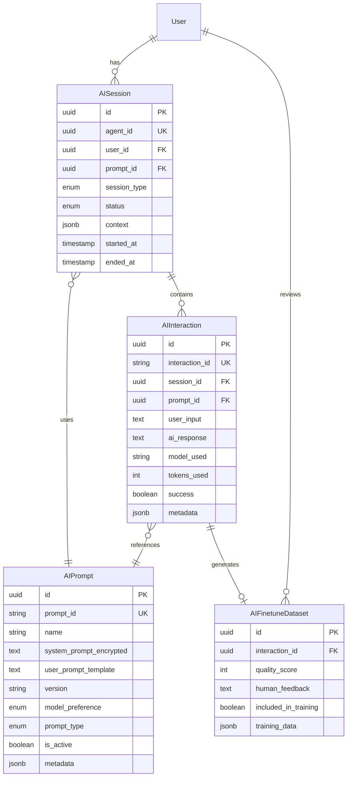
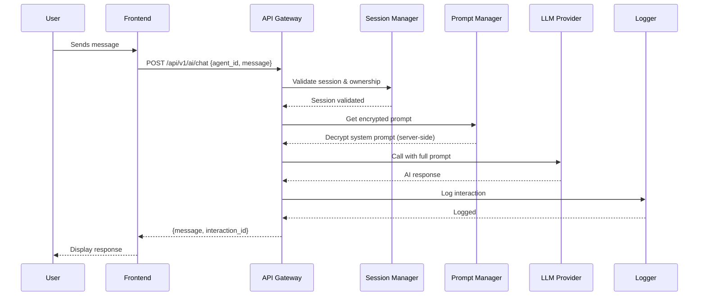
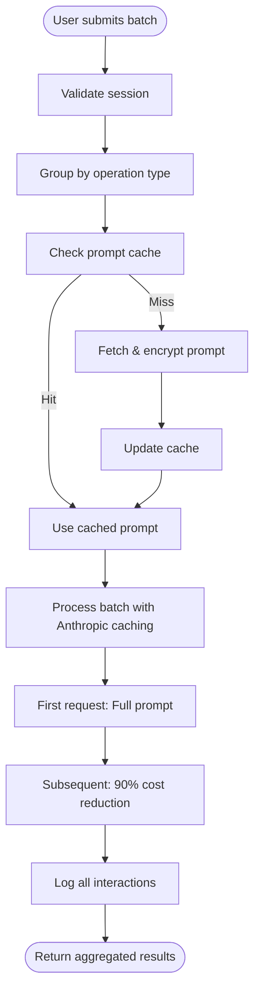
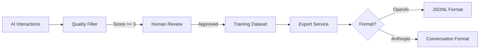

# DeepRef AI Orchestration Architecture

## Executive Summary

DeepRef implements a **secure, server-side AI orchestration architecture** designed with zero-trust principles. The system ensures that system prompts and LLM communications are never exposed to end users, while providing comprehensive tracking for fine-tuning and optimization.

## 🔒 Security Architecture

### Core Security Principles

1. **Zero Client-Side LLM Access**
   - All LLM API calls are made server-side only
   - System prompts are encrypted at rest using AES-256-GCM
   - Users receive only sanitized AI responses
   - No prompt templates or system instructions in client responses

2. **Session Isolation**
   - Each user session gets a unique `agent_id` (UUID)
   - Sessions are cryptographically isolated
   - 30-minute idle timeout with automatic cleanup
   - Maximum 10 active sessions per user

3. **Rate Limiting**
   - Per agent: 10 messages/minute
   - Per user: 100 messages/hour
   - Bulk operations: 5/minute
   - Implemented at multiple layers (Guard, Service, Infrastructure)

## 📊 Database Schema

### Entity Relationship Diagram



## 🔄 Request Flow Architecture

### Standard Chat Flow



### Bulk Processing Flow



## 🏗️ Service Architecture

### Core Services

1. **PromptManagerService**
   - Manages prompt versions and A/B testing
   - Handles encryption/decryption (server-side only)
   - Tracks usage metrics and success rates
   - Supports prompt cloning and migration

2. **SessionManagerService**
   - Creates unique agent sessions
   - Validates ownership and expiration
   - Manages session lifecycle
   - Automatic cleanup via cron jobs

3. **InteractionLoggerService**
   - Logs all user inputs and AI responses
   - Sanitizes data for security
   - Auto-flags suspicious interactions
   - Prepares fine-tuning datasets

4. **BulkProcessorService**
   - Groups operations by type
   - Implements Anthropic prompt caching
   - Achieves 90% cost reduction on bulk ops
   - Maintains 5-minute TTL cache

5. **FineTuneExporterService**
   - Exports quality-filtered datasets
   - Supports OpenAI and Anthropic formats
   - Tracks export history
   - Manages dataset versioning

## 🛡️ Security Layers

### 1. Network Layer
- HTTPS only (TLS 1.3+)
- API Gateway with WAF
- DDoS protection
- IP allowlisting for admin endpoints

### 2. Application Layer
- JWT authentication
- Agent session validation
- Rate limiting guards
- Input sanitization

### 3. Data Layer
- Encryption at rest (AES-256-GCM)
- Column-level encryption for prompts
- Encrypted backups
- Audit logging

### 4. Infrastructure Layer
- VPC isolation
- Private subnets for databases
- Secrets management (AWS KMS/Vault)
- Zero-trust network policies

## 📈 Performance Optimizations

### Caching Strategy

```typescript
// Three-tier caching architecture
Layer 1: In-memory prompt cache (5min TTL)
Layer 2: Redis session cache (30min TTL)
Layer 3: Anthropic prompt caching (90% cost reduction)
```

### Database Optimizations

- Composite indexes on frequently queried columns
- JSONB for flexible metadata storage
- Partitioning for interactions table (by month)
- Read replicas for analytics queries

## 🔍 Monitoring & Observability

### Key Metrics

```yaml
Business Metrics:
  - Sessions per hour
  - Average response time
  - Token usage by user
  - Cost per session

Security Metrics:
  - Failed authentication attempts
  - Rate limit violations
  - Prompt injection attempts
  - Suspicious interaction flags

Technical Metrics:
  - Database query performance
  - Cache hit rates
  - LLM API latency
  - Error rates by service
```

### Alerting Thresholds

| Metric | Warning | Critical |
|--------|---------|----------|
| Response Time | > 2s | > 5s |
| Error Rate | > 1% | > 5% |
| Token Usage | > 80% quota | > 95% quota |
| Session Count | > 1000/hour | > 2000/hour |

## 🚀 API Endpoints

### Session Management

```http
POST   /api/v1/ai/sessions/start
POST   /api/v1/ai/sessions/end
GET    /api/v1/ai/sessions/active
GET    /api/v1/ai/sessions/:agentId/history
```

### Chat Operations

```http
POST   /api/v1/ai/chat
GET    /api/v1/ai/chat/stream (SSE)
```

### Bulk Processing

```http
POST   /api/v1/ai/batch
GET    /api/v1/ai/batch/:batchId/status
```

### Admin Operations (Protected)

```http
# Prompt Management
POST   /api/v1/admin/ai/prompts
PUT    /api/v1/admin/ai/prompts/:id
GET    /api/v1/admin/ai/prompts

# Fine-tuning
POST   /api/v1/admin/ai/finetune/prepare
POST   /api/v1/admin/ai/finetune/review/:id
GET    /api/v1/admin/ai/finetune/export
```

## 🧪 Testing Strategy

### Security Testing
- Penetration testing for prompt injection
- Session hijacking attempts
- Rate limit bypass tests
- Encryption validation

### Integration Testing
- End-to-end session flows
- Bulk processing scenarios
- Error handling paths
- Timeout and retry logic

### Performance Testing
- Load testing (1000 concurrent sessions)
- Stress testing (10,000 requests/minute)
- Latency benchmarks
- Cost optimization validation

## 📊 Fine-Tuning Pipeline

### Data Collection Flow



### Quality Metrics

- **Relevance Score**: How well the response addresses the query
- **Accuracy Score**: Factual correctness of information
- **Helpfulness Score**: Practical value to the user
- **Safety Score**: Absence of harmful content
- **Coherence Score**: Logical flow and clarity
- **Completeness Score**: Thoroughness of response

## 🔐 Environment Variables

```bash
# Encryption
AI_ENCRYPTION_KEY=<64-char-hex>  # Generate with: openssl rand -hex 32

# LLM Providers
ANTHROPIC_API_KEY=sk-ant-...
OPENAI_API_KEY=sk-...

# Rate Limiting
RATE_LIMIT_PER_AGENT=10
RATE_LIMIT_PER_USER=100
RATE_LIMIT_WINDOW_MS=60000

# Session Config
SESSION_IDLE_TIMEOUT=1800
MAX_SESSIONS_PER_USER=10
SESSION_EXPIRY_HOURS=24

# Database
DATABASE_URL=postgresql://...
REDIS_URL=redis://...

# Monitoring
DATADOG_API_KEY=...
SENTRY_DSN=...
```

## 🚨 Security Checklist

- [ ] All system prompts encrypted with AES-256-GCM
- [ ] No prompt content in API responses
- [ ] Session validation on every request
- [ ] Rate limiting implemented and tested
- [ ] Input sanitization for injection prevention
- [ ] Audit logging for all AI interactions
- [ ] Regular security scans and penetration tests
- [ ] Incident response plan documented
- [ ] Data retention policies enforced
- [ ] GDPR/CCPA compliance verified

## 📈 Cost Optimization

### Strategies Implemented

1. **Prompt Caching**: 90% cost reduction on repeated prompts
2. **Batch Processing**: Group similar operations
3. **Model Selection**: Use appropriate model for task complexity
4. **Token Optimization**: Compress prompts without losing context
5. **Response Caching**: Cache common queries (5min TTL)

### Estimated Savings

| Strategy | Monthly Savings | Implementation Effort |
|----------|----------------|----------------------|
| Prompt Caching | $3,000-5,000 | Low |
| Batch Processing | $1,500-2,500 | Medium |
| Model Selection | $2,000-3,000 | Low |
| Token Optimization | $1,000-1,500 | High |
| Response Caching | $500-1,000 | Low |

## 🔄 Deployment Architecture

```yaml
Production:
  - Blue-green deployment
  - Auto-scaling (2-10 instances)
  - Multi-AZ redundancy
  - Database read replicas
  - CloudFront CDN

Staging:
  - Mirror of production
  - Synthetic testing
  - Canary deployments

Development:
  - Docker Compose setup
  - Local LLM mocking
  - Seed data generation
```

## 📝 Maintenance & Operations

### Daily Tasks
- Monitor rate limit violations
- Review flagged interactions
- Check session cleanup logs
- Verify backup completion

### Weekly Tasks
- Analyze token usage trends
- Review security alerts
- Update prompt performance metrics
- Export fine-tuning candidates

### Monthly Tasks
- Security audit
- Cost analysis and optimization
- Performance benchmarking
- Disaster recovery test

## 🎯 Success Metrics

- **Security**: Zero prompt exposures
- **Performance**: < 2s average response time
- **Reliability**: 99.9% uptime
- **Cost**: < $0.10 per user session
- **Quality**: > 4.0 average satisfaction score

## 📚 References

- [Anthropic Prompt Caching](https://docs.anthropic.com/claude/docs/prompt-caching)
- [OpenAI Fine-tuning Guide](https://platform.openai.com/docs/guides/fine-tuning)
- [OWASP LLM Security Top 10](https://owasp.org/www-project-top-10-for-large-language-model-applications/)
- [AWS Well-Architected Framework](https://aws.amazon.com/architecture/well-architected/)

---

**Document Version**: 1.0.0
**Last Updated**: November 2024
**Maintained By**: AI Security & Architecture Team